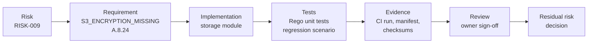

# Control chain: S3 encryption at rest (S3_ENCRYPTION_MISSING)

- **Organization:** Ayka Secure Technologies GmbH (simulated case study)
- **Control owner:** Cloud Platform owner
- **Chain recorded:** 2026-10-05
- **Status:** Implemented and tested at plan time; owner review pending (section 7)

This is the template for linking one control end to end. Each link names the file, test or run that proves it. A link that is only planned says so.

## 1. Risk

[RISK-009](../03-risk-management/risk-register.md): storage, logging, TLS, network and service-boundary weaknesses carried into a deployment without threat-based triage. For S3 the threat is disclosure of stored data through a snapshot, a mis-scoped grant or a compromised key path, with no key-level audit trail to investigate it.

## 2. Requirement

[`control-mapping.yaml`](../../../Internal-IT/engineering/policy-as-code/metadata/control-mapping.yaml), control `S3_ENCRYPTION_MISSING`:

| Field | Value |
|---|---|
| Statement | Every S3 bucket has its own server-side encryption configuration |
| Framework reference | ISO/IEC 27001:2022 Annex A **A.8.24** (use of cryptography) |
| Severity | MEDIUM: needs human approval; the rationale is recorded with the control |
| Enforced by | OPA `policies.terraform.aws_s3`, tfsec `AVD-AWS-0088` and `AVD-AWS-0132` |
| Related control | `S3_KMS_ENCRYPTION_REQUIRED` (Checkov `CKV_AWS_145`): customer-managed key |

## 3. Implementation

[`ayka-portal/modules/storage/main.tf`](../../../Internal-IT/workloads/ayka-portal/modules/storage/main.tf):

| Bucket | Encryption | Why |
|---|---|---|
| `aws_s3_bucket.this` (data) | SSE-KMS with the workload key ([`kms.tf`](../../../Internal-IT/workloads/ayka-portal/kms.tf), rotation on) | Key policy and CloudTrail give access control and audit on the key |
| `aws_s3_bucket.access_logs` | SSE-S3 (AES256) | ALB and S3 server access logs can only be delivered to SSE-S3 buckets; accepted in [`exceptions.yaml`](../../../Internal-IT/engineering/policy-as-code/metadata/exceptions.yaml) with the AWS documentation as the reason, owner and expiry |

## 4. Tests

| Test | What it proves | Where |
|---|---|---|
| `test_encryption_is_bound_to_its_own_bucket` | One encryption config does not cover a second bucket | [`OPA/tests/aws_s3_test.rego`](../../../Internal-IT/engineering/policy-as-code/OPA/tests/aws_s3_test.rego) |
| `test_reference_is_scoped_to_module_instance` | A config in one module does not cover a bucket in another | same file |
| `test_root_module_*`, `test_nested_module_*` | Binding works in the root module and in nested modules, both ways | same file |
| Regression scenario `s3/missing-encryption` | The gate fails on a real plan of an unencrypted bucket, reported by OPA and tfsec | [`expected-controls.txt`](../../../Internal-IT/workloads/control-validation-scenarios/expected-controls.txt), `check-regression.sh` |
| Mutation check | The tests fail against the old rule (recorded in PR #25) | [PR #25](https://github.com/Ayush-cloud06/Ayka-Secure-Technologies-GmbH/pull/25) |

## 5. Evidence

Every pipeline run uploads a `compliance-evidence` artifact. Its `evidence/manifest.json` records the commit, the run, the tool versions and the SHA-256 of `control-mapping.yaml`, `exceptions.yaml`, the evaluator and every Rego file. `evidence/artifacts.sha256` covers every file in the bundle, and the apply job checks it before the simulated apply.

| Run | Commit | Workload | Result for this control |
|---|---|---|---|
| [37265256207](https://github.com/Ayush-cloud06/Ayka-Secure-Technologies-GmbH/actions/runs/37265256207) | `26d08f1` on `main` | ayka-portal | no `S3_ENCRYPTION_MISSING`; the log bucket's customer-key findings are excepted |
| same run, regression job | `26d08f1` | control-validation-scenarios | `S3_ENCRYPTION_MISSING` reported by OPA and tfsec; build fails as required |

Artifacts expire with GitHub's retention period. A run record that must outlive it has to be exported (download the artifact, keep it with this file's review).

## 6. Limits of this evidence

- Plan-time only. Nothing is deployed, so this shows the configuration is declared, not that objects in a live bucket are encrypted. Operating evidence would be `GetBucketEncryption` output and object metadata from a deployed bucket.
- The checksums travel with the files: they prove the bundle is unchanged between jobs, not who produced it.

## 7. Review and residual risk

| Item | Value |
|---|---|
| Reviewer | Control owner (Cloud Platform owner role) |
| Review | **Pending.** The reviewer checks sections 2 to 5 against the linked files and run, then records the date and result here |
| Proposed residual risk for the S3 part of RISK-009 | Likelihood 2 (design coherent, verified at plan time, no operating proof) x impact 4 = **8 Medium**, per [risk-criteria.md](../03-risk-management/risk-criteria.md) |
| Decision | **Not yet made.** Accept, or require operating evidence first. An acceptance goes into the [risk acceptance log](../03-risk-management/risk-acceptance-log.md) |

Review log:

| Date | Reviewer | Result |
|---|---|---|
| — | — | — |
