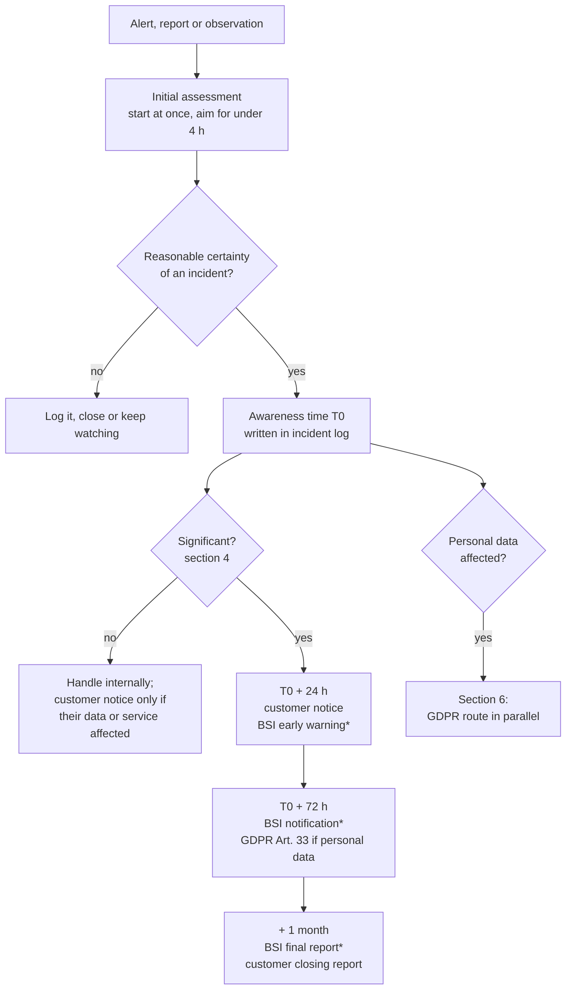

# Security Incident Reporting Procedure (NIS2, GDPR, Customers)

| Field | Value |
|---|---|
| Document ID | NIS2-03 |
| Organization | Ayka Secure Technologies GmbH (simulated case study) |
| Owner | Security Operations Analyst (Incident Coordinator) |
| Approver | CISO |
| Version | 1.0 |
| Effective | On approval |
| Status | Draft. Not approved: no approval record exists. Never exercised. |
| Classification | Internal |

## 1. Purpose and when it applies

This procedure decides **who must be told about a security incident, by when, and with what content**. It does not describe how to contain or fix an incident; that belongs in the incident response procedure, which is still planned ([ISMS index](../ISMS/README.md), area 06).

Three reporting regimes can apply to the same incident. Today only two of them bind Ayka:

| Regime | Applies today? | Recipient | Clock |
|---|---|---|---|
| Customer contracts (and GDPR Art. 33(2) as a processor) | **Yes**, once Ayka has customers | Each affected customer | Ayka's commitment: within 24 hours of awareness (section 5) |
| GDPR Art. 33 as a controller (employee data) | **Yes** | LfDI Baden-Württemberg | 72 hours after awareness |
| NIS2 Art. 23 / §32 BSIG | **No** ([NIS2-01](01-applicability-assessment.md)). Voluntary reporting to the BSI is possible | BSI | 24 hours / 72 hours / 1 month |

The BSI steps are written out in full anyway. Ayka's customers need Ayka to report fast enough for **their** 24-hour early warning, so Ayka has to run on the NIS2 clock even when the law does not require it. And if Ayka comes into scope, this procedure must work on day one.

## 2. Roles

| Role | Holder (personnel register) | Responsibility in this procedure |
|---|---|---|
| Incident Coordinator | Security Operations Analyst (EMP-005); deputy: Security Engineer (EMP-014) | Opens the incident log, starts the clocks, drafts every report, tracks deadlines |
| Decision-maker on significance and reporting | CISO (EMP-002); deputy: Managing Director | Decides whether the incident is significant and which reports go out; signs them off |
| Managing Director | EMP-001 | Informed of every significant incident within 4 hours; approves customer communication that admits a breach of contract |
| GDPR Lead | Compliance Analyst (EMP-004) | Judges personal-data impact; drafts the Art. 33 notification |
| Customer communication | Customer Success Manager (EMP-010) | Sends customer notices drafted by the Incident Coordinator; keeps the customer contact list current |
| Regulatory reporting | Compliance Officer (EMP-021) | Holds the BSI portal access once registered; submits BSI reports |

With 24 people, several of these are part-time hats. If both a role holder and the deputy are unreachable for more than one hour, the next person in the chain takes the role, in this order: CISO, Managing Director, Security Engineer.

## 3. When the clock starts

All deadlines run from **awareness** (*Kenntnis*). Ayka is aware of a significant incident when, after an initial assessment, it has a reasonable degree of certainty that a significant incident has happened. Awareness is **not** the moment the incident started, and not the moment an alert fired. It also cannot be postponed by not looking: the initial assessment of an alert or report must start without delay and should take no more than four hours.

The Incident Coordinator writes the awareness time in the incident log (template T-4) and every later deadline is calculated from it.

## 4. Is it significant?

An incident is **significant** under NIS2 Art. 23(3) if it has caused, or is capable of causing, severe operational disruption of Ayka's services or financial loss to Ayka, or considerable material or non-material damage to others.

For a cloud computing service provider, Implementing Regulation (EU) 2024/2690 replaces that general test with fixed thresholds. Ayka uses them now, so customers and staff have one definition to work with. An incident is significant if **any** of these is true:

| Ref. | Threshold | Source |
|---|---|---|
| S-1 | The SaaS platform is completely unavailable for more than **30 minutes** | IR 2024/2690 Art. 7(a) |
| S-2 | Availability is limited for more than **5 %** of EU users, or more than 1 million EU users, whichever is smaller, for more than **one hour** | Art. 7(b) |
| S-3 | Integrity, confidentiality or authenticity of stored, transmitted or processed data is compromised by a **suspectedly malicious** action | Art. 7(c) |
| S-4 | Integrity, confidentiality or authenticity of data is compromised with impact on more than 5 % of EU users or 1 million, whichever is smaller | Art. 7(d) |
| S-5 | Has caused **or is capable of causing** direct financial loss above EUR 500,000 or 5 % of last year's turnover, whichever is lower | Art. 3(1)(a) |
| S-6 | Has caused **or is capable of causing** exfiltration of trade secrets | Art. 3(1)(b) |
| S-7 | Has caused **or is capable of causing** death or considerable damage to a person's health | Art. 3(1)(c), (d) |
| S-8 | Successful, suspectedly malicious and unauthorised access capable of causing severe operational disruption | Art. 3(1)(e) |
| S-9 | Two or more incidents within six months, with the same apparent root cause, that together meet S-5 | Art. 4 |

S-5 to S-7 look forward: ransomware that is contained before any money is lost is still significant if it was credibly capable of causing a loss above the threshold. Judge the potential, not only the damage done.

For Ayka at its size S-3 and S-8 are the realistic ones: almost any confirmed intrusion into the AWS accounts, the Entra ID tenant or the GitHub repository meets them, regardless of how many customers were affected. A leaked credential that was **used** by someone else is S-8. A leaked credential that was rotated before anyone used it is not significant, but it is still logged.

Personal-data breaches are judged separately (section 6). An incident can be significant under NIS2 and not a personal-data breach, or the reverse.

## 5. Reporting timeline



\* BSI reports are mandatory only if Ayka is a NIS2 entity. Until then the CISO decides whether to report voluntarily.

| Deadline (from T0) | Report | Recipient | Minimum content | Who sends |
|---|---|---|---|---|
| Without undue delay, at most **24 h** | Customer incident notice | Affected customers, through their designated security contact | What happened as far as known; services and data affected; whether a malicious act is suspected; what the customer should do now; next update time | Customer Success Manager |
| At most **24 h** | Early warning (*Frühwarnung*) | BSI, through the BSI reporting portal | Whether the incident is suspected to be caused by unlawful or malicious acts; whether it could have cross-border impact | Compliance Officer |
| At most **72 h** | Incident notification (*Meldung*) | BSI | Update of the early warning; initial assessment of severity and impact; indicators of compromise where available | Compliance Officer |
| On request | Intermediate report | BSI | Status updates the BSI asks for | Compliance Officer |
| **1 month** after the 72-hour notification | Final report (*Abschlussmeldung*) | BSI and, in summary, affected customers | Detailed description with severity and impact; type of threat or root cause; mitigation applied and ongoing; cross-border impact | Compliance Officer; customer version by Customer Success |
| If the incident is still ongoing at one month | Progress report, then final report one month after handling ends | BSI | As above | Compliance Officer |

Further duties for an in-scope cloud provider (NIS2 Art. 23(1) and (2)):

- Inform the **recipients of the service** without undue delay about significant incidents likely to affect them. Ayka already does this through the customer notice.
- Tell recipients who could be affected by a **significant cyber threat** what they can do about it, for example a credential phishing campaign aimed at Ayka customers.

## 6. Personal-data breaches (GDPR)

Run in parallel with section 5. The GDPR Lead takes the lead.

| Ayka's role | Data | Duty | Deadline |
|---|---|---|---|
| Controller | Employee identity and access data | Notify the LfDI Baden-Württemberg (Art. 33(1)) unless the breach is unlikely to result in a risk to people; tell the people affected if the risk is high (Art. 34) | 72 hours from awareness |
| Processor | Customer data in the SaaS platform | Notify the customer as controller without undue delay (Art. 33(2)); the customer decides on its own notifications | Ayka commits to 24 hours, the same as the customer incident notice |

Every personal-data breach goes into the breach log, including those not notified (Art. 33(5)). The log is template T-4 with the GDPR fields filled.

## 7. Other parties to consider

| Party | When | Note |
|---|---|---|
| Police: Zentrale Ansprechstelle Cybercrime (ZAC), LKA Baden-Württemberg | Extortion, ransomware, or any crime the Managing Director wants prosecuted | A criminal complaint does not replace any regulatory report |
| AWS, Microsoft, GitHub | When their service is the source of, or needed for, the investigation | Support case; abuse reports for compromised accounts |
| Cyber insurer | If a policy exists | **No cyber insurance is recorded.** Policies typically demand notice within days and restrict who may be hired for forensics; check before engaging anyone |
| Certification or TISAX auditor | If Ayka holds a certificate or label at the time | Contract terms of the certification body apply |

## 8. Preconditions that do not exist yet

This procedure is only as good as Ayka's ability to notice an incident. Today:

| Precondition | State | Reference |
|---|---|---|
| Detection: GuardDuty, alerting rules, someone receiving alerts | **Missing.** The `security-alerts` SNS topic exists in Terraform, but nothing publishes to it | [NIS2-02](02-risk-management-measures.md) No. 2 |
| Logs to investigate with | CloudTrail with log file validation is designed, not deployed | [landing zone logging](../../Internal-IT/platform/foundation/landing-zone/modules/core/logging/cloudtrail.tf) |
| Customer security contact list | No customers yet | Customer Success Manager |
| BSI portal access | Not needed while out of scope; *Mein Unternehmenskonto* to be requested at 40 employees | [NIS2-01](01-applicability-assessment.md) section 8 |
| Out-of-band communication if Entra ID or company e-mail is compromised | **Not defined.** Phone tree on paper is the minimum | NIS2-02 No. 10 |
| Exercise | Never run | Section 10 |

## 9. Templates

These are templates. No incident has been recorded and no report has been sent.

### T-1 Customer incident notice

```text
Subject: [Ayka Security Notice] <short title> – <date>

Incident reference:   AYK-INC-<yyyy>-<nnn>
Status:               Investigating / Contained / Resolved
Detected:             <date, time, timezone>
Services affected:    <service and tier>
Your data affected:   Yes / No / Under investigation – <categories>
Suspected malicious:  Yes / No / Unknown
What happened:        <two or three factual sentences; no speculation>
What we have done:    <containment steps>
What you should do:   <actions for the customer, or "No action needed">
Next update:          <date, time>
Contact:              <Incident Coordinator, phone, e-mail>
```

### T-2 BSI early warning and notification (field list)

The BSI reporting portal defines the form. Prepare these answers before opening it:

| Field | Early warning (24 h) | Notification (72 h) |
|---|---|---|
| Entity, registration number, contact reachable 24/7 | Required | Required |
| Awareness time (T0) and detection method | Required | Required |
| Suspected unlawful or malicious cause | Required | Update |
| Possible cross-border impact | Required | Update |
| Services and Member States affected | If known | Required |
| Severity and impact assessment (users, duration, data) | — | Required |
| Indicators of compromise | — | Where available |
| Measures taken | — | Required |

### T-3 Final report outline

1. Incident summary and timeline (detection, awareness, containment, recovery)
2. Severity and impact, with the thresholds from section 4 that were met
3. Type of threat or root cause
4. Mitigation applied and still ongoing
5. Cross-border impact
6. Lessons learned and corrective actions, with owners (feeds the ISMS lessons-learned and corrective action logs)

### T-4 Incident and breach log

| Ref | Opened | T0 (awareness) | Summary | Significant (S-ref) | Personal data | Customer notice sent | BSI early warning | BSI notification | GDPR Art. 33 | Final report | Closed | Owner |
|---|---|---|---|---|---|---|---|---|---|---|---|---|
| | | | | | | | | | | | | |

No entries yet.

## 10. Exercise

Run one tabletop exercise per year and after every change to this procedure. A good first scenario for Ayka: an AWS access key of the CI pipeline appears in a public repository on a Friday at 18:00, and CloudTrail shows `ListBuckets` calls from an unknown IP. Measure time to awareness, time to the significance decision, and whether the 24-hour customer notice would have gone out.

| Date | Scenario | Participants | Deadlines met | Findings | Actions |
|---|---|---|---|---|---|
| | | | | | |

No exercise held yet.

## Revision history

| Version | Date | Author | Change |
|---|---|---|---|
| 1.0 | 2026-10-06 | Incident Coordinator | First version, aligned with §32 BSIG and IR 2024/2690 thresholds |
