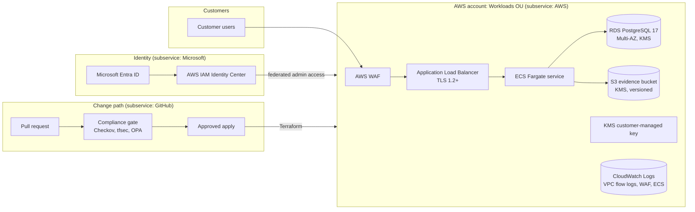

# Description of the Ayka Portal System

| Field | Value |
|---|---|
| Document ID | SOC2-01 |
| Owner | CISO |
| Contributors | Cloud Platform Engineering, Head of Product |
| Approver | Managing Director |
| Version | 1.0 |
| Prepared as of | 2026-10-06 |
| Next review | Before engaging a service auditor, and at every significant system change |
| Status | Draft. Not approved. Prepared for readiness; not part of any SOC 2 report |

> **Basis of preparation.** This description follows the structure of the AICPA *Description Criteria for a Description of a Service Organization's System in a SOC 2 Report* (DC 200, 2018, with the 2022 implementation guidance). It describes the system **as designed**. Where a component is not operating, the text says so, because DC 200 requires a description that does not omit or distort information. Section numbers refer to DC 200 criteria in brackets.

## 1. Company overview and types of services provided [DC 1]

Ayka Secure Technologies GmbH ("Ayka") is a software company registered in Stuttgart, Germany, with 24 personnel ([personnel register](../../organization/personnel-register.md)). Ayka sells a subscription service, the **Ayka Portal**, to small and mid-sized EU companies, mainly automotive Tier-2 and Tier-3 suppliers, that are preparing for ISO/IEC 27001 certification, TISAX assessments or GDPR reviews ([business model](../../organization/business-model.md)).

Customers use the Ayka Portal to:

- keep their own control library, risk register and policies;
- upload evidence files (screenshots, exports, signed documents) against controls;
- track remediation tasks and auditor requests;
- export evidence packages for their certification auditor.

Ayka also sells onboarding packages and audit-preparation advisory. Those advisory services are delivered by people, not by the system, and are **outside** this description.

## 2. Principal service commitments and system requirements [DC 2]

### 2.1 Service commitments to customers

Ayka's commitments are made in the Master Subscription Agreement, the Data Processing Agreement under GDPR Art. 28 and the public security page. The commitments relevant to the in-scope categories are:

| Category | Commitment |
|---|---|
| Security | Customer data is accessible only to the customer's authorised users and to Ayka personnel who need it to operate the service; administrative access is federated, role-based and requires MFA |
| Security | Every infrastructure change is reviewed and passes automated security checks before release |
| Security | Ayka notifies affected customers of a security incident affecting their data without undue delay, and in any case within 48 hours of confirming it, so customers can meet their own 72-hour GDPR Art. 33 deadline |
| Availability | Monthly availability target of 99.5 % for the web application, excluding announced maintenance |
| Availability | Recovery point objective (RPO) of 24 hours and recovery time objective (RTO) of 8 hours for the production database ([BC/DR plan](policies/business-continuity-and-disaster-recovery-plan.md)) |
| Confidentiality | Customer data is encrypted in transit (TLS 1.2 or higher) and at rest (AWS KMS) |
| Confidentiality | Customer data is processed and stored in the EU (AWS `eu-central-1`, Frankfurt) |
| Confidentiality | Customer data is deleted within 30 days after contract end, and backups age out within a further 35 days |

> **Not yet true.** The Terraform names `ap-south-1` (Mumbai), not `eu-central-1` ([`dev.tfvars`](../../Internal-IT/workloads/ayka-portal/envs/dev.tfvars), [`restrict-region.json`](../../Internal-IT/platform/foundation/aws-organization/modules/scp/restrict-region.json)). The EU residency commitment cannot be made until the Region moves (RISK-011 in the [risk register](../ISMS/03-risk-management/risk-register.md)). The contractual documents (MSA, DPA, security page) are not written; the table above is what they would say.

### 2.2 System requirements

System requirements are the internal specifications Ayka sets to meet the commitments. They are written in:

- the [information security policy](../ISMS/00-context-and-governance/information-security-policy.md) and the SOC 2 policies listed in the [README](README.md);
- the 38 machine-enforced configuration rules in [`control-mapping.yaml`](../../Internal-IT/engineering/policy-as-code/metadata/control-mapping.yaml), which every Terraform change must pass;
- the legal and regulatory requirements that apply to Ayka as a German GmbH processing customer data: GDPR, BDSG, the German Commercial Code (HGB) and Fiscal Code (AO) retention rules for business records, and, for customers in scope of NIS2, their supply-chain security requirements passed on by contract.

## 3. Components of the system [DC 3]

### 3.1 System boundary

The system is the production Ayka Portal and the processes and tooling that build, change, operate and secure it.

**Inside the boundary:** the `ayka-portal` workload, the AWS organization controls that govern its account, the identity path used by Ayka staff, and the GitHub repository and Actions pipeline that change it.

**Outside the boundary:** customers' own systems and identity providers; Ayka's office network and corporate IT (e-mail, laptops) except where they are used to reach the system; advisory services; the sales and billing systems.

### 3.2 Infrastructure

All production infrastructure is defined in Terraform. Nothing is configured by hand.

| Component | Purpose | Defined in | Status |
|---|---|---|---|
| AWS Organization with Security, Infrastructure and Workloads OUs | Account separation | [`aws-organization/`](../../Internal-IT/platform/foundation/aws-organization/) | Designed |
| Service control policies: deny root user actions, deny stopping or deleting CloudTrail, restrict Regions | Organization-wide guardrails | [`modules/scp/`](../../Internal-IT/platform/foundation/aws-organization/modules/scp/) | Designed |
| Landing zone: per-account CloudTrail (multi-Region, log file validation), protected trail bucket, S3 public access block, `security-alerts` SNS topic, permission boundary | Per-account baseline | [`landing-zone/`](../../Internal-IT/platform/foundation/landing-zone/) | Designed |
| VPC across availability zones with public, private and database subnets; VPC flow logs to CloudWatch (365 days) | Network isolation | [`modules/networking/`](../../Internal-IT/workloads/ayka-portal/modules/networking/) | Gated design |
| Internet-facing ALB with an HTTPS listener (`ELBSecurityPolicy-TLS13-1-2-2021-06`), deletion protection, and an AWS WAF web ACL with AWS managed rule groups; WAF logs kept 365 days | Edge protection | [`modules/compute/alb.tf`](../../Internal-IT/workloads/ayka-portal/modules/compute/alb.tf) | Gated design |
| ECS Fargate service with CPU target-tracking autoscaling | Application runtime | [`modules/compute/`](../../Internal-IT/workloads/ayka-portal/modules/compute/) | Gated design |
| RDS PostgreSQL 17.2, Multi-AZ, storage encrypted with the customer-managed key, 7-day automated backups, deletion protection, final snapshot on delete | Customer data store | [`modules/database/main.tf`](../../Internal-IT/workloads/ayka-portal/modules/database/main.tf) | Gated design |
| S3 bucket for uploaded evidence, KMS-encrypted and versioned, with lifecycle rules; separate access-log bucket | Customer file store | [`modules/storage/main.tf`](../../Internal-IT/workloads/ayka-portal/modules/storage/main.tf) | Gated design |
| KMS customer-managed key with annual rotation | Encryption at rest | [`kms.tf`](../../Internal-IT/workloads/ayka-portal/kms.tf) | Gated design |

### 3.3 Software

| Software | Use |
|---|---|
| Ayka Portal application (container image on ECS) | The customer-facing service. In the repository the image is a placeholder (`nginx:stable`); the application source is not part of this repository |
| PostgreSQL 17 (Amazon RDS) | Relational data |
| Terraform 1.7.5 | Infrastructure definition |
| Checkov, tfsec, OPA via conftest, pinned by version and SHA-256 in [`toolchain.versions`](../../Internal-IT/engineering/ci-cd/toolchain.versions) | Pre-deployment security checks |
| GitHub Actions workflows in [`.github/workflows/`](../../.github/workflows/) | Build, test, scan, decide and record evidence |
| Microsoft Entra ID, AWS IAM Identity Center | Workforce identity and federated access |

### 3.4 People

The organization chart is in [org-structure.md](../../organization/org-structure.md) and the responsibilities in [roles-and-responsibilities.md](../../organization/roles-and-responsibilities.md). The roles that run this system are:

| Role | Responsibility for the system |
|---|---|
| Managing Director | Accountable for the control environment; approves policies and accepts residual risk |
| CISO | Owns this description, the control set, the risk register and incident response |
| Cloud Platform Engineering | Designs and changes infrastructure through Terraform; operates the pipeline |
| Product and Engineering | Builds the application; fixes vulnerabilities assigned to them |
| Compliance and Risk | Maintains the control matrix and evidence; runs the internal control self-assessment |
| Security Operations | Monitors alerts, handles incidents, performs access reviews |
| HR and Administration | Triggers joiner, mover and leaver events; keeps training and confidentiality records |

Ayka is small, so one person can hold several roles. Where that weakens segregation of duties, the [readiness assessment](04-readiness-assessment.md) records it.

### 3.5 Procedures

| Process | Described in |
|---|---|
| Change management, including emergency changes | [Change Management Policy](policies/change-management-policy.md), [policy evaluation flow](../../Internal-IT/engineering/ci-cd/compliance-gates/policy-evaluation-flow.md), [enforcement levels](../../Internal-IT/engineering/ci-cd/compliance-gates/enforcement-levels.md) |
| Access provisioning, review and removal | [Logical Access Control Policy](policies/access-control-policy.md), [identity provisioning workflow](../../Internal-IT/platform/domains/identity/docs/identity-provisioning-workflow.md) |
| Emergency (break-glass) access | [Break-glass procedure](../../Internal-IT/platform/domains/identity/docs/break-glass-procedure.md) |
| Logging, monitoring and incident response | [Logging and Monitoring Standard](policies/logging-and-monitoring-standard.md), [Incident Response Plan](policies/incident-response-plan.md) |
| Risk assessment | [Risk management methodology](../ISMS/03-risk-management/risk-management-methodology.md) |
| Vendor management | [Vendor and Subservice Organization Management Policy](policies/vendor-management-policy.md) |
| Backup, recovery and continuity | [BC/DR plan](policies/business-continuity-and-disaster-recovery-plan.md) |
| Data handling and deletion | [Data Classification and Confidentiality Policy](policies/data-classification-and-confidentiality-policy.md) |

### 3.6 Data

| Data | Classification | Where it lives |
|---|---|---|
| Customer account data (user names, e-mail, roles) | Confidential | RDS |
| Customer evidence files and their metadata | Confidential (customers may upload Restricted material, e.g. contracts) | S3 evidence bucket, RDS |
| Application and access logs | Internal | CloudWatch Logs, S3 access-log bucket |
| Infrastructure definitions and pipeline evidence | Internal | GitHub repository and Actions artifacts |
| Secrets (database credentials) | Restricted | AWS Secrets Manager |

## 4. System incidents [DC 4]

The Ayka Portal has not operated in production, so there are no system incidents to disclose. One security-relevant event affecting the system's identity design is recorded in the risk register: bootstrap passwords for Entra ID were committed to the repository between 2026-03-22 and 2026-09-28 (RISK-001). They were removed from source on 2026-09-28; the tenant check and rotation are still open. If the system were in production during a report period, this event would be evaluated against the commitments in section 2.1 and disclosed if it caused a significant failure.

## 5. Applicable trust services criteria and related controls [DC 5]

The common criteria follow the five COSO 2013 components. Sections 5.1 to 5.4 describe the four components that are mostly organizational; section 5.5 points to the control activities.

### 5.1 Control environment

- **Integrity and ethics.** The information security policy sets the expectation; a code of conduct and its yearly acknowledgement are planned (control CE-02).
- **Oversight.** Ayka is a GmbH without a supervisory board. Oversight sits with the Managing Director, who receives a quarterly security report from the CISO (CE-06). The CISO reports to the Managing Director and has no revenue targets.
- **Structure and authority.** Roles are defined in the organization documents above and enforced technically through tiered groups (Tier 0 security administration, Tier 1 infrastructure operators, Tier 2 developers) described in the [identity architecture](../architecture/identity-architecture.md).
- **Competence.** The [training and awareness programme](../../organization/training-and-awareness.md) defines baseline and role-based training.
- **Accountability.** Owners are named for every control in the [control matrix](03-control-matrix.md) and for every exception to a technical rule in [`exceptions.yaml`](../../Internal-IT/engineering/policy-as-code/metadata/exceptions.yaml).

### 5.2 Risk assessment

Ayka assesses risk with a likelihood × impact method on a 5 × 5 scale ([risk criteria](../ISMS/03-risk-management/risk-criteria.md)). The [risk register](../ISMS/03-risk-management/risk-register.md) holds 13 risks, each with an owner, inherent, current and target score and a treatment. It is reviewed at least quarterly and at every significant change; the last dated reviews are 2026-09-28 and 2026-10-05. Vendor risk is assessed under POL-VEN-01. Fraud risk (for example, an insider approving their own change or misusing break-glass access) is planned to be added as an explicit risk category (RA-02).

### 5.3 Information and communication

- Internally, policies are versioned in the Git repository; every change is a pull request with history.
- Every pipeline run produces a `compliance-evidence` artifact with the plan, raw scanner output, the decision summary, a Markdown report and a manifest of tool versions and file hashes. This is the main quality-controlled information the security function relies on.
- Externally, customers will receive the security page, the DPA and, once issued, the SOC 2 report under NDA. Customers report incidents and questions to a monitored security mailbox (IC-03, planned).

### 5.4 Monitoring activities

- **Ongoing evaluation.** On every pull request and push to `main`, a regression job plans a set of deliberately insecure Terraform scenarios and fails the build unless each expected control is reported by its named tool ([`expected-controls.txt`](../../Internal-IT/workloads/control-validation-scenarios/expected-controls.txt)). The gate therefore tests itself on every run.
- **Separate evaluation.** An annual control self-assessment by Compliance and Risk, and the ISO 27001 internal audit, are planned (MO-02).
- **Deficiencies** go to the risk treatment plan with an owner and due date.

### 5.5 Control activities

The controls, mapped to each criterion, are in the [Trust Services Criteria mapping](02-trust-services-criteria-mapping.md) and the [control matrix](03-control-matrix.md). They form part of this description.

## 6. Complementary user entity controls (CUECs) [DC 6]

Ayka's controls meet the criteria only if customers also operate the following controls. Customers' auditors should test these at the customer.

| ID | Customer responsibility | Related criteria |
|---|---|---|
| CUEC-01 | Customers approve, review and remove their own users in the Ayka Portal, and tell Ayka promptly when an administrator leaves | CC6.2, CC6.3 |
| CUEC-02 | Customers that connect their own identity provider enforce MFA in it | CC6.1 |
| CUEC-03 | Customers protect credentials and API tokens issued to them | CC6.1 |
| CUEC-04 | Customers classify what they upload and do not upload data categories excluded by the contract (for example special-category personal data under GDPR Art. 9) | C1.1 |
| CUEC-05 | Customers report suspected security incidents or misuse involving their accounts to Ayka's security contact | CC7.3 |
| CUEC-06 | Customers keep their own copies of evidence they must retain beyond their subscription | A1.2, C1.2 |

## 7. Subservice organizations and complementary subservice organization controls (CSOCs) [DC 7]

Ayka uses the **carve-out method**: the subservice organizations' controls are excluded from this description, and Ayka monitors them under POL-VEN-01, mainly by reviewing their own SOC 2 Type II reports each year.

| Subservice organization | Service | Controls Ayka expects it to operate (CSOCs) | Related criteria |
|---|---|---|---|
| Amazon Web Services | Hosting, storage, database, key management, logging | Physical and environmental security of data centres; secure destruction of storage media; availability and redundancy of the underlying hardware and availability zones; hypervisor isolation between tenants; KMS key material protection | CC6.4, CC6.5, A1.2, CC6.1 |
| Microsoft (Entra ID) | Workforce identity provider | Availability and integrity of authentication; protection of the tenant directory and token signing keys | CC6.1, A1.2 |
| GitHub (Microsoft) | Source control, CI runners, artifact storage | Integrity of repositories, rulesets and environment approvals; isolation of hosted runners; protection of stored artifacts | CC8.1, CC6.1 |

The current status of each provider's report, and its bridge letter, is tracked in the vendor register under POL-VEN-01. None has been retrieved yet (**to verify**).

## 8. Criteria not relevant to the system [DC 8]

All criteria of the Security, Availability and Confidentiality categories are relevant. Two are met largely through subservice organizations and are noted as such rather than excluded:

- **CC6.4** (physical access): Ayka operates no data centre; physical security of production is carved out to AWS. The Stuttgart office holds no production systems or customer data.
- **CC6.5** (disposal of physical assets): storage media are destroyed by AWS. Ayka's own part covers laptops and the logical deletion of customer data.

## 9. Significant changes during the period [DC 9]

Not applicable: no report period has started. For a Type II report this section will list changes such as the Region move to `eu-central-1` and the first production deployment.

## Revision history

| Version | Date | Change |
|---|---|---|
| 1.0 | 2026-10-06 | First issue, readiness draft |
