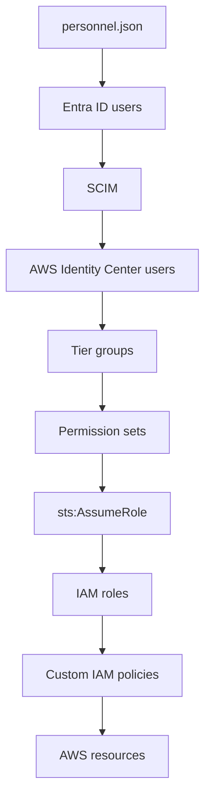

# Identity Architecture

## Tiers

- **Tier 0 – Security Administration**
- **Tier 1 – Infrastructure Operators**
- **Tier 2 – Developers**

## User Lifecycle



## Components

```
entra-id/
   ├── identity provider
   ├── HR source
   └── user lifecycle

aws-identity-center/
   ├── login layer
   ├── permission sets
   └── group mapping

aws-iam-core/
   ├── real permissions
   ├── IAM roles
   ├── boundaries
   └── policies
```