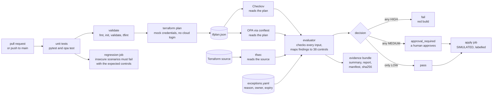

# Ayka: a compliance-as-code gate for Terraform plans

[](https://github.com/Ayush-cloud06/Ayka-Secure-Technologies-GmbH/actions/workflows/test.yml)

Every pull request's Terraform plan is scanned by **Checkov, tfsec and custom OPA rules**. Findings are mapped to **38 controls** (ISO/IEC 27001:2022 Annex A references), a **fail-closed evaluator** decides **pass / approval required / fail**, and the run leaves a **checksummed evidence bundle** that the apply job verifies. `main` only accepts changes through that gate.

## 1. What it shows

One pipeline run on `main` ([run 37265256207](https://github.com/Ayush-cloud06/Ayka-Secure-Technologies-GmbH/actions/runs/37265256207), commit `26d08f1`) checks two workloads:

| Workload | What it is | Decision | Detail |
|---|---|---|---|
| [`ayka-portal`](Internal-IT/workloads/ayka-portal/) | Reference workload, ~88 resources: VPC, ALB + WAF, ECS Fargate, Multi-AZ RDS, S3, KMS | **pass** | 6 LOW; 14 findings set aside in [`exceptions.yaml`](Internal-IT/engineering/policy-as-code/metadata/exceptions.yaml), each with a reason, owner and expiry |
| [`control-validation-scenarios`](Internal-IT/workloads/control-validation-scenarios/) | Deliberately insecure: public S3, open SSH, IMDSv1, no encryption, open NACL, VPC without flow logs | **fail** (required) | 20 HIGH / 34 MEDIUM / 10 LOW raw, 7 / 25 / 9 as distinct issues; every control in [`expected-controls.txt`](Internal-IT/workloads/control-validation-scenarios/expected-controls.txt) must be reported by its named tools, or the build fails |

The second row is the point: a gate that has never been shown to fail proves nothing. Any MEDIUM finding stops the run at a GitHub environment that needs a human reviewer; the evaluator tests cover that path.

Each run's `compliance-evidence` artifact holds the plan, raw scanner output, `compliance-summary.json`, a Markdown report, `manifest.json` (commit, run, tool versions, SHA-256 of the mapping, exceptions, evaluator and every Rego file) and `artifacts.sha256` over all of it. One control is traced end to end, from risk to evidence, in [control-chain-s3-encryption.md](Governance/ISMS/04-controls-and-soa/control-chain-s3-encryption.md).

## 2. Scope: a plan-analysis gate

This project judges **Terraform plans**. It does not deploy them.

- Plans run offline with mock credentials. The apply job verifies the evidence and then prints `SIMULATED APPLY`; nothing is created.
- `ayka-portal` is realistic enough to give the scanners real work, but its runtime parts are placeholders: the `nginx:stable` container image, a placeholder AMI, AWS's documentation account ID (`123456789012`, a validated variable) and a self-signed certificate.
- So a pass means "this plan meets the mapped controls", not "this system runs securely". Operating evidence would need a deployment, which is out of scope.
- Ayka Secure Technologies GmbH and its ISMS are a simulated case study, not a certified or operating ISMS.

## 3. How it works



**How a finding becomes a decision.** A scanner reports a rule ID (for example tfsec `AVD-AWS-0107`, Checkov `CKV_AWS_24`, or OPA `[EC2_OPEN_SSH]`). The evaluator looks it up in [`control-mapping.yaml`](Internal-IT/engineering/policy-as-code/metadata/control-mapping.yaml), and the *control's* severity counts, not the scanner's. A finding nobody has mapped counts as at least MEDIUM, so a human sees it. Any HIGH fails the build, any MEDIUM needs approval. A finding can only be set aside through [`exceptions.yaml`](Internal-IT/engineering/policy-as-code/metadata/exceptions.yaml), with a reason, an owner and an expiry date, and it still appears in the report.

## 4. Capability status

- **Implemented** = runs in CI, and a run or a test shows it doing the real thing.
- **Simulated** = runs, but its effect is faked on purpose, and it says so.
- **Planned** = designed or written down only, including Terraform the gate never scans.

| Capability | Status | Evidence |
|---|---|---|
| Checkov scan of the Terraform plan | ✅ Implemented | `run-checkov.sh`, evidence run |
| OPA/conftest custom rules on the plan, all modules, resources linked through plan references | ✅ Implemented (blind spot: policy JSON unknown at plan time, see Limitations) | `OPA/terraform/*.rego`, `OPA/tests/` |
| tfsec scan of the Terraform source | ✅ Implemented (until 2026-09 a wrapper bug dropped every tfsec finding; fixed and now tested) | `run-tfsec.sh`, `tests/compliance/test_run_tfsec.py` |
| Finding → control mapping (38 controls, ISO/IEC 27001:2022 Annex A references) | ✅ Implemented | `control-mapping.yaml`, `tests/compliance/test_control_mapping.py` |
| Three-way decision, fail-closed on missing, malformed, errored or empty scanner output and on invalid severities | ✅ Implemented | `evaluate-results.py`, `tests/compliance/test_evaluate_results.py` |
| Reviewed exceptions with reason, owner and expiry | ✅ Implemented | `exceptions.yaml`, "Excepted Findings" in `compliance-report.md` |
| Negative test that must fail with named controls and tools | ✅ Implemented | `check-regression.sh`, `expected-controls.txt` |
| Unit tests and policy tests in CI | ✅ Implemented | `unit-tests` job (pytest and Rego tests) |
| Pinned tools and actions (checksums, commit SHAs) | ✅ Implemented | `.github/actions/*/action.yml` |
| Evidence bundle: plan, raw scanner JSON, summary, Markdown report, logs, and a run manifest (commit, run, tool versions, SHA-256 of mapping, exceptions, evaluator and every Rego file) | ✅ Implemented | `.github/actions/evidence/action.yml`, `write-manifest.py` |
| SHA-256 integrity check between scan and apply over every bundled file, required files enforced, evidence must match the applied commit | ✅ Implemented (integrity, **not** tamper-proof: the hash travels with the files) | `run-apply.sh`, `tests/compliance/test_evidence.py` |
| No cloud credentials in plan-only CI | ✅ Implemented | no OIDC or `id-token` anywhere in `.github/` |
| Human approval before apply | ✅ Configured: `manual-apply-approval` and `medium-risk-approval` environments require the owner's review (solo repo, so self-review is allowed) | GitHub environment settings |
| Branch protection with required checks | ✅ Configured: ruleset `protect-main` requires a PR and the five pipeline checks, and blocks force-push and deletion (0 approvals: a solo owner can't approve their own PR) | GitHub ruleset |
| Terraform apply | 🎭 Simulated: the verified plan is not applied; the job prints `SIMULATED APPLY` | `run-apply.sh` |
| Cost estimation | 🎭 Simulated: infracost isn't installed; the step says so and gates nothing | `run-cost-check.sh` |
| Workload infrastructure | 🎭 Simulated: mock credentials, plan-only, never deployed (by design, see "Scope") | `ayka-portal/provider.tf` |
| The company, ISMS, personnel, risk register | 🎭 Simulated case study; placeholders replaced by one [ISMS index](Governance/ISMS/README.md) | `Governance/`, `organization/` |
| AWS Organizations, SCPs, landing zone, IAM core, Identity Center, Entra ID | 📐 Planned: design-only (validates locally, not gated) | `Internal-IT/platform/` |
| Drift detection | 📐 Planned: a manual workflow exists and refuses to run without a remote backend | `drift-detection.yml` |
| Remote state, real sandbox apply, governance ↔ evidence links (SoA) | 📐 Planned | — |

**Not claimed:** Terragrunt, SIEM integration, SOC 2 / NIST CSF / CIS mappings, zero-trust, continuous monitoring, automated remediation, delegated administration, incident-response workflows, audit-readiness, certification.

---

## 5. Run it locally

Every tool is pinned in [`toolchain.versions`](Internal-IT/engineering/ci-cd/toolchain.versions), with the same versions and checksums as CI (a test keeps them in sync). One command installs them into `.tools/` (Linux x86-64; needs `curl`, `unzip`, `python3`, `jq`):

```bash
git clone https://github.com/Ayush-cloud06/Ayka-Secure-Technologies-GmbH.git && cd Ayka-Secure-Technologies-GmbH
bash Internal-IT/engineering/ci-cd/scripts/bootstrap-tools.sh
export PATH="$PWD/.tools/bin:$PATH"
.tools/venv/bin/python -m pytest -q tests/ && opa test Internal-IT/engineering/policy-as-code/OPA
bash Internal-IT/engineering/ci-cd/scripts/run-local-chain.sh Internal-IT/workloads/ayka-portal
bash Internal-IT/engineering/ci-cd/scripts/run-local-chain.sh Internal-IT/workloads/control-validation-scenarios
```

The local runner checks the tool versions first and stops if they differ from CI (`ALLOW_TOOL_DRIFT=1` turns that into a warning).

Expected: `ayka-portal` → `pass` (LOW 6, 14 excepted); scenarios → `fail` (HIGH 20, MEDIUM 34, LOW 10). Results land in `output/` (summary, raw scanner JSON, `compliance-report.md`) and `evidence/` (raw copy plus `artifacts.sha256`), as in CI. The exit code follows the decision: `0` pass, `1` fail, `2` approval required, `3` tool or input error. Each run first deletes the previous `output/` and `evidence/`.

---

## 6. Known limitations

- Nothing is deployed; the apply is simulated. Drift detection needs remote state, which doesn't exist yet.
- OPA cannot judge an IAM policy whose JSON is unknown at plan time (it references a resource created in the same apply). Checkov is mapped to the same control.
- The decision counts raw findings, so one problem reported by three tools counts three times there; the summary and report also give `distinct_findings` (one issue on one resource). tfsec only names a module, so its findings are matched to resources inside that module.
- The checksum proves integrity between jobs, not authenticity.
- Rego uses pre-1.0 syntax pinned to conftest v0.45.0 (OPA 0.56.0). Upgrade path: rewrite rules as `deny contains msg if`, which OPA 0.56 already accepts with `future.keywords`, then raise the conftest and OPA pins together in `toolchain.versions` and `.github/`. tfsec is being folded into Trivy upstream.
- Exceptions for tfsec name a whole module (tfsec reports no resource), so one entry can cover more than one resource.

## 7. Repository map

| Path | What it is |
|---|---|
| [`.github/`](.github/) | The pipeline: workflows and composite actions (the only CI source) |
| [`Internal-IT/engineering/ci-cd/scripts/`](Internal-IT/engineering/ci-cd/scripts/) | Scanner wrappers, evaluator, report generator, regression check, local chain |
| [`Internal-IT/engineering/policy-as-code/`](Internal-IT/engineering/policy-as-code/) | Rego rules and tests, `control-mapping.yaml`, `exceptions.yaml` |
| [`Internal-IT/workloads/`](Internal-IT/workloads/) | `ayka-portal` (should pass) and the insecure scenarios (must fail) |
| [`tests/`](tests/) | Evaluator, wrapper and mapping tests |
| [`Internal-IT/platform/`](Internal-IT/platform/) | Design-only context: organization, landing zone, identity (not gated) |
| [`Governance/`](Governance/), [`organization/`](organization/) | The simulated ISMS case study; [`Governance/ISMS/README.md`](Governance/ISMS/README.md) lists every document as Draft, Covered elsewhere or Planned |
| [`docs/restoration-history.md`](docs/restoration-history.md) | How the repository was restored in 2026: phases, Definition of Done, audit remediation |

How the repository was restored in 2026, including the Definition of Done, is in [docs/restoration-history.md](docs/restoration-history.md).

## License

[Apache 2.0](LICENSE)
