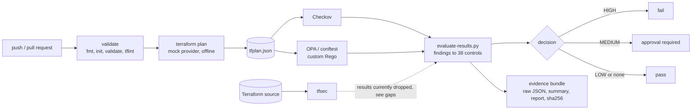
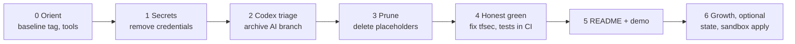

# Ayka Secure Technologies GmbH: Compliance-as-Code Gate for Terraform

> **A compliance-as-code gate for Terraform.** Checkov + tfsec + OPA scan a Terraform plan → findings are mapped to controls → a fail-closed evaluator decides pass / approval / fail → a checksummed evidence bundle and a human-readable report are produced.
>
> The platform belongs to **Ayka Secure Technologies GmbH**, a **simulated** EU SaaS company used as a case study. Nothing here is a certified ISMS, a real customer, or a production deployment.

> 🚧 **Status: under restoration (Oct–Nov 2026).** This README is the **yardstick**: it says what is true *today*, what "done" means, and the path from here to there. Every item below is checked only when it can be proven.

---

## 1. What it does

Two workloads exercise the gate:

| Workload | Role | Expected decision |
|---|---|---|
| [`ayka-portal`](Internal-IT/workloads/ayka-portal/) | Realistic modular workload (~87 resources: VPC, ALB/WAF, ECS, RDS, S3, KMS) | should **pass** |
| [`control-validation-scenarios`](Internal-IT/workloads/control-validation-scenarios/) | Deliberately insecure (public S3, open SSH, IMDSv1, no encryption) | must **fail** |

The heart of the project:

- [`control-mapping.yaml`](Internal-IT/engineering/policy-as-code/metadata/control-mapping.yaml): 38 controls with severity and ISO/IEC 27001:2022 Annex A references.
- [`evaluate-results.py`](Internal-IT/engineering/ci-cd/scripts/evaluate-results.py): turns scanner output into a decision.
- [`.github/`](.github/): the reusable workflow and composite actions.

---

## 2. Yardstick: capability status today

Labels:

- **Implemented** = runs in CI and a run can be shown.
- **Partial** = runs, but with a known gap.
- **Simulated** = fake inputs on purpose.
- **Planned** = design or docs only.

| Capability | Today | Target | Fixed in |
|---|---|---|---|
| Checkov scan of the plan | ✅ Implemented | — | — |
| OPA/conftest custom rules | ⚠️ Partial (known blind spots in EC2/IAM rules) | Implemented | Phase 4 |
| tfsec scan | ⚠️ Partial: runs, but **output is written to the wrong file, so findings are dropped** ([`run-tfsec.sh:13-19`](Internal-IT/engineering/ci-cd/scripts/run-tfsec.sh)) | Implemented | Phase 4 |
| Finding → control mapping (38 controls) | ✅ Implemented | — | — |
| Three-way decision (pass / approval / fail) | ✅ Implemented | Fail-closed on bad scanner input | Phase 4 |
| Evaluator unit tests | ⚠️ Partial: exist in [`tests/`](tests/compliance/), **not run in CI** | Run in CI | Phase 4 |
| Negative-test workload | ⚠️ Partial: regression job only **warns** if the bad workload passes | Fails the build | Phase 4 |
| Evidence bundle + SHA-256 checksums | ✅ Implemented (integrity, not tamper-proof) | — | — |
| Branch protection / environment approvals | ❌ Not set | Set and screenshotted | Phase 4 |
| Terraform apply | 🎭 Simulated (echo only) | — | Phase 6 (sandbox) |
| Workload infrastructure | 🎭 Simulated (mock credentials, never deployed) | — | Phase 6 |
| AWS Org / SCPs / landing zone / IAM / Identity Center / Entra ID | 📐 Planned: design-only Terraform, validates offline, not gated | — | Phase 6 |
| Drift detection | 📐 Planned (no remote state yet) | Manual-only until state exists | Phase 4 / 6 |
| ISMS, GDPR, risk register, org docs | 🎭 Simulated case study (many files are still empty placeholders) | Only real, linked docs | Phase 3 / 6 |
| No plaintext credentials in source | ❌ Entra bootstrap credentials still in Terraform | Removed; exposure decision recorded | Phase 1 |

**Deliberately *not* claimed:** Terragrunt, SIEM integration, SOC 2 / NIST / CIS mappings, zero-trust, continuous monitoring, automated remediation, audit-readiness, certification.

### Definition of Done: "flagship-ready"

Each item is checkable by someone who doesn't trust the author.

- [ ] **D1** No plaintext credentials in `HEAD`; rotation/history decision written
- [ ] **D2** Zero empty or title-only tracked files
- [ ] **D3** CI green on `main` with **all three** scanners counted
- [ ] **D4** pytest and `opa test` run in CI and pass
- [ ] **D5** Regression job fails the build if the insecure scenarios stop failing
- [ ] **D6** Every non-LOW finding on `ayka-portal` is fixed or carries a written rationale
- [ ] **D7** Branch protection + environment reviewer configured
- [ ] **D8** This capability table matches reality
- [ ] **D9** No links to untracked or local paths
- [ ] **D10** The author can explain every line of the evaluator and demo it in 3 minutes

---

## 3. The path

| Phase | Goal | Milestone proof | Status |
|---|---|---|:---:|
| 0 Orient | Re-learn, install tools, tag the baseline | tag `baseline-2026-10` pushed; local chain matches CI run #68 | ☐ |
| 1 Secrets | No plaintext credentials | `git grep -nE 'password\s*=\s*"' -- '*.tf'` is empty | ☐ |
| 2 Codex triage | Decide the fate of the AI-cleanup branch | decision recorded; branch archived or dropped | ☐ |
| 3 Prune | Zero placeholder files, one pipeline source | empty-file check prints nothing; 8/8 roots validate | ☐ |
| 4 Honest green | Gate sees everything; tests bite | green run on `main` with tfsec counted | ☐ |
| 5 README + demo | Final README, 3-minute demo | D1–D10 ticked | ☐ |
| 6 Next growth | Remote state → sandbox apply → governance linked to evidence | optional | ☐ |

---

## 4. Repository map

| Path | What it is | Status |
|---|---|---|
| [`.github/`](.github/) | CI: reusable workflow + composite actions (source of truth) | core |
| [`Internal-IT/engineering/`](Internal-IT/engineering/) | Scanner wrappers, evaluator, report generator, OPA policies, control mapping | core |
| [`Internal-IT/workloads/`](Internal-IT/workloads/) | `ayka-portal` (should pass) + insecure scenarios (must fail) | core |
| [`tests/`](tests/) | Evaluator unit tests | core |
| [`Internal-IT/platform/`](Internal-IT/platform/) | AWS Org, SCPs, landing zone, IAM, Identity Center, Entra ID | design-only |
| [`Governance/`](Governance/), [`organization/`](organization/) | Simulated ISMS / GDPR / company docs; the risk-management docs are the model to follow | case study, pruning in Phase 3 |
| [`Internal-IT/assurance/`](Internal-IT/assurance/) | Empty placeholders | to be removed in Phase 3 |

---

## 5. Tech

Terraform 1.7.5 · AWS (mock provider for workloads) · Microsoft Entra ID (design) · Checkov · tfsec · OPA / conftest · Python 3 · GitHub Actions

## License

[Apache 2.0](LICENSE)
