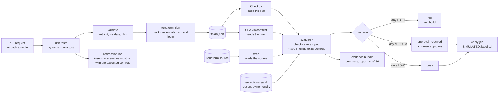
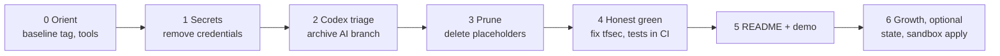

# Ayka: a compliance-as-code gate for Terraform

[](https://github.com/Ayush-cloud06/Ayka-Secure-Technologies-GmbH/actions/workflows/test.yml)

> **A compliance-as-code gate for Terraform.** Checkov + tfsec + OPA scan a Terraform plan → findings are mapped to controls → a fail-closed evaluator decides pass / approval / fail → a checksummed evidence bundle and a human-readable report are produced. It is demonstrated on **Ayka Secure Technologies GmbH**, a **simulated** ISO 27001 case-study company.

**What this is not.** Nothing is deployed. Terraform plans run offline with mock credentials, and the apply step is simulated and says so at runtime. The company, its ISMS and its people are a simulated case study, not a certified or operating ISMS.

---

## 1. How it works



**How a finding becomes a decision.** A scanner reports a rule ID (for example tfsec `AVD-AWS-0107`, Checkov `CKV_AWS_24`, or OPA `[EC2_OPEN_SSH]`). The evaluator looks it up in [`control-mapping.yaml`](Internal-IT/engineering/policy-as-code/metadata/control-mapping.yaml), and the *control's* severity counts, not the scanner's. A finding nobody has mapped counts as at least MEDIUM, so a human sees it. Any HIGH fails the build, any MEDIUM needs approval. A finding can only be set aside through [`exceptions.yaml`](Internal-IT/engineering/policy-as-code/metadata/exceptions.yaml), with a reason, an owner and an expiry date, and it still appears in the report.

Two workloads exercise the gate:

| Workload | Role | Decision |
|---|---|---|
| [`ayka-portal`](Internal-IT/workloads/ayka-portal/) | Realistic workload, ~88 resources (VPC, ALB + WAF, ECS Fargate, Multi-AZ RDS, S3, KMS) | **pass**: 6 LOW, 14 findings excepted with reasons |
| [`control-validation-scenarios`](Internal-IT/workloads/control-validation-scenarios/) | Deliberately insecure (public S3, open SSH, IMDSv1, no encryption, open NACL) | **fail**: 20 HIGH, 34 MEDIUM, 10 LOW, with the controls in [`expected-controls.txt`](Internal-IT/workloads/control-validation-scenarios/expected-controls.txt) |

---

## 2. Yardstick: capability status

- **Implemented** = runs in CI, and a run or a test shows it doing the real thing.
- **Simulated** = runs, but its effect is faked on purpose, and it says so.
- **Planned** = designed or written down only, including Terraform the gate never scans.

Evidence run: [first honest-green run, 2026-09-28](https://github.com/Ayush-cloud06/Ayka-Secure-Technologies-GmbH/actions/runs/36444940223) on [PR #7](https://github.com/Ayush-cloud06/Ayka-Secure-Technologies-GmbH/pull/7).

| Capability | Status | Evidence |
|---|---|---|
| Checkov scan of the Terraform plan | ✅ Implemented | `run-checkov.sh`, evidence run |
| OPA/conftest custom rules on the plan, all modules, resources linked through plan references | ✅ Implemented (blind spot: policy JSON unknown at plan time, see Limitations) | `OPA/terraform/*.rego`, `OPA/tests/` |
| tfsec scan of the Terraform source | ✅ Implemented (until 2026-09 a wrapper bug dropped every tfsec finding; fixed and now tested) | `run-tfsec.sh`, `tests/compliance/test_run_tfsec.py` |
| Finding → control mapping (38 controls, ISO/IEC 27001:2022 Annex A references) | ✅ Implemented | `control-mapping.yaml`, `tests/compliance/test_control_mapping.py` |
| Three-way decision, fail-closed on missing, malformed, errored or empty scanner output and on invalid severities | ✅ Implemented | `evaluate-results.py`, `tests/compliance/test_evaluate_results.py` |
| Reviewed exceptions with reason, owner and expiry | ✅ Implemented | `exceptions.yaml`, "Excepted Findings" in `compliance-report.md` |
| Negative test that must fail with named controls and tools | ✅ Implemented | `check-regression.sh`, `expected-controls.txt` |
| Unit tests and policy tests in CI | ✅ Implemented | `unit-tests` job (pytest and Rego tests) |
| Pinned tools and actions (checksums, commit SHAs) | ✅ Implemented | `.github/actions/*/action.yml` |
| Evidence bundle: plan, raw scanner JSON, summary, Markdown report, logs, and a run manifest (commit, run, tool versions, SHA-256 of mapping, exceptions, evaluator and every Rego file) | ✅ Implemented | `.github/actions/evidence/action.yml`, `write-manifest.py` |
| SHA-256 integrity check between scan and apply over every bundled file, required files enforced, evidence must match the applied commit | ✅ Implemented (integrity, **not** tamper-proof: the hash travels with the files) | `run-apply.sh`, `tests/compliance/test_evidence.py` |
| No cloud credentials in plan-only CI | ✅ Implemented | no OIDC or `id-token` anywhere in `.github/` |
| Human approval before apply | ✅ Configured: `manual-apply-approval` and `medium-risk-approval` environments require the owner's review (solo repo, so self-review is allowed) | GitHub environment settings |
| Branch protection with required checks | ✅ Configured: ruleset `protect-main` requires a PR and the five pipeline checks, and blocks force-push and deletion (0 approvals: a solo owner can't approve their own PR) | GitHub ruleset |
| Terraform apply | 🎭 Simulated: the verified plan is not applied; the job prints `SIMULATED APPLY` | `run-apply.sh` |
| Cost estimation | 🎭 Simulated: infracost isn't installed; the step says so and gates nothing | `run-cost-check.sh` |
| Workload infrastructure | 🎭 Simulated: mock credentials, plan-only, never deployed | `ayka-portal/provider.tf` |
| The company, ISMS, personnel, risk register | 🎭 Simulated case study; placeholders replaced by one [ISMS index](Governance/ISMS/README.md) | `Governance/`, `organization/` |
| AWS Organizations, SCPs, landing zone, IAM core, Identity Center, Entra ID | 📐 Planned: design-only (validates locally, not gated) | `Internal-IT/platform/` |
| Drift detection | 📐 Planned: a manual workflow exists and refuses to run without a remote backend | `drift-detection.yml` |
| Remote state, real sandbox apply, governance ↔ evidence links (SoA) | 📐 Planned | — |

**Not claimed:** Terragrunt, SIEM integration, SOC 2 / NIST CSF / CIS mappings, zero-trust, continuous monitoring, automated remediation, delegated administration, incident-response workflows, audit-readiness, certification.

### Definition of Done: "flagship-ready"

- [ ] **D1** No plaintext credentials in `HEAD` ✅; tenant check and rotation decision recorded ⏳ *(owner action)*
- [x] **D2** Zero empty or title-only tracked files
- [ ] **D3** CI green on `main` with all three scanners counted *(green on PR #7; pending merge)*
- [x] **D4** pytest and `opa test` run in CI and pass
- [x] **D5** Regression job fails the build if the insecure scenarios stop failing (it reports 5 missing tfsec pairs on the old run #68 data)
- [x] **D6** Every non-LOW finding on `ayka-portal` is fixed or excepted with a written reason, owner and expiry
- [ ] **D7** Branch protection + environment reviewer configured *(owner action)*
- [x] **D8** This capability table matches reality
- [x] **D9** No links to untracked or local paths
- [ ] **D10** The author can explain every line of the evaluator and demo it in 3 minutes

---

## 3. The path



| Phase | Goal | Proof | Status |
|---|---|---|:---:|
| 0 Orient | Re-learn, pin tools, tag the baseline | tag `baseline-2026-10`; local chain reproduced CI run #68 exactly | ☑ |
| 1 Secrets | No plaintext credentials | password literals replaced (`random_password`, manual break-glass); tenant check pending | ◐ |
| 2 Codex triage | Decide the fate of the AI-cleanup branch | archived privately; nothing taken | ☑ |
| 3 Prune | Zero placeholders, one pipeline source | 170 files removed; 8/8 roots validate | ☑ |
| 4 Honest green | Gate sees everything; tests bite | [green PR run](https://github.com/Ayush-cloud06/Ayka-Secure-Technologies-GmbH/actions/runs/36444940223) with tfsec counted; GitHub settings pending | ◐ |
| 5 README + demo | Honest docs, 3-minute demo | this README; demo rehearsal pending | ◐ |
| 6 Next growth | Remote state → sandbox apply → governance linked to evidence | optional | ☐ |

---

## 4. Run it locally

Pinned versions: Terraform 1.7.5, TFLint 0.53.0, tfsec 1.28.14, conftest 0.45.0 (OPA 0.56.0), Checkov 3.3.20, Python 3 with `tests/requirements.txt`, jq.

```bash
git clone https://github.com/Ayush-cloud06/Ayka-Secure-Technologies-GmbH.git && cd Ayka-Secure-Technologies-GmbH
python3 -m venv .venv && . .venv/bin/activate && pip install -r tests/requirements.txt
python3 -m pytest -q tests/ && opa test Internal-IT/engineering/policy-as-code/OPA
bash Internal-IT/engineering/ci-cd/scripts/run-local-chain.sh Internal-IT/workloads/ayka-portal
bash Internal-IT/engineering/ci-cd/scripts/run-local-chain.sh Internal-IT/workloads/control-validation-scenarios
```

Expected: `ayka-portal` → `pass` (LOW 6, 14 excepted); scenarios → `fail` (HIGH 20, MEDIUM 34, LOW 10). Results land in `output/` (summary, raw scanner JSON, `compliance-report.md`) and `evidence/` (raw copy plus `artifacts.sha256`), as in CI. The exit code follows the decision: `0` pass, `1` fail, `2` approval required, `3` tool or input error. Each run first deletes the previous `output/` and `evidence/`.

---

## 5. Known limitations

- Nothing is deployed; the apply is simulated. Drift detection needs remote state, which doesn't exist yet.
- OPA cannot judge an IAM policy whose JSON is unknown at plan time (it references a resource created in the same apply). Checkov is mapped to the same control.
- The decision counts raw findings, so one problem reported by three tools counts three times there; the summary and report also give `distinct_findings` (one issue on one resource). tfsec only names a module, so its findings are matched to resources inside that module.
- tfsec reports findings per module, so an exception is as coarse as the module; expiry dates and CODEOWNERS review are the safety net.
- The checksum proves integrity between jobs, not authenticity.
- Rego uses pre-1.0 syntax pinned to conftest v0.45.0; tfsec is being folded into Trivy upstream.

## 6. Repository map

| Path | What it is |
|---|---|
| [`.github/`](.github/) | The pipeline: workflows and composite actions (the only CI source) |
| [`Internal-IT/engineering/ci-cd/scripts/`](Internal-IT/engineering/ci-cd/scripts/) | Scanner wrappers, evaluator, report generator, regression check, local chain |
| [`Internal-IT/engineering/policy-as-code/`](Internal-IT/engineering/policy-as-code/) | Rego rules and tests, `control-mapping.yaml`, `exceptions.yaml` |
| [`Internal-IT/workloads/`](Internal-IT/workloads/) | `ayka-portal` (should pass) and the insecure scenarios (must fail) |
| [`tests/`](tests/) | Evaluator, wrapper and mapping tests |
| [`Internal-IT/platform/`](Internal-IT/platform/) | Design-only context: organization, landing zone, identity (not gated) |
| [`Governance/`](Governance/), [`organization/`](organization/) | The simulated ISMS case study; [`Governance/ISMS/README.md`](Governance/ISMS/README.md) lists every document as Draft, Covered elsewhere or Planned |

## License

[Apache 2.0](LICENSE)
