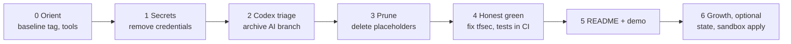

# Restoration history (2026)

How this repository went from an unverified scaffold to a tested gate. The landing page is the [README](../README.md); this file keeps the record of how it got there.

- Baseline tag: `baseline-2026-10`
- Restoration PR: [#7](https://github.com/Ayush-cloud06/Ayka-Secure-Technologies-GmbH/pull/7); first honest-green run: [36444940223](https://github.com/Ayush-cloud06/Ayka-Secure-Technologies-GmbH/actions/runs/36444940223) (2026-09-28)
- Audit remediation (October 2026): [milestone](https://github.com/Ayush-cloud06/Ayka-Secure-Technologies-GmbH/milestone/1), issues #9 to #24

## The path

| Phase | Goal | Proof | Status |
|---|---|---|:---:|
| 0 Orient | Re-learn, pin tools, tag the baseline | tag `baseline-2026-10`; local chain reproduced CI run #68 exactly | ☑ |
| 1 Secrets | No plaintext credentials | password literals replaced (`random_password`, manual break-glass); tenant check pending | ◐ |
| 2 Codex triage | Decide the fate of the AI-cleanup branch | archived privately; nothing taken | ☑ |
| 3 Prune | Zero placeholders, one pipeline source | 170 files removed; 8/8 roots validate | ☑ |
| 4 Honest green | Gate sees everything; tests bite | [green PR run](https://github.com/Ayush-cloud06/Ayka-Secure-Technologies-GmbH/actions/runs/36444940223) with tfsec counted; ruleset and reviewer configured 2026-10-05 | ☑ |
| 5 README + demo | Honest docs, 3-minute demo | README rewritten around results (#22); demo rehearsal pending | ◐ |
| 6 Next growth | Remote state → sandbox apply → governance linked to evidence | optional | ☐ |

## Definition of Done: "flagship-ready"

- [ ] **D1** No plaintext credentials in `HEAD` ✅; tenant check and rotation decision recorded ⏳ *(owner action)*
- [x] **D2** Zero empty or title-only tracked files
- [x] **D3** CI green on `main` with all three scanners counted
- [x] **D4** pytest and `opa test` run in CI and pass
- [x] **D5** Regression job fails the build if the insecure scenarios stop failing (it reports 5 missing tfsec pairs on the old run #68 data)
- [x] **D6** Every non-LOW finding on `ayka-portal` is fixed or excepted with a written reason, owner and expiry
- [x] **D7** Branch protection + environment reviewer configured (ruleset `protect-main`, 2026-10-05)
- [x] **D8** The README capability table matches reality
- [x] **D9** No links to untracked or local paths
- [ ] **D10** The author can explain every line of the evaluator and demo it in 3 minutes

