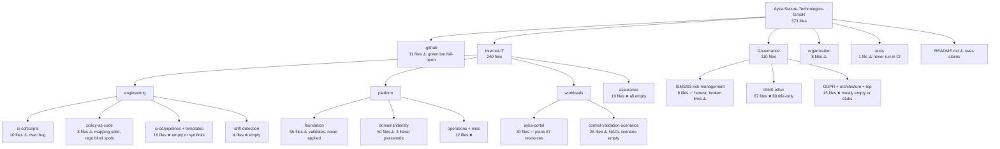
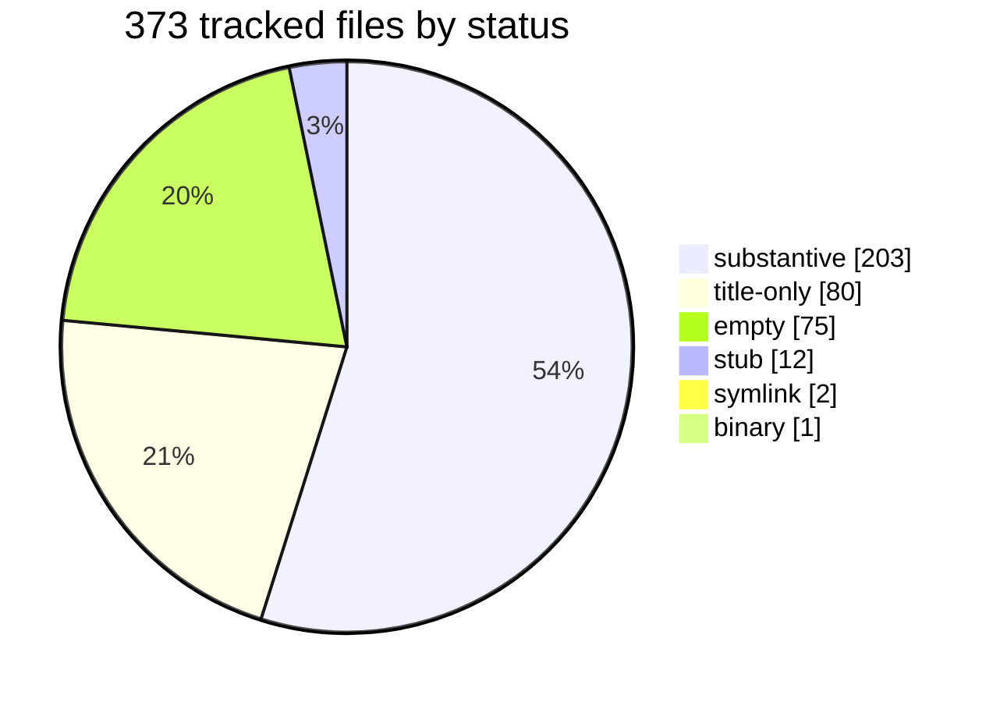
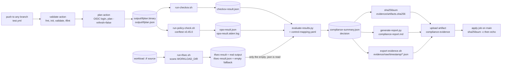
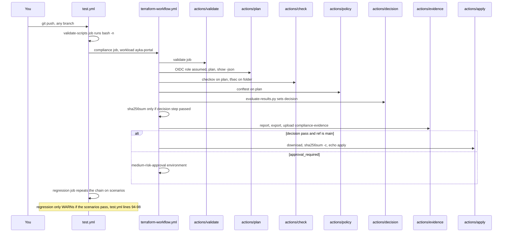
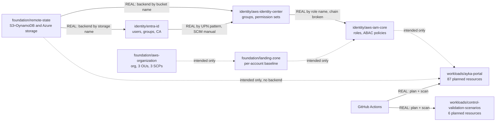
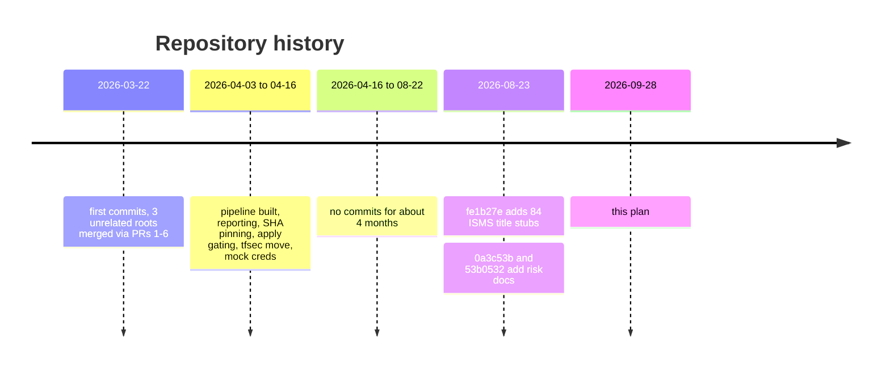

# 01 · Current state: what exists today, honestly

> **Snapshot:** `main` = `53b0532` (2026-08-23), 373 tracked files, checked on 2026-09-28.
> **How this was checked:** four research passes (Terraform, pipeline, inventory, codex branch) plus the GitHub API and CI job logs of run #68. Every row cites a file, a command or a run.
> **One-line verdict:** the core gate is real and its CI is green. But green is partly false (tfsec findings are dropped). About 40% of the files are empty placeholders, and the README claims things the code doesn't do.

---

## 1. Repo map with health labels

Legend: ✅ solid · ⚠️ works or has content but has known problems · ❌ empty or placeholder

---

## 2. Tracked files by status

- **155** files are empty or title-only (you estimated ~160). With stubs it's 167.
- Where the 80 title-only files came from: on 2026-08-23, `fe1b27e` ("Revert: cleanup") added **84** one-line `# Title` files under `Governance/ISMS/00…11` and gave 3 empty files a title (87). Two hours later, `0a3c53b` filled 7 of them with the risk documents: 87 − 7 = 80. `fe1b27e` is **not** a git revert.
- Code under `Internal-IT/`, `.github/`, `tests/` and `organization/` is byte-identical to `243c3b1` (2026-04-15/16). Proof: `git diff --stat 243c3b1 53b0532 -- tests .github Internal-IT organization` prints nothing.
- Definitions:
  - `empty` = 0 bytes or whitespace only;
  - `title-only` = only Markdown headings, ≤3 lines;
  - `stub` = a thin outline of things that don't exist;
  - `substantive` = real content, including small config files.

---

## 3. How the pipeline flows today (with artifact names)

| Stage | Where | Output file(s) | Problem found |
|---|---|---|---|
| Validate | `.github/actions/validate/action.yml:26-43` | none | tag-pinned actions, `tflint_version: latest` (`:17,22,24`) |
| Plan | `.github/actions/plan/action.yml:23-50` | `output/tfplan.binary`, `output/tfplan.json` | assumes a **real** AWS role via OIDC; the portal ignores it because of hard-coded mock keys (`ayka-portal/provider.tf:19-20`) |
| Cost hook | `run-cost-check.sh:6-13` | none | prints "Simulated cost check: Passed." |
| Checkov | `run-checkov.sh:13-16` | `output/checkov-result.json` | a missing plan gives exit 0 plus `parsing_errors`, which the evaluator ignores |
| tfsec | `run-tfsec.sh:9,13-19` | `output/tfsec-result` (real) and `output/tfsec-result.json` (15-byte fallback) | **every tfsec finding is dropped**; the regression job scans the wrong folder |
| OPA | `run-policy-check.sh:14-28` | `output/opa-result.json` | loads dead `OPA/aws/*.rego`; rules see only one module level |
| Decision | `evaluate-results.py:417-421` | `output/compliance-summary.json` | unmapped Checkov findings become LOW; jq bug in `decision/action.yml:38` |
| Checksum | `terraform-workflow.yml:96-105` | `evidence/artifacts.sha256` | skipped on `fail`; the summary isn't uploaded, so only `tfplan.json` gets verified |
| Evidence | `evidence/action.yml:13-32`, `export-evidence.sh:25-26` | artifact `compliance-evidence` | copies `*.json` only, so the bundle holds the *empty* tfsec file |
| Apply | `run-apply.sh:11-27` | none | verifies, then only echoes "14 added" (the real plan is 87 creates) |

Details and the full list of 29 confirmed issues (F1–F29) live in the research notes; the ones that matter are carried into [Phase 4](05-phase-playbooks/phase-4-pipeline-green.md). The mechanics are explained in [how-it-works.md](how-it-works.md).

---

## 4. One run through GitHub Actions and the composite actions

**GitHub state (API, 2026-09-28):**

| Item | State | Evidence |
|---|---|---|
| Branches | only `main`, `protected: false` | `list_branches` |
| PR Compliance Pipeline (`test.yml`) | active; runs #66–#68 on 2026-08-23 **success** | [run #68](https://github.com/Ayush-cloud06/Ayka-Secure-Technologies-GmbH/actions/runs/32621618951) |
| Terraform Compliance Workflow | active, reusable, called by `test.yml:37` | — |
| Policy Check Workflow | active, reusable, **called by nothing** | `grep -rn policy-check.yml .github` gives no caller |
| Scheduled Drift Detection | `disabled_inactivity` since 2026-06-15; 61/61 scheduled runs failed (plan exit code 2) | GitHub API; step "Report Drift" ran |
| Environments | apply job started about 4 s after it was queued, so it probably has no required reviewers (**UNVERIFIED**) | run #68 job timings |
| Run #68 artifacts | `compliance-evidence` 145 KB, `compliance-evidence-regression` 24 KB; **expire 2026-11-21** | `list_workflow_run_artifacts` |
| OIDC | role `arn:aws:iam::982081090103:role/github-actions-oidc-role` assumed successfully (`AWS_SESSION_TOKEN` set) | run #68 apply log |

---

## 5. Terraform roots and how they relate

There are **8** roots. `aws-identity-center` was missing from your list. All 8 pass `terraform fmt -check`, `init -backend=false` and `validate` (terraform 1.7.5). Only the two workloads can plan offline.

Solid arrow = a real code reference (name convention; **no** root reads another root's state, there is no `terraform_remote_state`). Dotted = described in docs only.

| Root | Purpose | Backend | Resources | Health | Evidence |
|---|---|---|---:|---|---|
| `Internal-IT/platform/foundation/aws-organization` | org, OUs, SCPs (attached to Workloads OU only) | local | 10 | ⚠️ both creates the org and reads it; no `terraform {}` block | `organization.tf:1`, `main.tf:11`, `provider.tf:1-3` |
| `Internal-IT/platform/foundation/landing-zone` | CloudTrail, S3 PAB, IAM roles, SNS, "SIEM" Firehose, budgets × 3 accounts | local | 22 per account | ⚠️ never applied; the Firehose has no source | `modules/siem/main.tf:16-27` |
| `Internal-IT/platform/foundation/remote-state` | state bucket + lock table (AWS) **and** Azure storage | local | 7 | ⚠️ mixes two clouds; `variables.tf` empty | `bootstrap.tf:1-40`, `main.tf:1-23` |
| `Internal-IT/platform/domains/identity/aws-iam-core` | roles, 9 policies, permission boundary | local | 21 | ⚠️ 3 ABAC policies never attached | `abac-custom-policies.tf:32,64,95` |
| `Internal-IT/platform/domains/identity/aws-identity-center` | tier groups, permission sets, assignments | S3 | 13 blocks | ⚠️ role chain can't work (roles trust `sso.amazonaws.com`) | `trust-policies.tf:2-11` |
| `Internal-IT/platform/domains/identity/entra-id` | users from HR JSON, groups, admins, break-glass, CA (off by default) | azurerm | 14 blocks | ❌ **3 literal passwords**; no lock file | `modules/core/users.tf:16`, `modules/privileged/break_glass.tf:6`, `modules/privileged/admin_accounts.tf:9` |
| `Internal-IT/workloads/ayka-portal` | VPC, ALB+WAF, ECS, EC2, RDS, S3, KMS | local | **87 planned** | ✅ clean fmt/validate/tflint; plans offline | `provider.tf:17-33` (mock keys + skip flags) |
| `Internal-IT/workloads/control-validation-scenarios` | 5 deliberately broken modules | local | **6 planned** | ⚠️ NACL scenario empty; no IAM scenario; plans only with env credentials | `vpc/permissive-network-acl/main.tf` (0 bytes), `provider.tf:12-21` |

---

## 6. Area-by-area table

| Path | Purpose | Files | Lines | Health | Evidence |
|---|---|---:|---:|---|---|
| `.github/workflows` | entry (`test.yml`), reusable gate, unused policy workflow, drift | 4 | 315 | ⚠️ | fail-open issues in §3; actionlint: 2 errors (top-level `description:` at `terraform-workflow.yml:2`, `policy-check.yml:2`) |
| `.github/actions` | 7 composite actions | 7 | 247 | ⚠️ | jq bug `decision/action.yml:38`; no `workload_dir` in `check/action.yml` |
| `Internal-IT/engineering/ci-cd/scripts` | wrappers + evaluator + report | 10 | 728 | ⚠️ | `run-tfsec.sh:13-19`; evaluator itself is sound (`evaluate-results.py`, 458 lines) |
| `Internal-IT/engineering/policy-as-code` | 38-control mapping + 6 rego files | 8 | 1,084 | ⚠️ | mapping 11 HIGH / 9 MEDIUM / 18 LOW; `OPA/aws/*.rego` dead; OPA 1.0 would give 45 parse errors |
| `tests/compliance` | evaluator unit tests | 1 | 228 | ⚠️ | 5 pass locally; never run in CI |
| `Internal-IT/engineering/ci-cd` (other) | docs, 14 empty pipeline YAMLs, 2 symlinks | 23 | 88 | ❌ | all 14 `pipelines/**/*.yml` are 0 bytes; `templates/*.yml` are symlinks to `.github/workflows` |
| `Internal-IT/engineering` (other) | drift docs/script, pre-commit | 5 | 0 | ❌ | all empty |
| `Internal-IT/workloads/ayka-portal` | "should pass" workload | 30 | 1,718 | ✅ | plans 87 creates offline |
| `Internal-IT/workloads/control-validation-scenarios` | "must fail" workload | 26 | 229 | ⚠️ | 10 empty files; committed `tfplan.binary` |
| `Internal-IT/platform/foundation/*` | org, landing zone, remote state | 56 | 1,203 | ⚠️ | validate OK; never applied; stale README |
| `Internal-IT/platform/domains/identity/*` | IAM core, Identity Center, Entra ID + docs | 50 | 2,792 | ⚠️/❌ | literal passwords; `tempChangePlan.md` is a real decision record |
| `Internal-IT/platform` (other) | operations, control-plane docs | 12 | 157 | ❌ | 9 empty, 2 stubs describing planes that don't exist |
| `Internal-IT/assurance` | evidence/audit folder | 19 | 1 | ❌ | 18 × 0 bytes + one 2-byte whitespace file |
| `Governance/ISMS/03-risk-management` | risk register, criteria, treatment plan, reviews | 8 | 635 | ✅/⚠️ | honest and evidence-graded; 10 links into untracked `AUDIT/`; `risk-register.md:21` wrongly says the source is clean |
| `Governance/ISMS` (other) | ISMS skeleton | 87 | 656 | ❌ | 80 title-only; `iam-iso27001-mapping.md` has 7 broken paths and A.5.15–A.5.18 shifted by one |
| `Governance` (GDPR, architecture, top) | privacy, architecture | 15 | 191 | ❌ | 5 empty, 7 stubs |
| `organization` | simulated company | 8 | 468 | ⚠️ | 3 empty; claims a Sentinel SIEM (`roles-and-responsibilities.md:69`) |
| root | README, LICENSE, .gitignore | 3 | 395 | ⚠️ | README over-claims (§7) |

---

## 7. README claims vs code

| README claim | Where | Reality |
|---|---|---|
| Terragrunt | `README.md:67` | no `terragrunt.hcl` anywhere |
| SIEM integration | `README.md:24` | a Firehose with no source (`landing-zone/modules/siem/main.tf:16-27`) |
| SOC 2, NIST CSF 2.0, CIS | `README.md:12,35-37` | prose crosswalk only (`Platform_Complilance.md`); the mapping has ISO 27001 only |
| zero-trust | `README.md:61` | no code |
| continuous monitoring + automated remediation | `README.md:62` | no Config/Security Hub/EventBridge/Lambda anywhere |
| delegated administration, logging account, background checks, incident-response workflows | `README.md:18,25,29,52` | no code |
| audit-ready evidence | `README.md:60` | your own `risk-treatment-plan.md:26` forbids this wording until evidence is retained and reviewed |
| drift detection | `README.md:25` | workflow failed 61/61 and is disabled |

---

## 8. Verification results (planning session, 2026-09-28)

| Check | Command | Result |
|---|---|---|
| Tracked files | `git ls-files \| wc -l` | 373 |
| HEAD | `git rev-parse --short main` | `53b0532` |
| Code changed since April? | `git diff --stat 243c3b1 53b0532 -- tests .github Internal-IT organization` | empty (no) |
| Terraform fmt / init / validate (8 roots) | `terraform fmt -check -recursive`; `terraform init -backend=false`; `terraform validate` (terraform 1.7.5) | **8/8 pass** ¹ |
| tflint | `tflint --recursive` (0.53.0, terraform ruleset) | 46 warnings, 0 errors (all in platform/identity); workloads clean |
| Plan: ayka-portal | `terraform plan -refresh=false` (no credentials needed) | `Plan: 87 to add` |
| Plan: scenarios | same, with `AWS_ACCESS_KEY_ID=mock AWS_SECRET_ACCESS_KEY=mock` | `Plan: 6 to add` (fails without env credentials) |
| Evaluator tests | `python3 -m pytest -q tests/` | **5 passed** (pytest 9.1.1) |
| unittest discovery | `python3 -m unittest` | 0 tests found (no `__init__.py`) |
| Shell syntax | `bash -n Internal-IT/engineering/ci-cd/scripts/*.sh` | OK |
| shellcheck | `shellcheck …/scripts/*.sh` (0.11.0) | 1 warning (SC2034, `evaluate-results.sh:11`) |
| OPA (as pinned) | `opa check OPA/` (0.56.0 = conftest 0.45.0) | OK |
| OPA 1.0 | `opa check OPA/` (1.0.0) | **45 parse errors** (pre-1.0 syntax) |
| OPA tests | `opa test OPA/`; `conftest verify` | 0 tests exist |
| opa fmt | `opa fmt --list OPA/` | all 6 files need formatting |
| actionlint | `actionlint .github/workflows/*.yml` (1.7.7) | 2 errors (invalid top-level `description:`) |
| yamllint | `yamllint -d relaxed .github/` (1.38.0) | trailing spaces (`drift-detection.yml:21,40`, `test.yml:88,93`), no EOF newline (`apply/action.yml:27`) |
| Local chain, ayka-portal | checkov 3.3.20 → tfsec v1.28.14 → conftest 0.45.0 → evaluator | **PASS**, 0/0/14: matches run #68 exactly |
| Local chain, scenarios | same | **FAIL**, 4/8/17 (29 findings): matches run #68 exactly |
| tfsec as intended (bug fixed) | read `tfsec-result` instead of the fallback | ayka-portal **FAIL** 3/1/14; scenarios FAIL 17/16/21 |
| Probe plan (public SSH via rule resources, IMDSv1 root instance, `Action=["*"]`) | full chain | **PASS today** (16 LOW, OPA 0) |
| Checkov (`--repo-root-for-plan-enrichment`) | checkov 3.3.20 | inline skips are ignored on plan scans; enrichment would honour 3 of 8 |
| Secrets | pattern scan of tree and full history | 3 literal Entra passwords (lines above); mock AWS keys in `ayka-portal/provider.tf:19-20`; **no** AKIA keys, private keys, `.env` or tfstate ever |
| Codex branch | `git ls-remote`, GitHub API, activity log | not on GitHub, never pushed |
| checkov/tfsec/terraform registry reachability | sandbox proxy | `registry.terraform.io` and `api0.prismacloud.io` blocked (403) ¹ |

¹ **Disclosure:** in this planning sandbox `registry.terraform.io` returned 403. Provider zips were fetched from `releases.hashicorp.com`, the same official host as the terraform binary. They were checked against HashiCorp's SHA256SUMS and your committed lock-file hashes, then passed with `terraform init -plugin-dir`. If you consider that a workaround you didn't want, treat the `init`/`validate`/`plan` rows as **UNVERIFIED** and re-run them in [Phase 0](05-phase-playbooks/phase-0-orient.md), where your laptop has normal registry access.

---

## 9. History at a glance

65 commits, 1 author, 68 CI runs of `test.yml` (many red during the April build-out, green since #65).
