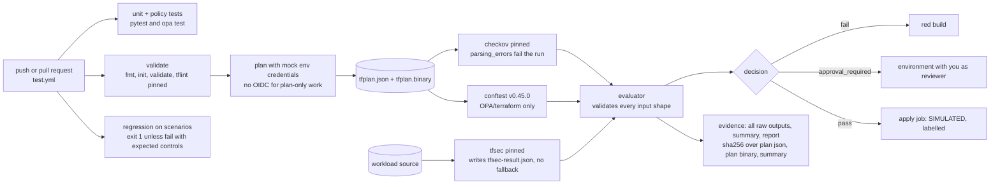

# 02 · Target state: what "done" looks like

> **"Done" is not "more features".** Done means every file in the repo is either running code, a test, or a document that points at real evidence. Every claim in the README is one you could demo.
> Target date for "flagship-ready": **Sat 2026-11-21** (see [04-roadmap.md](04-roadmap.md)).

---

## 1. The identity sentence (unchanged until you decide)

> "A compliance-as-code gate for Terraform: Checkov + tfsec + OPA scan a Terraform plan → findings are mapped to controls → a fail-closed evaluator decides pass/fail → a checksummed audit-evidence bundle and human-readable report are produced. It's backed by a simulated ISO 27001 case-study company, Ayka Secure Technologies GmbH."

[ADR-0002](adr/0002-identity-and-scope.md) proposes a more precise wording. The reasons:

- the evaluator has **three** outcomes, not two;
- tfsec scans the **source**, not the plan;
- "audit-evidence" conflicts with your own treatment TRT-007.

The sentence changes only if you accept the ADR. Either way, "fail-closed" only becomes true after [Phase 4](05-phase-playbooks/phase-4-pipeline-green.md).

---

## 2. Target repository tree (after Phases 3–5)

```text
Ayka-Secure-Technologies-GmbH/                         ≈ 205 files (from 373)
├── README.md                    rewritten: capability table, demo, limits  (P5)
├── LICENSE
├── .gitignore                   fixed: no tfplan binaries, no tree.md rule  (P3)
├── .github/                     single source of truth for CI  (ADR-0005)
│   ├── CODEOWNERS               new: mapping + workflows need review  (P4, ADR-0014)
│   ├── workflows/               test.yml · terraform-workflow.yml · drift-detection.yml (manual)
│   └── actions/                 validate · plan · check · policy · decision · evidence · apply
├── tests/compliance/            evaluator tests incl. fail-closed cases  (P4)
├── Internal-IT/
│   ├── engineering/
│   │   ├── ci-cd/               scripts/ (10) · architecture.md (rewritten) · compliance-gates/ (2)
│   │   └── policy-as-code/      OPA/terraform/*.rego (4) + *_test.rego (new) · metadata/ (2)
│   ├── workloads/
│   │   ├── ayka-portal/         "should pass" workload (30)
│   │   └── control-validation-scenarios/  "must fail" workload, NACL scenario implemented (≈16)
│   └── platform/                DESIGN-ONLY context, not scanned by the gate (≈102)
│       ├── foundation/          aws-organization · landing-zone · remote-state · platform-compliance.md
│       └── domains/identity/    aws-iam-core · aws-identity-center · entra-id · docs/
├── Governance/                  ≈16 files, every one real
│   ├── ISMS/README.md           index of *planned* documents (replaces 84 stubs, ADR-0004)
│   ├── ISMS/00-context-and-governance/   information-security-policy.md · scope.md
│   ├── ISMS/03-risk-management/          8 risk docs, links fixed (ADR-0009)
│   ├── ISMS/04-controls-and-soa/         iam-iso27001-mapping.md (banner: known issues)
│   ├── GDPR/technical-and-organization-measures/  2 docs (banner)
│   └── architecture/identity-architecture.md
├── organization/                simulated company (5)
└── docs/restore-plan/           this plan: keep it as the record of the restoration, or leave it on its branch
```

### The 80–120 file question: an honest answer

| Option | Files | What it takes | Trade-off |
|---|---:|---|---|
| **A. Prune placeholders, keep platform as design-only** (default) | ≈ 205 | Phase 3 as planned | Still shows your IAM / SCP / Identity Center / Entra work. About half the repo is context that the gate doesn't scan. |
| **B. Also archive `Internal-IT/platform/` to a tag** | ≈ 103 | one extra commit: `git tag archive/platform-2026` then `git rm -r Internal-IT/platform` | Very focused repo that matches the identity sentence exactly. You lose visible breadth, but the code stays one `git checkout` away. |

The 172 files marked DELETE are all empty, title-only, stubs, symlinks, dead code or generated. That gets you to about 201. **Reaching 80–120 means removing *substantive* work**, the ~102 platform files. It's a real choice, so it's [open question Q7](risks-and-open-questions.md#before-phase-23). The default is **A**, because the platform roots all pass `terraform validate` and show skills an interviewer will ask about. Revisit in [Phase 6](05-phase-playbooks/phase-6-next-growth.md).

> **Why not just count files?** File count is a proxy for "can a reviewer find the real work in 30 seconds?". A 200-file repo with zero empty files and a README that labels platform code "design-only" passes that test better than a 100-file repo with hidden gaps.

---

## 3. Target pipeline (differs from today)



| Change vs today | Why | Decided in |
|---|---|---|
| tfsec output path fixed, fallback removed | stop silently dropping findings | [ADR-0011](adr/0011-fail-closed-scanner-contract.md) |
| `workload_dir` passed into the scan | regression must scan the scenarios | ADR-0011 |
| evaluator validates inputs, fails on `parsing_errors` | fail-closed has to cover broken scanner output too | ADR-0011 |
| unmapped-finding severity policy (default: MEDIUM) | unknown checks must not pass as LOW | ADR-0011, Q9 |
| pytest + `opa test` in CI | tests that never run protect nothing | [ADR-0012](adr/0012-tests-run-in-ci.md) |
| strict regression job | a negative test that can't fail proves nothing | ADR-0012 |
| no OIDC role for plan-only work | least privilege; the role isn't used anyway | [ADR-0013](adr/0013-no-cloud-creds-for-plan-only.md) |
| checksums cover plan binary + summary; no `--ignore-missing` | verify what you claim to verify | [ADR-0011](adr/0011-fail-closed-scanner-contract.md) |
| actions and tools pinned | the same commit gives the same decision | [ADR-0015](adr/0015-pin-tool-versions.md) |
| drift workflow manual-only | no state means no meaningful drift | [ADR-0008](adr/0008-drift-manual-only.md) |
| mapping changes reviewed (CODEOWNERS + rationale) | the mapping *is* the gate | [ADR-0014](adr/0014-control-mapping-changes-reviewed.md) |

---

## 4. Capability status table (the honest one)

Definitions from [ADR-0006](adr/0006-honesty-labelling.md):

- **Implemented** = runs in CI on every push, and you can show the run.
- **Simulated** = shown with fake inputs or outputs, on purpose, and labelled as such.
- **Planned** = designed or written down, including Terraform that the gate never plans or scans. Nothing in CI proves it.

"Design-only" is the README wording for the platform roots. They are **Planned** in ADR-0006 terms: the source validates locally, but it was never applied and isn't gated. Rule of thumb: the weakest true label wins.

| Capability | Status after Phase 5 | Evidence to point at |
|---|---|---|
| Checkov scan of the Terraform plan | Implemented | `run-checkov.sh:13-16`, CI run |
| OPA/conftest custom rules on the plan | Implemented (known blind spots listed) | `OPA/terraform/*.rego`, `run-policy-check.sh` |
| tfsec scan of Terraform source | Implemented **after P4** (today: silently dropped) | `run-tfsec.sh` |
| Finding → control mapping (38 controls, ISO/IEC 27001:2022 Annex A refs) | Implemented | `control-mapping.yaml` |
| Three-way decision with fail-closed input checks | Implemented after P4 | `evaluate-results.py:417-421` |
| Negative-test workload that must fail | Implemented, strict after P4 | `control-validation-scenarios/`, regression job |
| Unit tests + policy tests in CI | Implemented after P4 | `tests/compliance/`, `*_test.rego` |
| Evidence bundle: raw JSON, summary, Markdown report | Implemented | `evidence/action.yml`, artifact |
| SHA-256 integrity check between scan and apply | Implemented (integrity, **not** tamper-proof) | `terraform-workflow.yml:96-105`, `run-apply.sh:14` |
| Human approval for MEDIUM findings | Implemented only once environment reviewers are set (P4, GitHub UI) | environment settings screenshot |
| Branch protection with required checks | Implemented after P4 (GitHub UI) | ruleset screenshot |
| Terraform apply | **Simulated** (echo) | `run-apply.sh:24-27` |
| Cost estimation | **Simulated** (infracost not installed) | `run-cost-check.sh` |
| Workload infrastructure (ayka-portal) | **Simulated**: mock credentials, never deployed | `ayka-portal/provider.tf:17-33` |
| AWS Organizations, SCPs, landing zone, IAM core, Identity Center, Entra ID | **Planned: design-only** (source validates locally, never applied, not gated) | `Internal-IT/platform/**` |
| The company, ISMS, personnel, risk register | **Simulated** case study (your docs already say so) | `risk-register.md:3,9` |
| Remote state for workloads | **Planned** (Phase 6a) | — |
| Real sandbox apply | **Planned** (Phase 6b) | — |
| Meaningful drift detection | **Planned** (needs state) | [ADR-0008](adr/0008-drift-manual-only.md) |
| Governance ↔ control ↔ evidence links (SoA) | **Planned** (Phase 6c) | [ADR-0009](adr/0009-governance-links-evidence.md) |
| Signed or attested evidence | **Planned** (optional, Phase 6e) | — |
| **Claims removed from README** | Terragrunt · SIEM integration · SOC 2 / NIST / CIS mappings (prose only) · zero-trust · continuous monitoring · automated remediation · delegated admin · logging account · incident-response workflows · audit-ready | [01-current-state.md §7](01-current-state.md#7-readme-claims-vs-code) |

---

## 5. Target README outline (full draft in Phase 5)

1. Title + identity sentence + one badge (CI status).
2. "What this is, and what it is not": the simulated case-study label in the first 3 lines.
3. Pipeline diagram (Mermaid, from [Phase 5](05-phase-playbooks/phase-5-readme-and-demo.md)).
4. Capability table (section 4 above).
5. "See it work in 3 minutes": links to a green run, the failing regression job, and a `compliance-report.md` artifact.
6. How a finding becomes a decision (5 lines + link to [how-it-works.md](how-it-works.md)).
7. Run it locally (pinned tool versions, 6 commands).
8. Repo map (which folders are the gate, which are design-only context).
9. Known limitations (from [interview-prep.md Q9](interview-prep.md#q9-what-are-the-limitations-be-proactive)).
10. Decisions (link to `docs/restore-plan/adr/`) and license.

---

## 6. Definition of Done: "flagship-ready"

Each line is checkable by someone who doesn't trust you.

| # | Criterion | How to verify |
|---|---|---|
| D1 | No plaintext credentials in `HEAD`; a written decision on rotation or history | `git grep -nE 'password\s*=\s*"' -- '*.tf'` returns nothing; ADR-0007 status Accepted |
| D2 | Zero empty or title-only tracked files | `git ls-files -z \| xargs -0 -I{} sh -c 'test -s "{}" \|\| echo {}'` prints nothing; the title-only check in Phase 3 prints nothing |
| D3 | CI green on `main` with **all three scanners** in `by_tool` | run summary shows `checkov`, `opa`, `tfsec` in `metadata_coverage.by_tool` |
| D4 | Tests run in CI and pass | the run shows pytest (≥ 5 + new cases) and `opa test` steps |
| D5 | Regression job fails the build if the scenarios stop failing | a deliberate test commit on a branch (e.g. comment out one scenario) turns CI red; then revert |
| D6 | Every non-LOW finding on ayka-portal is fixed or carries a written rationale | `control-mapping.yaml` rationale fields / `tfsec:ignore` comments with reason; summary shows 0 unexplained HIGH |
| D7 | Branch protection on `main` requires the CI checks; environments have a reviewer | screenshots dated after the change, linked from the risk register (RISK-005) |
| D8 | README capability table matches reality; no claim from the "removed" list remains | read the README against section 4 |
| D9 | No link points to an untracked path (`AUDIT/`, `/home/…`) | `git grep -nE 'AUDIT/\|/home/' -- '*.md'` returns nothing outside this plan |
| D10 | You can explain every line of the evaluator and each fix | [how-it-works.md §8 self-check](how-it-works.md#8-self-check-answer-without-looking-then-verify) answered from memory; the 3-minute demo rehearsed |
