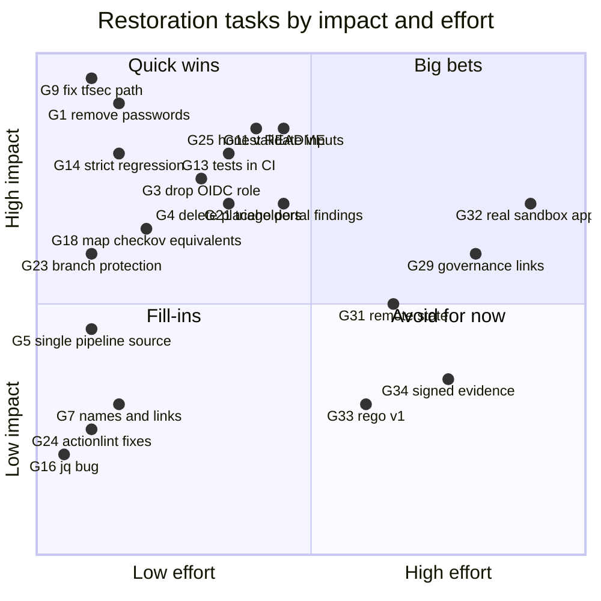

# 03 · Gap analysis: current → target, item by item

> Each row is one gap between [01-current-state.md](01-current-state.md) and [02-target-state.md](02-target-state.md). Effort is **S** ≤ 1 h, **M** = one 1–2 h session, **L** = more than one session.
> "Impact" means how much closing the gap improves the project's **truthfulness and credibility**, not how many lines change.

---

## 1. Gap table

### Security

| # | Gap | Current | Target | Closed in | Effort |
|---|---|---|---|---|---|
| G1 | Plaintext credentials in `HEAD` | 3 literal Entra passwords (`entra-id/modules/core/users.tf:16`, `modules/privileged/break_glass.tf:6`, `modules/privileged/admin_accounts.tf:9`) | variables / `random_password`, no literals ([ADR-0007](adr/0007-entra-bootstrap-secrets.md)) | P1 | S |
| G2 | Exposure decision not recorded | values public since 2026-03-22 in 3 root commits + PR refs; `risk-register.md:21` wrongly says source is clean | written decision: rotate/disable if ever real; history rewrite yes/no | P1 | S (+ your tenant check) |
| G3 | Plan-only CI assumes a **real** AWS role | OIDC succeeds for `982081090103` (run #68); role scope unknown; `id-token: write` on every job | inspect trust + permissions (P1); mock env credentials, no OIDC for plan-only (P4, [ADR-0013](adr/0013-no-cloud-creds-for-plan-only.md)) | P1 + P4 | M |

### Repository hygiene

| # | Gap | Current | Target | Closed in | Effort |
|---|---|---|---|---|---|
| G4 | Placeholder files | 75 empty + 80 title-only + 12 stubs | 0; one "planned documents" index ([ADR-0004](adr/0004-delete-placeholders.md)) | P3 | M |
| G5 | Duplicate pipeline surface | 14 empty `ci-cd/pipelines/*.yml`, 2 symlinks, unused `policy-check.yml` | `.github/` only ([ADR-0005](adr/0005-github-single-source-of-truth.md)) | P3 | S |
| G6 | Generated / odd tracked files | `control-validation-scenarios/tfplan.binary`; `.gitignore` ignores tracked `tree.md`; `output/` pattern matches a module dir | removed and gitignored | P3 | S |
| G7 | Broken names and references | `Platform_Complilance.md` typo; absolute `/home/ayush/...` links (`enforcement-levels.md:13`, `policy-evaluation-flow.md:12`); `metadata/README.md:8` points at a non-existent file | renamed and fixed | P3 | S |
| G8 | Hidden dependency on an empty file | `entra-id/main.tf:28-30` sources a module whose only file is 1 byte | module block removed, validate passes | P3 | S |

### Pipeline correctness ("honest green")

| # | Gap | Current | Target | Closed in | Effort |
|---|---|---|---|---|---|
| G9 | **tfsec findings silently dropped** | `run-tfsec.sh:13-19` writes `tfsec-result`, then an empty `.json` fallback | writes `tfsec-result.json`; missing file = fail | P4 | S |
| G10 | Regression job's tfsec scans the wrong folder | `WORKLOAD_DIR` inherited from `test.yml:13` | `workload_dir` input on `check/action.yml` | P4 | S |
| G11 | Evaluator accepts broken scanner output | Checkov `parsing_errors` ignored; `{}` / `[]` give `pass` | shape validation; fail on parse errors ([ADR-0011](adr/0011-fail-closed-scanner-contract.md)) | P4 | M |
| G12 | Unmapped Checkov findings can never block | null severity → LOW (`evaluate-results.py:48-54`) | written policy, default unmapped = MEDIUM (Q9) | P4 | S |
| G13 | Tests don't protect anything | 5 pytest tests never run in CI; 0 rego tests | pytest + `opa test` in CI ([ADR-0012](adr/0012-tests-run-in-ci.md)) | P4 | M |
| G14 | Negative test can't fail | `test.yml:76` `continue-on-error`, `:94-98` only warns | exit 1 unless `fail` with the expected controls | P4 | S |
| G15 | Checksum verifies less than it claims | summary not uploaded; `--ignore-missing`; `tfplan.binary` not hashed | all three hashed and verified | P4 | S |
| G16 | jq quoting bug | `decision/action.yml:38` compile error in run #68 | fixed | P4 | S |
| G17 | Dead policies loaded | `OPA/aws/*.rego` never fire but are loaded | deleted; conftest points at `OPA/terraform` | P4 | S |
| G18 | A realistic bad plan passes | probe: public SSH via rule resources + IMDSv1 + `Action=["*"]` → PASS | Checkov equivalents mapped to HIGH controls (P4, S); rego rewritten for all module levels and rule resources (P6, L) | P4 + P6 | S → L |
| G19 | Unpinned tools and actions | `@v3`/`@v4` tags, `tflint latest`, `pip install checkov` | pinned by SHA / version ([ADR-0015](adr/0015-pin-tool-versions.md)) | P4 | S |
| G20 | Scenario coverage weaker than documented | NACL scenario empty; no IAM scenario | NACL implemented; IAM scenario optional | P4 | S–M |
| G21 | ayka-portal becomes red once tfsec works | 3 unmapped HIGH (public ALB, 2× wildcard false positive) + 1 MEDIUM | each fixed or excepted with a written reason ([ADR-0014](adr/0014-control-mapping-changes-reviewed.md)) | P4 | M |
| G22 | Drift workflow can't work | nightly cron, 61/61 failures, plan errors reported green | `workflow_dispatch` only, errors fail ([ADR-0008](adr/0008-drift-manual-only.md)) | P4 | S |
| G23 | No enforced review | `main` unprotected; environments apparently without reviewers | ruleset with required checks; you as environment reviewer | P4 (GitHub UI) | S |
| G24 | Workflow lint errors | actionlint: invalid top-level `description:` ×2; yamllint whitespace | clean actionlint | P4 | S |

### Honesty and documentation

| # | Gap | Current | Target | Closed in | Effort |
|---|---|---|---|---|---|
| G25 | README over-claims | Terragrunt, SIEM, SOC 2, zero-trust, continuous monitoring… (`README.md:12-67`) | capability table: Implemented / Simulated / Planned ([ADR-0006](adr/0006-honesty-labelling.md)) | P5 | M |
| G26 | Simulated steps look real | `run-apply.sh:24-27` prints "Apply complete! 14 added"; cost check "Passed" | labelled SIMULATED in logs + README | P4 + P5 | S |
| G27 | Risk docs point at a folder GitHub can't see | 10 `AUDIT/` links; "124 Checkov failures"; TRT-003/006 describe fixes not on `main` | links to CI runs and committed evidence ([ADR-0009](adr/0009-governance-links-evidence.md)) | P1 (RISK-001) + P5 | S |
| G28 | Other docs contradict code | `workloads/README.md` data-source/analytics claims; Sentinel SIEM; unapproved "Approved by" lines | corrected or bannered | P5 | M |
| G29 | Governance not linked to controls/evidence | 0 docs reference any of the 38 control IDs | SoA / risk rows link control IDs + CI runs | P6c | L |
| G30 | Crosswalk errors | `iam-iso27001-mapping.md`: 7 broken paths, A.5.15–A.5.18 shifted by one | fixed or merged into one crosswalk | P6c | M |

### Growth (after flagship-ready)

| # | Gap | Current | Target | Closed in | Effort |
|---|---|---|---|---|---|
| G31 | No remote state for workloads | local state; `remote-state` root mixes AWS and Azure | one backend for ayka-portal | P6a | M |
| G32 | Nothing ever applied | apply is an echo | tiny sandbox slice applied and destroyed, with a budget alarm | P6b | L |
| G33 | Rego pre-1.0 syntax | 45 parse errors under OPA 1.0 | `rego.v1` | P6d | M |
| G34 | Evidence integrity only | hash travels with the data | attested or signed evidence | P6e | M |

---

## 2. Impact vs effort

**How to read it**

- **Quick wins** (top-left) are where Phases 1, 3 and 4 spend most of their time. G9 alone changes the truth of your headline claim.
- **Big bets** (top-right) are Phase 6. They matter, but only after the repo is honest.
- **Avoid for now** (bottom-right): Rego v1 migration and signed evidence are good engineering, but a recruiter won't notice them before the basics are right.
- **Fill-ins** (bottom-left): do them when a session has 20 minutes left.

---

## 3. What is *not* a gap (keep as is)

| Thing | Why it stays |
|---|---|
| The evaluator's core logic | Clear mapping precedence, three-way decision, fail-closed on missing or malformed files (`evaluate-results.py:32-37`, `:282-289`, `:417-421`) |
| The control mapping format | 38 controls, one YAML, multiple enforcements per control. The design is right; only rationale fields are missing |
| The two-workload design (should-pass / must-fail) | This is the most convincing part of the project |
| Your risk-document style | Evidence-graded, "simulated case study" on every page. It's the model for [ADR-0009](adr/0009-governance-links-evidence.md) |
| The ayka-portal Terraform | Plans 87 resources cleanly, fmt/validate/tflint clean |
| The platform Terraform | All roots validate. Label it design-only; don't expand it ([ADR-0002](adr/0002-identity-and-scope.md)) |
