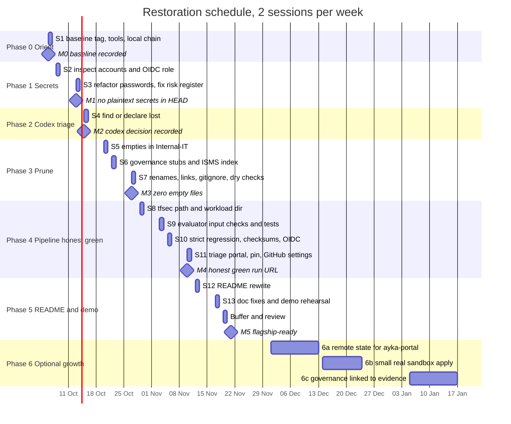
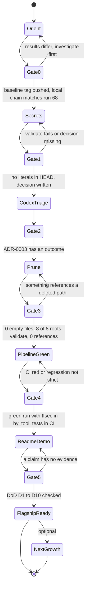
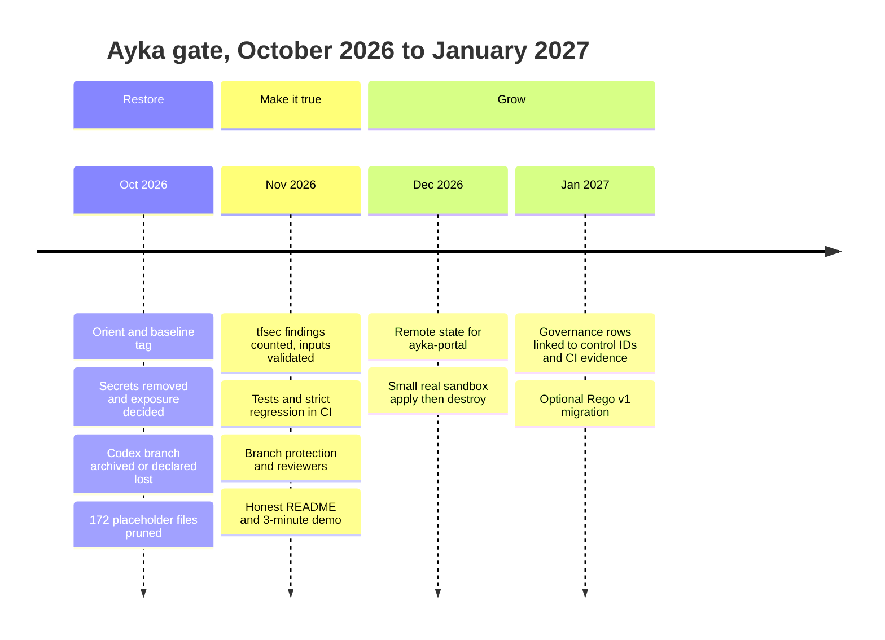

# 04 · Roadmap: phases, milestones, timeline

> **Assumption:** 2 sessions a week of 1–2 hours, **Tuesday and Thursday evenings**, starting the week of **2026-10-05**. Move the days freely; the order matters, the dates don't.
> **Core restoration:** 13 sessions (about 20 hours) → **flagship-ready by Sat 2026-11-21**, with one buffer session.
> **Phase 6** is optional growth, December 2026 – January 2027.

---

## 1. Schedule

| Phase | Goal | Sessions | Dates | Hours |
|---|---|---:|---|---:|
| [0 Orient](05-phase-playbooks/phase-0-orient.md) | re-learn, install tools, record a baseline | 1 | Tue 10-06 | 1.5 |
| [1 Secrets](05-phase-playbooks/phase-1-secrets.md) | no plaintext credentials; exposure decision; inspect the OIDC role | 2 | Thu 10-08, Tue 10-13 | 3 |
| [2 Codex triage](05-phase-playbooks/phase-2-codex-branch-triage.md) | find the AI branch or declare it lost | 1 | Thu 10-15 | 1 |
| [3 Prune](05-phase-playbooks/phase-3-prune.md) | zero empty files, one pipeline source, fixed names and links | 3 | Tue 10-20, Thu 10-22, Tue 10-27 | 4.5 |
| [4 Pipeline honest-green](05-phase-playbooks/phase-4-pipeline-green.md) | fail-open bugs fixed, tests in CI, strict regression, GitHub settings | 4 | Thu 10-29, Tue 11-03, Thu 11-05, Tue 11-10 | 8 |
| [5 README + demo](05-phase-playbooks/phase-5-readme-and-demo.md) | honest README, doc fixes, 3-minute demo | 2 | Thu 11-12, Tue 11-17 | 3 |
| Buffer | catch-up or rest | 1 | Thu 11-19 | 0–2 |
| [6 Next growth](05-phase-playbooks/phase-6-next-growth.md) | optional: remote state → sandbox apply → governance links | open | Dec – Jan | — |

> **Why this order?**
> 1. **Secrets first:** the exposure is public today and doesn't depend on anything else.
> 2. **Codex before prune:** don't delete things you might want to compare against.
> 3. **Prune before pipeline work:** fewer files, and no duplicate pipeline YAMLs to confuse you.
> 4. **Pipeline before README:** the README has to describe what the pipeline really does.

---

## 2. Phases with "stop and review" gates

Every gate is a 10-minute check at the end of a phase. If a gate fails, you go back into the phase, not forward.

**At every gate, ask these four questions (write the answers in your commit message or a short note):**

1. Is `git status` clean, and is everything pushed?
2. Is CI green on the latest commit? If red, is that expected and explained?
3. Can I explain every change in this phase out loud, without notes?
4. Did I update the progress tracker in [README.md](README.md) and any ADR status?

---

## 3. Milestones and proof

| Milestone | Target date | Proof it's done |
|---|---|---|
| **M0** Baseline recorded | 2026-10-06 | tag `baseline-2026-10` on `53b0532` visible on GitHub; run #68 artifacts saved locally; your local chain prints `pass` 0/0/14 for ayka-portal |
| **M1** No plaintext secrets in HEAD | 2026-10-13 | `git grep -nE 'password[[:space:]]*=[[:space:]]*"' -- '*.tf'` is empty on `main`; ADR-0007 **Accepted** with your rotation/history decision; `risk-register.md:21` corrected |
| **M2** Codex decision recorded | 2026-10-15 | ADR-0003 **Accepted** with "recovered and archived at …" or "declared lost on …" |
| **M3** Zero empty files | 2026-10-27 | the Phase 3 empty-file check prints only `vpc/permissive-network-acl/main.tf` (implemented in Phase 4); `git ls-files \| wc -l` ≈ 203 outside `docs/` (201 after Phase 4 removes `OPA/aws`); 8/8 roots validate (dry-run result on 2026-09-28) |
| **M4** Honest green | 2026-11-10 | **URL of a green run on `main`** whose summary lists `checkov`, `opa` **and** `tfsec` in `by_tool`, with pytest and `opa test` steps; the regression job is strict; screenshot of the branch ruleset |
| **M5** Flagship-ready | 2026-11-21 | new README merged; Definition of Done D1–D10 ([02-target-state.md §6](02-target-state.md#6-definition-of-done-flagship-ready)) ticked; demo rehearsed in under 3 minutes |
| M6a Remote state | Dec 2026 | ayka-portal `terraform init` uses a remote backend; drift workflow run shows "No changes" against real state |
| M6b Sandbox apply | Dec 2026 | a CI or local run that really applied a small slice, then destroyed it; budget alarm screenshot |
| M6c Governance linked | Jan 2027 | risk register / SoA rows cite control IDs from `control-mapping.yaml` and CI run URLs; no broken links |

---

## 4. Three-month vision

---

## 5. How to run a session (the same every time)

| Minutes | What you do |
|---:|---|
| 0–10 | Re-read the phase playbook section you're on. Run `git pull` and `git status`. |
| 10–80 | Do the next 1–3 numbered steps. Commit after each step. |
| 80–90 | Push. Tick the checklist. Write one line in the tracker: "stopped at step N, next is …". |

**If you miss a week:** nothing breaks. Every playbook has a *safe stopping point*. Restart at the step your tracker note names. Don't try to catch up by doing two phases in one session: that's how the first round got fragmented.
