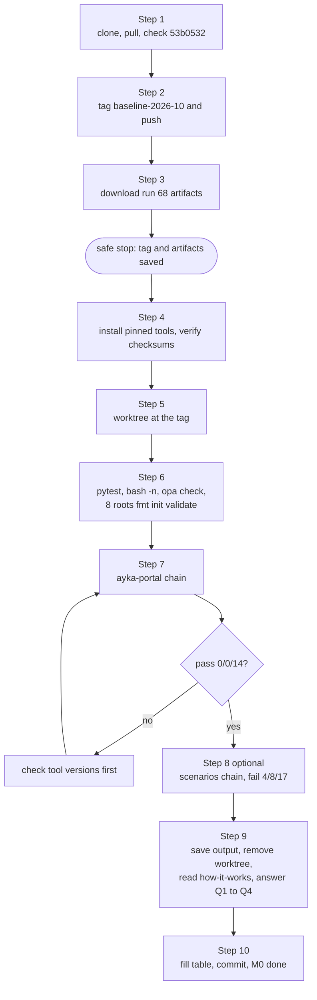

# Phase 0: Orient

> **Session:** 1 session, Tue 2026-10-06, about 1.5–2 h · **Milestone:** M0 baseline recorded
> **You need no decisions to start.** This phase changes no code. It creates one git tag and saves files outside the repository.

---

## 1. Goal

Re-learn the project, install the exact tool versions CI uses, and record a baseline (a git tag, the last green CI evidence and your own local results) that every later phase can be compared against.

## 2. Why this phase / why now

You're coming back after five months. Before you change anything, you need a fixed "before" picture. Without it you can't tell whether a later difference is something you broke or something that was already broken.

Three things make this urgent:

- **The evidence expires.** Run #68 on 2026-08-23 is your last green run on `main` ([run #68](https://github.com/Ayush-cloud06/Ayka-Secure-Technologies-GmbH/actions/runs/32621618951)). GitHub deletes its artifacts on **2026-11-21** ([../research/facts-lead.md](../research/facts-lead.md), "Run #68 evidence"). After that date the only proof of that run is the log text.
- **Tool versions drift.** CI installs Checkov with no version (`.github/actions/check/action.yml:15`) and TFLint as `latest` (`.github/actions/validate/action.yml:24`). If you install "whatever is current" today, your numbers may not match CI, and you'll chase differences that are really tool updates. The planning session reproduced run #68 exactly with Checkov 3.3.20, tfsec v1.28.14 and conftest v0.45.0 ([../research/pipeline.md](../research/pipeline.md) §6). Use the same versions.
- **Green is partly false.** The run is green, but tfsec findings never reach the evaluator (`Internal-IT/engineering/ci-cd/scripts/run-tfsec.sh:13-19`; [../how-it-works.md](../how-it-works.md) §4). Your baseline has to include that bug, so that in Phase 4 you can show the exact moment the gate started seeing tfsec output.

Related decisions (read them; accept or reject them this week):

- [ADR-0001](../adr/0001-fix-not-restart.md): fix in place instead of restarting. The baseline tag is the "before" of that story.
- [ADR-0002](../adr/0002-identity-and-scope.md): what the project is and what is out of scope.
- [ADR-0006](../adr/0006-honesty-labelling.md): Implemented / Simulated / Planned labels.
- [ADR-0015](../adr/0015-pin-tool-versions.md): the versions below become CI pins in Phase 4.

## 3. Before you start

**Prerequisites**

- The `plan/restore-2026` branch is merged into `main`, or you read these docs from that branch. It only adds `docs/restore-plan/`.
- About 2 GB of free disk space (Terraform providers are large).
- A GitHub login that can push tags to the repository.
- A private place for notes that is **not** in the repository (a password manager note or a local file outside the clone). You'll answer Q1–Q4 there.

**Tools and pinned versions**

| Tool | Version | Why this version | Where CI sets it |
|---|---|---|---|
| terraform | 1.7.5 | same as CI | `.github/workflows/test.yml:17` |
| tflint | 0.53.0 | CI uses `latest`; 0.53.0 was used in planning | `.github/actions/validate/action.yml:24` |
| tfsec | v1.28.14 | same as CI | `.github/actions/check/action.yml:18` |
| conftest | v0.45.0 (bundles OPA 0.56.0) | same as CI; your Rego needs a pre-1.0 OPA | `.github/actions/policy/action.yml:11` |
| opa | 0.56.0 | matches the OPA inside conftest 0.45.0 | not in CI yet (Phase 4) |
| checkov | 3.3.20 | CI is unpinned; this version reproduced run #68 exactly | `.github/actions/check/action.yml:15` |
| python3 + pytest + pyyaml | Python 3.11 in CI | the evaluator imports `yaml` (`evaluate-results.py:9`) | `.github/actions/check/action.yml:7-10` |
| jq, gh (GitHub CLI) | any recent | reading JSON, downloading artifacts | — |

Install them on Linux or macOS. Every binary is checked against its published SHA-256 before use:

```bash
mkdir -p ~/.local/bin ~/ayka-tools && cd ~/ayka-tools
export PATH="$HOME/.local/bin:$PATH"          # add this line to ~/.bashrc or ~/.zshrc too
OS=$(uname -s | tr '[:upper:]' '[:lower:]')   # linux or darwin
ARCH=$(uname -m); case "$ARCH" in x86_64) ARCH=amd64;; aarch64|arm64) ARCH=arm64;; esac
echo "$OS $ARCH"

# Terraform 1.7.5
V=1.7.5
curl -fsSLO "https://releases.hashicorp.com/terraform/${V}/terraform_${V}_${OS}_${ARCH}.zip"
curl -fsSLO "https://releases.hashicorp.com/terraform/${V}/terraform_${V}_SHA256SUMS"
grep " terraform_${V}_${OS}_${ARCH}.zip" "terraform_${V}_SHA256SUMS" | shasum -a 256 -c -
unzip -o "terraform_${V}_${OS}_${ARCH}.zip" terraform -d ~/.local/bin

# TFLint 0.53.0
curl -fsSLO "https://github.com/terraform-linters/tflint/releases/download/v0.53.0/tflint_${OS}_${ARCH}.zip"
curl -fsSL -o tflint_checksums.txt "https://github.com/terraform-linters/tflint/releases/download/v0.53.0/checksums.txt"
grep " tflint_${OS}_${ARCH}.zip" tflint_checksums.txt | shasum -a 256 -c -
unzip -o "tflint_${OS}_${ARCH}.zip" tflint -d ~/.local/bin

# tfsec v1.28.14
curl -fsSLO "https://github.com/aquasecurity/tfsec/releases/download/v1.28.14/tfsec-${OS}-${ARCH}"
curl -fsSLO "https://github.com/aquasecurity/tfsec/releases/download/v1.28.14/tfsec_checksums.txt"
grep " tfsec-${OS}-${ARCH}\$" tfsec_checksums.txt | shasum -a 256 -c -
install -m 0755 "tfsec-${OS}-${ARCH}" ~/.local/bin/tfsec

# conftest v0.45.0
COS=$([ "$OS" = linux ] && echo Linux || echo Darwin); CARCH=$([ "$ARCH" = amd64 ] && echo x86_64 || echo arm64)
curl -fsSLO "https://github.com/open-policy-agent/conftest/releases/download/v0.45.0/conftest_0.45.0_${COS}_${CARCH}.tar.gz"
curl -fsSL -o conftest_checksums.txt "https://github.com/open-policy-agent/conftest/releases/download/v0.45.0/checksums.txt"
grep " conftest_0.45.0_${COS}_${CARCH}.tar.gz" conftest_checksums.txt | shasum -a 256 -c -
tar xzf "conftest_0.45.0_${COS}_${CARCH}.tar.gz" conftest && install -m 0755 conftest ~/.local/bin/

# OPA 0.56.0 (asset names differ per platform)
case "$OS-$ARCH" in linux-*) OPAF="opa_linux_${ARCH}_static";; darwin-amd64) OPAF=opa_darwin_amd64;; darwin-arm64) OPAF=opa_darwin_arm64_static;; esac
curl -fsSLO "https://github.com/open-policy-agent/opa/releases/download/v0.56.0/${OPAF}"
curl -fsSLO "https://github.com/open-policy-agent/opa/releases/download/v0.56.0/${OPAF}.sha256"
shasum -a 256 -c "${OPAF}.sha256"
install -m 0755 "$OPAF" ~/.local/bin/opa

# Checkov 3.3.20 in its own environment (pipx: brew install pipx / sudo apt-get install -y pipx)
pipx install checkov==3.3.20

# jq and the GitHub CLI
# macOS:  brew install jq gh
# Debian/Ubuntu: sudo apt-get install -y jq gh   (or see https://cli.github.com for the gh repo)
```

Check that you got exactly these versions:

```bash
terraform version | head -1; tflint --version | head -1; tfsec --version
conftest --version; opa version | head -1; checkov --version; jq --version; gh --version | head -1
```

Expected, in order: `Terraform v1.7.5`, `TFLint version 0.53.0`, `v1.28.14`, `Conftest: 0.45.0` plus `OPA: 0.56.0`, `Version: 0.56.0`, `3.3.20`, then any jq and gh version.

**If a checksum line says `FAILED`:** don't use that file. Delete it and download it again. If it fails twice, stop and check the release page by hand; never skip the check.

**Answers you need by the end of this session** (from [../risks-and-open-questions.md](../risks-and-open-questions.md)): Q1–Q4. They decide what Phase 1 does. Step 9 walks you through them.

> **A note on the planning session.** When this plan was made, `registry.terraform.io` was blocked in the sandbox, so providers were downloaded from `releases.hashicorp.com`, verified against HashiCorp's SHA256SUMS and your lock files, and passed to Terraform with `-plugin-dir` ([../research/terraform.md](../research/terraform.md) §0). Your laptop can reach the registry, so you use plain `terraform init`. You don't need `-plugin-dir` anywhere in this playbook.

## 4. Steps

### Step 1: Get the repository and check where you are (5 min)

```bash
cd ~/src    # or wherever you keep repositories
git clone https://github.com/Ayush-cloud06/Ayka-Secure-Technologies-GmbH.git 2>/dev/null || true
cd Ayka-Secure-Technologies-GmbH
git fetch origin --tags
git switch main && git pull --ff-only
git log --oneline -5
git merge-base --is-ancestor 53b0532 HEAD && echo "53b0532 is in main"
git status --short
```

- **Files touched:** none.
- **Expected output:** `git log` shows `53b0532 fix: align risk documentation baseline dates` as the newest commit. If the plan branch is already merged, the plan's `docs(plan): …` commits (and possibly a merge commit) sit above it, and `53b0532` is the newest commit *below* them. The next line prints `53b0532 is in main`. `git status --short` prints nothing.
- **If this fails:** if `53b0532 is in main` doesn't print, someone pushed a different history. Stop and compare `git log --oneline origin/main | head -20` with the history in [../research/inventory.md](../research/inventory.md) §1 before going on. If `git status` shows local changes, commit or stash them first (`git stash push -m "before phase 0"`).

### Step 2: Tag the baseline (5 min)

An annotated tag is a named, dated pointer to one commit. It never moves, even when `main` does. Every "before vs after" comparison in Phases 1–5 uses it.

```bash
git tag -a baseline-2026-10 53b0532 -m "Baseline before restoration (docs/restore-plan, Phase 0)"
git push origin baseline-2026-10
git rev-parse 'baseline-2026-10^{commit}' | cut -c1-7
git ls-remote --tags origin baseline-2026-10
```

- **Files touched:** none (a tag is a git ref, not a file).
- **Expected output:** `53b0532`, then one line ending in `refs/tags/baseline-2026-10`.
- **If this fails:** `tag already exists` means you created it before. Check it with `git rev-parse 'baseline-2026-10^{commit}'`: if that prints 53b0532, you're done. If it points elsewhere, delete it (`git tag -d baseline-2026-10`) and repeat. A push rejected with a 403 means your GitHub login lacks push rights; run `gh auth login` and try again.

### Step 3: Save the run #68 artifacts outside git (10 min)

**In the browser:** open [run #68](https://github.com/Ayush-cloud06/Ayka-Secure-Technologies-GmbH/actions/runs/32621618951) → scroll to **Artifacts** at the bottom of the summary page → download `compliance-evidence` and `compliance-evidence-regression`. Unzip them into `~/ayka-evidence/run-68/`.

**Or with the GitHub CLI:**

```bash
gh auth status || gh auth login
mkdir -p ~/ayka-evidence/run-68 && cd ~/ayka-evidence/run-68
gh run download 32621618951 --repo Ayush-cloud06/Ayka-Secure-Technologies-GmbH
find . -type f | sort
(cd compliance-evidence && sha256sum -c evidence/artifacts.sha256 --ignore-missing 2>/dev/null || shasum -a 256 -c evidence/artifacts.sha256)
cd -
```

- **Files touched:** only `~/ayka-evidence/run-68/` (outside the repository).
- **Expected output:** two folders, `compliance-evidence/` and `compliance-evidence-regression/`. The first contains `evidence/artifacts.sha256`, `evidence/raw/<timestamp>/*.json`, `output/compliance-report.md`, `output/tfplan.json` and `output/tfplan.binary` (`.github/actions/evidence/action.yml:23-32`). The checksum check prints `output/tfplan.json: OK`, exactly the one line the CI apply job printed ([../how-it-works.md](../how-it-works.md) §5). On macOS the `shasum` fallback may also complain that `output/compliance-summary.json` is missing: that file is never uploaded, which is one of the Phase 4 fixes.
- **If this fails:** `no valid artifacts found` or HTTP 410 means the artifacts have expired. Then save the job logs instead (`gh run view 32621618951 --log > ~/ayka-evidence/run-68/run-68.log`) and note the loss in your tracker. Don't commit the artifacts to the repository: they contain a full plan JSON with the mock provider keys in it ([../research/terraform.md](../research/terraform.md) §4).

**Safe stopping point.** After Step 3, M0's two "must not lose" parts (tag and artifacts) are done. If you run out of time, stop here.

### Step 4: Install the pinned tools (20–30 min)

Run the install block from section 3, then the version check.

- **Files touched:** `~/.local/bin/*`, `~/ayka-tools/*` (outside the repository).
- **Expected output:** every `shasum -c` line says `OK`; the version check prints the versions listed in section 3.
- **If this fails:** on macOS, a binary can be blocked by Gatekeeper ("cannot be opened because the developer cannot be verified"). Run `xattr -d com.apple.quarantine ~/.local/bin/<tool>` after the checksum has passed. If `pipx` is missing, install it first (`brew install pipx` or `sudo apt-get install -y pipx`, then `pipx ensurepath` and open a new terminal).

### Step 5: Make a throwaway checkout of the baseline (2 min)

The CI scripts write `output/` and `evidence/` at the repository root (`run-checkov.sh:9`, `export-evidence.sh:12`). `evidence/` isn't in `.gitignore` yet (Phase 3 fixes that), and one step below overwrites a tracked file. So run everything in a separate **worktree**: a second checkout that shares the same `.git` data but has its own folder.

```bash
cd ~/src/Ayka-Secure-Technologies-GmbH
git worktree add --detach ../ayka-baseline baseline-2026-10
cd ../ayka-baseline
git log --oneline -1
```

- **Files touched:** creates `~/src/ayka-baseline/` (outside your main clone).
- **Expected output:** `53b0532 fix: align risk documentation baseline dates`.
- **If this fails:** `already exists` means an old worktree is there. Remove it with `git worktree remove --force ../ayka-baseline` from the main clone, then retry.

### Step 6: Run the baseline checks and fill in the table (20 min)

All commands run inside `~/src/ayka-baseline`. Unset any AWS credentials first. ayka-portal ignores them anyway, because its provider has static mock keys (`Internal-IT/workloads/ayka-portal/provider.tf:17-24`), but it's good hygiene never to run security tooling with real credentials loaded.

```bash
cd ~/src/ayka-baseline
unset AWS_ACCESS_KEY_ID AWS_SECRET_ACCESS_KEY AWS_SESSION_TOKEN AWS_PROFILE WORKLOAD_DIR

# Python tests (the evaluator)
python3 -m venv .venv && . .venv/bin/activate
pip install -q pytest pyyaml
python3 -m pytest -q tests/

# Shell syntax, as the validate-scripts job does (test.yml:29-33)
for f in Internal-IT/engineering/ci-cd/scripts/*.sh; do bash -n "$f" || echo "FAIL $f"; done; echo "bash -n done"

# Rego parses with the OPA version conftest uses
opa check Internal-IT/engineering/policy-as-code/OPA && echo "opa check OK"
opa test Internal-IT/engineering/policy-as-code/OPA

# Terraform: fmt / init -backend=false / validate for all 8 roots
for r in \
  Internal-IT/platform/foundation/aws-organization \
  Internal-IT/platform/foundation/landing-zone \
  Internal-IT/platform/foundation/remote-state \
  Internal-IT/platform/domains/identity/aws-iam-core \
  Internal-IT/platform/domains/identity/aws-identity-center \
  Internal-IT/platform/domains/identity/entra-id \
  Internal-IT/workloads/ayka-portal \
  Internal-IT/workloads/control-validation-scenarios
do
  f=$(terraform fmt -check -recursive "$r" >/dev/null 2>&1 && echo PASS || echo FAIL)
  i=$( (cd "$r" && terraform init -backend=false -input=false >/dev/null 2>&1) && echo PASS || echo FAIL)
  v=$( (cd "$r" && terraform validate >/dev/null 2>&1) && echo PASS || echo FAIL)
  echo "$r  fmt=$f  init=$i  validate=$v"
done

# TFLint on the two workloads, as CI runs it (validate/action.yml:43)
(cd Internal-IT/workloads/ayka-portal && tflint --init >/dev/null && tflint --recursive && echo "tflint portal: 0 issues")
(cd Internal-IT/workloads/control-validation-scenarios && tflint --init >/dev/null && tflint --recursive && echo "tflint scenarios: 0 issues")
git status --short
```

- **Files touched:** only inside the worktree: `.venv/`, `.terraform/` folders, and for entra-id a `.terraform.lock.hcl` (ignored by `entra-id/.gitignore:10`).
- **Expected output:** see the "Expected" column below. `opa test` prints nothing useful because there are 0 Rego tests; that is itself a baseline fact (Phase 4 adds tests, [ADR-0012](../adr/0012-tests-run-in-ci.md)).
- **If this fails:**
  - `init=FAIL` on one root: run it again without `>/dev/null` to see the error. With registry access every root should initialise. entra-id prints an "Incomplete lock file" warning because no lock file is committed; that's a warning, not a failure.
  - `git status` shows modified `.terraform.lock.hcl` files: on some platforms (for example macOS on Apple silicon) `terraform init` adds that platform's hashes to the lock files. **UNVERIFIED** on your machine. Don't commit that here. Phase 4 decides the lock-file policy ([ADR-0015](../adr/0015-pin-tool-versions.md)).
  - `pytest` can't import `yaml`: you're outside the virtualenv; run `. .venv/bin/activate` again.

**Fill this in** (edit this file and commit it in Step 10):

| Check | Command | Expected (planning session, 2026-09-28) | Your result |
|---|---|---|---|
| Evaluator tests | `python3 -m pytest -q tests/` | `5 passed` | |
| Shell syntax | `bash -n` loop | no `FAIL` lines | |
| Rego parse | `opa check …/OPA` (OPA 0.56.0) | `opa check OK` | |
| Rego tests | `opa test …/OPA` | 0 tests (none exist) | |
| aws-organization | fmt / init / validate | PASS / PASS / PASS | |
| landing-zone | fmt / init / validate | PASS / PASS / PASS | |
| remote-state | fmt / init / validate | PASS / PASS / PASS | |
| aws-iam-core | fmt / init / validate | PASS / PASS / PASS | |
| aws-identity-center | fmt / init / validate | PASS / PASS / PASS | |
| entra-id | fmt / init / validate | PASS / PASS (lock-file warning) / PASS | |
| ayka-portal | fmt / init / validate | PASS / PASS / PASS | |
| control-validation-scenarios | fmt / init / validate | PASS / PASS / PASS | |
| TFLint (2 workloads) | `tflint --recursive` | 0 issues each | |
| ayka-portal chain (Step 7) | plan → scanners → evaluator | `pass`, HIGH 0 / MEDIUM 0 / LOW 14 | |
| scenarios chain (Step 8) | same | `fail`, HIGH 4 / MEDIUM 8 / LOW 17 | |
| Tool versions | Step 4 check | as in section 3 | |

Sources for the expected column: [../research/terraform.md](../research/terraform.md) §6 (all 8 roots PASS, TFLint 0 issues on both workloads), [../research/pipeline.md](../research/pipeline.md) §5–6. The planning session re-ran every row on 2026-09-28 in a git worktree at `53b0532` with these exact versions (providers via `-plugin-dir`, see the note in section 3).

### Step 7: Reproduce the ayka-portal chain, exactly as CI runs it (15 min)

This mirrors the `compliance` job step by step: plan (`.github/actions/plan/action.yml:34-50`), Checkov and tfsec (`check/action.yml:22-28`), conftest (`policy/action.yml:15-17`) and the decision (`decision/action.yml:21-23`). The cost hook and the evidence upload are left out because they don't affect the decision. The scripts find the repository root with `git rev-parse --show-toplevel`, which is why the worktree must be a real git checkout.

```bash
cd ~/src/ayka-baseline
. .venv/bin/activate

# 1. Plan (plan/action.yml:34-50)
cd Internal-IT/workloads/ayka-portal
terraform init -input=false
terraform plan -input=false -refresh=false -out=tfplan.binary
mkdir -p ../../../output
terraform show -json tfplan.binary > ../../../output/tfplan.json
mv tfplan.binary ../../../output/tfplan.binary
cd ../../..

# 2. Scanners (check/action.yml, policy/action.yml)
bash Internal-IT/engineering/ci-cd/scripts/run-checkov.sh
bash Internal-IT/engineering/ci-cd/scripts/run-tfsec.sh
bash Internal-IT/engineering/ci-cd/scripts/run-policy-check.sh

# 3. Decision (decision/action.yml)
bash Internal-IT/engineering/ci-cd/scripts/evaluate-results.sh; echo "evaluate exit code: $?"
jq -c '{decision, totals, tools: (.by_tool | keys)}' output/compliance-summary.json
ls -l output/
```

- **Files touched:** `output/*` in the worktree only.
- **Expected output:**
  - `terraform plan` ends with `Plan: 87 to add, 0 to change, 0 to destroy.`
  - `evaluate exit code: 0`
  - `{"decision":"pass","totals":{"HIGH":0,"MEDIUM":0,"LOW":14},"tools":["checkov"]}`: the same result as run #68 ([../research/facts-lead.md](../research/facts-lead.md), "Run #68 evidence").
  - `output/` holds **both** `tfsec-result` (about 4 KB; the size depends on your folder path, 4137 bytes in CI) **and** `tfsec-result.json` (15 bytes). That pair is the tfsec bug: tfsec wrote its real findings to the file without `.json`, and the script then wrote an empty `{"results":[]}` fallback (`run-tfsec.sh:13-19`). `tools` lists only `checkov` because OPA found nothing and tfsec's findings were dropped.
  - Look at what was dropped: `jq '.results | length' output/tfsec-result` prints `4`. Those are the three HIGH and one MEDIUM findings that will appear in Phase 4 ([../research/pipeline.md](../research/pipeline.md) F2).
- **If this fails:**
  - Checkov prints a traceback about fetching guidelines from `prismacloud.io`: harmless, the results are unaffected ([../research/pipeline.md](../research/pipeline.md) §5).
  - The decision differs from `pass 0/0/14`: check `checkov --version` first. A different Checkov version is the most likely cause. Then check `conftest --version`: a conftest with OPA ≥ 1.0 can't parse your Rego, `opa-result.json` becomes an error payload, and the evaluator exits 1 (fail-closed, [../how-it-works.md](../how-it-works.md) §4).
  - `Required result file missing`: one scanner didn't run. Run the three scanner lines again one at a time and read their output.

### Step 8 (optional): Reproduce the scenarios chain (10 min)

The regression workload must **fail**. Its provider has no static keys (`control-validation-scenarios/provider.tf:12-21`), so in CI it only plans because the real OIDC credentials are present. Locally, dummy values do the same job, since `-refresh=false` and the `skip_*` flags mean no AWS call is made. Leave `WORKLOAD_DIR` unset: CI's regression job scans the ayka-portal folder with tfsec (`test.yml:13`), and you want the same numbers.

```bash
cd ~/src/ayka-baseline && rm -rf output && mkdir -p output
cd Internal-IT/workloads/control-validation-scenarios
terraform init -input=false
AWS_ACCESS_KEY_ID=mock AWS_SECRET_ACCESS_KEY=mock terraform plan -input=false -refresh=false -out=tfplan.binary
terraform show -json tfplan.binary > ../../../output/tfplan.json
mv tfplan.binary ../../../output/tfplan.binary
cd ../../..
bash Internal-IT/engineering/ci-cd/scripts/run-checkov.sh
bash Internal-IT/engineering/ci-cd/scripts/run-tfsec.sh
bash Internal-IT/engineering/ci-cd/scripts/run-policy-check.sh
bash Internal-IT/engineering/ci-cd/scripts/evaluate-results.sh; echo "evaluate exit code: $?"
jq -c '{decision, totals, tools: (.by_tool | keys)}' output/compliance-summary.json
git status --short
```

- **Files touched:** `output/*`, and the **tracked** file `Internal-IT/workloads/control-validation-scenarios/tfplan.binary` in the worktree.
- **Expected output:** `Plan: 6 to add`; `evaluate exit code: 1`; `{"decision":"fail","totals":{"HIGH":4,"MEDIUM":8,"LOW":17},"tools":["checkov","opa"]}`, as in run #68. `git status` shows ` D Internal-IT/workloads/control-validation-scenarios/tfplan.binary`: your plan overwrote the committed plan file and `mv` moved it away. That's harmless here (a throwaway worktree), and it's a small lesson in why a generated file shouldn't be committed. Phase 3 deletes it.
- **If this fails:** `No valid credential sources found … provider.tf line 12` means the two `mock` variables weren't set on the same line as `terraform plan`.

### Step 9: Keep the results, remove the worktree, answer Q1–Q4 (20 min)

```bash
mkdir -p ~/ayka-evidence/local-baseline-2026-10-06
cp -r ~/src/ayka-baseline/output ~/ayka-evidence/local-baseline-2026-10-06/scenarios-output
cd ~/src/Ayka-Secure-Technologies-GmbH
git worktree remove --force ../ayka-baseline
git worktree list
```

(If you want the ayka-portal output too, copy `output/` after Step 7, before Step 8 deletes it.)

- **Files touched:** `~/ayka-evidence/…` only; the worktree folder is removed.
- **Expected output:** `git worktree list` shows only your main clone.
- **If this fails:** `worktree contains modified or untracked files` is expected; that's what `--force` is for.

Then read [../how-it-works.md](../how-it-works.md) end to end (30 minutes, maybe in a separate sitting), with the code open next to it. Answer its self-check in section 8 without looking.

Finally, open [../risks-and-open-questions.md](../risks-and-open-questions.md) and write answers to **Q1–Q4 in your private note, not in the repository**:

- **Q1** Were the Entra passwords (`entra-id/modules/core/users.tf:16`, `modules/privileged/break_glass.tf:6`, `modules/privileged/admin_accounts.tf:9`) ever used in a real tenant? A first hint: `Internal-IT/platform/domains/identity/docs/tempChangePlan.md:75-77` says "SAML federation operational" and "SCIM user provisioning operational". If that was true, a real tenant existed. Phase 1 Step 1 shows how to check.
- **Q2** What is AWS account `982081090103`, and what can `github-actions-oidc-role` do? (Phase 1 Step 4 shows where to look.)
- **Q3** Was any Terraform root ever applied for real, and do you have `terraform.tfstate` files on this laptop? Look with `find ~ -name 'terraform.tfstate*' -not -path '*/.terraform/*' 2>/dev/null`. Don't delete any you find.
- **Q4** Would you accept a history rewrite of `main` if the passwords were real?

If you don't know an answer yet, write the default from the table in that file and "unverified".

### Step 10: Record M0 (5 min)

Fill the "Your result" column in Step 6, tick the checklist below, set Phase 0 to ☑ in the tracker in [../README.md](../README.md), and commit:

```bash
cd ~/src/Ayka-Secure-Technologies-GmbH
git switch -c docs/phase-0-baseline
git add docs/restore-plan/05-phase-playbooks/phase-0-orient.md docs/restore-plan/README.md
git commit -m "docs(plan): record phase 0 baseline results"
git push -u origin docs/phase-0-baseline
gh pr create --fill --base main && gh pr merge --merge --delete-branch
```

- **Files touched:** `docs/restore-plan/05-phase-playbooks/phase-0-orient.md`, `docs/restore-plan/README.md`.
- **Expected output:** the push triggers "PR Compliance Pipeline" on the branch (it runs on every push, `test.yml:3-5`). It should be green, as run #68 was, because you changed only docs.
- **If this fails:** if CI goes red on a docs-only change, compare the failing step with run #68. The most likely cause is an unpinned tool that changed since August (Checkov or TFLint `latest`). Note it for Phase 4 ([ADR-0015](../adr/0015-pin-tool-versions.md)) rather than fixing it now.

## 5. Flow diagram



## 6. Checklist

- [ ] `git merge-base --is-ancestor 53b0532 HEAD` succeeds on `main`
- [ ] Tag `baseline-2026-10` points to 53b0532 and is on GitHub
- [ ] Run #68 artifacts saved in `~/ayka-evidence/run-68/` (or logs saved, if expired)
- [ ] Tools installed, every checksum `OK`, versions match section 3
- [ ] Baseline table in Step 6 filled in
- [ ] ayka-portal chain reproduced: `pass` 0/0/14, and you saw the `tfsec-result` / `tfsec-result.json` pair
- [ ] (optional) scenarios chain reproduced: `fail` 4/8/17
- [ ] Worktree removed
- [ ] [how-it-works.md](../how-it-works.md) read, self-check answered
- [ ] Q1–Q4 answered in a private note
- [ ] ADR-0001, 0002 and 0006 set to Accepted or Rejected
- [ ] Tracker updated and committed

## 7. Definition of done

M0 is done when the tag exists on GitHub, the run #68 evidence is saved, and your local chain gives the same decision as CI.

Verify:

```bash
cd ~/src/Ayka-Secure-Technologies-GmbH
git ls-remote --tags origin baseline-2026-10                 # one line
git rev-parse 'baseline-2026-10^{commit}' | cut -c1-7          # 53b0532
ls ~/ayka-evidence/run-68/compliance-evidence/evidence/artifacts.sha256
grep -nE '\| \|$' docs/restore-plan/05-phase-playbooks/phase-0-orient.md   # prints nothing once every "Your result" cell is filled
```

## 8. Commit message(s)

```text
docs(plan): record phase 0 baseline results

Tag baseline-2026-10 -> 53b0532 pushed. Run #68 artifacts saved outside git.
Local chain with terraform 1.7.5, checkov 3.3.20, tfsec v1.28.14,
conftest 0.45.0 reproduces run #68: ayka-portal pass 0/0/14,
scenarios fail 4/8/17. tfsec output is written to output/tfsec-result
and dropped (run-tfsec.sh:13-19), as expected before Phase 4.
```

The tag itself has no commit; its message is the `-m` text from Step 2.

## 9. What you learned

- **A baseline makes change measurable.** "I tagged the last known state, saved the CI evidence before it expired, and reproduced the pipeline locally with pinned tool versions. From then on every change had a before and after." Interviewers like this because it's how you debug a system you didn't touch for months.
- **Reproducibility needs pinned tools.** The same Terraform plan can give different gate decisions with a different Checkov version, because rules are added and changed. CI installs Checkov unpinned (`check/action.yml:15`), so a green run is only reproducible if you know which version produced it. That's why Phase 4 pins everything ([ADR-0015](../adr/0015-pin-tool-versions.md)).
- **Green is a claim, not proof.** You saw it yourself: tfsec found 4 problems in ayka-portal, and the gate still said `pass`, because the findings were written to a file the evaluator never reads. "The evaluator is fail-closed on missing files, but the wrapper created an empty file for it" is a good, concrete example of a fail-open bug.

## 10. Time estimate and safe stopping point

| Part | Time | Date |
|---|---|---|
| Steps 1–3 (tag, artifacts) | 20 min | Tue 2026-10-06 |
| Step 4 (tools) | 20–30 min | Tue 2026-10-06 |
| Steps 5–8 (checks and chains) | 40 min | Tue 2026-10-06 |
| Steps 9–10 (Q1–Q4, record) | 20 min, plus 30 min reading how-it-works (can be a separate evening) | Tue 2026-10-06 |

**Safe stopping points:**

1. **After Step 3.** The things that can be lost (evidence) or must not move (tag) are secured. Everything after that can be repeated at any time.
2. **After Step 6.** Tools are installed and the table is half filled. Next time, start again at Step 5 (make a new worktree).

Don't start Phase 1 until Q1–Q4 have at least a default answer. Phase 1's first session depends on Q1 and Q2.
