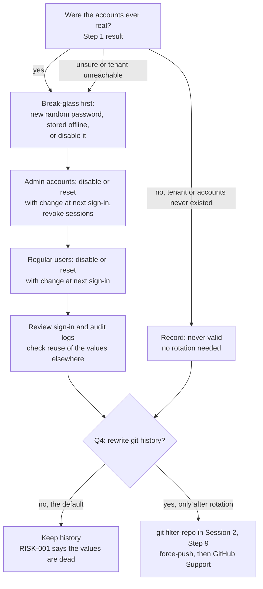
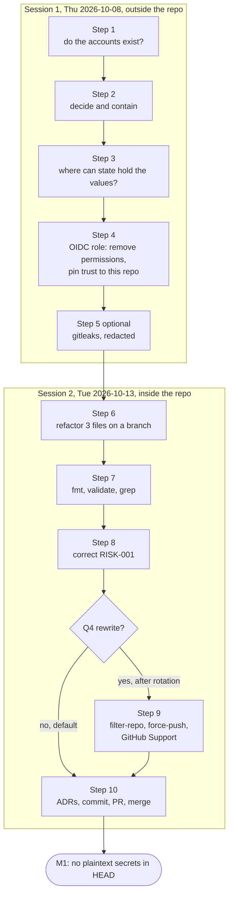

# Phase 1: Secrets

> **Sessions:** 2 · Thu 2026-10-08 (outside the repo: accounts and the AWS role) · Tue 2026-10-13 (inside the repo: code and records)
> **Milestone:** M1 no plaintext secrets in HEAD
> **Rule for this whole phase:** never print, paste or type the three password values anywhere: not in a terminal command, a commit, an issue, a chat or a search engine. Refer to them by `path:line` only.

---

## 1. Goal

Remove the three literal Entra passwords from `HEAD`, find out whether they were ever valid and contain them if they were, decide about git history, correct the risk register, and cut the real AWS OIDC role down to what plan-only CI needs.

## 2. Why this phase / why now

Three Terraform files in this **public** repository contain literal passwords:

| path:line | Account(s) | Why it matters |
|---|---|---|
| `Internal-IT/platform/domains/identity/entra-id/modules/core/users.tf:16` | initial password of every `azuread_user.users` (24 people from `personnel.json`) | `force_password_change = true` (`:17`) |
| `…/entra-id/modules/privileged/break_glass.tf:6` | the break-glass account | `force_password_change = false` (`:7`), `disable_password_expiration = true` (`:8`), member of tier0 (`:11-14`). If it was ever applied, the committed value is a live, non-expiring tier0 password. |
| `…/entra-id/modules/privileged/admin_accounts.tf:9` | initial password of the 4 admin accounts | `force_password_change = true` (`:10`) |

Sources: [../research/terraform.md](../research/terraform.md) §5, [../research/inventory.md](../research/inventory.md) §8.

This phase comes first because the exposure is already public and doesn't depend on anything else in the plan. Three ideas drive every step below:

1. **A pushed secret is published.** The values are in the three root commits `89db3df`, `7a2f667` (both 2026-03-22) and `fcbb603` (2026-03-25), unchanged in every commit since, and in the GitHub pull-request refs `refs/pull/1..6/head`, which you can't rewrite ([../research/terraform.md](../research/terraform.md) §5; [ADR-0007](../adr/0007-entra-bootstrap-secrets.md) Evidence). Deleting the line from `HEAD` doesn't un-publish anything.
2. **Rotation fixes the risk; code changes and history rewrites only tidy up.** If the accounts were ever real, the fix happens in the Entra portal, not in git. Your own treatment plan already says so, in the right order: "Determine which historical Entra credentials were applied or reused; disable or rotate affected identities, review sign-ins, investigate downstream reuse, then coordinate any history rewrite" (`Governance/ISMS/03-risk-management/risk-treatment-plan.md:20`, TRT-001).
3. **`sensitive = true` hides a value; it doesn't protect it.** It only masks the value in CLI and plan output. Terraform still writes it to the state file in plain text. Whoever can read state can read the secret ([ADR-0007](../adr/0007-entra-bootstrap-secrets.md), "What each option really protects").

There is a second, separate exposure: CI assumes a **real** AWS role, `arn:aws:iam::982081090103:role/github-actions-oidc-role` (`.github/workflows/test.yml:16,41`, `.github/workflows/drift-detection.yml:31`), on every push to any branch (`test.yml:3-5`). Run #68 shows it works: "Configure AWS credentials" succeeded and `AWS_SESSION_TOKEN` was set ([../research/facts-lead.md](../research/facts-lead.md), "Run #68 evidence"). Terraform never uses those credentials for ayka-portal, because the provider has static mock keys (`Internal-IT/workloads/ayka-portal/provider.tf:19-20`). Nobody has checked what the role can do. In this phase you only inspect and shrink the role in AWS. Removing OIDC from the workflows is Phase 4 ([ADR-0013](../adr/0013-no-cloud-creds-for-plan-only.md)).

Decisions for this phase (accept or reject before Session 2):

- [ADR-0007](../adr/0007-entra-bootstrap-secrets.md): `random_password` for users and admins; break-glass managed by hand, outside Terraform.
- [ADR-0013](../adr/0013-no-cloud-creds-for-plan-only.md): plan-only CI doesn't assume the real AWS role.

## 3. Before you start

**Answers you need** (from [../risks-and-open-questions.md](../risks-and-open-questions.md)), at least as defaults:

| # | Question | Default if you don't know |
|---|---|---|
| Q1 | Were the Entra passwords ever used in a real tenant? | **Assume real** ("unsure" counts as real) |
| Q2 | What can `github-actions-oidc-role` do? | **Assume broad** |
| Q3 | Was any root ever applied? Are there `terraform.tfstate` files on your laptop? | Assume nothing applied except whatever created the OIDC role; don't delete state files |
| Q4 | Would you accept rewriting `main`'s history? | **No rewrite** |

There's already a hint for Q1: `Internal-IT/platform/domains/identity/docs/tempChangePlan.md:75-77` says "SAML federation operational", "SCIM user provisioning operational" and "AWS Identity Center instance active", and `…/docs/identity-provisioning-workflow.md:59` describes an error you hit after running `terraform apply`. That points to a real tenant, but not necessarily to these three accounts. **UNVERIFIED** until you check (Step 1).

**Access and tools**

- An admin login to the Entra tenant used in `entra-id/modules/core/users.tf:5` (the domain isn't repeated here).
- Console or CLI access to AWS account `982081090103` with IAM read and write rights. Use **your own** credentials on your laptop, never the CI role.
- Optional CLIs: Azure CLI (`brew install azure-cli`, or see https://learn.microsoft.com/cli/azure/install-azure-cli), AWS CLI v2 (`brew install awscli`, or https://docs.aws.amazon.com/cli/latest/userguide/getting-started-install.html).
- Terraform 1.7.5 from Phase 0. Session 2 adds the `hashicorp/random` provider; `terraform init` downloads it from the registry.
- Optional: `git-filter-repo` (`brew install git-filter-repo` or `pipx install git-filter-repo`), only if Q4 becomes "yes". Optional: `gitleaks` (Step 5).
- A password manager for any new credential you create.

## 4. Steps

### Session 1 (Thu 2026-10-08): accounts and the AWS role

#### Step 1: Find out whether the accounts exist (20 min)

In the browser:

1. Sign in at https://entra.microsoft.com as a tenant admin.
2. **Users → All users.** Search for the break-glass account (`break_glass.tf:2`), the `admin-` accounts (`admin_accounts.tf:5`) and a few of the regular users (their names come from `users.tf:5` and `personnel.json`). For each, note in your private note: exists yes/no, **Account enabled**, **Created date**, last password change if shown.
3. **Monitoring & health → Sign-in logs.** Filter by each account that exists, widest date range available. Note any successful sign-in you didn't make.
4. **Monitoring & health → Audit logs.** Filter on these accounts (Target) for "Reset password" or "Update user".

Or with the Azure CLI (it prints names that include your tenant domain; keep that output private):

```bash
az login --allow-no-subscriptions
az ad user list --query "[?starts_with(userPrincipalName,'breakglass') || starts_with(userPrincipalName,'admin-')].{upn:userPrincipalName, enabled:accountEnabled}" -o table
az ad user list --query "length([?starts_with(userPrincipalName,'emp-')])"
```

- **Files touched:** none (your private note only).
- **Expected output:** either "tenant or accounts don't exist" (then Q1 = never real) or a list of accounts with their status.
- **If this fails:** if you can't sign in to the tenant at all (deleted, trial expired, lost admin), write "tenant unreachable on 2026-10-08" in your note. Treat the values as real but dead: nothing to rotate, but they must never be reused anywhere. Note on log retention: Microsoft documents 7 days of sign-in and audit logs for the Entra ID Free plan and 30 days with P1/P2 (**UNVERIFIED** for your tenant; `tempChangePlan.md:14` says it runs on the Free plan). A clean log therefore proves little about March to September. Say so in the record instead of calling it "no compromise".

#### Step 2: Decide, then contain (20–40 min)

Use this decision flow. Work through it top to bottom and write each answer in your private note.



If the accounts exist, contain them in this order (the most powerful account first):

1. **Break-glass** (`break_glass.tf:1-9`): open the user → **Reset password**, then replace the temporary password with a new random one of at least 24 characters generated by your password manager. Keep it offline (sealed paper copy or a separate vault). If you don't need a break-glass account in a lab, **disable** it instead: open the user → **Edit properties** → untick **Account enabled**. Either way, click **Revoke sessions**.
2. **Admin accounts** (`admin_accounts.tf:1-12`): disable them, or reset each password with "require change at next sign-in", then **Revoke sessions**.
3. **Regular users** (`users.tf:1-19`): disable them, or reset. For many users the CLI is faster:

```bash
# Disable every regular user created from personnel.json (the UPN prefix comes from users.tf:5)
for id in $(az ad user list --query "[?starts_with(userPrincipalName,'emp-')].id" -o tsv); do
  az ad user update --id "$id" --account-enabled false
  az rest --method POST --uri "https://graph.microsoft.com/v1.0/users/$id/revokeSignInSessions" >/dev/null
done
```

Then check reuse: did you use any of the three values anywhere else (another account, your laptop, a cloud console)? Check your password manager's reuse report. Don't paste the values into any website to "check" them.

- **Files touched:** none in the repository.
- **Expected output:** your private note says, per group: *never existed*, *disabled on 2026-10-08*, or *rotated on 2026-10-08*, plus what the logs showed.
- **If this fails:** if a reset fails because the account is protected (for example it holds a directory role you can't manage), sign in with a Global Administrator. If you lose access to your own admin account in the process, stop and use Microsoft's account recovery. Don't try to recover access with the committed values.

**Safe stopping point.** Once Step 2 is done, the real risk is handled. Everything after this is hygiene and records.

#### Step 3: Check where Terraform state could hold the values (10 min)

`sensitive = true` doesn't keep values out of state, and neither does anything else in Session 2. If `entra-id` was ever applied, its state holds the old passwords in plain text. The backend is the Azure storage account in `entra-id/provider.tf:11-17`, created by `Internal-IT/platform/foundation/remote-state/main.tf:1-23`.

```bash
# Local state files anywhere in your home folder (don't open them in a shared screen)
find ~ -name 'terraform.tfstate*' -not -path '*/.terraform/*' 2>/dev/null
```

In the Azure portal, open the storage account named in `entra-id/provider.tf:13` → **Access control (IAM)** → **Role assignments**. Only you should be able to read blobs.

- **Files touched:** none.
- **Expected output:** a list of local state files (maybe empty), and the list of people or apps that can read the remote state.
- **If this fails:** if the storage account doesn't exist, entra-id was probably never applied with that backend. Add that to your Q1/Q3 notes.

#### Step 4: Inspect and shrink the AWS OIDC role (25 min)

**What the role is for.** GitHub Actions gets a short-lived OIDC token and swaps it for AWS credentials, with no stored keys. The **trust policy** decides *who* can do the swap. The **permissions** decide *what* the credentials can do.

In the AWS console, signed in to account `982081090103` with your own admin user:

1. **IAM → Roles → `github-actions-oidc-role` → Trust relationships.** Read the `Condition` block.
2. **Permissions** tab: list every attached and inline policy.
3. **Last Accessed** tab (formerly Access Advisor) and "Last activity" on the role summary: which services were ever used with it.
4. **IAM → Identity providers**: note the `token.actions.githubusercontent.com` provider.
5. **CloudTrail → Event history**, region `ap-south-1` (`test.yml:15`): filter *Event name* = `AssumeRoleWithWebIdentity`. Every event should come from this repository's workflow runs.

Or with the AWS CLI:

```bash
aws sts get-caller-identity --query Account --output text        # expect 982081090103
aws iam get-role --role-name github-actions-oidc-role --query 'Role.AssumeRolePolicyDocument' --output json
aws iam list-attached-role-policies --role-name github-actions-oidc-role
aws iam list-role-policies --role-name github-actions-oidc-role
aws iam get-role --role-name github-actions-oidc-role --query 'Role.RoleLastUsed'
aws cloudtrail lookup-events --region ap-south-1 \
  --lookup-attributes AttributeKey=EventName,AttributeValue=AssumeRoleWithWebIdentity \
  --max-results 20 --query 'Events[].{time:EventTime,user:Username}' --output table
```

**What good looks like**

| Part | Good | Bad (fix today) |
|---|---|---|
| `aud` condition | `StringEquals` `token.actions.githubusercontent.com:aud` = `sts.amazonaws.com` | missing |
| `sub` condition, **end state** | `StringEquals` `token.actions.githubusercontent.com:sub` = `repo:Ayush-cloud06/Ayka-Secure-Technologies-GmbH:ref:refs/heads/main` | no `sub` condition at all (then *any* GitHub repository can assume the role), `repo:Ayush-cloud06/*`, or `*` |
| Permissions | **none**, or read-only | anything that can write, create or delete (`AdministratorAccess`, `PowerUserAccess`, `*:*`) |

Why "none" is enough: both workloads plan with `-refresh=false` (`.github/actions/plan/action.yml:42`) and the `skip_*` flags (`ayka-portal/provider.tf:21-24`, `control-validation-scenarios/provider.tf:17-20`). The planning session planned both roots with no AWS credentials, or with the literal value `mock`, and no AWS API call was made ([../research/terraform.md](../research/terraform.md) §6). The role needs no permissions for this. A role with zero permissions can still be assumed, so CI keeps working.

**What you change today, and what waits for Phase 4**

1. **Permissions → remove every policy** (detach managed policies, delete inline ones). This is the change that actually reduces risk, and it can't break a mock plan.
2. **Trust policy → pin it to this repository.** Don't pin it to `main` yet. Two jobs send a different `sub`:
   - the apply job runs in environment `manual-apply-approval` (`.github/workflows/terraform-workflow.yml:134-135`), and GitHub then sends `…:environment:manual-apply-approval`;
   - pushes to other branches send `…:ref:refs/heads/<branch>`, and CI runs on every branch (`test.yml:3-5`).

   Since the apply job also got credentials in run #68, today's trust policy already accepts more than `main`: either a second `sub` value or a wildcard (**UNVERIFIED** until you read it). Pinning to `main` now would turn your Phase 1–3 branch pushes and the apply job red. The interim policy:

```json
{
  "Version": "2012-10-17",
  "Statement": [{
    "Effect": "Allow",
    "Principal": { "Federated": "arn:aws:iam::982081090103:oidc-provider/token.actions.githubusercontent.com" },
    "Action": "sts:AssumeRoleWithWebIdentity",
    "Condition": {
      "StringEquals": { "token.actions.githubusercontent.com:aud": "sts.amazonaws.com" },
      "StringLike":   { "token.actions.githubusercontent.com:sub": "repo:Ayush-cloud06/Ayka-Secure-Technologies-GmbH:*" }
    }
  }]
}
```

3. **Phase 4** removes the OIDC steps, the role ARN and `id-token: write` from the workflows ([ADR-0013](../adr/0013-no-cloud-creds-for-plan-only.md)). After that, **delete the role** (and the OIDC provider, if nothing else uses it). If you keep a role for a future sandbox apply ([ADR-0010](../adr/0010-mock-plan-only-then-sandbox.md)), that's when it gets the `StringEquals … ref:refs/heads/main` condition from the table above.

- **Files touched:** none in the repository (AWS only).
- **Expected output:** your private note records the old trust condition, the old policy list, and what you changed. Push any small branch (or re-run the last workflow with **Re-run all jobs**) and check that the "Configure AWS credentials" steps still succeed.
- **If this fails:** if CI now fails with `Not authorized to perform sts:AssumeRoleWithWebIdentity`, compare the `sub` in the error with your `StringLike` pattern. A typo in the owner or repository name is the usual cause (the match is case-sensitive). If the role is used by something other than this repository (CloudTrail shows other callers), don't remove its permissions: write down what uses it and ask yourself whether that other thing should have its own role.

#### Step 5 (optional): Scan locally for other secrets (10 min)

A scanner looks for more patterns than the one `git grep` in Session 2. It's optional and local only. Adding a scanner to CI is a separate decision, not part of this plan.

```bash
brew install gitleaks            # or download v8.18.4 from https://github.com/gitleaks/gitleaks/releases
cd ~/src/Ayka-Secure-Technologies-GmbH
gitleaks detect --source . --redact -v                 # all commits reachable from HEAD
gitleaks detect --source . --redact --no-git -v        # the working tree only
```

- **Files touched:** none.
- **Expected output:** a list of findings with the values replaced by `REDACTED`. Expect the ayka-portal mock keys (`provider.tf:19-20`). Whether gitleaks' default rules flag the three Entra lines is **UNVERIFIED**. The `git grep` check in Step 7 is the one that proves M1.
- **If this fails:** never run it without `--redact` in a shared terminal or a recorded screen.

**End of Session 1.** Write in the tracker: "Phase 1 S1 done; accounts: <never real | disabled | rotated>; OIDC role: permissions removed, trust pinned to repo; next: Step 6".

### Session 2 (Tue 2026-10-13): code, records and the history decision

#### Step 6: Branch and refactor the three files (30 min)

```bash
cd ~/src/Ayka-Secure-Technologies-GmbH
git switch main && git pull --ff-only
git switch -c fix/p1-entra-secrets
cd Internal-IT/platform/domains/identity/entra-id
```

The **proposed** change below follows [ADR-0007](../adr/0007-entra-bootstrap-secrets.md): a `random_password` for the regular and admin users (they must change it at first sign-in anyway), and the break-glass account taken out of Terraform, because an emergency account shouldn't depend on the automation and state it exists to bypass. It's a proposal: nothing has been applied to the repository. Removed lines are shown as `<REDACTED>`; the values are never reproduced. Make the edits in your editor.

```diff
--- a/provider.tf
+++ b/provider.tf
@@ -1,11 +1,15 @@
 terraform {
-  required_version = ">= 1.6.0"
+  required_version = ">= 1.7.0"
 
   required_providers {
     azuread = {
       source  = "hashicorp/azuread"
       version = "~> 2.47"
     }
+    random = {
+      source  = "hashicorp/random"
+      version = "~> 3.6"
+    }
   }
 
   backend "azurerm" {
--- a/variables.tf
+++ b/variables.tf
@@ -8,3 +8,8 @@
   type        = bool
   default     = false
 }
+
+variable "break_glass_upn" {
+  description = "User principal name of the manually managed break-glass account (not a secret)."
+  type        = string
+}
--- a/main.tf
+++ b/main.tf
@@ -8,6 +8,7 @@
   privileged_personnel = module.core.privileged_personnel
   tier_groups          = module.core.tier_groups
   security_role_groups = module.core.security_role_groups
+  break_glass_upn      = var.break_glass_upn
 }
--- a/modules/core/users.tf
+++ b/modules/core/users.tf
@@ -13,7 +13,7 @@
   job_title     = each.value.primary_role
   employee_type = each.value.employment_type
 
-  password              = "<REDACTED>"
+  password              = random_password.initial_user.result
   force_password_change = true
 
 }
--- /dev/null
+++ b/modules/core/passwords.tf
@@ -0,0 +1,12 @@
+# One-time initial password. Users must change it at first sign-in (users.tf).
+# The value is stored in state: treat the state backend as secret.
+resource "random_password" "initial_user" {
+  length           = 24
+  special          = true
+  override_special = "!#%*-_=+"
+}
+
+output "initial_user_password" {
+  value     = random_password.initial_user.result
+  sensitive = true
+}
--- a/modules/privileged/admin_accounts.tf
+++ b/modules/privileged/admin_accounts.tf
@@ -6,7 +6,7 @@
   display_name        = "Admin ${each.value.display_name}"
   mail_nickname       = "admin${lower(each.key)}"
 
-  password                    = "<REDACTED>"
+  password                    = random_password.initial_admin.result
   force_password_change       = true
   disable_password_expiration = false
 }
--- /dev/null
+++ b/modules/privileged/passwords.tf
@@ -0,0 +1,11 @@
+# One-time initial password for the admin accounts (force_password_change = true).
+resource "random_password" "initial_admin" {
+  length           = 24
+  special          = true
+  override_special = "!#%*-_=+"
+}
+
+output "initial_admin_password" {
+  value     = random_password.initial_admin.result
+  sensitive = true
+}
--- a/modules/privileged/break_glass.tf
+++ b/modules/privileged/break_glass.tf
@@ -1,14 +1,19 @@
-resource "azuread_user" "break_glass_1" {
-  user_principal_name = "breakglass-01@<your-tenant-domain>"
-  display_name        = "Break Glass Emergency 01"
-  mail_nickname       = "breakglass01"
+# The break-glass account is created and rotated by hand, and its password is
+# kept offline (ADR-0007). Terraform only looks it up and keeps it in tier0.
+data "azuread_user" "break_glass_1" {
+  user_principal_name = var.break_glass_upn
+}
+
+# Stop managing the old resource WITHOUT deleting the real account.
+removed {
+  from = azuread_user.break_glass_1
 
-  password                    = "<REDACTED>"
-  force_password_change       = false
-  disable_password_expiration = true
+  lifecycle {
+    destroy = false
+  }
 }
 
 resource "azuread_group_member" "break_glass_tier0" {
   group_object_id  = var.tier_groups["tier0"].id
-  member_object_id = azuread_user.break_glass_1.id
+  member_object_id = data.azuread_user.break_glass_1.object_id
 }
--- a/modules/privileged/outputs.tf
+++ b/modules/privileged/outputs.tf
@@ -1,3 +1,3 @@
 output "break_glass_user_id" {
-  value = azuread_user.break_glass_1.object_id
+  value = data.azuread_user.break_glass_1.object_id
 }
--- a/modules/privileged/variables.tf
+++ b/modules/privileged/variables.tf
@@ -1,3 +1,8 @@
 variable "privileged_personnel" {}
 variable "tier_groups" {}
 variable "security_role_groups" {}
+
+variable "break_glass_upn" {
+  description = "User principal name of the manually managed break-glass account."
+  type        = string
+}
```

Why each piece is there:

- **`random_password`** means no human ever picks or commits the value. It's still stored in state, so the state backend is now a secret store. That's acceptable only for passwords that must be changed at first sign-in.
- **`sensitive = true` on the outputs** states the intent. `random_password.result` is already marked sensitive by the provider, and for a **root** module output Terraform insists on the flag ("Output refers to sensitive values", reported at plan time, not by `validate`). To hand a new user their first password you'd add such a root output and run `terraform output -raw …`, which reads the value from state.
- **The `removed` block** (Terraform ≥ 1.7, hence the `required_version` bump) tells Terraform to forget the old resource without destroying the real account. If you just deleted the `resource` block, the next `apply` against real state would **delete the break-glass user**. That's the most dangerous mistake in this phase, and the reason this diff is longer than "replace a string".
- **The data source** keeps the break-glass account in the tier0 group and keeps the `break_glass_user_id` output that the Conditional Access module excludes from MFA (`entra-id/main.tf:18-26`).
- **If `entra-id` is ever applied again:** the next apply sets a new random password on every regular and admin user (with forced change at next sign-in). If the accounts were real, that's effectively a rotation, but do it on purpose after reading the plan. If you want Terraform to set a password only at creation, add `lifecycle { ignore_changes = [password] }` to both `azuread_user` resources (checked in the planning session: validate still passes).

**Alternative: sensitive variables (ADR-0007 option 1).** Instead of `random_password`, declare `variable "initial_user_password" { type = string; sensitive = true }` (and the same for the admins, and for the break-glass account if you keep it in Terraform), pass them from the root module, and supply values only through the environment from your password manager, for example `export TF_VAR_initial_user_password="$(op read 'op://Private/entra-initial/password')"` with the 1Password CLI. **Never** put them in a `*.tfvars` file in git. Trade-off: the value comes from outside the repository, but a person still chooses it, and it still ends up in state. The planning session prototyped this variant too; it also passes `fmt -check`, `init -backend=false` and `validate`.

- **Files touched:** `Internal-IT/platform/domains/identity/entra-id/{provider.tf,variables.tf,main.tf}`, `modules/core/{users.tf,passwords.tf}`, `modules/privileged/{admin_accounts.tf,passwords.tf,break_glass.tf,outputs.tf,variables.tf}`.
- **Expected output:** your editor diff looks like the block above.
- **If this fails:** if you get lost, `git restore Internal-IT/platform/domains/identity/entra-id` puts every file back as it was, and you can start again.

#### Step 7: Prove it: format, validate, grep (10 min)

```bash
cd ~/src/Ayka-Secure-Technologies-GmbH/Internal-IT/platform/domains/identity/entra-id
terraform fmt -check -recursive; echo "fmt exit: $?"
terraform init -backend=false -input=false
terraform validate
cd ~/src/Ayka-Secure-Technologies-GmbH
git grep -nE 'password[[:space:]]*=[[:space:]]*"' -- '*.tf'; echo "password literals: $?"
git grep -nE '(password|secret_key|access_key|client_secret)[[:space:]]*=[[:space:]]*"' -- '*.tf' | sed -E 's/"[^"]*"/"<value>"/'
git status --short
```

- **Files touched:** `.terraform/` and `.terraform.lock.hcl` inside `entra-id/` (both ignored by `entra-id/.gitignore:1,10`).
- **Expected output:** `fmt exit: 0`; `init` installs `hashicorp/azuread` 2.x and `hashicorp/random` 3.x (plus the "Incomplete lock file" warning you saw in Phase 0); `Success! The configuration is valid.`; the first `git grep` prints nothing and `password literals: 1` (grep's "no match"); the second one prints only `Internal-IT/workloads/ayka-portal/provider.tf:19` and `:20`, the intentional mock keys ([../research/terraform.md](../research/terraform.md) §4). ADR-0013 lets Phase 4 move them out of the provider block. `git status` lists only the files from Step 6.
- **Verified in the planning session (2026-09-28):** the exact diff above, applied to a `git archive` copy of `53b0532`, passes `terraform fmt -check -recursive`, `terraform init -backend=false` and `terraform validate` with Terraform 1.7.5, azuread 2.53.1 and random 3.8.1 (providers from a local, checksum-verified mirror because the sandbox couldn't reach the registry). The password-literal grep printed nothing.
- **If this fails:**
  - `Unsupported block type "removed"`: your Terraform is older than 1.7. Run `terraform version`; use 1.7.5 from Phase 0.
  - `Reference to undeclared resource`: a name doesn't match between `passwords.tf` and `users.tf` or `admin_accounts.tf`.
  - Don't run `terraform plan` or `apply` for entra-id here. They need Azure credentials and would talk to the real tenant. This root is design-only context ([ADR-0002](../adr/0002-identity-and-scope.md)).

#### Step 8: Correct the risk register (15 min)

`Governance/ISMS/03-risk-management/risk-register.md:21` (RISK-001) ends with "even though current source is clean". That was false for `main`: the literals were still there at `53b0532`. Correct the "Risk scenario" cell of that row so it states what is true after your commit:

> **Before:** Historical Entra bootstrap credentials remain in public Git history; if applied or reused, an attacker could obtain privileged identity access even though current source is clean
>
> **After:** Entra bootstrap passwords were hard-coded in source until 2026-10-13 (`entra-id/modules/core/users.tf:16`, `modules/privileged/break_glass.tf:6`, `modules/privileged/admin_accounts.tf:9` at baseline `53b0532`) and remain in public Git history and pull-request refs since 2026-03-22; if they were applied or reused, an attacker could obtain privileged identity access

Update the "Evidence confidence" cell with what Session 1 found (for example "E2 source scan; tenant check 2026-10-08: accounts disabled"), without values or tenant names. Keep **Status** as "Awaiting external action" until the Step 2 containment is complete, as the register's own status rules define it (`risk-register.md:54`). Add a row to **Review history** (`risk-register.md:44-48`):

```markdown
| 2026-10-13 | Correction | RISK-001: literals were still in source on `main` (baseline `53b0532`); removed in the Phase 1 commit. Tenant check 2026-10-08: <never existed / disabled / rotated>. |
```

- **Files touched:** `Governance/ISMS/03-risk-management/risk-register.md`.
- **Expected output:** `git diff` shows one changed table row and one new review-history row. `grep -n "current source is clean" Governance/ISMS/03-risk-management/risk-register.md` prints nothing.
- **If this fails:** if the Markdown table breaks (a column shifts on GitHub), you probably typed a `|` inside a cell. Remove it.

#### Step 9 (only if Q4 = yes, and only after Step 2): Rewrite history (45 min, a separate session)

**Default: skip this step.** A rewrite is worth it only when the accounts were real, rotation is done, and you still want the values gone from the visible history. Before you choose it, know what it costs ([ADR-0007](../adr/0007-entra-bootstrap-secrets.md), Decision outcome):

- The literals are in the three root commits, so **almost every commit SHA changes**. That includes the `baseline-2026-10` tag, the SHAs every plan document cites, and the commit links in 68 CI runs.
- Every existing clone breaks (you have 0 forks, [../research/codex.md](../research/codex.md) §1).
- GitHub keeps `refs/pull/1..6/head` and cached commit views until **GitHub Support** removes them. Any copy someone already made stays out there. A rewrite never replaces rotation.

If you still want it:

```bash
cd ~/src
git clone --mirror https://github.com/Ayush-cloud06/Ayka-Secure-Technologies-GmbH.git ayka-rewrite.git
git -C ayka-rewrite.git bundle create ~/ayka-evidence/before-rewrite.bundle --all   # full backup; keep it offline
cd ayka-rewrite.git
printf '%s\n' 'regex:(password\s*=\s*)"[^"]+"==>\1"REMOVED-see-ADR-0007"' > ~/ayka-replacements.txt
git filter-repo --replace-text ~/ayka-replacements.txt
git log -p --all | grep -E '^[+-]\s*password\s*=\s*"' | grep -vc 'REMOVED-see-ADR-0007'   # expect 0
git remote add origin https://github.com/Ayush-cloud06/Ayka-Secure-Technologies-GmbH.git  # filter-repo removes it on purpose
git push origin --force --all
git push origin --force --tags
```

Then open https://support.github.com/contact, choose "Removing sensitive data", and ask them to purge cached views and the pull-request refs. Finally, delete and re-clone every local copy (`~/src/Ayka-Secure-Technologies-GmbH`) and update the tag SHA in your notes.

- **Files touched:** every commit in history (that's the point).
- **Expected output:** the count line prints `0`. The regex never contains the values, so the replacements file is safe to keep. The planning session dry-ran this exact regex on a scratch copy of the history: all 3 literal lines were replaced in every commit, and 0 remained.
- **If this fails:** `git push --mirror` would fail on `refs/pull/*` (GitHub doesn't let anyone push those), which is why the commands push `--all` and `--tags` separately. If anything goes wrong, restore from the bundle: `git clone ~/ayka-evidence/before-rewrite.bundle`.

#### Step 10: Commit, push, merge (15 min)

Set [ADR-0007](../adr/0007-entra-bootstrap-secrets.md) to **Accepted** (or Rejected, with your reason) and add one line under its decision: the tenant check result and your Q4 answer, without values. Set [ADR-0013](../adr/0013-no-cloud-creds-for-plan-only.md) likewise.

```bash
cd ~/src/Ayka-Secure-Technologies-GmbH
git add Internal-IT/platform/domains/identity/entra-id
git commit -m "fix(identity): remove hard-coded Entra passwords"      # full message in section 8
git add Governance/ISMS/03-risk-management/risk-register.md
git commit -m "docs(governance): correct RISK-001 source status"
git add docs/restore-plan/adr/0007-entra-bootstrap-secrets.md docs/restore-plan/adr/0013-no-cloud-creds-for-plan-only.md
git commit -m "docs(adr): accept ADR-0007 and ADR-0013"
git push -u origin fix/p1-entra-secrets
gh pr create --fill --base main
```

- **Files touched:** the files from Steps 6 and 8, and the two ADRs.
- **Expected output:** CI on the branch stays green. entra-id isn't a CI workload (`test.yml:13-14` only plans ayka-portal and the scenarios), so the change can't affect the gate. The run also proves that the Step 4 trust-policy change still lets branch pushes assume the role. Merge the PR with a merge commit so the three small commits stay visible: `gh pr merge --merge --delete-branch`.
- **If this fails:** red "Configure AWS credentials (OIDC)" means the trust policy from Step 4 is too tight: fix it in AWS and re-run the job. Any other red step already failed before your change; compare with Phase 0.

## 5. Flow diagram



## 6. Checklist

- [ ] Tenant and accounts checked; result in a private note (no values, no tenant name in the repo)
- [ ] If real or unsure: break-glass, admins and users disabled or rotated; sessions revoked
- [ ] Sign-in and audit logs reviewed; retention limit noted
- [ ] Reuse of the three values checked in your password manager
- [ ] State locations listed; remote state readable only by you
- [ ] OIDC role: trust policy read; permissions removed; `sub` pinned to this repository
- [ ] CI still assumes the role after the change (green "Configure AWS credentials")
- [ ] (optional) gitleaks run with `--redact`
- [ ] Refactor done on `fix/p1-entra-secrets`; `fmt -check`, `init -backend=false`, `validate` pass
- [ ] `git grep` for password literals in `*.tf` prints nothing
- [ ] `risk-register.md:21` corrected; review-history row added
- [ ] Q4 decided; history rewritten only if "yes" and after rotation
- [ ] ADR-0007 and ADR-0013 set to Accepted or Rejected
- [ ] PR merged; tracker updated

## 7. Definition of done

M1 is done when `main` has no plaintext password in any `.tf` file, the risk register says what is true, and you have a written, dated answer to "were they real, and what did you do?".

```bash
cd ~/src/Ayka-Secure-Technologies-GmbH && git switch main && git pull --ff-only
git grep -nE 'password[[:space:]]*=[[:space:]]*"' -- '*.tf' || echo "M1: no password literals in HEAD"
grep -c "current source is clean" Governance/ISMS/03-risk-management/risk-register.md   # 0
grep -n "^- \*\*Status:\*\*" docs/restore-plan/adr/0007-entra-bootstrap-secrets.md      # Accepted or Rejected
(cd Internal-IT/platform/domains/identity/entra-id && terraform init -backend=false -input=false >/dev/null && terraform validate)
```

Outside the repository: your private note has the account result (never existed, disabled or rotated, with the date) and the old and new OIDC trust condition and permissions.

## 8. Commit message(s)

```text
fix(identity): remove hard-coded Entra passwords

Replace the literal passwords at modules/core/users.tf:16 and
modules/privileged/admin_accounts.tf:9 with random_password resources
(one-time, force_password_change stays true). Take the break-glass
account out of Terraform: a data source looks it up, and a removed
block with destroy = false stops managing it without deleting it.
Requires Terraform >= 1.7 and the hashicorp/random provider.

The old values remain in git history since 2026-03-22; see ADR-0007
and RISK-001 for the exposure decision. Values are not reproduced.
```

```text
docs(governance): correct RISK-001 source status

risk-register.md:21 said "current source is clean"; the literals were
still on main at 53b0532. Record their removal and the 2026-10-08
tenant check (no values, no identifiers).
```

```text
docs(adr): accept ADR-0007 and ADR-0013
```

If you rewrite history (Step 9), there's no commit message: note the date and the new `baseline-2026-10` SHA in the tracker.

## 9. What you learned

- **Exposure vs. hygiene.** "Once a secret is pushed to a public repository, the question isn't how to hide it but whether it was valid. I checked the tenant, disabled or rotated what existed, reviewed the logs, and only then considered a history rewrite, which also breaks every clone and doesn't reach copies or GitHub's pull-request refs."
- **What Terraform really protects.** "`sensitive = true` masks a value in output; the state file still holds it in plain text. `random_password` removes the human-chosen value from git but also lives in state. So the state backend becomes a secret store and needs its own access control. For a break-glass account I took it out of Terraform entirely, and used a `removed` block so Terraform forgets the resource instead of deleting the real account."
- **Least privilege for CI identities.** "My CI assumed a real AWS role through OIDC although the plan never used it: the provider had mock keys and `-refresh=false`. I removed every permission (the plan makes no API calls), pinned the trust policy's `sub` claim to my repository, and later removed OIDC from plan-only CI completely. Without a `sub` condition, any GitHub repository could have assumed that role."

## 10. Time estimate and safe stopping point

| Session | Steps | Time | Date |
|---|---|---|---|
| 1 | 1–5: accounts, containment, state, OIDC role, optional scan | 1.5 h | Thu 2026-10-08 |
| 2 | 6–8, 10: refactor, validate, risk register, ADRs, PR | 1.5 h | Tue 2026-10-13 |
| (extra) | 9: history rewrite, only if Q4 = yes | 45 min | a separate evening, after rotation |

**Safe stopping points:**

1. **After Step 2.** The real exposure is contained. Nothing in the repository has changed yet, so there's nothing half-done.
2. **After Step 4.** The AWS role is reduced. CI still works.
3. **After Step 7, before committing.** The branch holds a validated refactor. If you have to stop, commit it on the branch with `git commit -m "wip: entra secrets refactor"` and push the branch. Don't merge half a phase into `main`.

Never stop between "removed the resource block" and "added the `removed` block" and then apply. That's the one sequence in this phase that can delete a real account.
