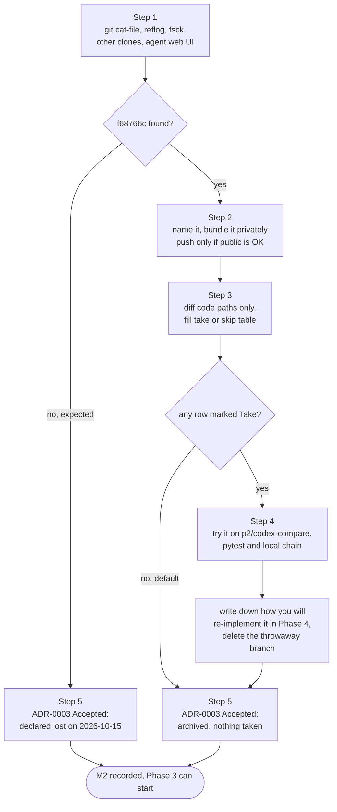

# Phase 2: Codex branch triage

> **Session:** 1 · Thu 2026-10-15 · 15 minutes if the branch is gone, up to 2 h if you find it
> **Milestone:** M2 codex decision recorded
> **Default outcome:** you take **nothing** from the branch. Every fix it was supposed to contain gets re-implemented by hand in Phase 4 anyway.

---

## 1. Goal

Find out whether the AI cleanup branch (`codex/pre-restore-ai-cleanup-20260823`, commit `f68766c`) still exists on your laptop; archive it privately or declare it lost; record the outcome in ADR-0003.

## 2. Why this phase / why now

In August an AI agent produced a cleanup branch that reportedly touched 293 files (+9.5k / −3.8k lines). You didn't keep it. The planning session looked everywhere it could reach and **the branch isn't there**: not on GitHub, not in any pull-request ref, not in the clone, and GitHub's activity log shows it was never pushed ([../inventory/codex-branch-triage.md](../inventory/codex-branch-triage.md) §1; [../research/codex.md](../research/codex.md) §1). If it still exists, it's only on the machine where the agent ran.

Two facts make this a short phase:

- **`main` already is your own pre-AI code.** `fe1b27e "Revert: cleanup"` is not a `git revert`: its parent is `243c3b1` (15 April 2026), and it only adds 84 one-line `# Title` files, titles 3 empty ones and edits `.gitignore` and `tree.md`. `git diff --stat 243c3b1 53b0532 -- tests .github Internal-IT` is empty ([../research/codex.md](../research/codex.md) §1). There's nothing to undo.
- **Every fix category is re-implemented by hand in Phase 4 anyway.** The planning session checked each fix the cleanup claimed against `main` and found each one small (5–40 lines) ([../inventory/codex-branch-triage.md](../inventory/codex-branch-triage.md) §4). Writing them yourself takes about as long as reviewing AI code, and afterwards you can explain every line in an interview.

Why this phase comes **before** the prune: if you find the branch, you may want to compare it with files Phase 3 deletes. After Phase 3 that comparison gets harder. So close this question first, on a fixed date.

Decision: [ADR-0003](../adr/0003-codex-branch-parts-bin.md), a parts bin that is never merged, with a deadline (this session).

## 3. Before you start

- **Machines:** the laptop (or VM, or cloud workspace) where you ran the AI agent in August. If you used more than one, check each.
- **Answer Q5** from [../risks-and-open-questions.md](../risks-and-open-questions.md): does `f68766c` still exist on your laptop? Default: assume lost.
- **Tools:** git ≥ 2.30 (`git --version`), Python venv with pytest and pyyaml, and the pinned scanners from [Phase 0](phase-0-orient.md) if you want to run the local chain.
- **ADR-0003** read, and accepted or rejected before you start ([../adr/README.md](../adr/README.md), "Which ADRs block which phase").
- **Where not to put it:** the repository is public. Pushing the branch there publishes the AI's work under your name. The private default is a **bundle file** outside the repository.

## 4. Steps

### Step 1: Look for the commit in your clone(s) (10 min)

```bash
cd ~/src/Ayka-Secure-Technologies-GmbH
git cat-file -t f68766c                                   # "commit" if it exists
git branch -a --list '*codex*' '*cleanup*'
git reflog --all --date=iso | grep -iE 'codex|cleanup|f68766c'
git stash list
git fsck --no-reflogs --lost-found 2>/dev/null | grep 'dangling commit'
```

Then look for **other clones** on the same machine (the agent may have worked in a copy):

```bash
find ~ -type d -name .git -prune 2>/dev/null | while read -r g; do
  d=$(dirname "$g")
  git -C "$d" cat-file -e f68766c 2>/dev/null && echo "FOUND in $d"
  git -C "$d" branch -a --list '*codex*' 2>/dev/null | sed "s|^|$d: |"
done
```

If the agent was a cloud tool that creates `codex/…` branches from a web UI, its task history may still show the diff or offer "create PR" or "download patch". That's a place to look too (**UNVERIFIED**: depends on the tool and its retention).

- **Files touched:** none.
- **Expected output:** either `commit` from `git cat-file` or `FOUND in …`, or `fatal: Not a valid object name f68766c` and no other lines. The planning session got the "not found" result in the clone it had ([../research/codex.md](../research/codex.md) §1).
- **If this fails:** `git fsck` lists dangling commits. For each one run `git log -1 --format='%h %ad %s' <sha>`. If one is dated 2026-08-23 and its subject sounds like a cleanup, treat it as found and use that SHA below instead of `f68766c`.

**Not found?** Go straight to [Step 5](#step-5-record-the-outcome-in-adr-0003-10-min). That's the expected path.

### Step 2 (only if found): Archive it privately (10 min)

Give the commit a name first. A bundle can only store named refs; `git bundle create file f68766c` fails with "Refusing to create empty bundle" (checked in the planning session).

```bash
cd <the clone where you found it>
git branch archive/codex-ai-cleanup-20260823 f68766c
git diff --shortstat main archive/codex-ai-cleanup-20260823      # your memory: 293 files, +9.5k / -3.8k
mkdir -p ~/ayka-evidence
git bundle create ~/ayka-evidence/codex-ai-cleanup-20260823.bundle archive/codex-ai-cleanup-20260823
git bundle verify ~/ayka-evidence/codex-ai-cleanup-20260823.bundle
```

This bundle holds the full history up to that commit, so it restores on its own anywhere (`git clone ~/ayka-evidence/codex-ai-cleanup-20260823.bundle`). Adding `^main` makes it smaller, but it can then only be unpacked into a clone that already has `main`.

**Only if you accept that it becomes public**, push it to an archive branch instead of (or as well as) the bundle:

```bash
git push origin archive/codex-ai-cleanup-20260823
```

- **Files touched:** `~/ayka-evidence/codex-ai-cleanup-20260823.bundle` (outside the repository); a local branch.
- **Expected output:** `--shortstat` prints something like `N files changed, X insertions(+), Y deletions(-)`; write it down, since it settles the "293 files" question. `git bundle verify` ends with `… is okay`.
- **If this fails:** if `git diff main …` says `unknown revision`, run `git fetch origin main:main` first, or use `origin/main`.

### Step 3 (only if found): Triage the code paths (30–60 min)

Follow [../inventory/codex-branch-triage.md](../inventory/codex-branch-triage.md) §3. Look **only** at code paths. Ignore every `.md` file: you already rejected the AI's documents, and ADR-0004 and ADR-0009 set a different documentation approach.

```bash
BR=archive/codex-ai-cleanup-20260823
git diff --stat main "$BR" -- tests .github \
  Internal-IT/engineering/ci-cd/scripts Internal-IT/engineering/policy-as-code '*.tf'
git diff main "$BR" -- Internal-IT/engineering/ci-cd/scripts/run-tfsec.sh      # start with the rows below
```

Read in this order. These are the files behind the known fail-open bugs ([../research/codex.md](../research/codex.md) §3):

1. `Internal-IT/engineering/ci-cd/scripts/run-tfsec.sh` (triage row 1)
2. `Internal-IT/engineering/ci-cd/scripts/evaluate-results.py` (row 3)
3. `tests/` (row 4)
4. `.github/actions/*/action.yml` (rows 2, 5, 10)
5. `.github/workflows/test.yml` (row 8)
6. `.github/workflows/terraform-workflow.yml`, `Internal-IT/engineering/ci-cd/scripts/run-apply.sh`, `.github/actions/evidence/action.yml` (row 9)

Fill one row per changed file. Copy this template into your private note, or into ADR-0003 under a "Triage" heading if you archived the branch publicly:

| File | What the change does | Fixes which known issue (triage §4 row) | Risk: what could break | +/− lines | Take / Partial / Skip | How you'd apply it | How you'd review it |
|---|---|---|---|---|---|---|---|
| `run-tfsec.sh` | | 1 | | | **Skip** (default) | re-implement in Phase 4 | Phase 4 tests; `tfsec` in `by_tool` |
| | | | | | | | |

Rules ([ADR-0003](../adr/0003-codex-branch-parts-bin.md)):

1. **Default is Skip.** The row still helps: it tells you what the fix looks like before you write your own in Phase 4.
2. Mark **Take** only if the change maps to a known issue **and** you can explain every line out loud.
3. "Nice refactors" that fix no known issue: Skip.
4. Never `git merge` the branch. Never copy anything onto `main` directly.

- **Files touched:** none (reading only).
- **Expected output:** a filled table; most rows say Skip.
- **If this fails:** if the diff is too large to read in one session (likely, at hundreds of files), read only rows 1–3 of the order above today, mark the rest "not reviewed, Skip", and stop. Phase 4 doesn't depend on this table.

### Step 4 (only if something is marked Take): Try it on a throwaway branch (20–40 min)

Nothing from the AI branch lands on `main` in this phase. You try a part on a throwaway branch to see whether it works, then write your own version in Phase 4 (or, if it's truly small and you understand every line, redo that exact change by hand in your Phase 4 commit).

```bash
git switch -c p2/codex-compare main
BR=archive/codex-ai-cleanup-20260823
```

Pick **one** of these three ways per file:

```bash
# a) Take one whole file as it is on the AI branch
git checkout "$BR" -- Internal-IT/engineering/ci-cd/scripts/run-tfsec.sh

# b) Take the change to one file as a patch, check it first, then apply
git diff main "$BR" -- Internal-IT/engineering/ci-cd/scripts/run-tfsec.sh > /tmp/p2-run-tfsec.patch
less /tmp/p2-run-tfsec.patch
git apply --check /tmp/p2-run-tfsec.patch && git apply /tmp/p2-run-tfsec.patch
#    (for single hunks: git checkout -p "$BR" -- <path>, and answer y/n per hunk)

# c) Look at what one AI commit did, without committing it
git cherry-pick -n <sha-of-one-ai-commit>
git restore --staged . && git restore -- <paths-you-do-not-want>
```

Review what you now have:

```bash
git diff --stat main
git diff main
. .venv/bin/activate 2>/dev/null || (python3 -m venv .venv && . .venv/bin/activate && pip install -q pytest pyyaml)
python3 -m pytest -q tests/
```

Then run the ayka-portal local chain exactly as in [Phase 0, Step 7](phase-0-orient.md#step-7-reproduce-the-ayka-portal-chain-exactly-as-ci-runs-it-15-min), in a fresh worktree of this branch (`git worktree add ../ayka-p2 p2/codex-compare`), and compare the decision with your Phase 0 baseline (`pass`, 0/0/14). If the tfsec fix is in, expect `fail` with HIGH 3 / MEDIUM 1 / LOW 14: the dropped findings becoming visible, not a regression ([../research/pipeline.md](../research/pipeline.md) F2).

- **Files touched:** only on the branch `p2/codex-compare`, which you never merge.
- **Expected output:** pytest still passes (5 or more); the chain gives the result you predicted before you ran it.
- **If this fails:** throw the experiment away: `git switch main && git branch -D p2/codex-compare`. Nothing on `main` changed.

When you're done, write down what you learned in the triage table ("works; ~6 lines; I'll write it like this in Phase 4"), then delete the throwaway branch:

```bash
git switch main
git worktree remove --force ../ayka-p2 2>/dev/null
git branch -D p2/codex-compare
```

### Step 5: Record the outcome in ADR-0003 (10 min)

Edit [ADR-0003](../adr/0003-codex-branch-parts-bin.md):

- Change `**Status:** Proposed` to `**Status:** Accepted`.
- Add an **Outcome** section at the end of "Decision outcome". Use one of these:

```markdown
### Outcome (2026-10-15)

Searched the laptop clone(s), the reflog, dangling commits and other clones on this machine.
f68766c was not found. Declared lost. No code is taken from it; every fix category is
re-implemented in Phase 4 (see inventory/codex-branch-triage.md §4).
```

```markdown
### Outcome (2026-10-15)

Found f68766c in <which clone>. `git diff --shortstat main f68766c`: <N files, +X/-Y>.
Archived as a private bundle outside the repository (<not pushed | also pushed to archive/codex-ai-cleanup-20260823>).
Triage: <K> code files read; 0 taken directly; <list of rows> used as reference for the Phase 4 re-implementation.
```

Then commit on a short branch and merge:

```bash
cd ~/src/Ayka-Secure-Technologies-GmbH
git switch main && git pull --ff-only
git switch -c docs/p2-codex-outcome
git add docs/restore-plan/adr/0003-codex-branch-parts-bin.md
git commit -m "docs(adr): record codex branch outcome"
git push -u origin docs/p2-codex-outcome
gh pr create --fill --base main && gh pr merge --merge --delete-branch
```

- **Files touched:** `docs/restore-plan/adr/0003-codex-branch-parts-bin.md` (and the tracker in `docs/restore-plan/README.md`).
- **Expected output:** CI green (docs-only change).
- **If this fails:** if CI goes red on a docs-only change, it's the same unpinned-tool drift described in Phase 0 Step 10. Note it for Phase 4 and merge anyway only if the failing step is clearly unrelated to your change.

## 5. Flow diagram



## 6. Checklist

- [ ] `git cat-file -t f68766c`, branch list, reflog, stash and `fsck` checked in the main clone
- [ ] Other clones on the machine checked with the `find` loop
- [ ] (if the agent was a web tool) its task history checked
- [ ] If found: named, bundled to `~/ayka-evidence/`, `git bundle verify` OK
- [ ] If found: `--shortstat` written down
- [ ] If found: triage table filled for code paths only; default Skip
- [ ] If anything tried: done on `p2/codex-compare` only; branch deleted afterwards
- [ ] ADR-0003 set to Accepted with a dated Outcome section
- [ ] PR merged; tracker says "Phase 2 ☑"

## 7. Definition of done

M2 is done when ADR-0003 says, with a date, whether the branch was found and what (if anything) you did with it, and `main` contains no code from it.

```bash
cd ~/src/Ayka-Secure-Technologies-GmbH && git switch main && git pull --ff-only
grep -n '^- \*\*Status:\*\*' docs/restore-plan/adr/0003-codex-branch-parts-bin.md      # Accepted
grep -n '### Outcome' docs/restore-plan/adr/0003-codex-branch-parts-bin.md             # one line
git branch -a --list '*p2/codex-compare*'                                             # nothing
git diff --stat baseline-2026-10 main -- tests .github Internal-IT/engineering        # nothing new from the AI branch
ls ~/ayka-evidence/codex-ai-cleanup-20260823.bundle 2>/dev/null || echo "no bundle (declared lost)"
```

The `git diff --stat` line should show no changes under those paths at this point. Phase 1 only touched `entra-id` and the risk register.

## 8. Commit message(s)

Not found:

```text
docs(adr): record codex branch outcome

Searched the laptop clone, reflog, dangling commits and other clones on
2026-10-15: f68766c not found. ADR-0003 accepted; branch declared lost.
All fix categories are re-implemented by hand in Phase 4.
```

Found:

```text
docs(adr): record codex branch outcome

f68766c found and archived as a private bundle (not pushed).
git diff --shortstat main f68766c: <N files, +X/-Y>. Code paths triaged;
nothing taken directly; rows 1, 3, 4 used as reference for Phase 4.
```

## 9. What you learned

- **How git keeps (and loses) commits.** "A commit lives as long as something references it: a branch, a tag, the reflog, a stash. When nothing does, `git gc` eventually deletes it. That's why I searched the reflog and `git fsck` for dangling commits, and why a commit that was never pushed exists only on one machine. To keep it without publishing it, I used `git bundle`, a single file holding the commits and a named ref."
- **Treat AI output like any third-party change.** "An AI agent produced a cleanup said to touch 293 of my 373 files. I didn't merge it, because I couldn't defend it line by line. I used it as a parts bin: diff only the code paths, map each change to a known bug, and re-implement the fix myself with a test. It's the same discipline you'd apply to a large external pull request."
- **Three ways to take part of a branch.** "`git checkout <ref> -- <path>` takes a whole file. `git diff … | git apply` (or `git checkout -p`) takes selected hunks. `git cherry-pick -n` replays a commit without committing it, so you can keep only what you want. I did all three on a throwaway branch and reviewed with `git diff --stat`, the tests and the local pipeline before deciding anything."

## 10. Time estimate and safe stopping point

| Case | Steps | Time | Date |
|---|---|---|---|
| Not found (expected) | 1, 5 | 15–30 min | Thu 2026-10-15 |
| Found, nothing taken | 1, 2, 3, 5 | 1–1.5 h | Thu 2026-10-15 |
| Found, something tried | 1–5 | up to 2 h | Thu 2026-10-15 |

**Safe stopping points:**

1. **After Step 2.** The branch is safe in a bundle. Triage can wait, but set yourself a date, because ADR-0003's deadline exists so that this can't block Phase 3.
2. **Mid-Step 3.** Mark the unread files "not reviewed, Skip" and record the outcome (Step 5). Nothing in Phase 4 depends on finishing the table.

If the session runs out before Step 5, the only thing left is the ADR edit. Do it at the start of the first Phase 3 session.
