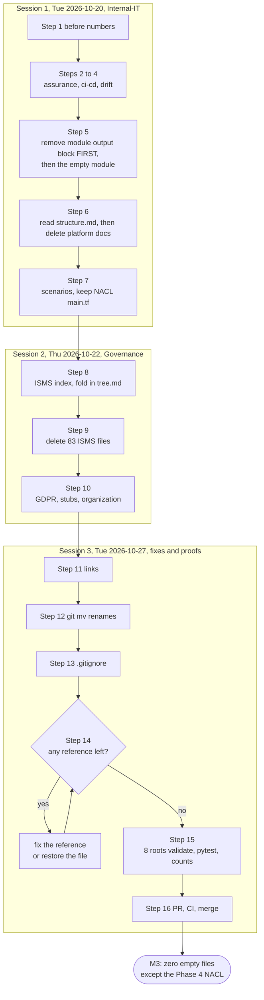

# Phase 3: Prune

> **Sessions:** 3 · Tue 2026-10-20 (Internal-IT) · Thu 2026-10-22 (Governance and the ISMS index) · Tue 2026-10-27 (names, links, `.gitignore`, proofs)
> **Milestone:** M3 zero empty files (one known exception, closed in Phase 4)
> **Work on one branch** (`chore/p3-prune`), one commit per batch, one pull request merged at the end of Session 3.

---

## 1. Goal

Delete the 170 empty, title-only, stub, duplicate and generated files marked for Phase 3, replace the 79 ISMS placeholders with one "planned documents" index, fix the 9 files whose names or links are wrong, and prove that nothing still points at a deleted path.

## 2. Why this phase / why now

Of your 373 tracked files, 75 are empty, 80 contain only a `# Title` line and 12 are thin stubs: 167 files, **45% of the repository**, that say nothing ([../research/inventory.md](../research/inventory.md) §2). A reviewer who opens three folders and finds three empty files will assume the rest is empty too, including the parts that work. An empty file is a promise with no date; one table that says "planned, not started" is honest and takes 30 seconds to read.

You already wrote the rule yourself. The risk register says RISK-010 and RISK-011 "require real activities and processing facts, not additional blank templates" (`Governance/ISMS/03-risk-management/risk-register.md:42`), and the Q1 assessment warns that creating records after the fact "would manufacture evidence" (`Governance/ISMS/03-risk-management/risk-assessment-results/2026-q1-risk-assessment.md:12`). So the answer isn't to fill 79 ISO documents in a week. It's to delete the placeholders and keep your intent in one list.

Why now, and in this order:

- **After Phase 2**, because you might have wanted to compare these files with the AI branch. That question is closed.
- **Before Phase 4**, because Phase 4 edits the pipeline, and the 14 empty `ci-cd/pipelines/*.yml` files plus 2 symlinks in `ci-cd/templates/` make it look as if there were two pipelines ([ADR-0005](../adr/0005-github-single-source-of-truth.md)). With them gone, `.github/` is the only place to look.
- **Deletions are safe to undo.** Git keeps every removed file: `git show baseline-2026-10:<path>` prints any of them, and `git checkout baseline-2026-10 -- <path>` brings one back.

Decisions for this phase (accept or reject before Session 1):

- [ADR-0004](../adr/0004-delete-placeholders.md): remove placeholders rather than filling them; one ISMS index keeps the plan.
- [ADR-0005](../adr/0005-github-single-source-of-truth.md): `.github/` is the single source of truth for pipelines.
- Related: [ADR-0009](../adr/0009-governance-links-evidence.md) (evidence comes from CI runs, not empty `.txt` files), [ADR-0006](../adr/0006-honesty-labelling.md) (stubs describing things that don't exist).

**About the file count.** After this phase, 203 of the original 373 files remain, plus whatever earlier phases added (the Phase 1 change adds 2 `passwords.tf` files) and the `docs/restore-plan/` files. Phase 4 deletes 2 more (the dead `OPA/aws/*.rego`), which gives the 201 in [../inventory/file-disposition.md](../inventory/file-disposition.md). Your "80–120 files" goal is only reachable by also moving the ~95 platform files out: that's open question Q7, and the default is to keep them as design-only context ([../02-target-state.md](../02-target-state.md)).

## 3. Before you start

- **Phase 2 is closed:** ADR-0003 has an Outcome section.
- **ADR-0004 and ADR-0005** are Accepted (or you've decided what to do differently).
- **Answers:** Q6 (the 84 ISMS stubs: to-do list or not? default: replace with one index) and Q7 (file-count target; default: keep the platform roots) from [../risks-and-open-questions.md](../risks-and-open-questions.md).
- **Tools from Phase 0:** terraform 1.7.5, the Python venv with pytest and pyyaml, the pinned scanners (for the optional chain re-run), `jq`. `perl` is preinstalled on macOS and on most Linux systems (`perl -v`); the text edits below use it because `sed -i` behaves differently on macOS and Linux.
- **Reference while you work:** [../inventory/file-disposition.md](../inventory/file-disposition.md) (every file, with its disposition).
- **A clean start:**

```bash
cd ~/src/Ayka-Secure-Technologies-GmbH
git switch main && git pull --ff-only && git status --short     # prints nothing
git switch -c chore/p3-prune
```

### What the planning session already proved

On 2026-09-28 the planning session ran **every command in this playbook** on a scratch copy: `git archive 53b0532` into a new folder, `git init`, one commit, the tag `baseline-2026-10`, then all Session 1–3 steps in order, then the Step 14–15 proofs. Results:

| Check | Result (planning session, 2026-09-28) |
|---|---|
| Files deleted (`git diff --diff-filter=D`) | **170**, identical to the DELETE/P3 rows of the disposition list |
| Files fixed | 9: 7 modified, 2 renamed (`R098` `platform-compliance.md`, `R094` `identity-boundary-decision.md`) |
| Path references to deleted files (Step 14 loop) | **0** |
| Folder and file names (Step 14) | 0 everywhere, except `tree.md` 1 and `structure.md` 1 (both expected, see Step 14) |
| Terraform, all 8 roots | **8/8** `fmt -check`, `init -backend=false`, `validate` PASS (Terraform 1.7.5; providers from a checksum-verified local mirror because the sandbox blocked the registry) |
| `python3 -m pytest -q tests/` | 5 passed |
| Files remaining | **203** of 373 (no Phase 1 changes in the dry run) |
| Empty files remaining | 1: `control-validation-scenarios/vpc/permissive-network-acl/main.tf` (Phase 4 FIX) |
| Title-only Markdown / symlinks / tracked-but-ignored | 0 / 0 / 0 |
| ayka-portal chain after the prune | `pass`, HIGH 0 / MEDIUM 0 / LOW 14 (unchanged); `git status` clean afterwards |

You should get the same numbers, except that your file count also includes the files Phase 1 added.

## 4. Steps

### Overview: the complete deletion list

The list is the 170 rows with disposition DELETE and phase P3 in [../inventory/file-disposition.md](../inventory/file-disposition.md), with real line and byte counts. A folder is shown as `folder/` only when **every** tracked file in it is deleted; otherwise every file is listed. Nine batches, one commit each:

| Batch | Session | Area | Files | Lines | Bytes |
|---|---|---|---:|---:|---:|
| A | 1 | `Internal-IT/assurance/` | 19 | 1 | 2 |
| B | 1 | CI/CD placeholders, symlinks, unused workflow | 22 | 23 | 573 |
| C | 1 | `Internal-IT/engineering/drift-detection/` | 4 | 0 | 0 |
| D | 1 | Platform: empty `.tf` files, empty `output` module | 3 | 1 | 1 |
| E | 1 | Platform: empty and aspirational docs | 13 | 180 | 8954 |
| F | 1 | Regression scenarios | 11 | 3 | 7216 |
| G | 2 | `Governance/ISMS` stubs, empty evidence files, `tree.md` | 83 | 213 | 7072 |
| H | 2 | Governance: GDPR empties and stubs | 12 | 53 | 978 |
| I | 2 | `organization/` empties | 3 | 0 | 0 |
| **Total** | | | **170** | **474** (+ 1 binary) | **24796** |

**Traps** (the only files where the order of operations matters):

| File | Why it's a trap | What to do |
|---|---|---|
| `Internal-IT/platform/domains/identity/entra-id/modules/output/compliance.tf` | 1 byte, but it's the whole module that `entra-id/main.tf:28-30` calls (`module "output" { source = "./modules/output" }`). Delete the folder first and `terraform init` fails. It's also matched by `.gitignore:39` (`output/`). | Remove the `module "output"` block **first** (Step 5) |
| `Internal-IT/workloads/control-validation-scenarios/vpc/permissive-network-acl/` | Wired in at `control-validation-scenarios/main.tf:21-24`. Its `main.tf` is empty (so the scenario creates nothing), but it's a FIX for Phase 4, not a delete: Phase 4 writes the NACL that gives `NETWORK_ACL_UNRESTRICTED_INGRESS` its negative test. | Delete **only** `README.md` and `variables.tf`; keep `main.tf` and `versions.tf` (Step 7) |
| `Governance/ISMS/tree.md` | 134 lines: the list of ISMS documents you planned. Also silently matched by `.gitignore:68` (`tree.md`). | Fold it into `Governance/ISMS/README.md` **first** (Step 8), then delete it (Step 9) |
| `Internal-IT/platform/structure.md` | 113 real lines. It describes folders that don't exist (`domains/detection`, `response`, `network`, `shared/`), so it misleads, but it may hold ideas you want for the Phase 5 repo map. | Read it once before deleting (Step 6) |
| `Internal-IT/platform/domains/identity/docs/tempChangePlan.md` | The name says "temporary", but it's a real decision record: the Entra ID Free plan blocks group-based SCIM, so groups live in IAM Identity Center. | **Rename, don't delete** (Step 12) |

**Short files that are meaningful: don't delete them.** Short isn't the same as empty. The deletion list is based on content status, not length. These look deletable at a glance but stay ([../research/inventory.md](../research/inventory.md) §5):

- `versions.tf`, `provider.tf`, `outputs.tf`, `variables.tf` files with 3–15 lines in every root and module (for example the 8 identical `versions.tf` files: normal Terraform plumbing);
- the 7 committed `.terraform.lock.hcl` files;
- `Internal-IT/platform/foundation/landing-zone/modules/core/docs/remediation.md` (a real 5-step root-hardening checklist);
- `Internal-IT/platform/domains/identity/docs/scim.md` and `…/entra-id/provisioning.md` (real manual procedures);
- `control-validation-scenarios/ec2/no-imdsv2/main.tf` (8 lines) and the other scenario `main.tf` files: they *are* the negative tests;
- `Internal-IT/engineering/policy-as-code/OPA/aws/*.rego`: dead code, but deleted in Phase 4 together with the `run-policy-check.sh` change, not here.

And a few files **on** the list are short but deserve one look before they go: `.github/workflows/policy-check.yml` (21 lines, a real reusable workflow that nothing calls, [../research/pipeline.md](../research/pipeline.md) §1), `control-validation-scenarios/shared/versions.tf` (3 real lines in a folder no module references), and the stubs in Batches E and H (4–24 lines each, describing things that don't exist).

### Session 1 (Tue 2026-10-20): Internal-IT

#### Step 1: Record the "before" numbers (5 min)

```bash
cd ~/src/Ayka-Secure-Technologies-GmbH
git ls-files ':(exclude)docs/restore-plan' | wc -l
git ls-files -z | xargs -0 sh -c 'for f; do [ -L "$f" ] || grep -q "[^[:space:]]" "$f" || echo "$f"; done' sh | wc -l
git ls-files -z -- '*.md' | xargs -0 awk 'FNR==1{if(f!="" && n>0 && h==n) print f; f=FILENAME; n=0; h=0} NF{n++; if($0 ~ /^[[:space:]]*#/) h++} END{if(n>0 && h==n) print f}' | wc -l
```

The first command counts tracked files outside the plan folder. The second lists files that are empty or whitespace only (symlinks skipped). The third lists Markdown files whose non-blank lines are all headings.

- **Files touched:** none.
- **Expected output:** `375` (373 at the baseline plus the 2 `passwords.tf` files from Phase 1; 374 if you chose the variables alternative), `75`, `80`. The planning session measured 373 / 75 / 80 at `53b0532`, matching the inventory.
- **If this fails:** different numbers mean something changed since the baseline. Run `git diff --stat baseline-2026-10 main -- . ':(exclude)docs/restore-plan'` and make sure you recognise every change before deleting anything.

#### Step 2: Batch A, `Internal-IT/assurance/` (5 min)

| Path | Files | Status | Lines | Bytes | Why |
|---|---:|---|---:|---:|---|
| `Internal-IT/assurance/` (whole folder) | 19 | empty 19 | 1 | 2 | Empty placeholder (ADR-0004) |

```bash
git rm -r Internal-IT/assurance
git commit -m "chore(repo): remove empty assurance placeholders"
```

- **Files touched:** 19 files under `Internal-IT/assurance/` (removed).
- **Expected output:** 19 `rm '…'` lines; the commit reports `19 files changed, 1 deletion(-)`.
- **If this fails:** `did not match any files` means the folder is already gone or you're in the wrong directory. Run `git rev-parse --show-toplevel` to check.

The folder name `assurance/` documented an idea (audit support, evidence integrity, metrics). If you want to keep that idea visible, mention it in the Phase 5 README under "Planned", not as 19 empty files.

#### Step 3: Batch B, CI/CD placeholders, symlinks and the unused workflow (10 min)

| Path | Files | Status | Lines | Bytes | Why |
|---|---:|---|---:|---:|---|
| `.github/workflows/policy-check.yml` | 1 | substantive | 21 | 475 | Reusable workflow nothing calls; only mirrored by a symlink (ADR-0005) |
| `Internal-IT/engineering/.pre-commit-config.yaml` | 1 | empty | 0 | 0 | Empty and in the wrong place (pre-commit reads repo root) |
| `Internal-IT/engineering/ci-cd/README.md` | 1 | empty | 0 | 0 | Empty |
| `Internal-IT/engineering/ci-cd/compliance-gates/approvals/` (whole folder) | 2 | empty 2 | 0 | 0 | Empty placeholder (ADR-0004) |
| `Internal-IT/engineering/ci-cd/compliance-gates/failure-handling.md` | 1 | empty | 0 | 0 | Empty placeholder (ADR-0004) |
| `Internal-IT/engineering/ci-cd/pipelines/` (whole folder) | 14 | empty 14 | 0 | 0 | Empty placeholder YAML shadowing `.github/` (ADR-0005) |
| `Internal-IT/engineering/ci-cd/templates/` (whole folder) | 2 | symlink 2 | 2 | 98 | Symlink into `.github/workflows` (ADR-0005) |

```bash
git rm -r Internal-IT/engineering/ci-cd/pipelines Internal-IT/engineering/ci-cd/templates
git rm .github/workflows/policy-check.yml
git rm Internal-IT/engineering/ci-cd/README.md \
  Internal-IT/engineering/ci-cd/compliance-gates/failure-handling.md \
  Internal-IT/engineering/ci-cd/compliance-gates/approvals/change-justification-template.md \
  Internal-IT/engineering/ci-cd/compliance-gates/approvals/prod-approval-policy.md \
  Internal-IT/engineering/.pre-commit-config.yaml
git grep -n -e 'policy-check.yml' -e 'ci-cd/templates' -e 'ci-cd/pipelines' -- .github Internal-IT/engineering/ci-cd/scripts
git commit -m "chore(ci): make .github the single source of pipeline definitions"
```

- **Files touched:** 22 files (removed). `Internal-IT/engineering/ci-cd/architecture.md` still describes the `pipelines/*` layers; you rewrite it in Step 11.
- **Expected output:** the `git grep` prints nothing: no workflow, action or script refers to the removed files. The "Policy Check Workflow" will disappear from the Actions tab after the merge; nothing called it (`policy-check.yml` is `workflow_call` only and no workflow uses it, [../research/pipeline.md](../research/pipeline.md) §1).
- **If this fails:** if `git grep` prints a line under `.github/`, don't delete that file yet. Something calls it. Restore it with `git restore --staged --worktree <path>` and check the caller.

#### Step 4: Batch C, `Internal-IT/engineering/drift-detection/` (3 min)

| Path | Files | Status | Lines | Bytes | Why |
|---|---:|---|---:|---:|---|
| `Internal-IT/engineering/drift-detection/` (whole folder) | 4 | empty 4 | 0 | 0 | Empty placeholder (ADR-0004) |

```bash
git rm -r Internal-IT/engineering/drift-detection
git commit -m "chore(ci): remove empty drift-detection placeholders"
```

- **Files touched:** 4 files (removed), including the empty `drift-check.sh`. The real drift workflow is `.github/workflows/drift-detection.yml` and stays (Phase 4 makes it manual-only, [ADR-0008](../adr/0008-drift-manual-only.md)).
- **Expected output:** `4 files changed`.
- **If this fails:** see Step 2.

#### Step 5: Batch D, the `entra-id` output module and two empty `.tf` files (10 min)

| Path | Files | Status | Lines | Bytes | Why |
|---|---:|---|---:|---:|---|
| `Internal-IT/platform/domains/identity/entra-id/modules/output/` (whole folder) | 1 | empty | 1 | 1 | 1-byte `compliance.tf`. **Trap:** remove `module "output"` from `entra-id/main.tf:28-30` first, or init breaks |
| `Internal-IT/platform/domains/identity/entra-id/modules/privileged/governance_authorities.tf` | 1 | empty | 0 | 0 | Empty .tf |
| `Internal-IT/platform/foundation/remote-state/variables.tf` | 1 | empty | 0 | 0 | Empty .tf |

**Trap first.** Remove the `module "output"` block from `entra-id/main.tf` (lines 28-30 at the baseline; about one line lower after your Phase 1 change). Do it in your editor, or with this command, which removes exactly that block and the blank line before it:

```bash
E=Internal-IT/platform/domains/identity/entra-id
perl -0pi -e 's/\nmodule "output" \{\n  source = "\.\/modules\/output"\n\}\n//' $E/main.tf
git diff $E/main.tf
```

The diff should look like this (the line numbers in the `@@` header are one or more higher if Phase 1 added lines to `main.tf`):

```diff
@@ -24,7 +24,3 @@ module "conditional_access" {
 
   count = var.enable_conditional_access ? 1 : 0
 }
-
-module "output" {
-  source = "./modules/output"
-}
```

Then delete the files and prove the root still works:

```bash
git rm -r $E/modules/output
git rm $E/modules/privileged/governance_authorities.tf Internal-IT/platform/foundation/remote-state/variables.tf
(cd $E && terraform fmt -check && terraform init -backend=false -input=false >/dev/null && terraform validate)
(cd Internal-IT/platform/foundation/remote-state && terraform init -backend=false -input=false >/dev/null && terraform validate)
git add $E/main.tf
git commit -m "fix(identity): drop the empty output module and empty .tf files"
```

- **Files touched:** `Internal-IT/platform/domains/identity/entra-id/main.tf` (edited); `entra-id/modules/output/compliance.tf`, `entra-id/modules/privileged/governance_authorities.tf`, `platform/foundation/remote-state/variables.tf` (removed).
- **Expected output:** the diff above; `Success! The configuration is valid.` twice. The module declared no resources, so removing it changes nothing in any state file, even if `entra-id` was applied.
- **If this fails:** `Module not installed` or `Unreadable module directory` from `init` means the block is still in `main.tf`. Check `git diff $E/main.tf`. `terraform fmt -check` failing means a blank line was left at the end of the file: run `terraform fmt $E` and look at the diff again.

#### Step 6: Batch E, platform docs; read `structure.md` first (15 min)

| Path | Files | Status | Lines | Bytes | Why |
|---|---:|---|---:|---:|---|
| `Internal-IT/platform/CONTROL-PLANE.md` | 1 | stub | 20 | 522 | Generic headings; detection/response planes don't exist |
| `Internal-IT/platform/README.md` | 1 | empty | 0 | 0 | Empty |
| `Internal-IT/platform/architecture.md` | 1 | empty | 0 | 0 | Empty |
| `Internal-IT/platform/deployments/` (whole folder) | 1 | stub | 24 | 551 | Phase outline for phases that don't exist |
| `Internal-IT/platform/foundation/landing-zone/modules/siem/elastic-siem.md` | 1 | stub | 23 | 498 | Describes an Elastic SIEM lab whose files don't exist (ADR-0006) |
| `Internal-IT/platform/operations/` (whole folder) | 7 | empty 7 | 0 | 0 | Empty placeholder (ADR-0004) |
| `Internal-IT/platform/structure.md` | 1 | substantive | 113 | 7383 | **Trap:** 113 real lines describing folders that don't exist. Read it before deleting (Step 6) |

Read `Internal-IT/platform/structure.md` once (10 minutes). Copy anything that is still **true** into a private note for the Phase 5 repo map ([../02-target-state.md](../02-target-state.md), item 8). Most of it isn't: it lists `domains/detection|response|network/`, `shared/` and `policy-as-code/config-rules/`, none of which exist ([../research/inventory.md](../research/inventory.md) §6.3), and it spells `Platform_Compliance.md` differently from the real file. Then:

```bash
git rm Internal-IT/platform/{README,architecture,CONTROL-PLANE,structure}.md
git rm -r Internal-IT/platform/deployments Internal-IT/platform/operations
git rm Internal-IT/platform/foundation/landing-zone/modules/siem/elastic-siem.md
git commit -m "chore(platform): remove empty and aspirational platform docs"
```

- **Files touched:** 13 files (removed).
- **Expected output:** `13 files changed, 180 deletions(-)`.
- **If this fails:** zsh or bash must expand `{README,architecture,…}`. If your shell doesn't, list the four paths one by one.

#### Step 7: Batch F, regression scenarios (10 min)

| Path | Files | Status | Lines | Bytes | Why |
|---|---:|---|---:|---:|---|
| `Internal-IT/workloads/control-validation-scenarios/ec2/no-imdsv2/README.md` | 1 | empty | 0 | 0 | Empty placeholder (ADR-0004) |
| `Internal-IT/workloads/control-validation-scenarios/ec2/open-ssh-security-group/README.md` | 1 | empty | 0 | 0 | Empty placeholder (ADR-0004) |
| `Internal-IT/workloads/control-validation-scenarios/ec2/open-ssh-security-group/variables.tf` | 1 | empty | 0 | 0 | Empty .tf (safe: dir has other real .tf; checked with `terraform validate`) |
| `Internal-IT/workloads/control-validation-scenarios/s3/missing-encryption/README.md` | 1 | empty | 0 | 0 | Empty placeholder (ADR-0004) |
| `Internal-IT/workloads/control-validation-scenarios/s3/public-bucket/README.md` | 1 | empty | 0 | 0 | Empty placeholder (ADR-0004) |
| `Internal-IT/workloads/control-validation-scenarios/s3/public-bucket/variables.tf` | 1 | empty | 0 | 0 | Empty .tf (safe: dir has other real .tf; checked with `terraform validate`) |
| `Internal-IT/workloads/control-validation-scenarios/shared/` (whole folder) | 2 | empty 1, substantive 1 | 3 | 46 | Dead folder: no module block references `shared/` (`versions.tf` is real but unused) |
| `Internal-IT/workloads/control-validation-scenarios/tfplan.binary` | 1 | binary | binary | 7170 | Generated plan (a zip with an empty state) committed in `0756e0a`; CI never reads it |
| `Internal-IT/workloads/control-validation-scenarios/vpc/permissive-network-acl/README.md` | 1 | empty | 0 | 0 | Empty (scenario documented in the scenarios README) |
| `Internal-IT/workloads/control-validation-scenarios/vpc/permissive-network-acl/variables.tf` | 1 | empty | 0 | 0 | Empty .tf |

**Trap:** in `vpc/permissive-network-acl/`, remove only `README.md` and `variables.tf`. Keep `main.tf` (empty; Phase 4 fills it) and `versions.tf`.

```bash
S=Internal-IT/workloads/control-validation-scenarios
git rm $S/tfplan.binary
git rm $S/ec2/no-imdsv2/README.md $S/ec2/open-ssh-security-group/README.md $S/ec2/open-ssh-security-group/variables.tf \
  $S/s3/missing-encryption/README.md $S/s3/public-bucket/README.md $S/s3/public-bucket/variables.tf \
  $S/vpc/permissive-network-acl/README.md $S/vpc/permissive-network-acl/variables.tf
git rm -r $S/shared
ls $S/vpc/permissive-network-acl/                     # main.tf  versions.tf
(cd $S && terraform init -backend=false -input=false >/dev/null && terraform validate)
git commit -m "chore(scenarios): remove committed plan binary, dead shared/ and empty files"
```

- **Files touched:** 11 files (removed).
- **Expected output:** `ls` prints `main.tf  versions.tf`; `Success! The configuration is valid.` The committed `tfplan.binary` was never read by CI: the regression job's plan step writes a fresh `tfplan.binary` into the same folder (`.github/actions/plan/action.yml:42`), which is also how your Phase 0 Step 8 run overwrote it.
- **If this fails:** if `validate` complains about `./vpc/permissive-network-acl`, you deleted `main.tf` or `versions.tf` too. Bring them back with `git checkout baseline-2026-10 -- $S/vpc/permissive-network-acl/main.tf $S/vpc/permissive-network-acl/versions.tf`.

**End of Session 1.** Push the branch as a backup (CI runs on it, and it should be green):

```bash
git push -u origin chore/p3-prune
```

### Session 2 (Thu 2026-10-22): Governance and the ISMS index

#### Step 8: Write the ISMS "planned documents" index, folding in `tree.md` (40 min)

`Governance/ISMS/README.md` is title-only today. It becomes the one list of ISMS documents: the ones that exist, the ones covered elsewhere, and the ones only planned ([ADR-0004](../adr/0004-delete-placeholders.md)). Every document name in `tree.md` and every stub you're about to delete becomes a row, so nothing you planned is lost.

Status values:

- **Draft**: the file exists but isn't approved. None can be "In use": your own methodology says "An empty approval field never counts as approval" (`Governance/ISMS/03-risk-management/risk-management-methodology.md:51`).
- **Covered elsewhere**: the content lives in another file (for example `organization/org-structure.md`, or `control-mapping.yaml` for the control mapping).
- **Planned**: not written. It's an intention, not a document.

The draft below was generated in the planning session from `tree.md` and the stub list. It has 93 rows: 11 Draft, 6 Covered elsewhere, 76 Planned. Rewrite the "Why" and "Evidence" cells in your own words where you disagree. The ISO/IEC 27001:2022 clause and Annex A numbers are from the standard's structure; check them against your copy before you rely on them (your own `iam-iso27001-mapping.md` shows how easily they shift, [../research/inventory.md](../research/inventory.md) §6.2).

<details>
<summary>Draft <code>Governance/ISMS/README.md</code> (click to expand)</summary>

```markdown
# Information Security Management System (ISMS)

> Simulated ISO/IEC 27001:2022 case study. This table is the single list of ISMS documents: the ones that exist and the ones that are only planned.
> A `Planned` row is an intention, not a document. When you write one, create the file in the matching folder, link it here and change the status.
> Status: `Draft` = file exists, not approved (no real approver exists) · `Covered elsewhere` = content lives in another file · `Planned` = not written.

| Area | Planned document | Status | Why it would exist | Evidence it would need |
|---|---|---|---|---|
| 00 Context and governance | [Scope](00-context-and-governance/scope.md) | Draft | Clause 4.3: what the ISMS covers | Label the approval line as simulated (Phase 5) |
| 00 Context and governance | [Information security policy](00-context-and-governance/information-security-policy.md) | Draft | Clause 5.2, A.5.1: top-level policy | Label the approval line as simulated (Phase 5) |
| 00 Context and governance | Context of the organization | Planned | Clause 4.1: issues that shape the ISMS | Dated list of issues; can build on `organization/business-model.md` |
| 00 Context and governance | Interested parties | Planned | Clause 4.2: who has requirements on the ISMS | List of parties and their requirements, with a review date |
| 00 Context and governance | Legal and regulatory requirements | Planned | Clause 4.2, A.5.31 | Register of laws and contracts (e.g. GDPR) with an owner |
| 00 Context and governance | ISMS objectives | Planned | Clause 6.2: measurable objectives | Each objective names a data source, e.g. CI run history |
| 00 Context and governance | Management commitment statement | Planned | Clause 5.1 | A real dated decision by a real person; don't write one for the simulated company |
| 00 Context and governance | Document control procedure | Planned | Clause 7.5.2, 7.5.3 | Git history, pull requests and branch protection (after Phase 4) |
| 00 Context and governance | Document register | Planned | Clause 7.5 | This table can be the register; add owner and review-date columns |
| 00 Context and governance | Record retention policy | Planned | A.5.33 | Retention that is actually configured, e.g. GitHub artifact retention |
| 01 Organization | [Org chart](../../organization/org-structure.md) | Covered elsewhere | Clause 5.3 | Already written in `organization/` |
| 01 Organization | [Roles and responsibilities](../../organization/roles-and-responsibilities.md) | Covered elsewhere | Clause 5.3, A.5.2 | Already written in `organization/` (fix the SIEM claim in Phase 5) |
| 01 Organization | [Personnel register](../../organization/personnel-register.md) | Covered elsewhere | A.6.1, joiner and leaver tracking | Already written in `organization/` (fictional people) |
| 01 Organization | NDA template | Planned | A.6.6 | Template text only |
| 01 Organization | Signed NDA index | Planned | A.6.6 | Only real signed agreements; stays Planned in a simulation |
| 01 Organization | Competence matrix | Planned | Clause 7.2 | Roles against required skills, with a dated assessment |
| 01 Organization | [Training and awareness programme](../../organization/training-and-awareness.md) | Covered elsewhere | Clause 7.3, A.6.3 | Already written in `organization/`; no training records exist |
| 01 Organization | Disciplinary process | Planned | A.6.4 | Process text; no records in a simulation |
| 01 Organization | Onboarding and offboarding procedure | Planned | A.5.16, A.5.18, A.6.5 | Link the identity provisioning workflow and the Entra ID Terraform |
| 02 Asset management | Asset inventory | Planned | A.5.9 | Generated from the plan JSON resource list, not typed by hand |
| 02 Asset management | Asset classification policy | Planned | A.5.12 | A classification tag that Terraform actually sets |
| 02 Asset management | Asset ownership register | Planned | A.5.9 | Owner tags or a CODEOWNERS file |
| 02 Asset management | Acceptable use policy | Planned | A.5.10 | Policy text; acknowledgements would be records |
| 02 Asset management | Remote work policy | Planned | A.6.7 | Policy text |
| 02 Asset management | Mobile device policy | Planned | A.8.1 | Policy text; device management records |
| 02 Asset management | Asset return checklist | Planned | A.5.11 | Offboarding records |
| 03 Risk management | [Risk management methodology](03-risk-management/risk-management-methodology.md) | Draft | Clause 6.1.2 | Replace `AUDIT/` links with CI run links (Phase 5, ADR-0009) |
| 03 Risk management | [Risk criteria](03-risk-management/risk-criteria.md) | Draft | Clause 6.1.2 a | In your preferred style already |
| 03 Risk management | [Risk register](03-risk-management/risk-register.md) | Draft | Clause 6.1.2, 8.2 | RISK-001 corrected in Phase 1; other links in Phase 5 |
| 03 Risk management | [Risk treatment plan](03-risk-management/risk-treatment-plan.md) | Draft | Clause 6.1.3, 8.3 | TRT-003/006 status fixed in Phase 5 |
| 03 Risk management | [Risk acceptance log](03-risk-management/risk-acceptance-log.md) | Draft | Clause 6.1.3 f | No approver exists yet, and the log says so |
| 03 Risk management | [Threat scenarios catalogue](03-risk-management/threat-scenarios-catalog.md) | Draft | Clause 6.1.2 c | Scenarios already point at real repo conditions |
| 03 Risk management | [2026 Q1 risk assessment](03-risk-management/risk-assessment-results/2026-q1-risk-assessment.md) | Draft | Clause 8.2 | Marked as a retrospective reconstruction |
| 03 Risk management | [2026 Q2 risk review](03-risk-management/risk-assessment-results/2026-q2-risk-review.md) | Draft | Clause 8.2 | Its drift reading matches the workflow history |
| 04 Controls and SoA | [IAM to ISO 27001 mapping](04-controls-and-soa/iam-iso27001-mapping.md) | Draft | A.5.15 to A.5.18, A.8.2 to A.8.5 | Has broken `Internal-IT/iam/` paths and shifted A.5 labels; fix before relying on it |
| 04 Controls and SoA | Statement of Applicability | Planned | Clause 6.1.3 d | Every Annex A control: applicable or not, and why; link applicable ones to `control-mapping.yaml` |
| 04 Controls and SoA | [Control mapping to Internal-IT](../../Internal-IT/engineering/policy-as-code/metadata/control-mapping.yaml) | Covered elsewhere | Clause 6.1.3 | The real mapping: 38 controls with ISO 27001 refs, read by the evaluator |
| 04 Controls and SoA | Control gap analysis | Planned | Clause 6.1.3 | Difference between the SoA and the controls the gate enforces |
| 04 Controls and SoA | Access control evidence index | Planned | A.5.15 | CI run links for the IAM controls |
| 04 Controls and SoA | Privileged access justification | Planned | A.8.2 | One line per privileged role: reason and approver |
| 04 Controls and SoA | Justification for exclusions | Planned | Clause 6.1.3 d | Can be a column in the SoA instead of a file |
| 05 Operational policies | Incident response policy | Planned | A.5.24 | Policy text |
| 05 Operational policies | Access control policy | Planned | A.5.15 | Controls `IAM_WILDCARD_POLICY`, `IAM_USER_PROHIBITED` in CI runs |
| 05 Operational policies | Password policy | Planned | A.5.17 | Entra ID settings; no passwords in code (Phase 1) |
| 05 Operational policies | MFA policy | Planned | A.8.5 | Control `IAM_USER_MFA_MISSING`; Conditional Access module |
| 05 Operational policies | Privileged access policy | Planned | A.8.2 | Tier 0 groups in Terraform; break-glass procedure |
| 05 Operational policies | Logging and monitoring policy | Planned | A.8.15, A.8.16 | Controls `S3_LOGGING_DISABLED`, `VPC_FLOW_LOGS_MISSING` |
| 05 Operational policies | Cloud security policy | Planned | A.5.23 | The compliance gate itself: CI run links |
| 05 Operational policies | Secure development policy | Planned | A.8.25 | Pipeline stages and branch protection |
| 05 Operational policies | Change management policy | Planned | A.8.32 | Pull requests plus the gate decision per run |
| 05 Operational policies | Backup policy | Planned | A.8.13 | Control `S3_VERSIONING_DISABLED`; restore tests would be records |
| 05 Operational policies | Encryption policy | Planned | A.8.24 | Controls `S3_ENCRYPTION_MISSING`, `EC2_ROOT_VOLUME_UNENCRYPTED` |
| 05 Operational policies | Vulnerability management policy | Planned | A.8.8 | Scanner results in CI artifacts |
| 05 Operational policies | Patch management policy | Planned | A.8.8 | Pinned tool versions and update commits |
| 05 Operational policies | Supplier security policy | Planned | A.5.19 | Supplier list with assessments |
| 05 Operational policies | Data protection policy | Planned | A.5.34 | GDPR records of processing (none yet) |
| 05 Operational policies | Data retention policy | Planned | A.5.33, A.8.10 | Configured retention settings |
| 05 Operational policies | Clean desk and clear screen policy | Planned | A.7.7 | Policy text |
| 06 Operational procedures | User access procedure | Planned | A.5.16, A.5.18 | Link the identity provisioning workflow doc |
| 06 Operational procedures | Access review procedure | Planned | A.5.18 | Dated review records |
| 06 Operational procedures | Incident response procedure | Planned | A.5.26 | Exercise or incident records |
| 06 Operational procedures | Backup and restore procedure | Planned | A.8.13 | Restore test results |
| 06 Operational procedures | Change management procedure | Planned | A.8.32 | PR and CI run URLs |
| 06 Operational procedures | Vulnerability scanning procedure | Planned | A.8.8 | CI scan artifacts |
| 06 Operational procedures | Patch deployment procedure | Planned | A.8.8 | Update commits and CI runs |
| 06 Operational procedures | Supplier onboarding procedure | Planned | A.5.19, A.5.20 | Supplier assessments |
| 06 Operational procedures | Data breach notification procedure | Planned | A.5.26, GDPR Art. 33 | Exercise records |
| 06 Operational procedures | Business continuity procedure | Planned | A.5.29, A.5.30 | Test records |
| 06 Operational procedures | Disaster recovery procedure | Planned | A.5.30 | Recovery test records |
| 06 Operational procedures | Corrective action procedure | Planned | Clause 10.2 | Corrective action log entries |
| 07 Technical evidence | Control evidence index | Planned | Clause 7.5, 9.1 | CI run URL and artifact name per control (ADR-0009) |
| 07 Technical evidence | Internal-IT mapping | Planned | Clause 6.1.3 | Which folder implements which control |
| 07 Technical evidence | Terraform module mapping | Planned | Clause 6.1.3 | Which module implements which control |
| 07 Technical evidence | Penetration test report | Planned | A.8.8 | Only from a real test; never simulated |
| 07 Technical evidence | IAM role list, Identity Center groups, IAM plan extract | Planned | A.5.15, A.8.2 | Generated by a CI job from the plan JSON, never typed by hand |
| 07 Technical evidence | Architecture diagrams | Planned | Clause 7.5 | Mermaid diagrams in Markdown instead of PNG files |
| 07 Technical evidence | Logging evidence, access review logs, backup test results | Planned | A.8.15, A.5.18, A.8.13 | Real exports only |
| 07 Technical evidence | Vulnerability scan reports | Covered elsewhere | A.8.8 | The `compliance-evidence` artifact of each CI run |
| 08 Monitoring and measurement | KPIs and metrics | Planned | Clause 9.1 | Numbers computed from CI history |
| 08 Monitoring and measurement | Security metrics dashboard | Planned | Clause 9.1 | Same data as KPIs |
| 08 Monitoring and measurement | Q1 and Q2 monitoring results | Planned | Clause 9.1 | Real measurements only; don't backdate |
| 08 Monitoring and measurement | Supplier performance review | Planned | A.5.22 | Review records |
| 09 Internal audit | Audit programme | Planned | Clause 9.2.2 | Programme text |
| 09 Internal audit | Audit plan 2026 | Planned | Clause 9.2 | Plan with dates |
| 09 Internal audit | Audit findings log | Planned | Clause 9.2 | Findings from a real audit |
| 09 Internal audit | Audit checklists and reports | Planned | Clause 9.2 | Real audit records |
| 10 Management review | Management review agenda | Planned | Clause 9.3.2 | Agenda text |
| 10 Management review | Management review minutes Q1 and Q2 | Planned | Clause 9.3.3 | Real meetings only; don't write minutes after the fact |
| 10 Management review | Management review action items | Planned | Clause 9.3.3 | Actions from real meetings |
| 11 Improvement | Nonconformity log | Planned | Clause 10.2 | Entries with dates |
| 11 Improvement | Corrective action log | Planned | Clause 10.2 | Entries with dates |
| 11 Improvement | Improvement register | Planned | Clause 10.1 | Entries with dates; the restore plan itself is a candidate |
| 11 Improvement | Lessons learned log | Planned | A.5.27 | Entries with dates |

This index replaces 79 one-line placeholder files and `tree.md` (removed in Phase 3, see `docs/restore-plan/adr/0004-delete-placeholders.md`). Git history keeps every removed path.
```

</details>

```bash
$EDITOR Governance/ISMS/README.md            # paste the draft, then edit
grep -c '^| ' Governance/ISMS/README.md        # 94 = header row + 93 document rows (if unchanged)
git add Governance/ISMS/README.md
git commit -m "docs(governance): add ISMS planned-documents index"
```

- **Files touched:** `Governance/ISMS/README.md`.
- **Expected output:** on GitHub the README renders as one table, and the links in Draft rows open real files.
- **If this fails:** broken links in the Draft or Covered rows: paths are relative to `Governance/ISMS/`, so files in `organization/` need `../../organization/…`.

#### Step 9: Batch G, the ISMS stubs and `tree.md` (10 min)

| Path | Files | Status | Lines | Bytes | Why |
|---|---:|---|---:|---:|---|
| `Governance/ISMS/00-context-and-governance/context-of-organization.md` | 1 | title-only | 1 | 30 | Title-only placeholder; listed in the ISMS index instead (ADR-0004) |
| `Governance/ISMS/00-context-and-governance/document-control-procedure.md` | 1 | title-only | 1 | 29 | Title-only placeholder; listed in the ISMS index instead (ADR-0004) |
| `Governance/ISMS/00-context-and-governance/document-register.md` | 1 | title-only | 1 | 20 | Title-only placeholder; listed in the ISMS index instead (ADR-0004) |
| `Governance/ISMS/00-context-and-governance/interested-parties.md` | 1 | title-only | 1 | 21 | Title-only placeholder; listed in the ISMS index instead (ADR-0004) |
| `Governance/ISMS/00-context-and-governance/isms-objectives.md` | 1 | title-only | 1 | 18 | Title-only placeholder; listed in the ISMS index instead (ADR-0004) |
| `Governance/ISMS/00-context-and-governance/legal-and-regulatory-requirements.md` | 1 | title-only | 1 | 36 | Title-only placeholder; listed in the ISMS index instead (ADR-0004) |
| `Governance/ISMS/00-context-and-governance/management-commitment-statement.md` | 1 | title-only | 1 | 34 | Title-only placeholder; listed in the ISMS index instead (ADR-0004) |
| `Governance/ISMS/00-context-and-governance/record-retention-policy.md` | 1 | title-only | 1 | 26 | Title-only placeholder; listed in the ISMS index instead (ADR-0004) |
| `Governance/ISMS/01-organization/` (whole folder) | 9 | title-only 9 | 9 | 220 | Title-only placeholder; listed in the ISMS index instead (ADR-0004) |
| `Governance/ISMS/02-asset-management/` (whole folder) | 7 | title-only 7 | 7 | 168 | Title-only placeholder; listed in the ISMS index instead (ADR-0004) |
| `Governance/ISMS/04-controls-and-soa/access-control-evidence-index.md` | 1 | title-only | 1 | 32 | Title-only placeholder; listed in the ISMS index instead (ADR-0004) |
| `Governance/ISMS/04-controls-and-soa/control-gap-analysis.md` | 1 | title-only | 1 | 23 | Title-only placeholder; listed in the ISMS index instead (ADR-0004) |
| `Governance/ISMS/04-controls-and-soa/control-mapping-to-internal-it.md` | 1 | title-only | 1 | 33 | Title-only placeholder; listed in the ISMS index instead (ADR-0004) |
| `Governance/ISMS/04-controls-and-soa/justification-for-exclusions.md` | 1 | title-only | 1 | 31 | Title-only placeholder; listed in the ISMS index instead (ADR-0004) |
| `Governance/ISMS/04-controls-and-soa/privileged-access-justification.md` | 1 | title-only | 1 | 34 | Title-only placeholder; listed in the ISMS index instead (ADR-0004) |
| `Governance/ISMS/04-controls-and-soa/statement-of-applicability.md` | 1 | title-only | 1 | 35 | Title-only placeholder; listed in the ISMS index instead (ADR-0004) |
| `Governance/ISMS/05-operational-policies/` (whole folder) | 17 | title-only 17 | 17 | 429 | Title-only placeholder; listed in the ISMS index instead (ADR-0004) |
| `Governance/ISMS/06-operational-procedures/` (whole folder) | 12 | title-only 12 | 12 | 366 | Title-only placeholder; listed in the ISMS index instead (ADR-0004) |
| `Governance/ISMS/07-technical-evidence/` (whole folder) | 7 | empty 3, title-only 4 | 4 | 100 | 4 title-only stubs (listed in the index instead) and 3 empty `iam/*.txt` "evidence" files: evidence comes from CI artifacts (ADR-0009) |
| `Governance/ISMS/08-monitoring-and-measurement/` (whole folder) | 5 | title-only 5 | 5 | 109 | Title-only placeholder; listed in the ISMS index instead (ADR-0004) |
| `Governance/ISMS/09-internal-audit/` (whole folder) | 3 | title-only 3 | 3 | 75 | Title-only placeholder; listed in the ISMS index instead (ADR-0004) |
| `Governance/ISMS/10-management-review/` (whole folder) | 4 | title-only 4 | 4 | 122 | Title-only placeholder; listed in the ISMS index instead (ADR-0004) |
| `Governance/ISMS/11-improvement/` (whole folder) | 4 | title-only 4 | 4 | 89 | Title-only placeholder; listed in the ISMS index instead (ADR-0004) |
| `Governance/ISMS/tree.md` | 1 | substantive | 134 | 4992 | **Trap:** your planned-document list. Fold it into `Governance/ISMS/README.md` first (Step 8); also matched by `.gitignore:68` |

```bash
I=Governance/ISMS
git rm $I/00-context-and-governance/{context-of-organization,document-control-procedure,document-register,interested-parties,isms-objectives,legal-and-regulatory-requirements,management-commitment-statement,record-retention-policy}.md
git rm $I/04-controls-and-soa/{access-control-evidence-index,control-gap-analysis,control-mapping-to-internal-it,justification-for-exclusions,privileged-access-justification,statement-of-applicability}.md
git rm -r $I/01-organization $I/02-asset-management $I/05-operational-policies $I/06-operational-procedures \
  $I/07-technical-evidence $I/08-monitoring-and-measurement $I/09-internal-audit $I/10-management-review $I/11-improvement
git rm $I/tree.md
git ls-files $I
git commit -m "docs(governance): replace ISMS placeholder files with the index"
```

- **Files touched:** 83 files (removed).
- **Expected output:** `git ls-files Governance/ISMS` lists exactly 12 files: `README.md`, `00-context-and-governance/{information-security-policy,scope}.md`, the 8 files of `03-risk-management/`, and `04-controls-and-soa/iam-iso27001-mapping.md`. Those are the 11 Draft rows of your index, plus the index itself.
- **If this fails:** if any of those 12 is missing, restore it with `git checkout HEAD -- <path>` before committing.

#### Step 10: Batches H and I, Governance and organization empties (10 min)

| Path | Files | Status | Lines | Bytes | Why |
|---|---:|---|---:|---:|---|
| `Governance/GDPR/data-processing-register.md` | 1 | empty | 0 | 0 | Empty placeholder (ADR-0004) |
| `Governance/GDPR/data-retention-policy.md` | 1 | empty | 0 | 0 | Empty placeholder (ADR-0004) |
| `Governance/GDPR/data-subject-rights.md` | 1 | empty | 0 | 0 | Empty placeholder (ADR-0004) |
| `Governance/GDPR/privacy-impact-assessment.md` | 1 | empty | 0 | 0 | Empty placeholder (ADR-0004) |
| `Governance/architecture/README.md` | 1 | stub | 4 | 136 | Thin stub describing things that don't exist (ADR-0004/0006) |
| `Governance/architecture/platform-architecture.md` | 1 | stub | 7 | 98 | Thin stub describing things that don't exist (ADR-0004/0006) |
| `Governance/architecture/security-control-model.md` | 1 | stub | 5 | 94 | Thin stub describing things that don't exist (ADR-0004/0006) |
| `Governance/architecture/system-overview.md` | 1 | stub | 22 | 387 | Thin stub describing things that don't exist (ADR-0004/0006) |
| `Governance/company-security-roadmap.md` | 1 | empty | 0 | 0 | Empty placeholder (ADR-0004) |
| `Governance/security-architecture.md` | 1 | stub | 6 | 124 | Thin stub describing things that don't exist (ADR-0004/0006) |
| `Governance/security-operating-model.md` | 1 | stub | 5 | 107 | Thin stub describing things that don't exist (ADR-0004/0006) |
| `Governance/vendor-risk-management.md` | 1 | stub | 4 | 32 | Thin stub describing things that don't exist (ADR-0004/0006) |

| Path | Files | Status | Lines | Bytes | Why |
|---|---:|---|---:|---:|---|
| `organization/acceptable-use-policy.md` | 1 | empty | 0 | 0 | Empty placeholder (ADR-0004) |
| `organization/security-steering-committee.md` | 1 | empty | 0 | 0 | Empty placeholder (ADR-0004) |
| `organization/vendor-management.md` | 1 | empty | 0 | 0 | Empty placeholder (ADR-0004) |

```bash
git rm Governance/GDPR/{data-processing-register,data-retention-policy,data-subject-rights,privacy-impact-assessment}.md
git rm Governance/{company-security-roadmap,security-architecture,security-operating-model,vendor-risk-management}.md
git rm Governance/architecture/{README,platform-architecture,security-control-model,system-overview}.md
git commit -m "docs(governance): remove empty GDPR files and architecture stubs"
git rm organization/{acceptable-use-policy,security-steering-committee,vendor-management}.md
git commit -m "chore(repo): remove empty organization placeholders"
git push
```

- **Files touched:** 15 files (removed). `Governance/GDPR/technical-and-organization-measures/*` (2 real documents) and `Governance/architecture/identity-architecture.md` stay.
- **Expected output:** two commits, `12 files changed` and `3 files changed`.
- **If this fails:** see Step 2.

**End of Session 2.** All 170 deletions are done. Only fixes and proofs are left.

### Session 3 (Tue 2026-10-27): names, links, `.gitignore`, proofs

#### Step 11: Fix the CI/CD docs (20 min)

Three files point at things that don't exist:

- `Internal-IT/engineering/ci-cd/compliance-gates/enforcement-levels.md:13` and `…/policy-evaluation-flow.md:12` link to an **absolute path on your old laptop** (`/home/<you>/Compliance-Oriented-Cloud-Security-Platform/…`), which also leaks the old repository name ([../research/inventory.md](../research/inventory.md) §6.3).
- `Internal-IT/engineering/policy-as-code/metadata/README.md:8` points to `../active/control-mapping.yaml`, which never existed. The file the evaluator really reads is `metadata/control-mapping.yaml` (`evaluate-results.py:23-28`).
- `Internal-IT/engineering/ci-cd/architecture.md:5-11` describes five `pipelines/*` "layers" that were empty files (deleted in Step 3).

```bash
git grep -n '/home/' -- . ':(exclude)docs/restore-plan'        # the two absolute links
perl -pi -e 's#\(/home/[^)]*/Internal-IT/engineering/policy-as-code/metadata/control-mapping\.yaml\)#(../../policy-as-code/metadata/control-mapping.yaml)#' \
  Internal-IT/engineering/ci-cd/compliance-gates/enforcement-levels.md \
  Internal-IT/engineering/ci-cd/compliance-gates/policy-evaluation-flow.md
git grep -n '/home/' -- . ':(exclude)docs/restore-plan'        # now prints nothing
```

Replace `Internal-IT/engineering/policy-as-code/metadata/README.md` with (edit freely):

```markdown
# Control mapping

`control-mapping.yaml` in this folder is the mapping the gate **enforces**. The evaluator reads it on every CI run (`Internal-IT/engineering/ci-cd/scripts/evaluate-results.py`, constant `CONTROL_MAPPING_FILE`).

For each control it holds:

- the severity that drives the decision (HIGH fails the run, MEDIUM needs approval, LOW passes);
- the scanner rules that report it (Checkov or tfsec `policy_id`, OPA package and `[CONTROL_ID]` message prefix);
- the ISO/IEC 27001:2022 references.

A control that no scanner rule reports is listed but not enforced.
Changing a severity changes what the gate blocks, so write the reason in the commit message.
```

Replace `Internal-IT/engineering/ci-cd/architecture.md` with (edit freely; the last link works once `docs/restore-plan/` is on `main`):

```markdown
# CI/CD architecture

The pipeline is defined in `.github/` and nowhere else.

| What | Where |
|---|---|
| Entry workflow, runs on every push | [`.github/workflows/test.yml`](../../../.github/workflows/test.yml) |
| Reusable gate: validate, plan, scan, decide, evidence, approval, apply | [`.github/workflows/terraform-workflow.yml`](../../../.github/workflows/terraform-workflow.yml) |
| Drift check | [`.github/workflows/drift-detection.yml`](../../../.github/workflows/drift-detection.yml) |
| Steps the workflows call | [`.github/actions/`](../../../.github/actions/) (validate, plan, check, policy, decision, evidence, apply) |
| Scripts the steps run | [`scripts/`](scripts/) |
| Policies and the control mapping | [`../policy-as-code/`](../policy-as-code/) |

A walkthrough with file and line references: [how it works](../../../docs/restore-plan/how-it-works.md).

Not built: release promotion, rollback, emergency bypass, secrets scanning and IAM diff checks. Earlier versions of this file described them as if they existed.
```

```bash
git add Internal-IT/engineering
git commit -m "docs(ci): fix broken links and describe the real pipeline layout"
```

- **Files touched:** `…/compliance-gates/enforcement-levels.md`, `…/compliance-gates/policy-evaluation-flow.md`, `…/policy-as-code/metadata/README.md`, `…/ci-cd/architecture.md`.
- **Expected output:** the second `git grep '/home/'` prints nothing; on GitHub, the two control-mapping links open `control-mapping.yaml`.
- **If this fails:** if the `perl` line changed nothing, the link text differs slightly from what's expected. Open the two files at the cited lines and replace the link target by hand with `../../policy-as-code/metadata/control-mapping.yaml`.

#### Step 12: Fix two file names (10 min)

`git mv` records a rename, so `git log --follow` still shows the file's history under its new name.

```bash
git mv Internal-IT/platform/foundation/Platform_Complilance.md Internal-IT/platform/foundation/platform-compliance.md
perl -pi -e 's#`Internal-IT/cloud-platform/`#`Internal-IT/platform/foundation/`#' Internal-IT/platform/foundation/platform-compliance.md
sed -n 3p Internal-IT/platform/foundation/platform-compliance.md

git mv Internal-IT/platform/domains/identity/docs/tempChangePlan.md \
       Internal-IT/platform/domains/identity/docs/identity-boundary-decision.md
perl -pi -e 's/^# Temporary Identity Architecture Change Plan$/# Identity boundary decision: users from Entra ID, groups in IAM Identity Center/' \
  Internal-IT/platform/domains/identity/docs/identity-boundary-decision.md
head -1 Internal-IT/platform/domains/identity/docs/identity-boundary-decision.md

git grep -n -e 'Platform_Compl' -e 'tempChangePlan' -- . ':(exclude)docs/restore-plan'
git add -A Internal-IT/platform
git commit -m "docs(platform): fix file names and a broken path"
git log --follow --oneline -- Internal-IT/platform/foundation/platform-compliance.md | tail -1
```

- **Files touched:** `Internal-IT/platform/foundation/Platform_Complilance.md` → `platform-compliance.md` (renamed; line 3 fixed: it pointed at `Internal-IT/cloud-platform/`, which never existed); `Internal-IT/platform/domains/identity/docs/tempChangePlan.md` → `identity-boundary-decision.md` (renamed; title changed).
- **Expected output:** line 3 now names `Internal-IT/platform/foundation/`; the new title; `git grep` prints nothing (the only file that mentioned `Platform_Compliance.md` was `structure.md`, deleted in Step 6); `git log --follow` reaches back past the rename. `git status` shows the two files as `renamed`.
- **If this fails:** if git shows a delete plus an add instead of a rename, you changed too much in the same commit. That's harmless; `git log --follow` still works when the content is at least 50% similar.

#### Step 13: Fix `.gitignore` (10 min)

Three rules in the root `.gitignore` match files that are (or were) tracked, which makes git behave in confusing ways: `git ls-files -i -c --exclude-standard` listed exactly `Governance/ISMS/tree.md`, `entra-id/modules/output/compliance.tf` and `control-validation-scenarios/tfplan.binary` at the baseline ([../research/inventory.md](../research/inventory.md) §1). Also, the local chain writes `evidence/` at the repository root, and nothing ignores it.

| Line (baseline) | Today | Change | Why |
|---|---|---|---|
| 14-19 | only `terraform.tfvars`, `*.auto.tfvars`, `backend.tfvars` | add `*.tfvars`, `*.tfvars.json`, with explicit exceptions for the 2 tracked, secret-free tfvars | a new `secrets.tfvars` (for example a Phase 1 temptation) can't be added by accident |
| 34-36 | `*.tfplan`, `*.binary` exist | add `tfplan.binary`, `tfplan.json` by name | readable intent; `tfplan.json` wasn't covered outside `output/` |
| 39 | `output/` | `/output/` | anchored to the root, where CI and the scripts write; no longer matches module folders named `output` |
| 68 | `tree.md` | remove | it silently ignored a tracked file (deleted in Step 9) and would hide any future `tree.md` |
| 100 | `!**/evidence/.gitkeep` (a file that doesn't exist) | `/evidence/` | `export-evidence.sh:12` writes `evidence/` at the root |

The change as a diff (apply it in your editor):

```diff
--- a/.gitignore
+++ b/.gitignore
@@ -17,6 +17,11 @@
 *.auto.tfvars.json
 backend.tfvars
 backend.hcl
+# Variable files can hold secrets. Only these two are tracked on purpose (no secrets in them):
+*.tfvars
+*.tfvars.json
+!Internal-IT/workloads/ayka-portal/envs/dev.tfvars
+!Internal-IT/platform/foundation/landing-zone/enterprise_strict.tfvars
 
 annotations
 graphify-out
@@ -36,7 +41,10 @@
 *.binary
 *.out
 .codex
-output/
+tfplan.binary
+tfplan.json
+# CI and the local chain write scanner output at the repo root
+/output/
 ##################################
 # Sensitive Files (Just In Case)
 ##################################
@@ -65,7 +73,6 @@
 *.env
 credentials
 config
-tree.md
 
 !.env.example
 ##################################
@@ -97,7 +104,7 @@
 ##################################
 # Reports / Generated Evidence
 ##################################
-!**/evidence/.gitkeep
+/evidence/
 ##################################
 # Logs
 ##################################
```

```bash
git diff .gitignore
git ls-files -i -c --exclude-standard            # prints nothing
git check-ignore -v output evidence secrets.tfvars
git check-ignore -v --no-index Internal-IT/workloads/ayka-portal/envs/dev.tfvars
git add .gitignore
git commit -m "chore(repo): fix .gitignore rules that hid tracked files"
```

- **Files touched:** `.gitignore`.
- **Expected output:** `git ls-files -i …` prints nothing. The first `check-ignore` prints the `/output/`, `/evidence/` and `*.tfvars` rules. The second prints the `!Internal-IT/workloads/ayka-portal/envs/dev.tfvars` rule: a negated match means "not ignored". (`--no-index` is needed because git never reports ignore rules for a tracked file.)
- **If this fails:** if `git ls-files -i …` still lists a file, one of the Batch D, F or G deletions is missing. Check with `git log --oneline baseline-2026-10..HEAD`.

#### Step 14: Prove nothing references a deleted path (20 min)

Build the list of deleted files from git itself, not from this document, then search the remaining tree for each path and for its last two components (which catches relative links like `../architecture/README.md`):

```bash
git diff --name-only --diff-filter=D baseline-2026-10 HEAD > /tmp/p3-deleted.txt
wc -l < /tmp/p3-deleted.txt                                              # 170
git diff --name-status -M baseline-2026-10 HEAD -- . ':(exclude)docs/restore-plan' | grep -v '^D'

while read -r p; do
  two="$(basename "$(dirname "$p")")/$(basename "$p")"
  git grep -n -F -e "$p" -e "$two" -- . ':(exclude)docs/restore-plan'
done < /tmp/p3-deleted.txt
echo "--- end of path references"
```

Then search for the deleted folder names and file names, which catches prose mentions:

```bash
for d in ci-cd/pipelines ci-cd/templates templates/ Internal-IT/assurance assurance/ drift-detection/ \
         platform/operations platform/deployments modules/output scenarios/shared Governance/architecture \
         07-technical-evidence tree.md structure.md CONTROL-PLANE Platform_Complilance tempChangePlan \
         elastic-siem policy-check.yml pre-commit /home/; do
  printf '%-22s %s\n' "$d" "$(git grep -n -F -e "$d" -- . ':(exclude)docs/restore-plan' | wc -l)"
done
git grep -n -F -e tree.md -e structure.md -- . ':(exclude)docs/restore-plan'
```

- **Files touched:** none (`/tmp/p3-deleted.txt` only).
- **Expected output:** `170`; the rename/modify list shows your Phase 1 files plus the 9 Phase 3 fixes (7 `M`, 2 `R`); **nothing** between the loop and `--- end of path references`; every folder-name count `0` except `tree.md 1` and `structure.md 1`, which are the index's closing sentence and the Draft link to `organization/org-structure.md` (a different file whose name contains `structure.md`).
- **If this fails:** any line from the loop is a real dangling reference. Open that file. Either fix the reference (point it at the index or the real file), or, if the deleted file was actually needed, restore it with `git checkout baseline-2026-10 -- <path>` and add a line to [../inventory/file-disposition.md](../inventory/file-disposition.md) saying why.

`docs/restore-plan/` is excluded because the plan documents mention every deleted path on purpose.

#### Step 15: Prove everything still works (20 min)

```bash
for r in \
  Internal-IT/platform/foundation/aws-organization Internal-IT/platform/foundation/landing-zone \
  Internal-IT/platform/foundation/remote-state Internal-IT/platform/domains/identity/aws-iam-core \
  Internal-IT/platform/domains/identity/aws-identity-center Internal-IT/platform/domains/identity/entra-id \
  Internal-IT/workloads/ayka-portal Internal-IT/workloads/control-validation-scenarios
do
  f=$(terraform fmt -check -recursive "$r" >/dev/null 2>&1 && echo PASS || echo FAIL)
  i=$( (cd "$r" && terraform init -backend=false -input=false >/dev/null 2>&1) && echo PASS || echo FAIL)
  v=$( (cd "$r" && terraform validate >/dev/null 2>&1) && echo PASS || echo FAIL)
  echo "$r  fmt=$f  init=$i  validate=$v"
done
. .venv/bin/activate && python3 -m pytest -q tests/
for f in Internal-IT/engineering/ci-cd/scripts/*.sh; do bash -n "$f" || echo "FAIL $f"; done

git ls-files ':(exclude)docs/restore-plan' | wc -l
git ls-files -z | xargs -0 sh -c 'for f; do [ -L "$f" ] || grep -q "[^[:space:]]" "$f" || echo "$f"; done' sh
git ls-files -z -- '*.md' | xargs -0 awk 'FNR==1{if(f!="" && n>0 && h==n) print f; f=FILENAME; n=0; h=0} NF{n++; if($0 ~ /^[[:space:]]*#/) h++} END{if(n>0 && h==n) print f}'
git ls-files -s | awk '$1==120000' | wc -l
```

Optionally re-run the ayka-portal chain from [Phase 0, Step 7](phase-0-orient.md#step-7-reproduce-the-ayka-portal-chain-exactly-as-ci-runs-it-15-min), in the branch this time (not a worktree): `output/` and `evidence/` are now ignored, so `git status --short` stays empty afterwards.

- **Files touched:** `.terraform/` folders (ignored).
- **Expected output:**
  - 8 lines, all `fmt=PASS init=PASS validate=PASS`;
  - `5 passed`; no `FAIL` from `bash -n`;
  - file count `205` (203 left from the baseline + the 2 Phase 1 files; 204 with the variables alternative);
  - exactly **one** empty file: `Internal-IT/workloads/control-validation-scenarios/vpc/permissive-network-acl/main.tf`, the known Phase 4 fix;
  - no title-only Markdown files; `0` symlinks;
  - chain (optional): `pass`, HIGH 0 / MEDIUM 0 / LOW 14, the same as Phase 0. Pruning changed no gate input.
- **If this fails:** a `validate=FAIL` in entra-id almost always means the Step 5 module block is still there, or the Phase 1 change went wrong; run `terraform validate` in that folder without `>/dev/null`. A second empty file means a batch was skipped; compare it with the tables above.

#### Step 16: Push, review, merge (15 min)

Set [ADR-0004](../adr/0004-delete-placeholders.md) and [ADR-0005](../adr/0005-github-single-source-of-truth.md) to Accepted if you haven't. Tick the checklist and the tracker, then:

```bash
git add docs/restore-plan/adr/0004-delete-placeholders.md docs/restore-plan/adr/0005-github-single-source-of-truth.md docs/restore-plan/README.md
git commit -m "docs(adr): accept ADR-0004 and ADR-0005"
git push
gh pr create --base main --title "chore: prune placeholder files (Phase 3)" --body "170 files removed, 9 fixed. Proofs in docs/restore-plan/05-phase-playbooks/phase-3-prune.md, Steps 14-15."
gh pr checks --watch
gh pr merge --merge --delete-branch
```

- **Files touched:** the two ADRs and the tracker.
- **Expected output:** the PR shows about 14 commits, `170 files` removed and 9 changed or renamed; CI green (the gate inputs didn't change); after the merge the Actions tab no longer lists "Policy Check Workflow".
- **If this fails:** red CI after a prune is almost always a path problem. Open the failing step's log and search for the path it complains about in `/tmp/p3-deleted.txt`. Restore that file, rerun Step 14, push again.

## 5. Flow diagram



## 6. Checklist

- [ ] ADR-0004 and ADR-0005 decided; Q6 and Q7 answered
- [ ] Branch `chore/p3-prune` created from an up-to-date `main`
- [ ] Before numbers recorded (Step 1)
- [ ] Batch A `assurance` (19) committed
- [ ] Batch B CI/CD (22) committed; no workflow references a removed file
- [ ] Batch C drift-detection (4) committed
- [ ] Batch D: `module "output"` block removed **before** the module; entra-id validates
- [ ] Batch E: `structure.md` read; platform docs (13) committed
- [ ] Batch F: scenarios (11) committed; NACL `main.tf` and `versions.tf` still there
- [ ] ISMS index written, with every `tree.md` entry as a row
- [ ] Batch G ISMS (83) committed; 12 files left in `Governance/ISMS`
- [ ] Batches H (12) and I (3) committed
- [ ] Absolute `/home/…` links, `metadata/README.md` and `ci-cd/architecture.md` fixed
- [ ] `Platform_Complilance.md` → `platform-compliance.md`; `tempChangePlan.md` → `identity-boundary-decision.md` (both with `git mv`)
- [ ] `.gitignore` fixed; `git ls-files -i -c --exclude-standard` prints nothing
- [ ] Step 14: 170 deleted, 0 path references
- [ ] Step 15: 8/8 roots validate, 5 tests pass, 1 known empty file, 0 title-only, 0 symlinks
- [ ] PR merged with CI green; tracker updated

## 7. Definition of done

M3 is done when `main` has no empty or title-only file except the NACL `main.tf` that Phase 4 fills, no file references a deleted path, and every Terraform root still validates.

```bash
cd ~/src/Ayka-Secure-Technologies-GmbH && git switch main && git pull --ff-only
git diff --name-only --diff-filter=D baseline-2026-10 main | wc -l            # 170 (more after Phase 4)
git ls-files -z | xargs -0 sh -c 'for f; do [ -L "$f" ] || grep -q "[^[:space:]]" "$f" || echo "$f"; done' sh
#   -> only Internal-IT/workloads/control-validation-scenarios/vpc/permissive-network-acl/main.tf
git ls-files -i -c --exclude-standard                                        # nothing
test -f Internal-IT/platform/foundation/platform-compliance.md && echo "rename ok"
grep -c '^| ' Governance/ISMS/README.md                                      # about 94
```

Then run the Step 14 loop and the Step 15 Terraform loop once more on `main`. Both must give the same result as on the branch.

## 8. Commit message(s)

One commit per batch, in this order (the first 13 are exactly the commits of the planning dry run):

```text
chore(repo): remove empty assurance placeholders
chore(ci): make .github the single source of pipeline definitions
chore(ci): remove empty drift-detection placeholders
fix(identity): drop the empty output module and empty .tf files
chore(platform): remove empty and aspirational platform docs
chore(scenarios): remove committed plan binary, dead shared/ and empty files
docs(governance): add ISMS planned-documents index
docs(governance): replace ISMS placeholder files with the index
docs(governance): remove empty GDPR files and architecture stubs
chore(repo): remove empty organization placeholders
docs(ci): fix broken links and describe the real pipeline layout
docs(platform): fix file names and a broken path
chore(repo): fix .gitignore rules that hid tracked files
docs(adr): accept ADR-0004 and ADR-0005
```

Add a body where the reason isn't obvious, for example:

```text
fix(identity): drop the empty output module and empty .tf files

entra-id/main.tf:28-30 called ./modules/output, whose only file was a
single newline. Remove the module block first, then the folder, so
terraform init keeps working. The module declared no resources, so no
state changes.
```

## 9. What you learned

- **Deleting safely is a process, not a command.** "I generated the deletion list from data (content status, not file length), deleted in small batches with one commit each, and then proved nothing referenced a deleted path by building the list from `git diff --diff-filter=D` and grepping the tree for every path. I also checked that every Terraform root still validated and the gate gave the same decision as before."
- **Know your dependencies before you delete.** "Two empty files were load-bearing. A 1-byte file was the whole of a module that `main.tf` called, so I removed the module block first. An empty scenario was wired into the regression root, so I kept it for the next phase, where I implemented it. Empty doesn't mean unused."
- **Honest documentation beats complete-looking documentation.** "I had 79 ISO 27001 documents that were only a title. Instead of filling them after the fact, which would have been manufactured evidence, I replaced them with one index that says what exists, what's covered elsewhere, and what's only planned, with the evidence each would need. A reviewer sees the real state in 30 seconds."

## 10. Time estimate and safe stopping point

| Session | Steps | Time | Date |
|---|---|---|---|
| 1 | 1–7: before numbers, Batches A–F (72 files) | 1–1.5 h | Tue 2026-10-20 |
| 2 | 8–10: ISMS index, Batches G–I (98 files) | 1–1.5 h | Thu 2026-10-22 |
| 3 | 11–16: links, renames, `.gitignore`, proofs, merge | 1.5 h | Tue 2026-10-27 |

**Safe stopping points:** after **any** batch commit. Every batch stands alone: nothing in a later batch depends on an earlier one, except "index before `tree.md`" (Steps 8 → 9) and "module block before module" (inside Step 5). Push the branch whenever you stop (`git push`), and write the next step number in the tracker.

**Not safe:** stopping in the middle of Step 5 with the module folder deleted but the block still in `main.tf`. If that happens, `git restore --staged --worktree Internal-IT/platform/domains/identity/entra-id` puts it back.
