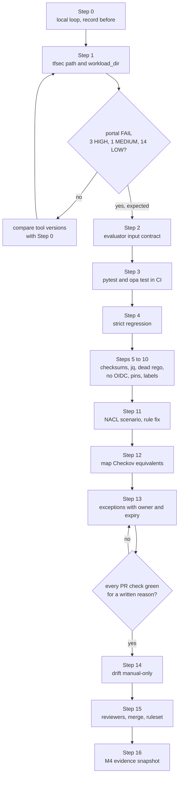

# Phase 4: Pipeline honest-green

> **Sessions:** 4 sessions: Thu 2026-10-29, Tue 2026-11-03, Thu 2026-11-05, Tue 2026-11-10, about 2 h each · **Milestone:** M4 honest green
> **You need:** Phases 0–3 done (M3 reached: zero empty files, `policy-check.yml` and the committed `tfplan.binary` deleted, `evidence/` in `.gitignore`).
> **Every number in this playbook was measured.** The planning session applied each fix to a scratch copy of `53b0532` (`<scratch>/tree-P4`, a `git archive` plus `git init`) and ran it against real Terraform 1.7.5 plans with the same tool versions as CI. Nothing in the repository was changed. The diffs below are *proposals*: you type them in yourself, one step at a time, so you can explain every line.

---

## 1. Goal

Make CI green **because the gate works**: every scanner's output is counted or the run fails, the tests run in CI, the negative test can go red, no cloud credentials are used, and every non-LOW finding on ayka-portal is fixed or written down as an exception.

## 2. Why this phase / why now

Today your pipeline is green, and the green is partly false. Run #68 ([link](https://github.com/Ayush-cloud06/Ayka-Secure-Technologies-GmbH/actions/runs/32621618951)) passed ayka-portal with 14 LOW findings, but tfsec's findings were never read: the wrapper writes them to `output/tfsec-result` and then creates an empty `output/tfsec-result.json` for the evaluator (`Internal-IT/engineering/ci-cd/scripts/run-tfsec.sh:13-19`). Your evaluator is fail-closed on a *missing* file (`evaluate-results.sh:13-18`), and the wrapper defeats that by inventing the file. [../how-it-works.md](../how-it-works.md) §4 explains the mechanism; [../research/pipeline.md](../research/pipeline.md) §3 lists all 29 issues (F1–F29).

**Your original expectation, "ayka-portal = PASS with LOW findings only", held only because tfsec findings were dropped.** With the tfsec path fixed and nothing else changed, ayka-portal becomes **FAIL: HIGH 3 / MEDIUM 1 / LOW 14** (measured). That's not a regression. It's the truth becoming visible. Your target is not "green again at any price": it's PASS or APPROVAL_REQUIRED **with every non-LOW finding fixed in Terraform or excepted with a written reason, an owner and an expiry date** ([ADR-0014](../adr/0014-control-mapping-changes-reviewed.md)). Lowering a severity to get green is the one move this phase forbids.

> **Mentor note: why this order.** The steps follow risk, highest first:
> 1. **Findings that are silently lost** (tfsec). A gate that can't see can't decide.
> 2. **Inputs that are silently wrong** (Checkov `parsing_errors`, empty OPA output, unmapped findings at LOW).
> 3. **Tests that don't run.** They protect nothing until CI runs them.
> 4. **A negative test that can't fail.** The planning session showed that a strict regression check would have gone red on run #68's data: all five expected controls were missing their tfsec report. **The tfsec bug would have been caught on day one.**
> 5. Then evidence integrity, small bugs, dead code, credentials, pinning, labels, the missing NACL scenario and the known blind spots.
>
> Fix the gate's *eyes* before its *manners*.

This phase implements these decisions: [ADR-0011](../adr/0011-fail-closed-scanner-contract.md) (scanner contract, unmapped findings at least MEDIUM), [ADR-0012](../adr/0012-tests-run-in-ci.md) (tests in CI), [ADR-0013](../adr/0013-no-cloud-creds-for-plan-only.md) (no cloud credentials for plan-only work), [ADR-0014](../adr/0014-control-mapping-changes-reviewed.md) (mapping and exceptions are reviewed), [ADR-0015](../adr/0015-pin-tool-versions.md) (pin tools), [ADR-0008](../adr/0008-drift-manual-only.md) (drift manual-only), [ADR-0006](../adr/0006-honesty-labelling.md) (label simulations) and [ADR-0009](../adr/0009-governance-links-evidence.md) (evidence you can link to). If you rejected one of them, skip or adapt its step.

### What the numbers will do (all measured on real plans)

Format: decision, HIGH / MEDIUM / LOW (total findings). "Probe" is a plan built to slip past the gate (Step 12); it is optional.

| After step | ayka-portal | control-validation-scenarios | Probe (optional) |
|---|---|---|---|
| Before (= run #68, `53b0532`) | **PASS** 0 / 0 / 14 (checkov 14) | FAIL 4 / 8 / 17 (29: checkov 23, opa 6) | **PASS** 0 / 0 / 16 |
| 1 tfsec path + `workload_dir` | **FAIL** 3 / 1 / 14 (tfsec 4, 3 unmapped HIGH) | FAIL 17 / 16 / 21 (54: +25 tfsec) | FAIL 5 / 0 / 17 |
| 2 input contract + unmapped at least MEDIUM | FAIL 3 / 1 / 14 | FAIL 17 / 27 / 10 (11 unmapped LOW → MEDIUM) | FAIL 5 / 15 / 2 |
| 7 dead `OPA/aws` removed | unchanged | unchanged (6 → 4 OPA namespaces) | unchanged |
| 11 NACL scenario + NACL rule fix | unchanged | FAIL 18 / 35 / 10 (63; plan 8 to add) | — |
| 12 Checkov equivalents mapped | FAIL 3 / 1 / 14 | FAIL 20 / 33 / 10 (63) | FAIL 9 / 11 / 2 (IAM wildcard now caught) |
| 13 triage with an exceptions list | **PASS** 0 / 0 / 14, 4 excepted | FAIL 20 / 33 / 10 | — |

The regression expectations after Phase 4: the scenarios **FAIL** with HIGH findings from `EC2_OPEN_SSH`, `EC2_MISSING_IMDSV2`, `S3_PUBLIC_ACCESS`, `EC2_PUBLIC_EGRESS`, `EC2_ROOT_VOLUME_UNENCRYPTED` and `NETWORK_ACL_UNRESTRICTED_INGRESS`, each reported by the tools listed in `expected-controls.txt` (Step 4).

## 3. Before you start

**Prerequisites**

- M3 reached ([phase-3-prune.md](phase-3-prune.md)). In particular: `.github/workflows/policy-check.yml` is gone (otherwise actionlint keeps one error), `control-validation-scenarios/tfplan.binary` is gone (otherwise every local plan overwrites a tracked file), and `evidence/` is in `.gitignore`.
- Your Phase 0 baseline table and the run #68 artifacts in `~/ayka-evidence/run-68/`.
- Your answer to **Q9** (unmapped-finding policy) and **Q10** (environment reviewers) in [../risks-and-open-questions.md](../risks-and-open-questions.md). This playbook uses the defaults: unmapped = at least MEDIUM, and you become the reviewer.
- Phase 1 has dealt with the AWS role itself ([ADR-0013](../adr/0013-no-cloud-creds-for-plan-only.md) splits the work: the role in Phase 1, the YAML here).

**Tools** (the same pinned set as [Phase 0 §3](phase-0-orient.md#3-before-you-start); that block also covers macOS). Two additions for this phase: `actionlint` and pinned `pytest`/`pyyaml`.

| Tool | Version | Used for |
|---|---|---|
| terraform | 1.7.5 | plans |
| tflint | v0.53.0 | validate step |
| tfsec | v1.28.14 | source scan |
| conftest | v0.45.0 (bundles OPA 0.56.0) | policy scan |
| opa | 0.56.0 | `opa test` (the same engine as conftest) |
| checkov | 3.3.20 (via pipx) | plan scan |
| pytest, pyyaml | 9.1.1, 6.0.1 | evaluator tests |
| jq | 1.6 or newer | reading summaries |
| actionlint | 1.7.7 | workflow lint |

Linux x86_64 install, checksums verified (skip what Phase 0 already installed):

```bash
mkdir -p ~/.local/bin ~/ayka-tools && cd ~/ayka-tools && export PATH="$HOME/.local/bin:$PATH"

curl -fsSLO https://releases.hashicorp.com/terraform/1.7.5/terraform_1.7.5_linux_amd64.zip
echo "3ff056b5e8259003f67fd0f0ed7229499cfb0b41f3ff55cc184088589994f7a5  terraform_1.7.5_linux_amd64.zip" | sha256sum -c -
unzip -o terraform_1.7.5_linux_amd64.zip terraform -d ~/.local/bin

curl -fsSLO https://github.com/terraform-linters/tflint/releases/download/v0.53.0/tflint_linux_amd64.zip
echo "bb0a3a6043ea1bcd221fc95d49bac831bb511eb31946ca6a4050983e9e584578  tflint_linux_amd64.zip" | sha256sum -c -
unzip -o tflint_linux_amd64.zip tflint -d ~/.local/bin

curl -fsSLO https://github.com/aquasecurity/tfsec/releases/download/v1.28.14/tfsec-linux-amd64
echo "a32d0799bbefababaa4fcd814da9f4d251cd932789590b99d1d5fcb89ace6f68  tfsec-linux-amd64" | sha256sum -c -
install -m 0755 tfsec-linux-amd64 ~/.local/bin/tfsec

curl -fsSLO https://github.com/open-policy-agent/conftest/releases/download/v0.45.0/conftest_0.45.0_Linux_x86_64.tar.gz
echo "65edcf630f5cd2142138555542f10f8cbc99588e5dfcefbfa1e8074c7cc82c23  conftest_0.45.0_Linux_x86_64.tar.gz" | sha256sum -c -
tar -xzf conftest_0.45.0_Linux_x86_64.tar.gz conftest && install -m 0755 conftest ~/.local/bin/

curl -fsSLO https://github.com/open-policy-agent/opa/releases/download/v0.56.0/opa_linux_amd64_static
echo "623771025227588898af1788998d5b5f29068a887682cd8b8e9699136d4cf121  opa_linux_amd64_static" | sha256sum -c -
install -m 0755 opa_linux_amd64_static ~/.local/bin/opa

curl -fsSLO https://github.com/rhysd/actionlint/releases/download/v1.7.7/actionlint_1.7.7_linux_amd64.tar.gz
echo "023070a287cd8cccd71515fedc843f1985bf96c436b7effaecce67290e7e0757  actionlint_1.7.7_linux_amd64.tar.gz" | sha256sum -c -
tar -xzf actionlint_1.7.7_linux_amd64.tar.gz actionlint && install -m 0755 actionlint ~/.local/bin/

pipx install checkov==3.3.20            # needs pipx: sudo apt-get install -y pipx && pipx ensurepath
sudo apt-get install -y jq               # Ubuntu 24.04 ships jq 1.7
```

The hashes above are the ones published on each release page; the planning session downloaded them on 2026-09-28 and they matched the binaries it used.

Check the versions:

```bash
terraform version | head -1; tflint --version | head -1; tfsec --version | tail -1
conftest --version; opa version | head -1; checkov --version; actionlint --version | head -1; jq --version
```

Expected: `Terraform v1.7.5`, `TFLint version 0.53.0`, `v1.28.14`, `Conftest: 0.45.0` / `OPA: 0.56.0`, `Version: 0.56.0`, `3.3.20`, `1.7.7`, `jq-1.7` (or 1.6).

**Branch strategy for the whole phase.** Do all of Phase 4 on one branch and one pull request. `main` keeps its last green run (#68) until the PR merges, and the PR's history becomes evidence in its own right: you can show the exact commit where ayka-portal turned red and the commit where it turned green again for a *documented* reason.

```bash
cd ~/src/Ayka-Secure-Technologies-GmbH
git switch main && git pull --ff-only
git switch -c fix/phase-4-honest-green
python3 -m venv .venv && . .venv/bin/activate && pip install -q pytest==9.1.1 pyyaml==6.0.1
```

## 4. Steps

Sessions: **S1** = Steps 0–1 · **S2** = Steps 2–3 · **S3** = Steps 4–10 · **S4** = Steps 11–16. Each step ends with a commit and a push.

---

### Step 0: Build your local loop and record "before" (S1, 20 min)

You'll run the whole gate locally many times. Put the CI order into one script **outside the repository** (it's your tool, not part of the project). It is the same order as the `compliance` job: validate, plan, Checkov, tfsec, OPA, decision.

```bash
cat > ~/ayka-chain.sh <<'EOF'
#!/bin/bash
# ayka-chain.sh <workload_dir>: run the gate locally in the same order as CI.
set -uo pipefail
WL="${1:?usage: ayka-chain.sh <workload_dir>}"
cd "$(git rev-parse --show-toplevel)" || exit 1
S=Internal-IT/engineering/ci-cd/scripts
# Plan-only: never use your real AWS login, even by accident (ADR-0013).
mockenv() {
  env -u AWS_SESSION_TOKEN -u AWS_PROFILE AWS_ACCESS_KEY_ID=mock AWS_SECRET_ACCESS_KEY=mock \
    AWS_CONFIG_FILE=/dev/null AWS_SHARED_CREDENTIALS_FILE=/dev/null AWS_EC2_METADATA_DISABLED=true "$@"
}
rm -rf output evidence && mkdir -p output
echo "== 1 validate"
terraform fmt -check -recursive "$WL" || exit 1
terraform -chdir="$WL" init -backend=false -input=false > /dev/null || exit 1
terraform -chdir="$WL" validate -no-color || exit 1
echo "== 2 plan"
mockenv terraform -chdir="$WL" plan -input=false -refresh=false -no-color -out=tfplan.binary | grep -E '^Plan:' || exit 1
terraform -chdir="$WL" show -json tfplan.binary > output/tfplan.json && mv "$WL/tfplan.binary" output/tfplan.binary
echo "== 3 checkov"; bash "$S/run-checkov.sh" > /dev/null 2> output/checkov.stderr.log || exit 1
echo "== 4 tfsec";   WORKLOAD_DIR="$WL" bash "$S/run-tfsec.sh" > /dev/null 2>&1 || { echo "tfsec wrapper failed"; exit 1; }
echo "== 5 opa";     bash "$S/run-policy-check.sh" > /dev/null || exit 1
echo "== 6 decide";  bash "$S/evaluate-results.sh" > output/evaluate.log 2>&1; echo "evaluator exit code: $?"
jq -c '{decision, totals, by_tool: (.by_tool | map_values(.total_findings)), excepted: .decision_basis.excepted_findings}' \
  output/compliance-summary.json 2> /dev/null || tail -3 output/evaluate.log
EOF
chmod +x ~/ayka-chain.sh
~/ayka-chain.sh Internal-IT/workloads/ayka-portal
~/ayka-chain.sh Internal-IT/workloads/control-validation-scenarios
```

- **Files touched:** `~/ayka-chain.sh` (outside the repo); `output/` in the repo (ignored by `.gitignore:39`).
- **Expected output** (measured with this exact script on `53b0532`):

  ```text
  Plan: 87 to add, 0 to change, 0 to destroy.
  evaluator exit code: 0
  {"decision":"pass","totals":{"HIGH":0,"MEDIUM":0,"LOW":14},"by_tool":{"checkov":14},"excepted":null}
  Plan: 6 to add, 0 to change, 0 to destroy.
  evaluator exit code: 1
  {"decision":"fail","totals":{"HIGH":4,"MEDIUM":8,"LOW":17},"by_tool":{"checkov":23,"opa":6},"excepted":null}
  ```

  These are run #68's numbers. The script passes `WORKLOAD_DIR` for the scenarios, but today's wrapper drops tfsec findings anyway, so it makes no difference yet.
- **If this fails:** numbers differ → compare `checkov --version` and `conftest --version` with section 3 first (Phase 0 Step 7 lists the other causes). `No valid credential sources found` → you ran `terraform plan` yourself without the `mockenv` wrapper. `tfsec wrapper failed` → `tfsec` isn't on your `PATH`.

**The full local run order, before and after this phase.** Keep this table open; you'll compare against it after each step.

| # | Step | Command | Expected before (`53b0532`) | Expected after Phase 4 |
|---|---|---|---|---|
| 1 | Validate | `terraform fmt -check -recursive $WL`; `init -backend=false`; `validate`; `(cd $WL && tflint --recursive)` | all pass, 0 TFLint issues | same |
| 2a | Plan portal | `~/ayka-chain.sh Internal-IT/workloads/ayka-portal` (step 2) | `Plan: 87 to add` | same |
| 2b | Plan scenarios | same script, scenarios | `Plan: 6 to add` (only with mock env credentials) | `Plan: 8 to add` (NACL scenario adds a VPC and a NACL) |
| 3 | Checkov | `bash …/run-checkov.sh` | portal 14 failed, scenarios 23 failed | portal 14, scenarios 30 |
| 4 | tfsec | `WORKLOAD_DIR=$WL bash …/run-tfsec.sh` | real results in `output/tfsec-result` (portal 4, scenarios 25), evaluator reads the 15-byte fallback `{"results":[]}` | only `output/tfsec-result.json`: portal 4, scenarios 26 results |
| 5 | OPA | `bash …/run-policy-check.sh` | 6 namespaces (2 dead); portal 0, scenarios 6 failures | 4 namespaces; portal 0, scenarios 7 failures |
| 6a | Decide portal | `bash …/evaluate-results.sh` | PASS 0/0/14, exit 0 | PASS 0/0/14, **4 excepted** with reasons, exit 0 (FAIL 3/1/14 between Steps 1 and 13) |
| 6b | Decide scenarios | same | FAIL 4/8/17, exit 1 | FAIL 20/33/10, exit 1 |
| 7 | Regression check | `bash …/check-regression.sh` (new, Step 4) | doesn't exist; CI only printed `SUCCESS` or `WARNING` (`test.yml:94-98`) | `Negative test verified: every expected control was reported by every expected tool.` |
| 8 | Evaluator tests | `python3 -m pytest -q tests/` | `5 passed` | `21 passed, 1 skipped` |
| 9 | Policy tests | `opa test -v Internal-IT/engineering/policy-as-code/OPA` | 0 tests | `PASS: 4/4` |
| 10 | Workflow lint | `actionlint .github/workflows/*.yml` | 1 error left after Phase 3 (`terraform-workflow.yml:2`) | no output, exit 0 |

---

### Step 1: Fix the tfsec output path, remove the fallback, pass `workload_dir` (F1, F3) (S1, 50 min)

**Why.** Two bugs stack up here ([../research/pipeline.md](../research/pipeline.md) F1, F3):

- **F1:** `tfsec --out output/tfsec-result` writes exactly that file name. The script then checks for `tfsec-result.json`, doesn't find it, and writes `{"results":[]}` (`run-tfsec.sh:13-19`). Every tfsec finding in every run was dropped.
- **F3:** the check action takes no directory (`.github/actions/check/action.yml:26-28`), so `run-tfsec.sh:9` falls back to ayka-portal. The regression job inherits `WORKLOAD_DIR=ayka-portal` from `test.yml:13`, so the *scenarios* were never tfsec-scanned at all.

The fix follows [ADR-0011](../adr/0011-fail-closed-scanner-contract.md) rule 1 and 4: write to the file the evaluator reads, never create a result file after a failure, and require the target directory.

**1a. The wrapper** (proposed diff; `COMPLIANCE_OUTPUT_DIR` mirrors the variable `evaluate-results.py:12` already uses, so the test in 1c can redirect output):

```diff
--- a/Internal-IT/engineering/ci-cd/scripts/run-tfsec.sh
+++ b/Internal-IT/engineering/ci-cd/scripts/run-tfsec.sh
@@ -1,21 +1,29 @@
 #!/bin/bash
-set -e
+set -euo pipefail

 echo "Running tfsec..."

 cd "$(git rev-parse --show-toplevel)"

-OUTPUT_DIR="$(git rev-parse --show-toplevel)/output"
-TARGET_DIR="${WORKLOAD_DIR:-Internal-IT/workloads/ayka-portal}"
+OUTPUT_DIR="${COMPLIANCE_OUTPUT_DIR:-$(git rev-parse --show-toplevel)/output}"
+RESULT_FILE="$OUTPUT_DIR/tfsec-result.json"
+TARGET_DIR="${WORKLOAD_DIR:?WORKLOAD_DIR must be set by the calling action}"
 mkdir -p "$OUTPUT_DIR"
+rm -f "$RESULT_FILE" "$OUTPUT_DIR/tfsec-result"

-# Run tfsec but do not fail here; gating happens in evaluate-results.sh
-tfsec "$TARGET_DIR" \
-  --format json \
-  --out "$OUTPUT_DIR/tfsec-result" || true
+if [ ! -d "$TARGET_DIR" ]; then
+  echo "tfsec target directory not found: $TARGET_DIR" >&2
+  exit 1
+fi
+
+# tfsec exits 1 when it finds problems. Gating happens in evaluate-results.py,
+# so a non-zero exit is not an error by itself. The file check below is the guard.
+tfsec "$TARGET_DIR" --format json --no-colour --out "$RESULT_FILE" || true

-if [ ! -f "$OUTPUT_DIR/tfsec-result.json" ]; then
-  echo '{"results":[]}' > "$OUTPUT_DIR/tfsec-result.json"
+# Fail closed: no fallback file. The result must exist and hold a results list.
+if ! jq -e '.results | type == "array"' "$RESULT_FILE" > /dev/null 2>&1; then
+  echo "tfsec did not write a valid results list to $RESULT_FILE" >&2
+  exit 1
 fi

-echo "tfsec scan complete"
+echo "tfsec scan complete: $(jq '.results | length' "$RESULT_FILE") finding(s) in $TARGET_DIR"
```

> **Why keep `|| true` on the tfsec line?** tfsec v1.28.14 exits 1 both when it *finds problems* and when it *can't run* (for example a missing folder). The exit code can't tell them apart, so it isn't the guard. The guard is "did it write a valid `results` list to the exact file the evaluator reads?" On a clean folder tfsec writes `{"results": []}` and exits 0 (measured), which correctly passes the check.

**1b. Pass the directory** into the check action and from both callers:

```diff
--- a/.github/actions/check/action.yml
+++ b/.github/actions/check/action.yml
@@ -1,6 +1,11 @@
 name: 'Security Check'
 description: 'Install and run static analysis tools (Checkov, tfsec)'

+inputs:
+  workload_dir:
+    description: 'Terraform workload directory that tfsec scans'
+    required: true
+
 runs:
@@ -25,5 +30,7 @@ runs:
     - name: Run tfsec
       shell: bash
+      env:
+        WORKLOAD_DIR: ${{ inputs.workload_dir }}
       run: bash Internal-IT/engineering/ci-cd/scripts/run-tfsec.sh
```

```diff
--- a/.github/workflows/terraform-workflow.yml
+++ b/.github/workflows/terraform-workflow.yml
@@ -86,2 +86,4 @@
       - name: Security Check
         uses: ./.github/actions/check
+        with:
+          workload_dir: ${{ inputs.workload_dir }}
--- a/.github/workflows/test.yml
+++ b/.github/workflows/test.yml
@@ -67,2 +67,4 @@
       - name: Security Check (Regression)
         uses: ./.github/actions/check
+        with:
+          workload_dir: ${{ env.REGRESSION_DIR }}
```

**1c. A test for the wrapper** ([ADR-0012](../adr/0012-tests-run-in-ci.md): "`run-tfsec.sh` with a fake `tfsec` on `PATH`"). Create `tests/compliance/test_run_tfsec.py`:

```python
import os
import subprocess
import tempfile
import unittest
from pathlib import Path

REPO_ROOT = Path(__file__).resolve().parents[2]
SCRIPT = REPO_ROOT / "Internal-IT/engineering/ci-cd/scripts/run-tfsec.sh"


class RunTfsecWrapperTests(unittest.TestCase):
    """The wrapper must never invent an empty result (ADR-0011)."""

    def run_wrapper(self, fake_tfsec_body, workload_dir="Internal-IT/workloads/ayka-portal"):
        with tempfile.TemporaryDirectory() as tmp:
            tmp = Path(tmp)
            bin_dir = tmp / "bin"
            bin_dir.mkdir()
            fake = bin_dir / "tfsec"
            fake.write_text("#!/bin/bash\n" + fake_tfsec_body + "\n")
            fake.chmod(0o755)
            out = tmp / "output"
            env = os.environ.copy()
            env["PATH"] = f"{bin_dir}:{env['PATH']}"
            env["COMPLIANCE_OUTPUT_DIR"] = str(out)
            env.pop("WORKLOAD_DIR", None)
            if workload_dir:
                env["WORKLOAD_DIR"] = workload_dir
            result = subprocess.run(["bash", str(SCRIPT)], cwd=REPO_ROOT, env=env,
                                    capture_output=True, text=True)
            written = (out / "tfsec-result.json").read_text() if (out / "tfsec-result.json").exists() else None
            return result, written

    def test_tfsec_writes_nothing_fails_closed(self):
        result, written = self.run_wrapper("exit 1")
        self.assertEqual(result.returncode, 1, result.stdout + result.stderr)
        self.assertIsNone(written, "the wrapper must not create a fallback file")

    def test_findings_are_kept(self):
        # Parse --out like the real tfsec and write one finding there.
        body = 'while [ $# -gt 0 ]; do [ "$1" = "--out" ] && out="$2"; shift; done\n' \
               'echo \'{"results":[{"rule_id":"AVD-AWS-0107","severity":"HIGH"}]}\' > "$out"; exit 1'
        result, written = self.run_wrapper(body)
        self.assertEqual(result.returncode, 0, result.stdout + result.stderr)
        self.assertIn("AVD-AWS-0107", written)

    def test_missing_workload_dir_fails_closed(self):
        result, written = self.run_wrapper("exit 0", workload_dir=None)
        self.assertNotEqual(result.returncode, 0)
        self.assertIsNone(written)


if __name__ == "__main__":
    unittest.main()
```

**Run it:**

```bash
python3 -m pytest -q tests/
WORKLOAD_DIR=Internal-IT/workloads/ayka-portal bash Internal-IT/engineering/ci-cd/scripts/run-tfsec.sh | tail -1
ls output/ | grep tfsec
~/ayka-chain.sh Internal-IT/workloads/ayka-portal
~/ayka-chain.sh Internal-IT/workloads/control-validation-scenarios
git add -A && git commit        # message: section 8, Step 1
git push -u origin fix/phase-4-honest-green
gh pr create --draft --base main --title "Phase 4: pipeline honest-green" \
  --body "Restoration plan Phase 4 (docs/restore-plan/05-phase-playbooks/phase-4-pipeline-green.md). Expect ayka-portal to go red after the tfsec fix and green again after triage."
```

- **Files touched:** `Internal-IT/engineering/ci-cd/scripts/run-tfsec.sh`, `.github/actions/check/action.yml`, `.github/workflows/terraform-workflow.yml`, `.github/workflows/test.yml`, `tests/compliance/test_run_tfsec.py` (new).
- **Expected output:**
  - `pytest`: `8 passed` (5 old + 3 new). Against the *old* wrapper all 3 new tests fail (measured), which proves they test the bug.
  - The wrapper prints `tfsec scan complete: 4 finding(s) in Internal-IT/workloads/ayka-portal`; `ls` shows only `tfsec-result.json`.
  - Portal: `evaluator exit code: 1` and `{"decision":"fail","totals":{"HIGH":3,"MEDIUM":1,"LOW":14},"by_tool":{"checkov":14,"tfsec":4},…}`.
  - Scenarios: `{"decision":"fail","totals":{"HIGH":17,"MEDIUM":16,"LOW":21},"by_tool":{"checkov":23,"opa":6,"tfsec":25},…}`.
  - On GitHub (the push still triggers CI, `test.yml:3-5`): the `compliance / compliance` job goes **red** at "Compliance Decision" with HIGH 3. That's expected. The regression job stays green.
- **If this fails:**
  - `jq: command not found` in the wrapper → install jq (GitHub runners have it).
  - `WORKLOAD_DIR must be set` in CI → a caller is missing the `with: workload_dir:` lines from 1b.
  - Portal shows 5 or more tfsec findings → your tfsec version differs, or you ran it on a folder that contains a `.terraform/` with downloaded modules. Check `tfsec --version`.
  - The fake-tfsec test fails with "Permission denied" → your `/tmp` is mounted `noexec`; set `TMPDIR=$HOME/tmp` for the test run.

**Safe stopping point (end of S1).** The branch is pushed and the draft PR shows the portal red for a known reason. Nothing on `main` changed.

---

### Step 2: Evaluator input contract and unmapped findings at least MEDIUM (F5, F6) (S2, 60 min)

**Why.** The evaluator trusts whatever JSON it gets ([../research/pipeline.md](../research/pipeline.md) F5, F6; [../research/codex.md](../research/codex.md) §3 row 3):

- Checkov run on a **missing** plan exits 0 with `failed_checks: []` and a `parsing_errors` list; `normalize_checkov` only reads `failed_checks` (`evaluate-results.py:220-222`), so the decision is **pass**.
- Checkov on a plan with no resources writes a summary-only object with no `results` key → pass.
- tfsec `{}` → pass; OPA `[]` → pass.
- An unmapped Checkov finding keeps the scanner's severity, which open-source Checkov leaves empty, and `normalize_severity` turns empty into LOW (`evaluate-results.py:48-54`, `:137-148`). So an unknown check can never block. This is why the probe plan with public SSH passes today.

[ADR-0011](../adr/0011-fail-closed-scanner-contract.md) decides: validate every input's shape before deciding, and floor unmapped findings at MEDIUM, meaning `max(scanner severity, MEDIUM)`. A tfsec HIGH stays HIGH; an unknown LOW becomes "a human must look". It also asks that `by_tool` always lists all three tools, so a reviewer can see that tfsec ran even when it found nothing.

**Proposed diff** (`Internal-IT/engineering/ci-cd/scripts/evaluate-results.py`):

```diff
@@ imports / constants (after line 29) @@
 OPA_CONTROL_PREFIX = re.compile(r"^\[(?P<control_id>[A-Z0-9_]+)\]\s*(?P<message>.*)$")
+TOOLS = ("checkov", "opa", "tfsec")
+# ADR-0011: a finding nobody has mapped yet is at least MEDIUM, so a human sees it.
+UNMAPPED_MIN_SEVERITY = "MEDIUM"
+SEVERITY_ORDER = ["LOW", "MEDIUM", "HIGH"]
@@ new helpers (after normalize_severity, line 54) @@
+def at_least(severity, floor):
+    return max(severity, floor, key=SEVERITY_ORDER.index)
+
+
+def reject_input(tool, reason):
+    print(f"Invalid {tool} result: {reason}", file=sys.stderr)
+    sys.exit(1)
+
+
+def validate_checkov(data):
+    if not isinstance(data, dict) or not isinstance(data.get("results"), dict):
+        reject_input("checkov", "no 'results' object (summary-only output means nothing was scanned)")
+    results = data["results"]
+    if not isinstance(results.get("failed_checks"), list):
+        reject_input("checkov", "'results.failed_checks' is missing or not a list")
+    if results.get("parsing_errors"):
+        reject_input("checkov", f"parsing_errors: {results['parsing_errors']}")
+
+
+def validate_tfsec(data):
+    if not isinstance(data, dict) or not isinstance(data.get("results"), list):
+        reject_input("tfsec", "'results' is missing or not a list")
+
+
+def validate_opa(data, opa_package_index):
+    if isinstance(data, dict) and data.get("status") == "error":
+        return  # handled by normalize_opa with the full error payload
+    if not isinstance(data, list) or not data:
+        reject_input("opa", "expected a non-empty list of namespace results")
+    seen = {item.get("namespace") for item in data if isinstance(item, dict)}
+    missing = sorted(set(opa_package_index) - seen)
+    if missing:
+        reject_input("opa", f"no result for mapped policy packages: {missing}")
@@ resolve_scanner_mapping, unmapped branch (line 144) @@
-            "severity": normalize_severity(fallback_severity),
+            "severity": at_least(normalize_severity(fallback_severity), UNMAPPED_MIN_SEVERITY),
@@ build_metadata_coverage (line 364) @@
-    for tool in sorted({finding["tool"] for finding in findings}):
+    for tool in sorted(set(TOOLS) | {finding["tool"] for finding in findings}):
@@ build_summary (line 386-387) @@
-def build_summary(findings):
-    by_tool_groups = defaultdict(list)
+def build_summary(findings):
+    by_tool_groups = {tool: [] for tool in TOOLS}  # ADR-0011: every scanner is listed, even with 0 findings
@@ main (after build_control_indexes, line 438) @@
+    validate_checkov(checkov_data)
+    validate_tfsec(tfsec_data)
+    validate_opa(opa_data, opa_package_index)
+
```

> **Why "expected packages" comes from the mapping file.** ADR-0011 wants every OPA package (`aws_ec2`, `aws_s3`, `aws_iam`, `aws_vpc`) to appear in conftest's output, which proves the policies were loaded. Instead of hard-coding four names, the check uses the `policy_package` values that `control-mapping.yaml` already declares (`build_control_indexes`, `evaluate-results.py:91-97`). If someone points conftest at the wrong folder, or a package stops loading, the run stops with the package name in the error.

Also remove the unused variable shellcheck reports (`evaluate-results.sh:11`, `SUMMARY_FILE`, SC2034):

```diff
--- a/Internal-IT/engineering/ci-cd/scripts/evaluate-results.sh
+++ b/Internal-IT/engineering/ci-cd/scripts/evaluate-results.sh
@@ -10,2 +10,1 @@
 TFSEC_FILE="$OUTPUT_DIR/tfsec-result.json"
-SUMMARY_FILE="$OUTPUT_DIR/compliance-summary.json"
```

**Tests.** Tightening input checks breaks fixtures that were "too easy": four of the five existing tests pass `opa=[]`, which is now rejected (measured: 4 failed, 1 passed). Fix the fixtures, not the check. In `tests/compliance/test_evaluate_results.py`:

1. Above the class, add realistic clean inputs and replace every `opa=[]` with `opa=OPA_CLEAN`:

   ```python
   # A clean conftest result for the one policy package the test mapping uses.
   OPA_CLEAN = [
       {"filename": "output/tfplan.json", "namespace": "policies.terraform.aws_ec2", "successes": 1}
   ]
   CHECKOV_CLEAN = {"results": {"failed_checks": [], "parsing_errors": []}}
   TFSEC_CLEAN = {"results": []}
   ```

2. In `test_unmapped_opa_finding_defaults_to_medium_and_requires_approval`, change `opa=[` to `opa=OPA_CLEAN + [` so the mapped `aws_ec2` package is present.
3. **Rename and change** `test_unmapped_tfsec_finding_uses_scanner_severity` to `test_unmapped_tfsec_low_finding_is_raised_to_medium`: expect exit 0, `decision == "approval_required"`, `totals.MEDIUM == 1`, finding severity `MEDIUM`. Changing an existing assertion is correct here because the test encoded the *old policy*, and ADR-0011 changes the policy on purpose. Say so in the commit message.
4. Add eight tests (write them yourself from these outlines, each is 5–10 lines using `self.run_case`):

   | Test | Input | Expect |
   |---|---|---|
   | `test_unmapped_checkov_finding_without_severity_needs_approval` | checkov `CKV_AWS_24` with `"severity": None` | exit 0, `approval_required`, severity MEDIUM |
   | `test_unmapped_tfsec_high_finding_stays_high` | tfsec `AVD-AWS-0053`, HIGH | exit 1, `fail` |
   | `test_checkov_parsing_errors_fail_closed` | `{"results": {"failed_checks": [], "parsing_errors": ["output/tfplan.json"]}}` | exit 1, no summary file, stderr contains `parsing_errors` |
   | `test_checkov_summary_only_output_fails_closed` | `{"passed": 0, "failed": 0, "skipped": 0, "parsing_errors": 0, "resource_count": 0}` | exit 1, no summary |
   | `test_tfsec_without_results_list_fails_closed` | tfsec `{}` | exit 1, `Invalid tfsec result` |
   | `test_empty_opa_list_fails_closed` | opa `[]` | exit 1, `Invalid opa result` |
   | `test_opa_without_mapped_package_fails_closed` | opa `[{"namespace": "policies.aws.s3", "successes": 1}]` | exit 1, stderr names `policies.terraform.aws_ec2` |
   | `test_all_three_tools_listed_even_without_findings` | all clean | `sorted(summary["by_tool"]) == ["checkov", "opa", "tfsec"]` |

   A shared helper keeps the four rejection tests short:

   ```python
   def assert_rejected(self, *, checkov, tfsec, opa, message):
       result, summary = self.run_case(checkov=checkov, tfsec=tfsec, opa=opa)
       self.assertEqual(result.returncode, 1, result.stderr)
       self.assertIsNone(summary, "no summary may be written for rejected input")
       self.assertIn(message, result.stderr)
   ```

**Run it:**

```bash
python3 -m pytest -q tests/
~/ayka-chain.sh Internal-IT/workloads/ayka-portal
~/ayka-chain.sh Internal-IT/workloads/control-validation-scenarios
echo '{}' > /tmp/empty-plan.json && cp /tmp/empty-plan.json output/tfplan.json \
  && bash Internal-IT/engineering/ci-cd/scripts/run-checkov.sh > /dev/null 2>&1 \
  && bash Internal-IT/engineering/ci-cd/scripts/evaluate-results.sh; echo "exit=$?"
git add -A && git commit && git push
```

- **Files touched:** `Internal-IT/engineering/ci-cd/scripts/evaluate-results.py`, `Internal-IT/engineering/ci-cd/scripts/evaluate-results.sh`, `tests/compliance/test_evaluate_results.py`.
- **Expected output:**
  - `pytest`: `16 passed`.
  - Portal: still `fail` 3/1/14 (the tfsec HIGHs stay HIGH). `by_tool` now reads `{"checkov":14,"opa":0,"tfsec":4}`.
  - Scenarios: `{"decision":"fail","totals":{"HIGH":17,"MEDIUM":27,"LOW":10},…}`: the 11 unmapped LOW findings (9 Checkov, 2 tfsec `AVD-AWS-0094`) are now MEDIUM.
  - Empty plan: `Invalid checkov result: no 'results' object (summary-only output means nothing was scanned)`, `exit=1`.
- **If this fails:**
  - `KeyError: 'tfsec'` in `build_summary` → you kept `defaultdict(list)` somewhere; the dict comprehension replaces it.
  - The OPA check rejects real conftest output → run `jq -r '.[].namespace' output/opa-result.json`. You should see the four `policies.terraform.*` names (plus the two dead `policies.aws.*` ones until Step 7).
  - A test passes locally but not in CI → you are running with a leftover `output/` folder; the tests use temporary folders, so check that `COMPLIANCE_*` variables aren't exported in your shell.

---

### Step 3: Run pytest and `opa test` in CI; first Rego tests (F29) (S2, 40 min)

**Why.** Five good tests existed and never ran in CI: `validate-scripts` only runs `bash -n` (`test.yml:24-33`), and no `*_test.rego` file exists ([../research/pipeline.md](../research/pipeline.md) F29, §5). A test that doesn't run protects nothing. [ADR-0012](../adr/0012-tests-run-in-ci.md) adds a `unit-tests` job that the scans depend on, so a broken evaluator can never produce a decision.

**3a. Pinned test dependencies.** Create `tests/requirements.txt`:

```text
pytest==9.1.1
pyyaml==6.0.1
```

**3b. The job** (in `.github/workflows/test.yml`, after `validate-scripts`):

```diff
+  unit-tests:
+    needs: validate-scripts
+    runs-on: ubuntu-latest
+    steps:
+      - name: Checkout code
+        uses: actions/checkout@b4ffde65f46336ab88eb53be808477a3936bae11 # v4.1.1
+
+      - name: Setup Python
+        uses: actions/setup-python@0a5c61591373683505ea898e09a3ea4f39ef2b9c # v5.0.0
+        with:
+          python-version: "3.11"
+
+      - name: Evaluator and wrapper tests (pytest)
+        run: |
+          pip install -r tests/requirements.txt
+          python3 -m pytest -q tests/
+
+      - name: Policy tests (opa test)
+        run: |
+          # OPA 0.56.0 is the engine inside conftest v0.45.0, so tests and CI agree
+          wget -q https://github.com/open-policy-agent/opa/releases/download/v0.56.0/opa_linux_amd64_static
+          echo "623771025227588898af1788998d5b5f29068a887682cd8b8e9699136d4cf121  opa_linux_amd64_static" | sha256sum -c -
+          chmod +x opa_linux_amd64_static
+          ./opa_linux_amd64_static test -v Internal-IT/engineering/policy-as-code/OPA | tee opa-test.log
+          # opa test exits 0 when it finds no tests at all, so insist on at least one PASS line
+          grep -q '^PASS: [1-9]' opa-test.log
+
   compliance:
-    needs: validate-scripts
+    needs: unit-tests
@@ regression job @@
   regression:
     name: Control Validation Regression
+    needs: unit-tests
     runs-on: ubuntu-latest
```

**3c. First Rego tests.** Put them in a separate folder, `Internal-IT/engineering/policy-as-code/OPA/tests/`, so conftest (which only loads `OPA/terraform` after Step 7) never mixes test packages into its output, while `opa test …/OPA` still finds them. Create `OPA/tests/aws_ec2_test.rego` (v0 syntax like your policies; the v1 migration is Phase 6):

```rego
package policies.terraform.aws_ec2_test

import data.policies.terraform.aws_ec2

# A plan with one child module holding the given resources.
plan(resources) = {"planned_values": {"root_module": {"child_modules": [{"resources": resources}]}}}

open_ssh_sg := {
	"address": "module.x.aws_security_group.bad",
	"type": "aws_security_group",
	"values": {"ingress": [{"from_port": 22, "to_port": 22, "protocol": "tcp", "cidr_blocks": ["0.0.0.0/0"]}]},
}

office_ssh_sg := {
	"address": "module.x.aws_security_group.ok",
	"type": "aws_security_group",
	"values": {"ingress": [{"from_port": 22, "to_port": 22, "protocol": "tcp", "cidr_blocks": ["10.0.0.0/8"]}]},
}

test_open_ssh_is_denied {
	some msg
	aws_ec2.deny[msg] with input as plan([open_ssh_sg])
	startswith(msg, "[EC2_OPEN_SSH]")
}

test_ssh_from_private_range_is_allowed {
	denied := {msg | aws_ec2.deny[msg] with input as plan([office_ssh_sg]); startswith(msg, "[EC2_OPEN_SSH]")}
	count(denied) == 0
}

# Known gap (research/pipeline.md F7): resources in the root module are not inspected.
# This test documents today's behaviour. When you fix the gap, flip it to expect a denial.
test_known_gap_root_module_is_not_inspected {
	root_only := {"planned_values": {"root_module": {"resources": [open_ssh_sg]}}}
	count(aws_ec2.deny) == 0 with input as root_only
}
```

> **A test that "passes because of a bug"?** Yes, on purpose. It's called a *characterisation test*: it pins down what the code does today, including a known gap. The day you fix the gap (Phase 6d), this test fails, and you flip it. Without it, a fix could land silently, and so could a regression.

**3d. Mapping file tests** ([ADR-0014](../adr/0014-control-mapping-changes-reviewed.md)). Create `tests/compliance/test_control_mapping.py`:

```python
from collections import Counter
from pathlib import Path
import unittest

import yaml

MAPPING = Path(__file__).resolve().parents[2] / "Internal-IT/engineering/policy-as-code/metadata/control-mapping.yaml"


class ControlMappingTests(unittest.TestCase):
    """The mapping decides severity, so it is tested like code (ADR-0014)."""

    @classmethod
    def setUpClass(cls):
        cls.controls = yaml.safe_load(MAPPING.read_text(encoding="utf-8"))["controls"]

    def test_every_severity_is_valid(self):
        bad = {cid: c.get("severity") for cid, c in self.controls.items()
               if c.get("severity") not in {"HIGH", "MEDIUM", "LOW"}}
        self.assertEqual(bad, {})

    def test_no_policy_id_maps_to_two_controls(self):
        ids = []
        for control in self.controls.values():
            for enf in [control.get("enforcement", {})] + control.get("additional_enforcements", []):
                if enf.get("policy_id"):
                    ids.append(enf["policy_id"])
        self.assertEqual([i for i, n in Counter(ids).items() if n > 1], [])

    @unittest.skip("enable once every control has a rationale (Step 13)")
    def test_every_control_has_a_rationale(self):
        missing = [cid for cid, c in self.controls.items() if not c.get("rationale")]
        self.assertEqual(missing, [])
```

**Run it:**

```bash
python3 -m pytest -q tests/
opa test -v Internal-IT/engineering/policy-as-code/OPA
actionlint .github/workflows/test.yml
git add -A && git commit && git push
```

- **Files touched:** `.github/workflows/test.yml`, `tests/requirements.txt` (new), `tests/compliance/test_control_mapping.py` (new), `Internal-IT/engineering/policy-as-code/OPA/tests/aws_ec2_test.rego` (new).
- **Expected output:** `pytest`: `18 passed, 1 skipped`. `opa test`: three `PASS` lines and `PASS: 3/3` (measured with `OPA/aws` still present). actionlint prints nothing for `test.yml`. On GitHub a new `unit-tests` job appears and is green; `compliance` and `regression` now wait for it.
- **If this fails:**
  - `opa test` reports `rego_parse_error … contains keyword is required` → you're running OPA 1.x. Use 0.56.0 (`opa version`).
  - `grep -q '^PASS: [1-9]'` fails in CI although tests ran → check the log. OPA prints `PASS: 3/3` on its own line at the end; if every test failed it prints `FAIL:` instead, which is what you want to stop on.
  - `yaml` import error in the `unit-tests` job → `tests/requirements.txt` wasn't committed.

**Safe stopping point (end of S2).** The evaluator is fail-closed on bad inputs, and the tests guard it in CI. The portal is still red for the known tfsec reason.

---

### Step 4: Make the regression job strict, and assert the expected controls (F16) (S3, 25 min)

**Why.** The regression job is your proof that the gate *bites*. Today it can't fail on a missed violation: the decision step has `continue-on-error: true` (`test.yml:76`) and the check only prints `WARNING` when the decision isn't `fail` (`test.yml:94-98`) ([../research/pipeline.md](../research/pipeline.md) F16).

"Decision is fail" isn't enough either. The planning session disabled the SSH scenario on purpose: the decision **stayed `fail`** (other scenarios still fail), so a decision-only check would stay green, but two expectations broke. The stricter check below caught it. And run against run #68's data it reports 5 missing tfsec reports, so it would have caught the tfsec bug.

**4a. The contract.** Create `Internal-IT/workloads/control-validation-scenarios/expected-controls.txt`:

```text
# Negative test contract, read by ci-cd/scripts/check-regression.sh.
# Every line: <control_id> <tools that must report it> <scenario that triggers it>
EC2_OPEN_SSH            opa,tfsec      ec2/open-ssh-security-group
EC2_PUBLIC_EGRESS       checkov,tfsec  ec2/open-ssh-security-group
EC2_MISSING_IMDSV2      opa,tfsec      ec2/no-imdsv2
S3_PUBLIC_ACCESS        opa,tfsec      s3/public-bucket
S3_ENCRYPTION_MISSING   opa,tfsec      s3/missing-encryption
```

**4b. The check.** Create `Internal-IT/engineering/ci-cd/scripts/check-regression.sh` (it lives with the other scripts, so `validate-scripts` checks its syntax and you can run it locally):

```bash
#!/bin/bash
# Negative test: the insecure scenarios MUST be blocked, by the expected controls and tools.
set -euo pipefail
cd "$(git rev-parse --show-toplevel)"

SUMMARY="${COMPLIANCE_SUMMARY_FILE:-output/compliance-summary.json}"
EXPECTED="${EXPECTED_CONTROLS_FILE:-Internal-IT/workloads/control-validation-scenarios/expected-controls.txt}"

if [ ! -f "$SUMMARY" ]; then
  echo "::error::No compliance summary at $SUMMARY"
  exit 1
fi

decision="$(jq -r '.decision' "$SUMMARY")"
echo "Regression decision: $decision"
if [ "$decision" != "fail" ]; then
  echo "::error::Negative test broken: the insecure scenarios were not blocked (decision=$decision)"
  exit 1
fi

missing=0
while read -r control tools _; do
  case "$control" in ''|'#'*) continue ;; esac
  for tool in ${tools//,/ }; do
    if ! jq -e --arg c "$control" --arg t "$tool" \
        '(.by_control[$c].tools // []) | index($t) != null' "$SUMMARY" > /dev/null; then
      echo "::error::$control was not reported by $tool"
      missing=$((missing + 1))
    fi
  done
done < "$EXPECTED"

if [ "$missing" -gt 0 ]; then
  echo "Negative test broken: $missing expected control/tool pair(s) missing."
  exit 1
fi
echo "Negative test verified: every expected control was reported by every expected tool."
```

**4c. Use it in CI** (replace the whole inline script at `test.yml:83-98`; `continue-on-error` on the decision step stays, because the decision step *must* exit 1 for the scenarios):

```diff
       - name: Check Regression Results
         shell: bash
-        run: |
-          DECISION="${{ steps.evaluate_regression.outputs.decision }}"
-          ...
-            echo "WARNING: Regression suite did not return 'fail'. Current decision: $DECISION"
-          fi
-
+        run: bash Internal-IT/engineering/ci-cd/scripts/check-regression.sh
```

**Run it:**

```bash
chmod +x Internal-IT/engineering/ci-cd/scripts/check-regression.sh
~/ayka-chain.sh Internal-IT/workloads/control-validation-scenarios
bash Internal-IT/engineering/ci-cd/scripts/check-regression.sh; echo "rc=$?"
# Prove it would have caught the tfsec bug: run it on run #68's regression summary
COMPLIANCE_SUMMARY_FILE=$(find ~/ayka-evidence/run-68/compliance-evidence-regression -name compliance-summary.json | head -1) \
  bash Internal-IT/engineering/ci-cd/scripts/check-regression.sh; echo "rc=$?"
git add -A && git commit && git push
```

- **Files touched:** `Internal-IT/engineering/ci-cd/scripts/check-regression.sh` (new), `Internal-IT/workloads/control-validation-scenarios/expected-controls.txt` (new), `.github/workflows/test.yml`.
- **Expected output:** first run `Negative test verified …`, `rc=0`. On the run #68 summary: five lines `::error::<CONTROL> was not reported by tfsec`, then `Negative test broken: 5 expected control/tool pair(s) missing.`, `rc=1` (measured on the locally reproduced run #68 summary, which matches CI exactly).
- **If this fails:** `jq: error … index` → jq older than 1.5; upgrade. The run #68 `find` returns nothing → the summary sits under `evidence/raw/<timestamp>/`; `find` searches recursively, so check that you unzipped the regression artifact in Phase 0.

**Optional proof for D5** ([../02-target-state.md](../02-target-state.md#6-definition-of-done-flagship-ready)): on a throwaway branch, remove `"ec2_openssh",` from the `default` list in `control-validation-scenarios/variables.tf:5-11` and push. Measured locally: decision still `fail`, but `::error::EC2_OPEN_SSH was not reported by opa` and `::error::EC2_PUBLIC_EGRESS was not reported by checkov`, `rc=1`. (tfsec still reports them because it reads the source folder, not the plan. That's the difference between the tools in one example.) Delete the branch afterwards.

---

### Step 5: Checksum what you claim to verify (F17, F18) (S3, 20 min)

**Why.** Three gaps ([../research/pipeline.md](../research/pipeline.md) F17, F18; [../how-it-works.md](../how-it-works.md) §5):

- The checksum step has no `if: always()` (`terraform-workflow.yml:96-105`), so a `fail` run has no checksum, and the regression job has no checksum step at all.
- The upload leaves out `output/compliance-summary.json` (`.github/actions/evidence/action.yml:28-32`), so `sha256sum -c --ignore-missing` (`run-apply.sh:14`) silently skips it. Run #68's apply log shows only `output/tfplan.json: OK`.
- `tfplan.binary`, the file a real apply would use, is never hashed.

**The order of the changes matters.** Measured with coreutils 9.4: with the *old* upload list and `--ignore-missing` removed, verification fails (`output/compliance-summary.json: FAILED open or read`, exit 1). So add the file to the upload first, then drop the flag, in the same commit.

Move the checksum into the evidence action, so both jobs get it and it runs on fail runs too (a blocked change is evidence as well):

```diff
--- a/.github/actions/evidence/action.yml
+++ b/.github/actions/evidence/action.yml
@@ -20,6 +20,24 @@ runs:
       run: bash Internal-IT/engineering/ci-cd/scripts/export-evidence.sh

+    - name: Checksum Artifacts
+      if: always()
+      shell: bash
+      run: |
+        mkdir -p evidence
+        # Hash every file the apply job will rely on. A fail run is evidence too.
+        files=""
+        for f in output/tfplan.json output/tfplan.binary output/compliance-summary.json; do
+          [ -f "$f" ] && files="$files $f"
+        done
+        if [ -z "$files" ]; then
+          echo "::warning::Nothing to checksum"
+          exit 0
+        fi
+        # shellcheck disable=SC2086
+        sha256sum $files > evidence/artifacts.sha256
+        cat evidence/artifacts.sha256
+
     - name: Upload Evidence Artifact
@@ -28,5 +46,6 @@ runs:
         path: |
           evidence/
           output/compliance-report.md
+          output/compliance-summary.json
           output/tfplan.json
           output/tfplan.binary
```

Delete the old step `Checksum Artifacts` at `terraform-workflow.yml:96-105`, and make the apply verification strict and honest about what it proves:

```diff
--- a/Internal-IT/engineering/ci-cd/scripts/run-apply.sh
+++ b/Internal-IT/engineering/ci-cd/scripts/run-apply.sh
@@ -14,4 +14,4 @@
-if ! sha256sum -c evidence/artifacts.sha256 --ignore-missing; then
-  echo "Error: Checksum verification failed. Tampering detected."
+if ! sha256sum -c evidence/artifacts.sha256; then
+  echo "Error: integrity check failed; these files differ from the ones that were scanned."
   exit 1
 fi
```

("Tampering detected" over-claims: the hash travels in the same artifact, so this is integrity, not tamper-evidence. [ADR-0011](../adr/0011-fail-closed-scanner-contract.md) and [../interview-prep.md](../interview-prep.md) Q7.)

**Run it** (a local imitation of scan job → artifact → apply job):

```bash
~/ayka-chain.sh Internal-IT/workloads/ayka-portal
mkdir -p evidence && sha256sum output/tfplan.json output/tfplan.binary output/compliance-summary.json > evidence/artifacts.sha256
rm -rf downloaded-evidence && mkdir -p downloaded-evidence/output && cp -r evidence downloaded-evidence/ \
  && cp output/tfplan.json output/tfplan.binary output/compliance-summary.json downloaded-evidence/output/
(cd downloaded-evidence && sha256sum -c evidence/artifacts.sha256); echo "rc=$?"
echo x >> downloaded-evidence/output/tfplan.binary
(cd downloaded-evidence && sha256sum -c evidence/artifacts.sha256); echo "rc=$?"
rm -rf downloaded-evidence evidence
git add -A && git commit && git push
```

- **Files touched:** `.github/actions/evidence/action.yml`, `.github/workflows/terraform-workflow.yml`, `Internal-IT/engineering/ci-cd/scripts/run-apply.sh`.
- **Expected output:** three `OK` lines and `rc=0`; after the edit, `output/tfplan.binary: FAILED`, `WARNING: 1 computed checksum did NOT match`, `rc=1`. On GitHub, both jobs' "Checksum Artifacts" steps print three hashes (the portal job fails earlier until Step 13, and the step still runs thanks to `if: always()`).
- **If this fails:** `git status` shows `downloaded-evidence/` → you skipped the `rm -rf`. `evidence/` shows up as untracked → Phase 3 didn't add it to `.gitignore`; add a line `/evidence/` now (the leading slash keeps `docs/evidence/` trackable for Step 16).

---

### Step 6: Fix the jq quoting bug (F21) (S3, 5 min)

**Why.** `decision/action.yml:38` puts `\"unknown\"` inside single quotes, so jq receives the backslashes and fails to compile. The `echo` still succeeds, so `schema_version` is silently empty (run #68 log; reproduced under `bash -eo pipefail`).

```diff
--- a/.github/actions/decision/action.yml
+++ b/.github/actions/decision/action.yml
@@ -38 +38 @@
-        echo "schema_version=$(jq -r '.schema_version // \"unknown\"' output/compliance-summary.json)" >> "$GITHUB_OUTPUT"
+        echo "schema_version=$(jq -r '.schema_version // "unknown"' output/compliance-summary.json)" >> "$GITHUB_OUTPUT"
@@ -48 +48 @@
-          jq '{schema_version, decision, approval_required, totals, metadata_coverage}' output/compliance-summary.json
+          jq '{schema_version, decision, approval_required, decision_basis, totals, metadata_coverage}' output/compliance-summary.json
```

(The second change prints `decision_basis`, which will carry the excepted-finding count from Step 13, into the job log.)

```bash
bash -eo pipefail -c "echo \"schema_version=\$(jq -r '.schema_version // \"unknown\"' output/compliance-summary.json)\""
bash -eo pipefail -c 'echo "schema_version=$(jq -r ".schema_version // \"unknown\"" output/compliance-summary.json)"'
git add -A && git commit && git push
```

- **Files touched:** `.github/actions/decision/action.yml`.
- **Expected output:** the first line reproduces the bug (`jq: error: syntax error, unexpected INVALID_CHARACTER`, then `schema_version=`); the second prints `schema_version=2.0`. In CI, the "Publish Compliance Summary" log no longer contains `jq: error`.
- **If this fails:** the shell quoting in the test commands is fiddly; what matters is the YAML line. Check it with `grep -n 'unknown' .github/actions/decision/action.yml`: there must be no backslash on line 38.

---

### Step 7: Delete the dead `OPA/aws` rules and point conftest at `OPA/terraform` (S3, 10 min)

**Why.** `OPA/aws/{ec2,s3}.rego` read `input.instances` / `input.buckets`, which never exist in a plan, so they can't fire, yet they're loaded because `run-policy-check.sh:14` passes the whole `OPA/` folder ([../research/pipeline.md](../research/pipeline.md) §4; `s3.rego:8` even has the typo "publicy"). Dead rules make readers believe coverage exists.

```bash
git rm Internal-IT/engineering/policy-as-code/OPA/aws/ec2.rego Internal-IT/engineering/policy-as-code/OPA/aws/s3.rego
```

```diff
--- a/Internal-IT/engineering/ci-cd/scripts/run-policy-check.sh
+++ b/Internal-IT/engineering/ci-cd/scripts/run-policy-check.sh
@@ -14 +14 @@
-POLICY_DIR="Internal-IT/engineering/policy-as-code/OPA"
+POLICY_DIR="Internal-IT/engineering/policy-as-code/OPA/terraform"
```

```bash
~/ayka-chain.sh Internal-IT/workloads/control-validation-scenarios
jq -r '.[].namespace' output/opa-result.json
opa test Internal-IT/engineering/policy-as-code/OPA
git grep -n 'OPA/aws\|policies\.aws\.' -- ':!docs'
git add -A && git commit && git push
```

- **Files touched:** `Internal-IT/engineering/policy-as-code/OPA/aws/ec2.rego`, `…/OPA/aws/s3.rego` (deleted), `Internal-IT/engineering/ci-cd/scripts/run-policy-check.sh`.
- **Expected output:** scenario numbers unchanged (FAIL 17/27/10); four namespaces, all `policies.terraform.*`; `opa test` still `PASS: 3/3`; the `git grep` finds only the test that uses `policies.aws.s3` as a *wrong* namespace on purpose (Step 2).
- **If this fails:** the evaluator says `no result for mapped policy packages` → `POLICY_DIR` points at the wrong folder.

---

### Step 8: Plan with mock credentials instead of the AWS OIDC role (ADR-0013) (S3, 25 min)

**Why.** Every plan job assumes a real role, `arn:aws:iam::982081090103:role/github-actions-oidc-role` (`test.yml:16,41`; `plan/action.yml:23-27`; apply `terraform-workflow.yml:140-145`), and run #68 shows it worked ([../research/facts-lead.md](../research/facts-lead.md)). But nothing needs it:

- ayka-portal ignores it, because static mock keys in the provider win (`Internal-IT/workloads/ayka-portal/provider.tf:19-20`).
- The scenarios only use it because their provider has no keys at all (`control-validation-scenarios/provider.tf:12-21`). The planning session showed that `AWS_ACCESS_KEY_ID=mock AWS_SECRET_ACCESS_KEY=mock` is enough (`Plan: 6 to add`), because `-refresh=false` and the `skip_*` flags mean no AWS call is made.

`test.yml` runs on every push to every branch (`test.yml:3-5`) and grants `id-token: write` workflow-wide (`:19-21`), so each push mints a token for a real account. [ADR-0013](../adr/0013-no-cloud-creds-for-plan-only.md): remove the login, give both workloads mock credentials in the plan step, drop `id-token: write`. At the same time, fix the triggers so the pipeline really is a "PR Compliance Pipeline": pushes to `main` plus pull requests. Branch protection (Step 15) needs checks that run on PRs.

```diff
--- a/.github/actions/plan/action.yml
+++ b/.github/actions/plan/action.yml
@@ -1,17 +1,10 @@
 name: 'Terraform Plan'
-description: 'Authenticated Terraform plan and JSON export'
+description: 'Plan-only Terraform run with mock credentials and JSON export'
 ...
-  aws_role_arn:
-    description: 'AWS Role ARN to assume via OIDC'
-    required: true
-  aws_region:
-    description: 'AWS region'
-    required: false
-    default: 'ap-south-1'
 ...
-    - name: Configure AWS credentials (OIDC)
-      uses: aws-actions/configure-aws-credentials@v4
-      with:
-        role-to-assume: ${{ inputs.aws_role_arn }}
-        aws-region: ${{ inputs.aws_region }}
-
 ...
     - name: Terraform Plan
       shell: bash
       working-directory: ${{ inputs.workload_dir }}
+      env:
+        # ADR-0013: plan-only work never logs in to AWS. The provider's skip_* flags
+        # stop it from calling AWS; these values only satisfy its credential check.
+        AWS_ACCESS_KEY_ID: mock
+        AWS_SECRET_ACCESS_KEY: mock
+        AWS_EC2_METADATA_DISABLED: "true"
       run: terraform plan -input=false -refresh=false -out=tfplan.binary
```

```diff
--- a/.github/workflows/terraform-workflow.yml
+++ b/.github/workflows/terraform-workflow.yml
@@ -1,2 +1,2 @@
 name: Terraform Compliance Workflow
-description: 'Reusable workflow for running Terraform plan and security checks'
+# Reusable workflow: plan, scan, decide, record evidence, simulated apply.
@@ inputs @@
-      aws_region: ...           (lines 11-15, delete the whole input)
-      aws_role_arn: ...         (lines 16-19, delete the whole input)
@@ -45,3 +36,2 @@
 permissions:
-  id-token: write
   contents: read
@@ compliance job, Terraform Plan step @@
           workload_dir: ${{ inputs.workload_dir }}
-          aws_role_arn: ${{ inputs.aws_role_arn }}
-          aws_region: ${{ inputs.aws_region }}
           terraform_version: ${{ inputs.terraform_version }}
@@ apply job @@
-      - name: Configure AWS Credentials
-        uses: aws-actions/configure-aws-credentials@5579c002bb4778aa43395ef1df492868a9a1c83f # v4.0.2
-        with:
-          aws-region: ${{ inputs.aws_region }}
-          role-to-assume: ${{ inputs.aws_role_arn }}
-          role-session-name: GitHubActionsTerraformApply
-
-      - name: Verify Integrity and Apply Hook
+      - name: Verify Integrity and Simulated Apply
```

(The `description:` line is the actionlint error at `terraform-workflow.yml:2`; a workflow file has no such key.)

```diff
--- a/.github/workflows/test.yml
+++ b/.github/workflows/test.yml
@@ -3,5 +3,7 @@
 on:
   push:
+    branches: [main]
+  pull_request:
   workflow_dispatch:
@@ -12,10 +14,5 @@
 env:
-  WORKLOAD_DIR: ${{ github.event.inputs.workload_dir || 'Internal-IT/workloads/ayka-portal' }}
   REGRESSION_DIR: Internal-IT/workloads/control-validation-scenarios
-  AWS_REGION: ap-south-1
-  AWS_ROLE_ARN: arn:aws:iam::982081090103:role/github-actions-oidc-role
   TERRAFORM_VERSION: 1.7.5

 permissions:
-  id-token: write
   contents: read
@@ compliance job @@
       workload_dir: ${{ github.event.inputs.workload_dir || 'Internal-IT/workloads/ayka-portal' }}
-      aws_region: ap-south-1
-      aws_role_arn: arn:aws:iam::982081090103:role/github-actions-oidc-role
       terraform_version: 1.7.5
@@ regression job, Terraform Plan (Regression) @@
           workload_dir: ${{ env.REGRESSION_DIR }}
-          aws_role_arn: ${{ env.AWS_ROLE_ARN }}
-          aws_region: ${{ env.AWS_REGION }}
           terraform_version: ${{ env.TERRAFORM_VERSION }}
```

(`WORKLOAD_DIR` at workflow level is what made the regression job tfsec-scan ayka-portal (F3). Since Step 1 every tfsec run gets its folder explicitly, so the variable goes.)

```bash
actionlint .github/workflows/*.yml
git grep -n 'id-token\|configure-aws-credentials\|role-to-assume\|aws_role_arn' -- .github
git add -A && git commit && git push
gh pr ready --undo 2>/dev/null; gh pr view --json url -q .url
```

- **Files touched:** `.github/actions/plan/action.yml`, `.github/workflows/terraform-workflow.yml`, `.github/workflows/test.yml`.
- **Expected output:** actionlint prints nothing. The `git grep` matches only `.github/workflows/drift-detection.yml` (fixed in Step 14). From now on, branch pushes no longer trigger CI on their own; the draft PR's `pull_request` runs do. In the PR run, the regression job's plan step shows `Plan: 6 to add` with no "Configure AWS credentials" step before it.
- **If this fails:**
  - Regression plan fails with `No valid credential sources found` → the `env:` block isn't on the *Terraform Plan* step (it must be on the step that runs `terraform plan`).
  - No CI run after the push → the draft PR wasn't created in Step 1; create it now with the `gh pr create` line from Step 1.
  - The AWS role itself: Phase 1 decides whether to delete or restrict it. Removing it from CI here is safe either way.

---

### Step 9: Pin actions and tools (ADR-0015) (S3, 20 min)

**Why.** An unpinned tool can change your gate's decision without a commit: CI installs Checkov with no version (`check/action.yml:15`) and TFLint `latest` (`validate/action.yml:24`), and some actions use moving tags (`plan/action.yml:30`, `validate/action.yml:17,22`). tfsec and conftest are pinned by version but downloaded without a checksum check (`check/action.yml:18-20`, `policy/action.yml:11-13`) ([../research/pipeline.md](../research/pipeline.md) §8). [ADR-0015](../adr/0015-pin-tool-versions.md): full commit SHAs for actions, exact versions plus checksums for tools.

| What | Before | After | SHA or checksum source |
|---|---|---|---|
| `hashicorp/setup-terraform` | `@v3` (`plan/action.yml:30`, `validate/action.yml:17`) | `@a1502cd9e758c50496cc9ac5308c4843bcd56d36 # v3.0.0` | already used at `apply/action.yml:19` |
| `terraform-linters/setup-tflint` | `@v4`, `tflint_version: latest` | `@90f302c255ef959cbfb4bd10581afecdb7ece3e6 # v4.1.1`, `tflint_version: v0.53.0` | `git ls-remote https://github.com/terraform-linters/setup-tflint refs/tags/v4.1.1` |
| checkov | unpinned | `checkov==3.3.20` | reproduced run #68 exactly |
| PyYAML (evaluator import, F22) | installed as a side effect of Checkov | `pyyaml==6.0.1` (Checkov 3.3.20 accepts `>=6.0.0,<7.0.0`) | `pip show checkov` |
| tfsec v1.28.14 | no checksum | `a32d0799…6f68` | `tfsec_checksums.txt` on the release |
| conftest v0.45.0 | no checksum | `65edcf63…2c23` | `checksums.txt` on the release |
| OPA 0.56.0 (tests) | — | `62377102…f121` (Step 3) | `opa_linux_amd64_static.sha256` |
| Terraform in the apply action | hard-coded `1.7.5` (`apply/action.yml:21`) | `${{ inputs.terraform_version }}` | — |

```diff
--- a/.github/actions/validate/action.yml
+++ b/.github/actions/validate/action.yml
-      uses: hashicorp/setup-terraform@v3
+      uses: hashicorp/setup-terraform@a1502cd9e758c50496cc9ac5308c4843bcd56d36 # v3.0.0
 ...
-      uses: terraform-linters/setup-tflint@v4
+      uses: terraform-linters/setup-tflint@90f302c255ef959cbfb4bd10581afecdb7ece3e6 # v4.1.1
       with:
-        tflint_version: latest
+        tflint_version: v0.53.0
--- a/.github/actions/plan/action.yml
+++ b/.github/actions/plan/action.yml
-      uses: hashicorp/setup-terraform@v3
+      uses: hashicorp/setup-terraform@a1502cd9e758c50496cc9ac5308c4843bcd56d36 # v3.0.0
--- a/.github/actions/check/action.yml
+++ b/.github/actions/check/action.yml
-        pip install checkov
+        pip install checkov==3.3.20 pyyaml==6.0.1

-        # Install tfsec
-        wget https://github.com/aquasecurity/tfsec/releases/download/v1.28.14/tfsec-linux-amd64
+        # Install tfsec and refuse to run it if the download is not the published binary
+        wget -q https://github.com/aquasecurity/tfsec/releases/download/v1.28.14/tfsec-linux-amd64
+        echo "a32d0799bbefababaa4fcd814da9f4d251cd932789590b99d1d5fcb89ace6f68  tfsec-linux-amd64" | sha256sum -c -
--- a/.github/actions/policy/action.yml
+++ b/.github/actions/policy/action.yml
-        # Install Conftest (OPA runner)
-        wget https://github.com/open-policy-agent/conftest/releases/download/v0.45.0/conftest_0.45.0_Linux_x86_64.tar.gz
-        tar xzf conftest_*.tar.gz
+        # conftest v0.45.0 bundles OPA 0.56.0; the rego files use v0 syntax (ADR-0015)
+        wget -q https://github.com/open-policy-agent/conftest/releases/download/v0.45.0/conftest_0.45.0_Linux_x86_64.tar.gz
+        echo "65edcf630f5cd2142138555542f10f8cbc99588e5dfcefbfa1e8074c7cc82c23  conftest_0.45.0_Linux_x86_64.tar.gz" | sha256sum -c -
+        tar xzf conftest_0.45.0_Linux_x86_64.tar.gz conftest
--- a/.github/actions/apply/action.yml
+++ b/.github/actions/apply/action.yml
+  terraform_version:
+    description: 'Version of Terraform to use'
+    required: false
+    default: '1.7.5'
+  artifact_name:
+    description: 'Evidence artifact uploaded by the compliance job'
+    required: false
+    default: 'compliance-evidence'
 ...
-        name: compliance-evidence
+        name: ${{ inputs.artifact_name }}
 ...
-        terraform_version: 1.7.5
+        terraform_version: ${{ inputs.terraform_version }}
```

And pass the two new inputs from the apply job (`terraform-workflow.yml`, "Verify Integrity and Simulated Apply" step): `terraform_version: ${{ inputs.terraform_version }}` and `artifact_name: ${{ inputs.artifact_name }}`. This also fixes F23 (apply downloaded a hard-coded artifact name) and the missing end-of-file newline in `apply/action.yml:27` that yamllint reports.

```bash
git grep -n 'uses:' -- .github | grep -v -E '@[0-9a-f]{40}|uses: \./'; echo "unpinned: $?"
actionlint .github/workflows/*.yml
git add -A && git commit && git push
```

- **Files touched:** `.github/actions/{validate,plan,check,policy,apply}/action.yml`, `.github/workflows/terraform-workflow.yml`.
- **Expected output:** the `grep` prints nothing and `unpinned: 1` (grep found no unpinned `uses:`; measured on the prototype). actionlint prints nothing. In CI the install steps print `tfsec-linux-amd64: OK` and `conftest_0.45.0_Linux_x86_64.tar.gz: OK`.
- **If this fails:** `sha256sum: WARNING: 1 computed checksum did NOT match` in CI → stop. Don't "fix" the hash. Download the file yourself, compare with the release page's checksum file, and only change the pinned value if the release page says so.

---

### Step 10: Label the simulated steps (ADR-0006) (S3, 10 min)

**Why.** The apply job prints `Apply complete! Resources: 14 added, 0 changed, 0 destroyed.` (`run-apply.sh:24-27`). Nothing is applied, and the real plan has 87 resources. The cost hook prints `Simulated cost check: Passed.` (`run-cost-check.sh:10-12`) although nothing was estimated. [ADR-0006](../adr/0006-honesty-labelling.md) rule 5: simulations say so at runtime.

```diff
--- a/Internal-IT/engineering/ci-cd/scripts/run-apply.sh
+++ b/Internal-IT/engineering/ci-cd/scripts/run-apply.sh
@@ -20,8 +20,4 @@
-echo "Proceeding with apply..."
-cd "$GITHUB_WORKSPACE/$WORKLOAD_DIR"
-terraform init -input=false
-
-# In this mock environment, actual AWS calls will fail with the hardcoded mock credentials.
-# We will simulate a successful apply for the pipeline demonstration.
-echo "Simulating Terraform apply for $WORKLOAD_DIR..."
-echo "Apply complete! Resources: 14 added, 0 changed, 0 destroyed."
+# ADR-0006 / ADR-0010: this project never applies to a real account yet.
+# Say so plainly instead of printing a fake Terraform summary.
+echo "SIMULATED APPLY for $WORKLOAD_DIR: the verified plan was NOT applied and no resources were created."
+echo "See docs/restore-plan/adr/0010-mock-plan-only-then-sandbox.md for the path to a real sandbox apply."
--- a/Internal-IT/engineering/ci-cd/scripts/run-cost-check.sh
+++ b/Internal-IT/engineering/ci-cd/scripts/run-cost-check.sh
@@ -10,3 +10,2 @@
-  echo "Infracost not installed. Skipping precise cost estimation."
-  echo "To enable actual cost checks, install infracost in the runner."
-  echo "Simulated cost check: Passed."
+  echo "SIMULATED: infracost is not installed, so no cost estimate was produced."
+  echo "This step does not gate anything (ADR-0006)."
```

(The `terraform init` in the old apply script did nothing useful before an `echo`; a real apply in Phase 6b gets its own, reviewed script.)

```bash
bash -n Internal-IT/engineering/ci-cd/scripts/*.sh && shellcheck Internal-IT/engineering/ci-cd/scripts/*.sh && echo scripts-ok
git add -A && git commit && git push
```

- **Files touched:** `Internal-IT/engineering/ci-cd/scripts/run-apply.sh`, `Internal-IT/engineering/ci-cd/scripts/run-cost-check.sh`.
- **Expected output:** `scripts-ok` (shellcheck is clean once Step 2 removed SC2034; measured). The apply job only runs on `main`, so you'll see `SIMULATED APPLY …` after the merge in Step 15.
- **If this fails:** shellcheck isn't installed → `sudo apt-get install -y shellcheck`, or skip it; CI doesn't run it.

**Safe stopping point (end of S3).** Everything except the portal triage is in place. The PR has one red job (`compliance / compliance`) for a known, documented reason.

---

### Step 11: Implement the NACL scenario and fix the NACL rule (S4, 25 min)

**Why.** `NETWORK_ACL_UNRESTRICTED_INGRESS` is a HIGH control (`control-mapping.yaml:489-507`) whose only enforcement is an OPA rule, and its negative test does nothing: `vpc/permissive-network-acl/main.tf` is an empty file although the module is wired in (`control-validation-scenarios/main.tf:21-24`). A HIGH control that has never been seen to fire is unproven.

**The planning session found a new bug this way.** With a real NACL in the plan, the rule still didn't fire. It checks `entry.rule_action == "allow"` (`aws_vpc.rego:57`), but in the plan JSON an inline `ingress` entry of `aws_network_acl` has an `action` attribute (`rule_action` belongs to the separate `aws_network_acl_rule` resource). So this control could never have fired. Write the test first, watch it fail, then fix the rule.

**11a. The scenario.** Write `Internal-IT/workloads/control-validation-scenarios/vpc/permissive-network-acl/main.tf`:

```hcl
# Intentionally flawed network ACL for control validation.
# Expected: NETWORK_ACL_UNRESTRICTED_INGRESS (HIGH).
resource "aws_vpc" "scenario" {
  cidr_block = "10.42.0.0/16"
}

resource "aws_network_acl" "permissive" {
  vpc_id = aws_vpc.scenario.id

  ingress {
    rule_no    = 100
    protocol   = "-1"
    action     = "allow"
    cidr_block = "0.0.0.0/0" # Wrong: every protocol and port from the whole internet.
    from_port  = 0
    to_port    = 0
  }
}
```

**11b. The test first.** Create `Internal-IT/engineering/policy-as-code/OPA/tests/aws_vpc_test.rego`:

```rego
package policies.terraform.aws_vpc_test

import data.policies.terraform.aws_vpc

plan(resources) = {"planned_values": {"root_module": {"child_modules": [{"resources": resources}]}}}

# Shape copied from a real terraform 1.7.5 / aws 5.100.0 plan of the NACL scenario.
open_nacl := {
	"address": "module.vpc_permissive_network_acl[0].aws_network_acl.permissive",
	"type": "aws_network_acl",
	"values": {"ingress": [{"action": "allow", "cidr_block": "0.0.0.0/0", "protocol": "-1", "rule_no": 100, "from_port": 0, "to_port": 0}]},
}

test_open_nacl_is_denied {
	some msg
	aws_vpc.deny[msg] with input as plan([open_nacl])
	startswith(msg, "[NETWORK_ACL_UNRESTRICTED_INGRESS]")
}
```

```bash
opa test Internal-IT/engineering/policy-as-code/OPA      # expect: FAIL on test_open_nacl_is_denied
```

**11c. The fix:**

```diff
--- a/Internal-IT/engineering/policy-as-code/OPA/terraform/aws_vpc.rego
+++ b/Internal-IT/engineering/policy-as-code/OPA/terraform/aws_vpc.rego
@@ -54,7 +54,7 @@ deny[msg] {
     entry := acl.values.ingress[_]
     entry.cidr_block == "0.0.0.0/0"
-    entry.rule_action == "allow"
+    entry.action == "allow"
```

**11d. Expect it and document it.** Add one line to `expected-controls.txt`:

```text
NETWORK_ACL_UNRESTRICTED_INGRESS opa        vpc/permissive-network-acl
```

Update `control-validation-scenarios/README.md` ([../inventory/file-disposition.md](../inventory/file-disposition.md) marks it FIX): `README.md:5` promises "bad IAM", but no IAM scenario exists. Replace that line with "bad EC2, bad S3, bad VPC network ACL. There is no IAM scenario yet." and add a short section "Expected findings" that points to `expected-controls.txt` as the single source of truth.

```bash
opa test -v Internal-IT/engineering/policy-as-code/OPA | tail -2
~/ayka-chain.sh Internal-IT/workloads/control-validation-scenarios
jq '[.findings[] | select(.control_id=="NETWORK_ACL_UNRESTRICTED_INGRESS")] | length' output/compliance-summary.json
bash Internal-IT/engineering/ci-cd/scripts/check-regression.sh | tail -1
git add -A && git commit && git push
```

- **Files touched:** `…/vpc/permissive-network-acl/main.tf`, `…/OPA/tests/aws_vpc_test.rego` (new), `…/OPA/terraform/aws_vpc.rego`, `…/expected-controls.txt`, `Internal-IT/workloads/control-validation-scenarios/README.md`.
- **Expected output:** before the fix, `FAIL: 1/4`; after, `PASS: 4/4`. Plan `8 to add`. Scenarios `{"decision":"fail","totals":{"HIGH":18,"MEDIUM":35,"LOW":10},…}` with OPA 7 findings; the `jq` count is `1`; `Negative test verified …`.
  Also note what the other tools did (measured): Checkov reported `CKV_AWS_229/230/231/232` (NACL open to ports 21/20/3389/22) and `CKV2_AWS_1`/`CKV2_AWS_12` (all unmapped, so MEDIUM now), plus `CKV2_AWS_11` (flow logs, mapped). tfsec added only `AVD-AWS-0178` (VPC flow logs); it didn't flag the inline NACL rule.
- **If this fails:** `terraform fmt -check` fails on the new file → run `terraform fmt Internal-IT/workloads/control-validation-scenarios/vpc/permissive-network-acl`. `Plan: 6 to add` → the file wasn't saved, or `enabled_scenarios` was overridden.

---

### Step 12: Close the cheapest blind spots: map the Checkov equivalents (S4, 15 min)

**Why.** The probe plan built in the planning session (public SSH through `aws_vpc_security_group_ingress_rule` and `aws_security_group_rule`, a root-module EC2 with `http_tokens = "optional"`, and an IAM policy with `Action = ["*"]`) gets **PASS** today ([../research/pipeline.md](../research/pipeline.md) F9). Three reasons:

- OPA only walks one module level (`aws_ec2.rego:7`) and only inline `ingress` blocks (`aws_ec2.rego:6-21`), F7 and F8.
- `IAM_WILDCARD_POLICY` matches only the string `"*"`, not the list `["*"]` (`aws_iam.rego:11-15`), F10.
- Checkov *does* catch all three (`CKV_AWS_24`, `CKV_AWS_79`, `CKV_AWS_62`/`63`), but those IDs aren't mapped, so they landed as LOW (F6).

Fixing the Rego properly (walk every module level, handle standalone rule resources and list-form actions) is real work and belongs to Phase 6d. Mapping the Checkov IDs to the HIGH controls they mirror is five lines and closes most of the gap now. This is a mapping change, so [ADR-0014](../adr/0014-control-mapping-changes-reviewed.md) applies: each gets a written reason.

```diff
--- a/Internal-IT/engineering/policy-as-code/metadata/control-mapping.yaml
+++ b/Internal-IT/engineering/policy-as-code/metadata/control-mapping.yaml
@@ -16,6 +16,8 @@ EC2_OPEN_SSH
     additional_enforcements:
       - tool: tfsec
         policy_id: AVD-AWS-0107
+      - tool: checkov
+        policy_id: CKV_AWS_24
@@ -71,6 +73,8 @@ EC2_MISSING_IMDSV2
     additional_enforcements:
       - tool: tfsec
         policy_id: AVD-AWS-0028
+      - tool: checkov
+        policy_id: CKV_AWS_79
@@ -356,6 +360,11 @@ IAM_WILDCARD_POLICY
     message_patterns:
       - "allows wildcard action '*'"
+    additional_enforcements:
+      - tool: checkov
+        policy_id: CKV_AWS_62
+      - tool: checkov
+        policy_id: CKV_AWS_63
```

Add a `rationale:` line to each of the three controls, for example for `IAM_WILDCARD_POLICY`: `rationale: "HIGH because a wildcard action grants every current and future permission; mapped to Checkov too because the OPA rule misses list-form actions (pipeline.md F10)."`

Candidates for later, **not measured**: `CKV_AWS_8` → `EC2_ROOT_VOLUME_UNENCRYPTED`, `CKV_AWS_20` → `S3_PUBLIC_ACCESS`, `CKV_AWS_229`–`232` → `NETWORK_ACL_UNRESTRICTED_INGRESS`. Each one is a separate, reasoned mapping change.

```bash
python3 -m pytest -q tests/compliance/test_control_mapping.py
~/ayka-chain.sh Internal-IT/workloads/control-validation-scenarios
~/ayka-chain.sh Internal-IT/workloads/ayka-portal
git add -A && git commit && git push
```

- **Files touched:** `Internal-IT/engineering/policy-as-code/metadata/control-mapping.yaml`.
- **Expected output:** mapping tests pass (no duplicate `policy_id`). Scenarios `FAIL 20/33/10` (CKV_AWS_24 and CKV_AWS_79 move from MEDIUM to HIGH). Portal unchanged `FAIL 3/1/14`. Optional probe (below): `FAIL 9/11/2`, and `IAM_WILDCARD_POLICY` appears in `by_control` for the first time.
- **If this fails:** the duplicate-ID test fails → you mapped an ID that already belongs to another control; pick one owner for it.

**Optional (15 min, good interview material): build the probe yourself.** Outside the repo, create `~/ayka-probe/main.tf` with a provider block like `ayka-portal/provider.tf:17-24` pinned to `version = "5.100.0"`, one root-level `aws_instance` with `metadata_options { http_tokens = "optional" }`, and `module "m" { source = "./mod" }`. In `~/ayka-probe/mod/main.tf` put an `aws_security_group` with no inline rules, an `aws_vpc_security_group_ingress_rule` and an `aws_security_group_rule` that both open port 22 to `0.0.0.0/0`, and an `aws_iam_policy` whose statement has `Action = ["*"]`, `Resource = "*"`. Run `~/ayka-chain.sh ~/ayka-probe` from inside the repo. Measured: `PASS 0/0/16` on `53b0532`, `FAIL 9/11/2` after Step 12, OPA still 0. Being able to say "I wrote a plan designed to slip past my own gate, and here's what caught it and what still doesn't" is a strong answer to "how do you know your gate works?".

---

### Step 13: Triage the portal's new findings with a reviewed exceptions list (ADR-0014) (S4, 45 min)

**Why.** Once tfsec counts, ayka-portal has four findings nobody triaged ([../research/pipeline.md](../research/pipeline.md) F2):

| tfsec finding | Where | What it really is | Decision |
|---|---|---|---|
| `AVD-AWS-0053` `aws-elb-alb-not-public`, HIGH, unmapped | `modules/compute/alb.tf:34` (`internal = false`) | The portal is a customer-facing web app. The ALB is public **by design**, behind WAF (`alb.tf:80-85`; Checkov `CKV2_AWS_28` passes) and a TLS 1.2+ policy (`alb.tf:71`; `CKV_AWS_2`, `CKV_AWS_103` pass) | **Exception**, with reason, owner, expiry (alternative below) |
| `AVD-AWS-0057` `aws-iam-no-policy-wildcards`, HIGH ×2, unmapped | `modules/networking/main.tf:168-171` | The only wildcard is the `:*` log-stream suffix on one named log group, which VPC flow logs need. tfsec can't resolve the ARN at scan time and prints a placeholder. A false positive in substance. It's reported twice for the same lines | **Exception** |
| `AVD-AWS-0089` `aws-s3-enable-bucket-logging`, MEDIUM, mapped to `S3_LOGGING_DISABLED` | `modules/storage/main.tf:22` | `access_logs` is the *target* bucket for access logs. Logging it into itself creates a log loop; the real fix is a separate log-archive bucket, which is out of scope ([ADR-0002](../adr/0002-identity-and-scope.md)) | **Exception** |

**The principle, in order:**

1. **Fix the Terraform** if the finding is a real weakness you can remove. (None of these four is: one is intended, one is a false positive, one needs an out-of-scope bucket.)
2. Otherwise record a **documented exception with an owner and an expiry date.** An expired exception counts again.
3. **Never lower a control's severity to get green**, and never map a real HIGH to a LOW control "because it's by design". The severity describes the risk; the exception records your decision about it. Those are different things, and auditors look at both.

**Why not inline `tfsec:ignore` or `checkov:skip` comments?** Three reasons:

- Ignored findings never reach the evaluator, so the evidence bundle can't show them; your decision becomes invisible.
- Checkov ignores inline `# checkov:skip` comments when it scans plan JSON, and 8 of the 14 portal findings are ones you already tried to skip that way (F24).
- `--repo-root-for-plan-enrichment Internal-IT/workloads/ayka-portal` would honour only 3 of the 8, because the other comments sit outside the resource block (`storage/main.tf:21`, `security/main.tf:28,35,42,49`).

[ADR-0014](../adr/0014-control-mapping-changes-reviewed.md) therefore chose **one reviewed exceptions list** that the evaluator reads and reports.

**13a. Evaluator support** (proposed diff, on top of Step 2):

```diff
@@ imports @@
 from collections import Counter, defaultdict
+from datetime import date
@@ constants @@
+EXCEPTIONS_FILE = Path(
+    os.environ.get(
+        "COMPLIANCE_EXCEPTIONS_FILE",
+        "Internal-IT/engineering/policy-as-code/metadata/exceptions.yaml",
+    )
+)
@@ new functions @@
+def load_exceptions(today):
+    """ADR-0014: accepted findings live in one reviewed file, each with an owner and an expiry."""
+    if not EXCEPTIONS_FILE.exists():
+        return []
+    entries = (load_yaml(EXCEPTIONS_FILE) or {}).get("exceptions") or []
+    active = []
+    for entry in entries:
+        missing = [k for k in ("policy_id", "resource", "reason", "owner", "expires") if not entry.get(k)]
+        if missing:
+            print(f"Exception entry {entry.get('policy_id')} is missing {missing}", file=sys.stderr)
+            sys.exit(1)
+        if date.fromisoformat(str(entry["expires"])) < today:
+            print(f"Exception expired, finding counts again: {entry['policy_id']} on {entry['resource']}", file=sys.stderr)
+            continue
+        active.append(entry)
+    return active
+
+
+def split_excepted(findings, exceptions):
+    kept, excepted = [], []
+    for finding in findings:
+        match = next(
+            (e for e in exceptions if e["policy_id"] == finding["source"] and e["resource"] == finding["resource"]),
+            None,
+        )
+        if match:
+            excepted.append(dict(finding, exception={k: str(match[k]) for k in ("reason", "owner", "expires")}))
+        else:
+            kept.append(finding)
+    return kept, excepted
@@ build_summary @@
-def build_summary(findings):
+def build_summary(findings, excepted=()):
@@ decision_basis @@
             "unmapped_findings": len(unmapped_findings),
+            "excepted_findings": len(excepted),
         },
@@ end of the summary dict @@
         "findings": findings,
+        "excepted_findings": list(excepted),
     }
+    for finding in excepted:
+        summary["by_tool"][finding["tool"]].setdefault("excepted_findings", 0)
+        summary["by_tool"][finding["tool"]]["excepted_findings"] += 1
@@ main @@
-    summary = build_summary(findings)
+    findings, excepted = split_excepted(findings, load_exceptions(date.today()))
+    summary = build_summary(findings, excepted)
```

Known limit, and worth saying out loud: tfsec reports the *module* as the resource (`module.compute`), not the resource address, so an exception for `AVD-AWS-0053` on `module.compute` would also cover a second public ALB added to that module later. The expiry date and the review of `exceptions.yaml` (CODEOWNERS, Step 15) are the safety net. OPA exceptions aren't supported yet (OPA findings have no resource, F-note in [../research/pipeline.md](../research/pipeline.md) §3).

Add an "Excepted findings" table to the human report, after the unmapped section in `Internal-IT/engineering/ci-cd/scripts/generate-report.py` (before `with open(output_path, 'w')`, line 59):

```python
    if summary.get('excepted_findings'):
        report.append("## Excepted Findings (accepted with a reason, not counted)")
        report.append("| Tool | Source | Resource | Reason | Owner | Expires |")
        report.append("|------|--------|----------|--------|-------|---------|")
        for finding in summary['excepted_findings']:
            exc = finding.get('exception', {})
            report.append(f"| {finding.get('tool')} | {finding.get('source')} | {finding.get('resource')} | {exc.get('reason')} | {exc.get('owner')} | {exc.get('expires')} |")
        report.append("")
```

**13b. Tests.** In `test_evaluate_results.py`, give `run_case` an `exceptions=None` parameter that writes the text to `temp_path / "exceptions.yaml"`, and always set `COMPLIANCE_EXCEPTIONS_FILE` to that path (so the repository's real file never leaks into unit tests). Then add three tests: an active exception (expires `2999-12-31`) turns an `AVD-AWS-0107` HIGH into `pass` with `decision_basis.excepted_findings == 1`; an expired one (`2020-01-01`) gives `fail`; an entry with an empty `owner` exits 1 with no summary.

**13c. The exceptions file.** Create `Internal-IT/engineering/policy-as-code/metadata/exceptions.yaml`:

```yaml
# Accepted findings (ADR-0014). One entry per finding you decided not to fix.
# The evaluator reports matches under "excepted_findings"; they never count toward the decision.
# An entry past its expiry date stops matching, and the finding counts again.
exceptions:
  - policy_id: AVD-AWS-0053
    resource: module.compute
    reason: >-
      The portal ALB is internet-facing by design (modules/compute/alb.tf:34). It sits behind
      WAF (CKV2_AWS_28 passes) and a TLS 1.2+ listener policy (alb.tf:71).
    owner: you
    expires: 2027-05-31
  - policy_id: AVD-AWS-0057
    resource: module.networking
    reason: >-
      The only wildcard is the log-stream suffix ":*" on one named log group
      (modules/networking/main.tf:168-171), which the VPC flow-log service needs.
      tfsec cannot resolve the ARN at scan time and reports a placeholder.
    owner: you
    expires: 2027-05-31
  - policy_id: AVD-AWS-0089
    resource: module.storage
    reason: >-
      access_logs is the target bucket for server access logs (modules/storage/main.tf:22).
      Logging it into itself creates a log loop; the real fix is a separate log-archive
      bucket, which is out of scope (ADR-0002).
    owner: you
    expires: 2027-05-31
```

Replace `you` with your GitHub handle. Six months is a reasonable first expiry: long enough not to nag, short enough that you re-read the reasons before they go stale.

**Alternative for the public ALB (measured).** If you'd rather have a human look at the public ALB on *every* run, add a new MEDIUM control (for example `ALB_INTERNET_FACING`, enforced by tfsec `AVD-AWS-0053`, with `rationale: "Internet-facing by design, protected by WAF + TLS; MEDIUM so each run asks a human instead of blocking."`) and drop the 0053 exception. Result: **APPROVAL_REQUIRED 0/1/14**, 3 excepted, and every push to `main` waits in `medium-risk-approval`. It's honest too, but you'll approve the same known thing on every push, which trains you to click "Approve" without reading. That's why the exception is the default here.

**Optional: move your old skip comments** into the list, as ADR-0014 asks: the 8 `# checkov:skip` reasons (`compute/alb.tf:32`, `database/main.tf:11`, `storage/main.tf:21,82`, `security/main.tf:28,35,42,49`), with Checkov's full resource addresses (for example `module.security.aws_security_group.alb`). Measured: PASS 0/0/6, 12 excepted. Delete the comments afterwards; they never worked on plan scans. These are all LOW, so skip this if you're short on time.

**13d. Rationale for every control.** ADR-0014 wants a `rationale:` (and `reviewed: 2026-11-10`) on all 38 controls, LOW first, because LOW is where risk hides. That's about 40 minutes of writing. If it doesn't fit today, do it in the buffer session (Thu 2026-11-19) and remove the `@unittest.skip` from `test_every_control_has_a_rationale` when you're done.

```bash
python3 -m pytest -q tests/
~/ayka-chain.sh Internal-IT/workloads/ayka-portal
jq -r '.excepted_findings[] | "\(.source) \(.resource) until \(.exception.expires)"' output/compliance-summary.json
python3 Internal-IT/engineering/ci-cd/scripts/generate-report.py && grep -A6 'Excepted Findings' output/compliance-report.md
~/ayka-chain.sh Internal-IT/workloads/control-validation-scenarios
git add -A && git commit && git push
```

- **Files touched:** `Internal-IT/engineering/ci-cd/scripts/evaluate-results.py`, `Internal-IT/engineering/ci-cd/scripts/generate-report.py`, `tests/compliance/test_evaluate_results.py`, `Internal-IT/engineering/policy-as-code/metadata/exceptions.yaml` (new), optionally `control-mapping.yaml` and the `ayka-portal` modules (skip comments).
- **Expected output** (measured):
  - `pytest`: `21 passed, 1 skipped`.
  - Portal: `evaluator exit code: 0` and `{"decision":"pass","totals":{"HIGH":0,"MEDIUM":0,"LOW":14},"by_tool":{"checkov":14,"opa":0,"tfsec":0},"excepted":4}`.
  - The `jq` line lists `AVD-AWS-0053 module.compute`, `AVD-AWS-0057 module.networking` (twice) and `AVD-AWS-0089 module.storage`, each `until 2027-05-31`.
  - Scenarios unchanged, `FAIL 20/33/10` (no exception matches a scenario resource).
  - On the PR, every job is green for the first time since Step 1.
- **If this fails:** `Exception entry … is missing ['owner']` → an empty field; the evaluator refuses half-written exceptions on purpose. Portal still shows 4 tfsec findings → compare the `resource` values with `jq -r '.findings[] | select(.tool=="tfsec") | .resource' output/compliance-summary.json`; they must match exactly.

**Safe stopping point.** After Step 13 the PR is green for honest reasons. If the session ends here, the next session starts at Step 14.

---

### Step 14: Drift detection manual-only, and failing on errors (ADR-0008) (S4, 15 min)

**What happened to the drift workflow.** `drift-detection.yml` ran nightly (`:3-6`) from 2026-04-16 to 2026-06-15 and **failed 61 of 61 times**. The reason is structural, not a bug in your code: ayka-portal has no `backend` block, so every runner starts with empty state, and nothing was ever applied (the apply is an `echo`). `terraform plan -detailed-exitcode` therefore saw all 87 resources as "to add" and exited 2, and "Report Drift" (`:41-45`) turned that into red. Then on 2026-06-15 GitHub set the workflow to `disabled_inactivity`. That's GitHub's rule that scheduled workflows stop after **60 days without repository activity**; it wasn't a reaction to the failures ([../research/facts-lead.md](../research/facts-lead.md); [ADR-0008](../adr/0008-drift-manual-only.md)).

There's a second, quieter flaw: `continue-on-error: true` (`:38`) plus a check for exit code `2` only means a plan **error** (exit 1) would be reported green.

Proposed replacement for the whole file (it's short):

```yaml
name: Drift Detection (manual)

# ADR-0008: manual-only until ayka-portal has a remote backend and real applied resources.
# Without state, every run would report all resources as "to add", which is not drift.
on:
  workflow_dispatch:

permissions:
  contents: read

jobs:
  detect-drift:
    runs-on: ubuntu-latest
    strategy:
      matrix:
        workload: ['Internal-IT/workloads/ayka-portal']
    steps:
      - name: Checkout code
        uses: actions/checkout@b4ffde65f46336ab88eb53be808477a3936bae11 # v4.1.1

      - name: Require a remote backend
        working-directory: ${{ matrix.workload }}
        run: |
          if ! grep -rqs --include='*.tf' 'backend "' .; then
            echo "::error::No remote backend configured. Drift cannot be measured. See ADR-0008."
            exit 1
          fi

      - name: Setup Terraform
        uses: hashicorp/setup-terraform@a1502cd9e758c50496cc9ac5308c4843bcd56d36 # v3.0.0
        with:
          terraform_version: 1.7.5
          terraform_wrapper: false

      - name: Terraform Init and Plan
        working-directory: ${{ matrix.workload }}
        run: |
          terraform init -input=false
          set +e
          terraform plan -input=false -detailed-exitcode -out=drift.plan
          code=$?
          set -e
          case "$code" in
            0) echo "No drift." ;;
            2) echo "::error::Drift detected in ${{ matrix.workload }}"; exit 1 ;;
            *) echo "::error::terraform plan failed (exit $code)"; exit 1 ;;
          esac
```

What changed and why:

- **`schedule:` removed.** No state means no meaningful drift ([ADR-0008](../adr/0008-drift-manual-only.md)). It comes back in Phase 6 after remote state *and* a real apply exist.
- **OIDC step and `id-token: write` removed** ([ADR-0013](../adr/0013-no-cloud-creds-for-plan-only.md)). Phase 6 will add a narrowly trusted role when there's real state to read.
- **Backend guard.** A manual run now says "not measurable yet" instead of a fake "drift detected".
- **Every exit code handled.** `terraform_wrapper: false` makes `$?` the real plan exit code; `0` is green, `2` and anything else are red. No `continue-on-error`.
- **Pinned** checkout and setup-terraform. The version stays hard-coded here, because this workflow has no inputs; that's acceptable for a manual workflow.

```bash
actionlint .github/workflows/drift-detection.yml
git grep -n 'id-token\|configure-aws-credentials' -- .github; echo "left: $?"
git add -A && git commit && git push
```

- **Files touched:** `.github/workflows/drift-detection.yml`.
- **Expected output:** actionlint silent; `left: 1` (no OIDC anywhere in `.github/` any more; measured on the prototype).
- **If this fails:** actionlint complains about `matrix` in `working-directory` → check the indentation; the YAML above passed actionlint 1.7.7 as-is.

After the merge (Step 15) the workflow is still marked `disabled_inactivity` on GitHub. Re-enable it so it *can* be run by hand: **Actions tab → "Drift Detection (manual)" in the left list → "Enable workflow"**, or `gh workflow enable drift-detection.yml`. You may run it once (**Run workflow**): it should fail at "Require a remote backend" with the ADR-0008 message. That red run is the guard's test. It only becomes meaningful after Phase 6a (remote state) and 6b (a real apply).

---

### Step 15: Reviewers, merge, branch ruleset (GitHub UI) (S4, 30 min)

Order matters here. Configure the environments **before** merging, so the first run on `main` already shows a real approval gate. Turn on the ruleset **after** that run, because the ruleset needs the final check names, and a required check that never reports blocks every merge ([../risks-and-open-questions.md](../risks-and-open-questions.md) R11).

**15a. Check what the environments have today** (run #68's apply job started about 4 s after it was queued, so they probably have no reviewers: **UNVERIFIED**):

```bash
gh api repos/Ayush-cloud06/Ayka-Secure-Technologies-GmbH/environments \
  --jq '.environments[] | {name, rules: [.protection_rules[]?.type]}'
```

If `rules` is `[]` for both, there's no human gate today, and "approval" is **Simulated** in ADR-0006 terms.

**15b. Add yourself as required reviewer** (browser): **Settings → Environments → `manual-apply-approval` → Deployment protection rules → tick "Required reviewers" → add your own account → Save protection rules.** Leave "Prevent self-review" **off**: you're the only maintainer, and with it on you could never approve. Under **Deployment branches and tags**, choose **Selected branches and tags** and add `main`. Repeat for `medium-risk-approval` (reviewer only).

**15c. CODEOWNERS** ([ADR-0014](../adr/0014-control-mapping-changes-reviewed.md)). Create `.github/CODEOWNERS` on the branch:

```text
# The mapping, the exceptions and the evaluator ARE the gate. Changes need the owner's eyes.
/Internal-IT/engineering/policy-as-code/      @Ayush-cloud06
/Internal-IT/engineering/ci-cd/scripts/       @Ayush-cloud06
/.github/                                     @Ayush-cloud06
```

With required approvals off, this only auto-requests your review. It starts to matter the day a second maintainer exists; until then it documents who owns the gate.

**15d. Merge.** Commit and push the CODEOWNERS file, then:

```bash
gh pr checks          # every check green
gh pr ready
gh pr merge --rebase --delete-branch     # rebase keeps each conventional commit on main
gh run watch          # the push to main starts "PR Compliance Pipeline"
```

The `compliance / apply` job waits with **"Review pending"**. Open the run, click **Review deployments**, tick `manual-apply-approval`, **Approve and deploy**. The apply log should show three `OK` lines and `SIMULATED APPLY … no resources were created.`

**15e. The ruleset** (browser): **Settings → Rules → Rulesets → New ruleset → New branch ruleset.**

| Field | Value | Why |
|---|---|---|
| Name | `main-protection` | |
| Enforcement status | Active | |
| Bypass list | add **Repository admin**, "Allow for pull requests only" | an escape hatch for you alone; bypasses are logged |
| Target branches | Add target → **Include default branch** | |
| Restrict deletions | on | |
| Block force pushes | on | history is evidence |
| Require a pull request before merging | on, **Required approvals: 0** | forces the PR path (checks run) without blocking a solo maintainer ([ADR-0014](../adr/0014-control-mapping-changes-reviewed.md)) |
| Require status checks to pass | on; add `validate-scripts`, `unit-tests`, `compliance / compliance`, `Control Validation Regression` | the names must match the checks exactly as they appear on the run you just made |

The check names come from the job names: a job with `name:` reports that name (`Control Validation Regression`, `test.yml:45`), a job without one reports its id (`validate-scripts`, `unit-tests`), and a job inside a reusable workflow reports `<caller job> / <called job>` (`compliance / compliance`). If a name is missing from the picker, open the latest run's **Checks** list and copy it from there; if you rename a job later, update the ruleset in the same PR.

Verify from the command line:

```bash
gh api repos/Ayush-cloud06/Ayka-Secure-Technologies-GmbH/rules/branches/main \
  --jq '[.[].type]'
gh api repos/Ayush-cloud06/Ayka-Secure-Technologies-GmbH/environments \
  --jq '.environments[] | {name, rules: [.protection_rules[]?.type]}'
git push origin HEAD:main --dry-run 2>&1 | tail -2    # a direct push should now be refused (dry-run may not show it; a real push will)
```

- **Files touched:** `.github/CODEOWNERS` (new); GitHub settings (not files).
- **Expected output:** the rules list contains `deletion`, `non_fast_forward`, `pull_request`, `required_status_checks`; both environments list `required_reviewers`. A real direct push to `main` is rejected with a message about the ruleset (unless you use the admin bypass).
- **If this fails:**
  - A PR can't merge because a required check "is expected" but never runs → the name in the ruleset doesn't match. Fix the ruleset, not the workflow.
  - The apply job ran without waiting → the reviewer wasn't saved; re-open the environment page.
  - You locked yourself out → use the bypass, or temporarily set the ruleset to **Disabled**. Don't delete it.

---

### Step 16: Record the M4 evidence (S4, 20 min)

**Why.** GitHub deletes artifacts after the retention period (run #68's expire on 2026-11-21), and settings can change silently. [ADR-0009](../adr/0009-governance-links-evidence.md): link claims to a run URL, and keep a small committed snapshot for things that must outlive retention. Keep it honest: a screenshot proves a setting **at one moment**, not that it stayed that way; the API export and the run URL are stronger, so keep all three.

```bash
RUN=$(gh run list --workflow test.yml --branch main --limit 1 --json databaseId -q '.[0].databaseId')
D=docs/evidence/2026-11-m4 && mkdir -p "$D" && cd "$D"
gh run download "$RUN" -n compliance-evidence -D portal
gh run download "$RUN" -n compliance-evidence-regression -D regression
jq '.metadata_coverage.by_tool | keys' portal/output/compliance-summary.json
jq '{decision, totals, decision_basis}' portal/output/compliance-summary.json
gh api repos/Ayush-cloud06/Ayka-Secure-Technologies-GmbH/rules/branches/main > ruleset-main.json
gh api repos/Ayush-cloud06/Ayka-Secure-Technologies-GmbH/environments \
  --jq '[.environments[] | {name, rules: [.protection_rules[]?.type]}]' > environments.json
# keep: summaries, reports, checksum files. Remove the plan files (they embed provider config).
find . -name 'tfplan.*' -delete
find . -type f | sort
cd - > /dev/null
```

Then add, by hand:

- `README.md` in that folder with: the run URL, the commit SHA (`git rev-parse --short HEAD`), the date, the tool versions from section 3, and one line per file saying what it proves. Also the PR URL: its history shows the portal going red at Step 1 and green at Step 13.
- 3–4 small screenshots (PNG, cropped, under ~300 KB each, file names with the date): the ruleset page, the `manual-apply-approval` environment page, the run summary showing "Approved by" on the apply job, and the rendered `compliance-report.md` with its "Excepted Findings" table. Don't edit them beyond cropping.

Commit through a PR (the ruleset now requires one):

```bash
git switch -c docs/m4-evidence
git add docs/evidence/2026-11-m4 docs/restore-plan/README.md
git commit      # message: section 8, Step 16
git push -u origin docs/m4-evidence && gh pr create --fill && gh pr merge --rebase --delete-branch
```

- **Files touched:** `docs/evidence/2026-11-m4/**` (new), the tracker in `docs/restore-plan/README.md`.
- **Expected output:** `by_tool` keys `["checkov","opa","tfsec"]`; portal `pass`, `excepted_findings: 4`. The folder holds two summaries, two reports, two `artifacts.sha256`, two JSON exports, a README and the screenshots, and no `tfplan.*`.
- **If this fails:** `gh run download` says no artifact → the run is still waiting for your approval, or you picked a PR run; use the push run on `main`.

---

## 5. Flow diagram



## 6. Checklist

- [ ] Step 0: `~/ayka-chain.sh` reproduces run #68 (portal pass 0/0/14, scenarios fail 4/8/17)
- [ ] Step 1: tfsec writes `tfsec-result.json`, no fallback; `workload_dir` passed; wrapper tests pass; draft PR open
- [ ] Step 2: evaluator rejects bad Checkov/tfsec/OPA output; unmapped at least MEDIUM; all three tools in `by_tool`
- [ ] Step 3: `unit-tests` job green; `opa test` finds at least one test
- [ ] Step 4: `check-regression.sh` in CI; it goes red on run #68's data
- [ ] Step 5: checksums cover plan JSON, plan binary and summary; no `--ignore-missing`
- [ ] Step 6: `schema_version=2.0` in the decision log
- [ ] Step 7: `OPA/aws` deleted; conftest reads `OPA/terraform` only
- [ ] Step 8: no `id-token`, no OIDC step, mock env credentials; triggers are `push` to `main` + `pull_request`
- [ ] Step 9: no unpinned `uses:`; Checkov, TFLint, tfsec, conftest, OPA pinned and checksummed
- [ ] Step 10: apply and cost steps print SIMULATED
- [ ] Step 11: NACL scenario exists; NACL rule fixed; `PASS: 4/4`
- [ ] Step 12: `CKV_AWS_24/79/62/63` mapped, each with a rationale
- [ ] Step 13: `exceptions.yaml` with 3 entries (owner, expiry); portal PASS with 4 excepted
- [ ] Step 13d: rationale on all 38 controls (or scheduled for Thu 2026-11-19)
- [ ] Step 14: drift workflow manual-only, backend guard, exit codes handled; re-enabled on GitHub
- [ ] Step 15: reviewers on both environments; PR merged; ruleset active with 4 required checks
- [ ] Step 16: `docs/evidence/2026-11-m4/` committed; tracker updated

## 7. Definition of done

M4 is done when there is a **green run on `main`** in which:

1. `metadata_coverage.by_tool` lists `checkov`, `opa` **and** `tfsec`;
2. the `unit-tests` job ran pytest and `opa test`, with at least one Rego test;
3. the regression job ran `check-regression.sh` and printed `Negative test verified`;
4. the apply job waited for your approval and printed `SIMULATED APPLY`;

and `main` is protected by the ruleset. That covers D3, D4, D5, D6 and D7 of [../02-target-state.md](../02-target-state.md#6-definition-of-done-flagship-ready).

Verify:

```bash
RUN=$(gh run list --workflow test.yml --branch main --limit 1 --json databaseId,conclusion -q '.[0] | "\(.databaseId) \(.conclusion)"'); echo "$RUN"
gh run view "${RUN%% *}" --log | grep -E 'PASS: [1-9]|passed|Negative test verified|SIMULATED APPLY|tfsec-linux-amd64: OK' | head
jq '.metadata_coverage.by_tool | keys' docs/evidence/2026-11-m4/portal/output/compliance-summary.json
gh api repos/Ayush-cloud06/Ayka-Secure-Technologies-GmbH/rules/branches/main --jq '[.[].type]'
git grep -n 'id-token\|--ignore-missing\|tfsec-result"' -- .github Internal-IT/engineering/ci-cd; echo "leftovers: $?"
```

Expected: `<id> success`; log lines for `21 passed, 1 skipped`, `PASS: 4/4`, `Negative test verified`, `SIMULATED APPLY` and the tfsec checksum; `["checkov","opa","tfsec"]`; a rules list including `required_status_checks`; `leftovers: 1`.

Write the run URL into the tracker in [../README.md](../README.md) as the M4 proof.

## 8. Commit message(s)

One commit per step (conventional commits). Suggested messages:

```text
fix(ci): write tfsec results to tfsec-result.json and fail closed

run-tfsec.sh wrote --out output/tfsec-result and then created an empty
tfsec-result.json fallback, so every tfsec finding was dropped (F1).
The check action now takes workload_dir, so the regression job scans the
scenarios instead of ayka-portal (F3). Adds wrapper tests with a fake tfsec.
Expected: ayka-portal turns FAIL (HIGH 3 / MEDIUM 1 / LOW 14) until triage.
Refs: ADR-0011
```

```text
feat(evaluator): validate scanner outputs and floor unmapped findings at MEDIUM

Rejects Checkov parsing_errors and summary-only output, tfsec output without
a results list, and OPA output missing a mapped package (F5). Unmapped
findings become max(scanner severity, MEDIUM) (F6). by_tool always lists
checkov, opa and tfsec. Changes test_unmapped_tfsec_finding_uses_scanner_severity
on purpose: it encoded the old policy.
Refs: ADR-0011
```

```text
ci: run pytest and opa test before the scans
test(policy): add first rego unit tests, including a known-gap test
test(mapping): check severities and duplicate policy IDs
ci(regression): fail unless the scenarios fail with the expected controls
fix(evidence): checksum plan binary and summary, verify without --ignore-missing
fix(ci): correct jq quoting for schema_version
refactor(policy): remove dead OPA/aws rules and scan only OPA/terraform
ci: plan with mock credentials instead of the AWS OIDC role (ADR-0013)
ci: pin actions and tool versions with checksums (ADR-0015)
fix(ci): label simulated apply and cost check as simulated (ADR-0006)
feat(scenarios): add permissive NACL scenario and fix the NACL rule attribute
feat(mapping): map Checkov equivalents to HIGH controls (ADR-0014)
feat(evaluator): reviewed exceptions list; triage ayka-portal tfsec findings (ADR-0014)
ci(drift): make drift detection manual-only with a backend guard (ADR-0008)
chore(github): add CODEOWNERS for the gate
docs(evidence): record M4 honest-green run
```

## 9. What you learned

- **Fail-closed has to hold at every boundary, not just in the core.** Your evaluator refused missing files; a 20-line wrapper upstream created the missing file for it. "I now validate every scanner's output against a small contract (exists, parses, has the expected shape, names its target) before any decision is made" is a concrete, checkable answer to "how do you make a security gate trustworthy?".
- **Test the test.** A negative test that can only print a warning proves nothing, and "decision is fail" isn't specific enough either: measured, disabling one scenario left the decision at `fail` while two controls silently lost coverage. Asserting *which control* is reported *by which tool* turned the regression job into a real guard, one that would have caught the tfsec bug the day it was introduced.
- **Exceptions are decisions, not deletions.** A public ALB is a real exposure you chose on purpose. Lowering its severity hides the risk; an inline ignore hides your decision. A reviewed list with a reason, an owner and an expiry keeps both visible in the evidence and forces you to re-decide later. The same thinking applies to least privilege in CI: a plan-only pipeline needs no cloud identity, so it shouldn't have one.

## 10. Time estimate and safe stopping point

| Session | Date | Steps | Time |
|---|---|---|---|
| S1 | Thu 2026-10-29 | 0–1 (local loop, tfsec fix, draft PR) | 1.25 h |
| S2 | Tue 2026-11-03 | 2–3 (input contract, tests in CI) | 1.75 h |
| S3 | Thu 2026-11-05 | 4–10 (strict regression, checksums, jq, dead rego, no OIDC, pins, labels) | 2 h |
| S4 | Tue 2026-11-10 | 11–16 (NACL, mapping, triage, drift, GitHub settings, evidence) | 2.25 h |
| Spill-over | Thu 2026-11-19 (buffer) | 13d rationale for all 38 controls, anything unfinished | 0.5–1 h |

(The roadmap listed pinning in S4; it moved to S3 so that S4 has room for the triage.)

**Safe stopping points:**

1. **After Step 1** (end of S1): a draft PR is red for one known reason; `main` is untouched.
2. **After Step 3** (end of S2): the evaluator and its tests are solid.
3. **After Step 10** (end of S3): only the triage is missing.
4. **After Step 13**: the PR is green for honest reasons. Steps 14–16 can follow in the next session without risk.

Never stop between "merge" and "ruleset" in Step 15 for longer than a day: that's the only window where `main` is changed but unprotected.
