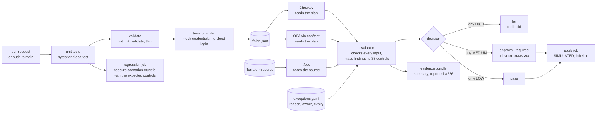
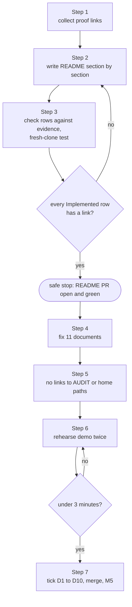

# Phase 5: README and demo

> **Sessions:** 2 sessions: Thu 2026-11-12 and Tue 2026-11-17, about 1.5 h each. Buffer: Thu 2026-11-19 · **Milestone:** M5 flagship-ready, target **Sat 2026-11-21** (also the day run #68's artifacts expire)
> **You need:** M4 reached. Phase 4 gave you a green run on `main` that lists all three scanners, runs the tests and has a strict regression job. This phase writes about that run; it doesn't change the pipeline.

---

## 1. Goal

Replace the README's claims with a page a stranger can check in three minutes (identity sentence, pipeline diagram, a capability table labelled Implemented / Simulated / Planned, and links to real runs), fix the other documents that still claim things the code doesn't do, and rehearse a 3-minute demo.

## 2. Why this phase / why now

The README is the first page a recruiter or reviewer reads, and often the only one. Today it describes a different, bigger project: "a comprehensive, compliance-oriented cloud security platform" that "serves as both the company's internal security infrastructure and a reference implementation" (`README.md:5`). Your own inventory checked each claim against the code ([../research/inventory.md](../research/inventory.md) §7; [../01-current-state.md](../01-current-state.md#7-readme-claims-vs-code)):

- **No code at all:** Terragrunt (`README.md:67`), delegated administration (`:18`), background checks (`:29`), incident-response workflows (`:25`), continuous compliance monitoring and automated remediation (`:62`), zero-trust (`:61`).
- **Prose only:** SOC 2, NIST CSF and CIS "supported" (`:12`, `:35-37`); the only source is a crosswalk table, and `control-mapping.yaml` carries ISO 27001 references only.
- **Over-claims:** "SIEM integration" (`:24`) is one Firehose stream with no log source, in a root that was never applied. "audit-ready evidence … for certification audits" (`:60`) contradicts your own treatment TRT-007 (`Governance/ISMS/03-risk-management/risk-treatment-plan.md:26`).

A reviewer who finds one false claim discounts every true one. The true ones are good: a working three-way gate, a negative test that now provably bites, and a tfsec bug you found and fixed yourself.

> **Mentor note.** Phase 4 came first on purpose: the README must describe what the pipeline *does*, and now you can link to a run that proves it. "Simulated" is not a weakness here. It's a boundary you drew on purpose and can defend ([ADR-0006](../adr/0006-honesty-labelling.md)). An unlabelled simulation that a reviewer discovers reads as dishonest; one you point out yourself reads as judgement.

Decisions this phase applies:

- [ADR-0006](../adr/0006-honesty-labelling.md): the Implemented / Simulated / Planned labels. The weakest true label wins, and every Implemented row links to evidence.
- [ADR-0002](../adr/0002-identity-and-scope.md): the identity sentence and the scope rings (gate / design-only context / out). Out-of-scope claims are **removed**, not relabelled.
- [ADR-0009](../adr/0009-governance-links-evidence.md): governance documents link to a path, a run URL or a committed evidence snapshot. No links to the untracked `AUDIT/` folder.
- [ADR-0005](../adr/0005-github-single-source-of-truth.md): the repo map points at `.github/` as the only pipeline.

## 3. Before you start

**Prerequisites**

- M4 done: `docs/evidence/2026-11-m4/` exists and the tracker in [../README.md](../README.md) has the M4 run URL.
- Your answers to **Q12** (do you accept the refined identity sentence?) and **Q13** (who is the README for?) in [../risks-and-open-questions.md](../risks-and-open-questions.md). Defaults: keep your original sentence; audience = cloud security engineer roles with a compliance angle.
- The ruleset from Phase 4 is active, so every change goes through a PR:

```bash
cd ~/src/Ayka-Secure-Technologies-GmbH
git switch main && git pull --ff-only
git switch -c docs/phase-5-readme
```

**Tools.** No new tools. You'll run the README's "Run it locally" commands once on a fresh clone to prove they work, so you need the pinned set from [Phase 4 §3](phase-4-pipeline-green.md#3-before-you-start): terraform 1.7.5, tflint v0.53.0, tfsec v1.28.14, conftest v0.45.0, opa 0.56.0, checkov 3.3.20 (`pipx install checkov==3.3.20`), pytest 9.1.1 and pyyaml 6.0.1 (`pip install -r tests/requirements.txt`), jq, actionlint 1.7.7, and `gh`. Quick check:

```bash
terraform version | head -1; tfsec --version | tail -1; conftest --version | head -1; opa version | head -1; checkov --version
```

Expected: `Terraform v1.7.5`, `v1.28.14`, `Conftest: 0.45.0`, `Version: 0.56.0`, `3.3.20`.

Optional, for previewing Mermaid before you push (GitHub renders it anyway): `npx -y @mermaid-js/mermaid-cli@11.17.0 -i diagram.mmd -o diagram.svg`, the same version the plan's diagrams were checked with.

## 4. Steps

Sessions: **S1** = Steps 1–3 · **S2** = Steps 4–7.

---

### Step 1: Collect your proof links (S1, 10 min)

Every Implemented row and every demo beat needs a link. Collect them first, so writing never stalls on "where was that run?".

```bash
REPO=Ayush-cloud06/Ayka-Secure-Technologies-GmbH
gh run list --repo $REPO --workflow test.yml --branch main --limit 3 --json databaseId,conclusion,headSha,url
RUN=<the M4 run id>
gh run view $RUN --repo $REPO --json jobs --jq '.jobs[] | "\(.name)  \(.conclusion)  \(.url)"'
gh pr list --repo $REPO --state merged --search "Phase 4" --json number,url
```

Write the results into this table in a scratch note (not committed):

| Link | Used in | Your URL |
|---|---|---|
| M4 run (green, on `main`) | README badge target, capability table, demo 0:45 | |
| `unit-tests` job | capability table (tests) | |
| `Control Validation Regression` job | capability table, demo 1:15 | |
| `compliance / apply` job (shows "Approved by" and `SIMULATED APPLY`) | capability table (approval, apply), demo 0:45 | |
| Phase 4 PR (red at Step 1, green at Step 13) | demo 2:40, interview story | |
| `docs/evidence/2026-11-m4/` | capability table, risk register (Step 4) | |

- **Files touched:** none.
- **Expected output:** the job list shows `validate-scripts`, `unit-tests`, `compliance / validate`, `compliance / compliance`, `compliance / apply`, `Control Validation Regression`, all `success` (`compliance / medium-risk-approval` is `skipped` because the portal decision is `pass`).
- **If this fails:** the latest run is red → you're not at M4 yet; go back to Phase 4 Step 16.

---

### Step 2: Write the new README, section by section (S1, 60 min)

Replace `README.md` completely. Below is the outline with what goes in each section. Write the prose yourself, in your voice. Keep each section short: the README is a map, and [../how-it-works.md](../how-it-works.md) is the territory.

**0. Title and badge.** The current title, "Compliance-Oriented Cloud Security Platform" (`README.md:1`), is the old repository name and promises a platform. Use something that names what it is, for example "Ayka: a compliance-as-code gate for Terraform". Add one badge, the CI status:

```markdown

```

**1. Identity sentence.** Your original sentence stays until you accept [ADR-0002](../adr/0002-identity-and-scope.md):

> "A compliance-as-code gate for Terraform: Checkov + tfsec + OPA scan a Terraform plan → findings are mapped to controls → a fail-closed evaluator decides pass/fail → a checksummed audit-evidence bundle and human-readable report are produced. It's backed by a simulated ISO 27001 case-study company, Ayka Secure Technologies GmbH."

ADR-0002 proposes this refinement, because the evaluator has three outcomes (`evaluate-results.py:417-421`), tfsec reads the source rather than the plan (`run-tfsec.sh`), and "audit-evidence" conflicts with your own TRT-007:

> "A compliance-as-code gate for Terraform: Checkov and OPA scan the Terraform plan and tfsec scans the source, every finding is mapped to an ISO 27001-referenced control, a fail-closed evaluator decides pass / needs-approval / fail, and each run leaves a checksummed evidence bundle and a readable report. It is demonstrated on Ayka Secure Technologies GmbH, a simulated ISO 27001 case study."

Use one or the other, not a mix. After Phase 4, "fail-closed" is true in both; before it, it wasn't.

**2. What this is, and what it is not** (3 lines, right under the sentence). Say it before anyone asks: nothing is deployed; Terraform plans run with mock credentials; the apply step is simulated and says so; the company and its ISMS are a simulated case study (your own risk register says so, `Governance/ISMS/03-risk-management/risk-register.md:3,9`).

**3. Pipeline diagram.** Embed this Mermaid block as it is (it renders on GitHub, and it was checked with mermaid-cli 11.17.0):



**4. Capability table.** Mirror [../02-target-state.md §4](../02-target-state.md#4-capability-status-table-the-honest-one) and [ADR-0006](../adr/0006-honesty-labelling.md) exactly. Labels mean:

- **Implemented** = runs in CI, and a run URL or a test shows it doing the real thing.
- **Simulated** = runs, but its effect is faked, stubbed or fed with fake inputs, and it says so.
- **Planned** = designed or written down, including Terraform the gate never plans or scans. Nothing in CI proves it.

Replace each `<…>` with a link from Step 1.

| Capability | Status | Evidence |
|---|---|---|
| Checkov scan of the Terraform plan | Implemented | `run-checkov.sh`, `<M4 run>` |
| OPA/conftest custom rules on the plan | Implemented (known blind spots, see Limitations) | `OPA/terraform/*.rego`, `OPA/tests/`, `<unit-tests job>` |
| tfsec scan of the Terraform source | Implemented (results were dropped by a wrapper bug until Phase 4, `run-tfsec.sh:13-19` on `53b0532`; fixed in `<Phase 4 PR>`) | `run-tfsec.sh`, `<M4 run>` |
| Finding → control mapping (38 controls, ISO/IEC 27001:2022 Annex A references) | Implemented | `control-mapping.yaml` |
| Three-way decision with fail-closed input checks | Implemented | `evaluate-results.py`, `tests/compliance/` |
| Reviewed exceptions with reason, owner and expiry | Implemented | `exceptions.yaml`, "Excepted findings" in `compliance-report.md` |
| Negative-test workload that must fail with named controls | Implemented | `control-validation-scenarios/expected-controls.txt`, `<regression job>` |
| Unit tests and policy tests in CI | Implemented | `<unit-tests job>` |
| Evidence bundle: raw JSON, summary, Markdown report | Implemented | `evidence/action.yml`, `docs/evidence/2026-11-m4/` |
| SHA-256 integrity check between scan and apply | Implemented (integrity, **not** tamper-proof: the hash travels with the files) | `run-apply.sh`, `<apply job>` |
| Human approval before apply | Implemented (environment reviewer set in Phase 4; the M4 run waited for approval). Simulated before that | `<apply job>`, `docs/evidence/2026-11-m4/` |
| Branch protection with required checks | Implemented (GitHub ruleset) | `docs/evidence/2026-11-m4/ruleset-main.json` |
| Terraform apply | **Simulated**: the verified plan is not applied; the job prints `SIMULATED APPLY` | `run-apply.sh` |
| Cost estimation | **Simulated**: infracost isn't installed; the step says so and gates nothing | `run-cost-check.sh` |
| Workload infrastructure (ayka-portal) | **Simulated**: mock credentials, plan-only, never deployed | `ayka-portal/provider.tf:17-33` |
| The company, ISMS, personnel, risk register | **Simulated** case study | `risk-register.md:3,9` |
| AWS Organizations, SCPs, landing zone, IAM core, Identity Center, Entra ID | **Planned: design-only** (source validates locally, never applied, not gated) | `Internal-IT/platform/` |
| Remote state for workloads | **Planned** (Phase 6a) | — |
| Real sandbox apply | **Planned** (Phase 6b) | [ADR-0010](../adr/0010-mock-plan-only-then-sandbox.md) |
| Meaningful drift detection | **Planned**: a manual workflow exists and refuses to run without a remote backend | [ADR-0008](../adr/0008-drift-manual-only.md) |
| Governance ↔ control ↔ evidence links (SoA) | **Planned** (Phase 6c) | [ADR-0009](../adr/0009-governance-links-evidence.md) |
| Signed or attested evidence | **Planned** (optional, Phase 6e) | — |

Then one line, not a table row: **Not claimed:** Terragrunt, SIEM integration, SOC 2 / NIST CSF / CIS mappings, zero-trust, continuous monitoring, automated remediation, delegated administration, a logging account, incident-response workflows, "audit-ready". (Those came from the old README; none has supporting code, [../research/inventory.md](../research/inventory.md) §7.) Don't list them as Planned; ADR-0002 moves them out of scope.

**5. See it work in 3 minutes.** Four links with one line each: the green run, the regression job failing on purpose, the `compliance-report.md` artifact (or its committed copy in `docs/evidence/2026-11-m4/`), and the Phase 4 PR showing the portal going red after the tfsec fix and green after triage.

**6. How a finding becomes a decision.** Five lines: a scanner reports a rule ID, the evaluator looks it up in `control-mapping.yaml`, the *control's* severity counts (not the scanner's), unmapped findings count as at least MEDIUM, and any HIGH fails the build. Link to [how-it-works.md §3](../how-it-works.md#3-how-one-finding-travels-scanner--control-id--severity--decision) for the worked example (the open-SSH scenario).

**7. Run it locally.** Pinned versions in one line (the list from section 3 above), then these commands. They're what a reviewer will paste, so run them once on a fresh clone before you commit:

```bash
git clone https://github.com/Ayush-cloud06/Ayka-Secure-Technologies-GmbH.git && cd Ayka-Secure-Technologies-GmbH
python3 -m venv .venv && . .venv/bin/activate && pip install -r tests/requirements.txt
python3 -m pytest -q tests/ && opa test Internal-IT/engineering/policy-as-code/OPA
WL=Internal-IT/workloads/control-validation-scenarios; S=Internal-IT/engineering/ci-cd/scripts
terraform -chdir=$WL init -input=false
AWS_ACCESS_KEY_ID=mock AWS_SECRET_ACCESS_KEY=mock terraform -chdir=$WL plan -input=false -refresh=false -out=tfplan.binary
mkdir -p output && terraform -chdir=$WL show -json tfplan.binary > output/tfplan.json
bash $S/run-checkov.sh && WORKLOAD_DIR=$WL bash $S/run-tfsec.sh && bash $S/run-policy-check.sh
bash $S/evaluate-results.sh > /dev/null; jq '{decision, totals}' output/compliance-summary.json
```

Expected (Phase 4 measurement): `"decision": "fail"` with HIGH 20, MEDIUM 33, LOW 10. For ayka-portal (`WL=Internal-IT/workloads/ayka-portal`; the mock variables are optional there because its provider has its own mock keys): `"decision": "pass"`, LOW 14, with 4 excepted findings. If you'd rather give reviewers one command, commit your `~/ayka-chain.sh` from Phase 4 Step 0 as `Internal-IT/engineering/ci-cd/scripts/run-local-chain.sh` (it then gets `bash -n` in CI like the other scripts) and show that instead.

**8. What's real vs simulated.** Three short paragraphs expanding the Simulated rows: where exactly the simulation starts (after the checksum verification, `run-apply.sh`), why (no real account for a portfolio repository; [ADR-0010](../adr/0010-mock-plan-only-then-sandbox.md) describes the path to a real sandbox apply), and what the case-study company is for (to give the controls a believable context, not to claim an operating ISMS).

**9. Known limitations.** Take them from [../interview-prep.md Q9](../interview-prep.md#q9-what-are-the-limitations-be-proactive) and update them to the post-Phase-4 state:

- nothing is deployed, and the apply is simulated;
- drift detection needs remote state, which doesn't exist yet;
- OPA sees one module level only, misses standalone security-group rule resources and list-form IAM actions (Checkov covers these three since Phase 4 Step 12), and some values are unknown at plan time (`aws_vpc.rego` flow-log and route-table rules);
- severity is decided by the mapping file, so changes to it are reviewed (CODEOWNERS, rationale per control);
- the same problem reported by two or three tools counts two or three times (no de-duplication);
- tfsec reports findings per module, so an exception is as coarse as the module;
- the checksum proves integrity between jobs, not authenticity;
- Rego uses pre-1.0 syntax pinned to conftest v0.45.0;
- tfsec is being folded into Trivy upstream (Phase 6g).

**10. Repo map.** Which folders are the gate and which are context:

```text
.github/                                    the pipeline: workflows and composite actions (the only CI source)
Internal-IT/engineering/ci-cd/scripts/      scanner wrappers, evaluator, report, regression check
Internal-IT/engineering/policy-as-code/     Rego rules and tests, control-mapping.yaml, exceptions.yaml
Internal-IT/workloads/ayka-portal/          realistic workload that should pass (mock provider, plan-only)
Internal-IT/workloads/control-validation-scenarios/   deliberately insecure workload that must fail
tests/                                      evaluator, wrapper and mapping tests
Internal-IT/platform/                       design-only context: org, landing zone, identity (never applied, not gated)
Governance/, organization/                  the simulated ISMS case study
docs/evidence/                              dated evidence snapshots
docs/restore-plan/                          how this repository was restored, with the decisions (ADRs)
```

**11. Decisions and further reading, licence.** Link [docs/restore-plan/adr/](../adr/README.md), [how-it-works.md](../how-it-works.md) and `LICENSE`.

Do a quick self-review before moving on:

```bash
grep -n -i -E 'terragrunt|siem|soc ?2|zero[- ]trust|continuous (compliance )?monitoring|automated remediation|audit-ready|delegated admin|background check|incident response|comprehensive|enterprise-grade|robust|seamless' README.md
```

- **Files touched:** `README.md`.
- **Expected output:** the `grep` prints only lines where these words appear in the "Not claimed" sentence or the Limitations list, never as a capability.
- **If this fails:** a removed claim sneaks back in as a feature → delete it, or move it to "Not claimed". The Mermaid block doesn't render in the GitHub preview → a label contains parentheses or a special character without quotes; the block above uses only quoted labels.

---

### Step 3: Check the README against the evidence (S1, 20 min)

**Why.** [ADR-0006](../adr/0006-honesty-labelling.md) rule 2: every Implemented row links to evidence. Check that mechanically, then run the local commands on a clean clone as a stranger would.

```bash
# 1. Every Implemented row has a link or a repo path
grep -n '| Implemented' README.md | grep -v -E 'https://|\.ya?ml|\.py|\.sh|\.rego|/' ; echo "rows without evidence: $?"
# 2. Every repo path the README mentions exists
grep -oE '`[A-Za-z0-9_./-]+\.(ya?ml|py|sh|tf|rego|md|json|txt)`' README.md | tr -d '`' | sort -u | \
  while read -r f; do git ls-files --error-unmatch "$f" > /dev/null 2>&1 || ls "$f" > /dev/null 2>&1 || \
  [ -n "$(git ls-files "*$f")" ] || echo "MISSING: $f"; done
# 3. Fresh-clone test of section 7
rm -rf /tmp/ayka-readme-test && git clone -q . /tmp/ayka-readme-test && cd /tmp/ayka-readme-test
#    ...paste the section 7 commands here...
cd - > /dev/null
```

Commit and open the PR:

```bash
git add README.md && git commit      # message: section 8
git push -u origin docs/phase-5-readme && gh pr create --fill
```

- **Files touched:** `README.md` (already); nothing else.
- **Expected output:** `rows without evidence: 1` (grep found none). No `MISSING:` lines (a bare file name like `run-apply.sh` is found by the `*$f` search). The fresh clone prints `"decision": "fail"` with HIGH 20 / MEDIUM 33 / LOW 10. The PR's checks are green (a docs change can't change the gate's decisions).
- **If this fails:** the fresh clone gives different numbers → a tool version differs (check `checkov --version` first), or the scenario plan didn't pick up `-refresh=false`. A `MISSING:` line → a path is wrong in the README, or it names a file that Phase 3 deleted.

**Safe stopping point (end of S1).** The README PR is open and green. It can be merged now, or together with Step 4's fixes.

---

### Step 4: Fix the other documents that claim too much (S2, 45 min)

These are the Phase 5 `FIX` items from [../inventory/file-disposition.md](../inventory/file-disposition.md). The rule for every one: say what is true, label what is simulated, link evidence instead of asserting it, and never invent approvals, dates or people. Your own methodology already says "An empty approval field never counts as approval" (`Governance/ISMS/03-risk-management/risk-management-methodology.md:51`).

| File | What's wrong (path:line) | Replace with |
|---|---|---|
| `Internal-IT/workloads/README.md` | Says the workload "does not provision its own networking … inherits via data sources" (`:6`) and expects a `data.tf` (`:32-37`), but `modules/networking/main.tf` creates the VPC, subnets, NAT, IGW and flow logs, and no `data.tf` exists. Describes an analytics tier with Kinesis, S3 data lake and Athena (`:13`) and a `/modules/analytics/` folder (`:30`) that don't exist. Uses ISO 27001:**2013** IDs (`:20-24`). Claims "All infrastructure changes require PR approvals" (`:23`). The deploy guide uses `-var-file` (`:46`), which CI doesn't. | Describe what `main.tf` wires: the five real modules (`compute`, `database`, `networking`, `security`, `storage`) plus `kms.tf`. Delete the analytics tier and the "Platform Dependencies" section. In the compliance table, replace the 2013 IDs with control IDs from `control-mapping.yaml`, which carry ISO/IEC 27001:2022 references (for example "Data at rest → `S3_ENCRYPTION_MISSING`, `S3_KMS_ENCRYPTION_REQUIRED` (A.8.24)"). Don't hand-translate 2013 numbers. Replace the PR claim with "Changes to `main` go through a pull request with required CI checks (ruleset); approvals aren't required while there is one maintainer." Replace the deploy guide with the plan-only commands from the README and a line that the workload is **Simulated** (mock provider, never deployed). |
| `Internal-IT/platform/foundation/README.md` | The whole file (`:1-28`) is a tree of a `cloud-platform/` folder with files that don't exist (`security-account.tf`, `dev-account.tf`, `prod-account.tf`, `attachments.tf`, `restrict-regions.json`). | A first line: "**Planned: design-only.** These roots validate locally but were never applied and are not scanned by the gate ([ADR-0002](../adr/0002-identity-and-scope.md))." Then the real tree, generated rather than typed: `git ls-files Internal-IT/platform/foundation \| sed 's#Internal-IT/platform/foundation/##'`. Note that `remote-state/` mixes an AWS bootstrap (`bootstrap.tf`) and Azure storage (`main.tf`); Phase 6a decides. |
| `Governance/ISMS/00-context-and-governance/information-security-policy.md` | "Approved by: Managing Director" and "Effective Date: 01-03-2026" (`:6-7`, again `:123-125`), with no approval evidence. "Ensuring 100% MFA enforcement for privileged access" (`:47`), which nothing measures. | Replace the header with "**Status:** Draft, simulated case study. Not approved: no approval record exists." Remove the signature block at the end. Change the MFA line to a target: "Target: MFA for all privileged access. Not measured in this repository." |
| `Governance/ISMS/00-context-and-governance/scope.md` | Same approval header (`:6-7`). Lists "Logging, monitoring, and SIEM systems" and "Backup and disaster recovery systems" as in scope (`:63-64`); none exist in the repository. | Same draft/simulated header. Keep the two lines, but append "(Planned: no such system exists in this repository)", or delete them if you want the scope to describe only what exists. |
| `organization/roles-and-responsibilities.md` | "Monitors SIEM alerts (Microsoft Sentinel)" (`:69`). No SIEM exists, and another document calls it Elastic. | "Would monitor security alerts. (Planned: no SIEM exists in this repository.)" Or remove the bullet. |
| `organization/business-model.md` | Typos "compnay" and "stuttgart" (`:8`), "framworks" (`:10`). TISAX and IEC 62443 offerings (`:14-15`, `:85-86`) are fiction. | Fix the typos ("company", "Stuttgart", "frameworks"). Add one line under the heading: "This business model is part of the simulated case study; the offerings are fictional." |
| `Governance/ISMS/03-risk-management/risk-register.md` | Three links into the untracked `AUDIT/` folder (`:15`), broken on GitHub. RISK-009 cites "E2 scanner snapshot: 124 Checkov failures" (`:29`), a number no committed scan reproduces (**UNVERIFIED** where it came from). RISK-005 (`:25`) says "Awaiting external action" for branch protection and reviewers. (RISK-001 `:21` was corrected in Phase 1.) | Replace the `AUDIT/` links with: the M4 run URL, `docs/evidence/2026-11-m4/`, and the plan's [research notes](../research/README.md) as the dated reconstruction. For RISK-009: "E3: run `<M4 run URL>`: ayka-portal 14 Checkov findings (all LOW) and 4 tfsec findings, all 4 excepted with reasons in `exceptions.yaml`." For RISK-005: link the ruleset and environment exports in `docs/evidence/2026-11-m4/` and update the status to what they show. Your own rule applies: "must not be marked fixed from workflow YAML" (`:40`); the API export is the evidence. |
| `Governance/ISMS/03-risk-management/risk-treatment-plan.md` | TRT-003 status "Source work started; runtime review open" (`:22`) and TRT-006 "Source correction complete; runtime test blocked" (`:25`) describe work that never reached `main` (`Internal-IT` is unchanged since 243c3b1). TRT-009 plans to "Group the 124 Checkov failures" (`:28`). | TRT-003: "Not started on `main`." TRT-006: "Not started on `main`; the earlier source correction was never merged." TRT-009: replace "124 Checkov failures" with the current count and the run link, as above, or "the Checkov findings of the latest `main` run". |
| `Governance/ISMS/03-risk-management/risk-management-methodology.md` | `AUDIT/` links at `:36` and `:167-169`. | `:36`: link `docs/evidence/` and the latest `main` run instead. `:167-169`: replace the three bullets with links to `docs/evidence/2026-11-m4/README.md`, [../research/README.md](../research/README.md) and [../04-roadmap.md](../04-roadmap.md). |
| `Governance/ISMS/03-risk-management/risk-assessment-results/2026-q1-risk-assessment.md` | `AUDIT/` links at `:19-20`. | Replace them with the same evidence links, and keep your honest "retrospective reconstruction" wording (`:8`). |
| `Governance/ISMS/04-controls-and-soa/iam-iso27001-mapping.md` (DEFER to Phase 6, banner now) | Seven broken `Internal-IT/iam/…` paths, and ISO/IEC 27001:2022 labels A.5.15–A.5.18 shifted by one ([../research/inventory.md](../research/inventory.md) §6.2). | Add one line at the top: "**Known issues:** some paths and ISO 2022 control labels are out of date; see Phase 6c. Do not cite this mapping as evidence." The real fix is in Phase 6c. |

Also, optionally, add a two-line note at the top of [../how-it-works.md](../how-it-works.md) and [../interview-prep.md](../interview-prep.md): "Phase 4 is done (`<PR URL>`): the fail-open gaps in §4 are fixed; answers marked *(after Phase 4)* are now true." Those two files describe the planning-time state, and a reader should know which parts changed.

```bash
git add -A && git commit     # one commit per row group, see section 8
git push
```

- **Files touched:** the eleven files in the table (plus, optionally, the two plan files).
- **Expected output:** `git diff --stat main` lists only Markdown files. CI stays green.
- **If this fails:** you're tempted to *add* content (a new policy section, a filled-in approval) → stop. This step only corrects and labels. New governance content waits for Phase 6c, where it has evidence to link to.

---

### Step 5: Check that no link points outside the repository (D9) (S2, 10 min)

```bash
git grep -nE 'AUDIT/|/home/' -- '*.md' ':!docs/restore-plan'; echo "untracked-path links: $?"
git grep -nE 'Internal-IT/(iam|cloud-platform)/' -- '*.md' ':!docs/restore-plan'
```

- **Files touched:** whatever the grep finds.
- **Expected output:** `untracked-path links: 1` (nothing found). The second grep should only hit `iam-iso27001-mapping.md` and the platform identity docs that Phase 6c handles; the banner from Step 4 covers them.
- **If this fails:** `/home/<you>/…` in `ci-cd/compliance-gates/*.md` → Phase 3 should have fixed those (`enforcement-levels.md:13`, `policy-evaluation-flow.md:12`); fix them now with a relative link to `../../policy-as-code/metadata/control-mapping.yaml`.

---

### Step 6: Rehearse the 3-minute demo (S2, 25 min)

**Why.** A recruiter gives you three minutes, often on a screen share. The order below moves from problem to proof to honesty, and every beat is a click on something real. Open these tabs before you start: the README, the M4 run, the regression job, the `compliance-report.md` (artifact or `docs/evidence/2026-11-m4/`), `control-mapping.yaml` at `EC2_OPEN_SSH`, and the Phase 4 PR.

| Time | Say (roughly) | Show / click |
|---|---|---|
| 0:00–0:20 | "Terraform reviews are manual, scanners speak in rule IDs, and auditors want evidence, not screenshots. I built a gate that turns scanner output into a control decision and leaves evidence behind." | README, identity sentence |
| 0:20–0:45 | "Here's what's real. Green rows run in CI with a link. The apply is simulated on purpose, and it says so. The platform Terraform is design-only. I don't claim anything I can't link." | README capability table; point at one Implemented, one Simulated, one Planned row |
| 0:45–1:15 | "This is a normal run on main: tests first, then plan, three scanners, the decision. tfsec, Checkov and OPA all appear in the summary. The apply waited for my approval, verified the checksums, and printed SIMULATED APPLY." | M4 run → jobs list → `compliance / compliance` log (Print Compliance Coverage) → `compliance / apply` log |
| 1:15–1:45 | "A gate that never fails proves nothing. This job plans a deliberately insecure workload and must fail, and it checks *which* controls fired and *which* tool saw each one. If one scenario stops being caught, this goes red." | `Control Validation Regression` job → `Negative test verified` line; `expected-controls.txt` |
| 1:45–2:15 | "The report is for humans. Totals, findings by control, and accepted exceptions: each has a reason, an owner and an expiry date, so nothing is silently ignored." | `compliance-report.md` → "Excepted Findings" table |
| 2:15–2:40 | "One finding end to end: the open-SSH scenario. OPA reports `[EC2_OPEN_SSH]`, tfsec reports AVD-AWS-0107, Checkov CKV_AWS_24. All three map to one control, EC2_OPEN_SSH, which I rated HIGH, with ISO 27001 references. One HIGH, and the build fails." | `control-mapping.yaml` lines of `EC2_OPEN_SSH` (starts at `:2`) |
| 2:40–2:55 | "When I came back to this project, CI was green, but a 20-line wrapper was dropping every tfsec finding. Fixing it turned my own 'passing' workload red with three HIGHs. I triaged them with written exceptions instead of lowering severities. This PR shows red, then green for a documented reason." | Phase 4 PR → checks history |
| 2:55–3:00 | Closing sentence (below) | — |

**Closing sentence:** "A green pipeline is a claim; I build gates that can show what they saw, and I test that they fail when they should."

**The 30-second version** (for "tell me about a project"): "I built a compliance gate for Terraform in GitHub Actions. Checkov, OPA and tfsec findings are mapped to my own controls with ISO 27001 references, and an evaluator decides pass, needs approval or fail. A deliberately insecure workload proves it blocks what it should. When I came back to it, I found CI had been green while silently dropping one scanner's findings; I fixed it, made the gate fail closed on bad scanner output, and handled the new findings with reviewed exceptions instead of lowering severities. Nothing is deployed; the apply step is simulated and labelled that way."

Rehearse it twice with a timer, out loud, with the tabs. The second run should be under 3:00.

- **Files touched:** none (optionally a private note with your own phrasing).
- **Expected output:** two timed runs, the second under 3 minutes, no beat where you search for a tab.
- **If this fails:** you run long → cut beat 1:45–2:15 first (the report), then shorten the table beat. Never cut the regression beat or the tfsec story; they're the strongest proof.

---

### Step 7: Record M5 (S2, 10 min)

Tick D1–D10 in [../02-target-state.md §6](../02-target-state.md#6-definition-of-done-flagship-ready), update the tracker in [../README.md](../README.md), merge, and (optionally) tag the moment:

```bash
git add docs/restore-plan/README.md docs/restore-plan/02-target-state.md
git commit -m "docs(plan): record M5 flagship-ready"
git push && gh pr checks && gh pr merge --rebase --delete-branch
git switch main && git pull --ff-only
git tag -a flagship-2026-11 -m "M5: honest README, green gate, demo rehearsed" && git push origin flagship-2026-11
```

- **Files touched:** `docs/restore-plan/README.md`, `docs/restore-plan/02-target-state.md`.
- **Expected output:** the PR merges; the push run on `main` is green (the apply waits for your approval once more). The tag exists on GitHub.
- **If this fails:** a D-item can't be ticked → it goes to the buffer session (Thu 2026-11-19). Don't tick it "because it's nearly done".

## 5. Flow diagram



## 6. Checklist

- [ ] Proof links collected (M4 run, jobs, PR, evidence folder)
- [ ] README: title, badge, identity sentence (original or ADR-0002, not mixed)
- [ ] README: "what it is and is not" in the first lines
- [ ] README: pipeline diagram renders on GitHub
- [ ] README: capability table follows ADR-0006; every Implemented row has evidence; "Not claimed" line present
- [ ] README: run-locally commands tested on a fresh clone (scenarios fail 20/33/10)
- [ ] README: limitations, repo map, links to ADRs and how-it-works
- [ ] Removed-claims `grep` clean
- [ ] 11 documents fixed (table in Step 4)
- [ ] No links to `AUDIT/` or `/home/` outside the plan
- [ ] Demo rehearsed twice, second run under 3:00; 30-second version memorised
- [ ] D1–D10 ticked; tracker updated; PR merged; optional tag `flagship-2026-11`

## 7. Definition of done

M5 "flagship-ready" is done when the new README is merged on `main`, all of D1–D10 in [../02-target-state.md §6](../02-target-state.md#6-definition-of-done-flagship-ready) are ticked with their verification commands, and you have given the demo in under 3 minutes.

Verify:

```bash
git switch main && git pull --ff-only
grep -c '| Implemented' README.md                                                        # 12 rows
grep -n -i -E 'terragrunt|soc ?2|zero[- ]trust|automated remediation|audit-ready' README.md # only in "Not claimed"/limitations
git grep -nE 'AUDIT/|/home/' -- '*.md' ':!docs/restore-plan'; echo "D9: $?"                # D9: 1
gh run list --workflow test.yml --branch main --limit 1 --json conclusion -q '.[0].conclusion'   # success
git ls-remote --tags origin flagship-2026-11                                              # optional tag
```

## 8. Commit message(s)

```text
docs(readme): rewrite README with capability table and honest scope

Replaces platform claims with what the gate does and links each
Implemented capability to a CI run or file. Labels apply, cost check,
mock credentials and the company as Simulated, platform roots as
Planned (design-only). Removes Terragrunt, SIEM, SOC 2/NIST/CIS,
zero-trust, continuous monitoring and automated remediation claims.
Refs: ADR-0002, ADR-0006
```

```text
docs(workloads): describe the modules ayka-portal really has
docs(foundation): replace stale tree and label roots design-only
docs(isms): mark policy and scope as unapproved drafts of a simulated case study
docs(org): fix typos, label fictional offerings, remove SIEM claim
docs(risk): link run evidence instead of untracked AUDIT/ files; correct TRT-003/006/009
docs(isms): add known-issues banner to iam-iso27001-mapping
docs(plan): record M5 flagship-ready
```

## 9. What you learned

- **Honesty labelling is a design decision, not a disclaimer.** Three labels with one rule ("the weakest true label wins") turn "is this deployed?" from an awkward question into a line in a table. You can defend a simulation you chose; you can't defend one a reviewer found.
- **A claim is only as good as its link.** Path and line for code, a run URL for behaviour, a committed snapshot for things that must outlive retention ([ADR-0009](../adr/0009-governance-links-evidence.md)). That's the same discipline an auditor applies to an ISMS, applied to your own README.
- **Tell it as problem → mechanism → proof → limitation.** The demo works because every sentence points at something clickable, and it ends with a real bug you found in your own system. Interviewers remember "I found my green pipeline was lying and fixed it" far longer than a feature list.

## 10. Time estimate and safe stopping point

| Session | Date | Steps | Time |
|---|---|---|---|
| S1 | Thu 2026-11-12 | 1–3 (links, README, checks) | 1.5 h |
| S2 | Tue 2026-11-17 | 4–7 (doc fixes, link check, demo, M5) | 1.5 h |
| Buffer | Thu 2026-11-19 | anything unfinished; Phase 4 Step 13d rationale if still open | 0–2 h |
| Milestone | **Sat 2026-11-21** | M5 flagship-ready | — |

**Safe stopping points:**

1. **After Step 3**: the README PR is open and green. Merging it alone already fixes the biggest problem.
2. **After Step 4**: the documents are honest. The demo can be rehearsed any evening.

Run #68's artifacts expire on Sat 2026-11-21. Phase 0 saved them outside git, and Phase 4 committed the M4 snapshot, so nothing in this phase depends on them.
