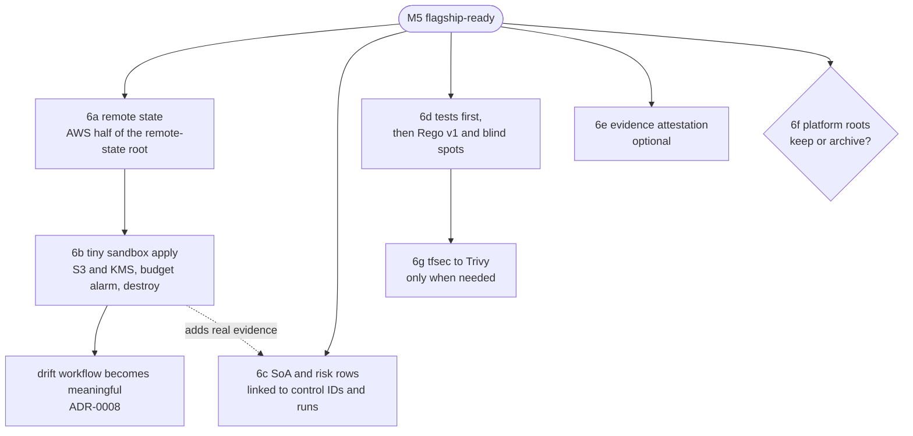
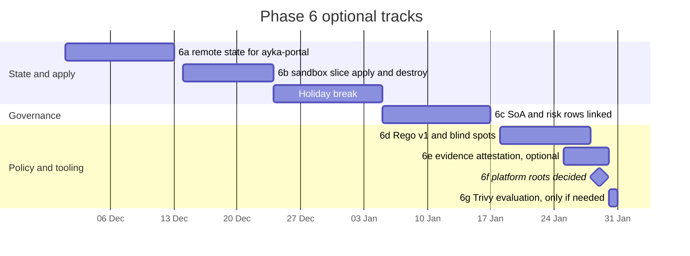

# Phase 6: Next growth (OPTIONAL)

> **This whole phase is optional.** Your repository is flagship-ready at M5. Nothing here is needed for a good portfolio; each track makes one **Planned** row in the README a little more **Implemented**, or makes the repository smaller and clearer.
> **When:** December 2026 to January 2027, at your own pace (2 sessions a week is a ceiling, not a target) · **Milestones:** M6a remote state, M6b sandbox apply, M6c governance linked ([../04-roadmap.md](../04-roadmap.md) §3)
> **Scope rule ([ADR-0002](../adr/0002-identity-and-scope.md)):** no new AWS services, scanners or compliance frameworks in the core. Every track below reuses what the repository already has (S3, DynamoDB, KMS and Budgets code already exist; ISO 27001 is the only framework; Trivy *replaces* tfsec, it isn't added next to it).

---

## 1. Goal

Pick at most one track at a time, and grow the gate only in ways that make its claims *more true*: real state and a real (tiny, reversible) apply, governance documents that point at evidence, and policy code that survives the next OPA release.

## 2. Why this phase / why now

After M5 the core is honest, and the temptation is to add things: a SIEM, SOC 2 mappings, a dashboard, a new cloud service. That's how the first round of this project grew 155 empty or title-only files ([../research/inventory.md](../research/inventory.md) §2). Risk R4, scope creep, is rated High / High ([../risks-and-open-questions.md](../risks-and-open-questions.md)). So this phase asks one question of every idea: **does this make the gate more true?**

The tracks are ordered by how much each one turns a *Planned* claim into an *Implemented* one:

| Track | Turns this Planned row into Implemented | Decided in |
|---|---|---|
| 6a Remote state | "Remote state for workloads" | [ADR-0010](../adr/0010-mock-plan-only-then-sandbox.md) step 1 |
| 6b Tiny sandbox apply | "Real sandbox apply", then "Meaningful drift detection" | ADR-0010 steps 2–3, [ADR-0008](../adr/0008-drift-manual-only.md) |
| 6c Governance linked to evidence | "Governance ↔ control ↔ evidence links (SoA)" | [ADR-0009](../adr/0009-governance-links-evidence.md) |
| 6d Rego v1 and blind spots | removes two Limitations lines (OPA blind spots, pre-1.0 syntax) | [ADR-0015](../adr/0015-pin-tool-versions.md), [ADR-0012](../adr/0012-tests-run-in-ci.md) |
| 6e Evidence attestation | "Signed or attested evidence" | [ADR-0011](../adr/0011-fail-closed-scanner-contract.md) (integrity vs authenticity) |
| 6f Platform roots decision | settles the "80–120 files" question | ADR-0002 open decision, Q7 |
| 6g tfsec → Trivy | keeps the source scanner maintained | ADR-0015 (one tool per PR) |

> **Mentor note.** 6a and 6b touch a real cloud account. That's where a portfolio project can cost money or leak credentials. The entry criteria below exist so that the first real resource you create is small, watched by a budget alarm, reviewed by you before it's applied, and destroyed on purpose. If a criterion isn't met, the track waits. That's not failure; it's the same "gate" thinking you built into the pipeline.

## 3. Before you start

**Prerequisites for every track**

- M5 done ([phase-5-readme-and-demo.md](phase-5-readme-and-demo.md)); CI green on `main`; ruleset active.
- The track's own entry criteria (listed in each step below) are met.
- One track at a time, on its own branch, through a PR. Record before/after `compliance-summary.json` totals in every PR that could change a decision ([ADR-0015](../adr/0015-pin-tool-versions.md)).

**Tools.** The pinned gate tools from [Phase 4 §3](phase-4-pipeline-green.md#3-before-you-start) stay as they are: terraform 1.7.5, tflint v0.53.0, tfsec v1.28.14, conftest v0.45.0 (bundles OPA 0.56.0), opa 0.56.0 for tests, checkov 3.3.20 via pipx, pytest 9.1.1 + pyyaml 6.0.1, jq, actionlint 1.7.7. Quick check:

```bash
terraform version | head -1; tfsec --version | tail -1; conftest --version | head -1; opa version | head -1; checkov --version
```

Extra, per track (install only when you start that track, and pin the version you install in the PR description):

| Track | Tool | Notes |
|---|---|---|
| 6a, 6b | AWS CLI v2 | used with a **personal sandbox account**, never with keys in the repository |
| 6d | OPA 1.x and a conftest release that bundles OPA 1.x | install side by side with 0.56.0 (for example as `opa1`); which conftest release bundles which OPA: check `conftest --version` (**UNVERIFIED** here) |
| 6e | GitHub CLI with `gh attestation` (2.49 or newer, **UNVERIFIED** minimum) | `gh attestation verify --help` must work |
| 6g | Trivy | pin one version with its published checksum, like tfsec in Phase 4 Step 9 |

## 4. Steps

Each track below is one "step": why, entry criteria, numbered sub-steps with commands, then files touched, expected output, what to do if it fails, done-when and risk.

---

### Step 6a: Remote state for ayka-portal, from the existing `remote-state` root (2–3 sessions, from Tue 2026-12-01)

**Why.** Drift detection needs a record of what exists ([ADR-0008](../adr/0008-drift-manual-only.md)), and a real apply needs somewhere safe to keep its state. ayka-portal has no `backend` block, so every run starts from empty state ([../research/pipeline.md](../research/pipeline.md) §7). You already wrote a bootstrap, `Internal-IT/platform/foundation/remote-state`, but it mixes two clouds:

- **AWS:** S3 bucket `ayka-terraform-state` with versioning and AES256 encryption, plus a DynamoDB lock table `terraform-locks`, in eu-central-1 (`bootstrap.tf:1-40`).
- **Azure:** a resource group, a storage account and a container for entra-id state (`main.tf:1-23`), with `public_network_access_enabled = true` (`main.tf:16`).
- `provider.tf:1-16` declares only `azurerm`. The `aws` provider has no version constraint ([../research/terraform.md](../research/terraform.md) §1). The S3 bucket has no public-access block.

**Decide: one cloud per root.** ayka-portal is AWS, so the AWS half serves it. The Azure half serves only entra-id's backend (`entra-id/provider.tf:12-14`), and entra-id is design-only. Default: move the Azure files to their own folder (`remote-state-azure/`) if you want to keep them as design, or delete them if you answered Q3 "never applied".

**Entry criteria**

- A **personal sandbox AWS account** you control, separate from anything that matters. Don't reuse account `982081090103` unless Phase 1 established that it's yours, it's a sandbox, and the old CI role is gone ([ADR-0013](../adr/0013-no-cloud-creds-for-plan-only.md)).
- MFA on that account's root user; you work with a short-lived login (`aws sso login` or `aws sts get-session-token`), never long-lived keys on disk if you can avoid it.
- A budget alarm exists in that account (6b step 1 shows one; you can do it first).
- Phase 4 Step 8b done (no mock keys in `ayka-portal/provider.tf`), so that later a drift run can give the provider real credentials through the environment.

**Sub-steps**

1. **Split and harden the bootstrap** (on a branch):

   ```bash
   git switch -c feat/6a-remote-state
   R=Internal-IT/platform/foundation/remote-state
   mkdir -p Internal-IT/platform/foundation/remote-state-azure
   git mv $R/main.tf Internal-IT/platform/foundation/remote-state-azure/main.tf
   git mv $R/provider.tf Internal-IT/platform/foundation/remote-state-azure/provider.tf
   ```

   Then in `$R`: add a `versions.tf` with `required_version = "1.7.5"` and `aws = { source = "hashicorp/aws", version = "~> 5.100" }`; make the bucket name a variable (S3 names are global, and `ayka-terraform-state` may already be taken by someone else, **UNVERIFIED**), for example `"ayka-tfstate-${data.aws_caller_identity.current.account_id}"`; add an `aws_s3_bucket_public_access_block` with all four settings `true`; add `allowed_account_ids = [var.sandbox_account_id]` to the provider so a wrong login fails loudly.
2. **Scan the bootstrap with your own gate before applying it.** It's Terraform like any other:

   ```bash
   ~/ayka-chain.sh Internal-IT/platform/foundation/remote-state
   ```

   Triage anything non-LOW (fix first, exception with owner and expiry second, [ADR-0014](../adr/0014-control-mapping-changes-reviewed.md)).
3. **Apply the bootstrap from your laptop** (the state bucket can't store its own creation; this local state file is the one exception, keep it outside git, for example in `~/ayka-state/`):

   ```bash
   aws sts get-caller-identity --query Account --output text     # must print your sandbox account
   cd Internal-IT/platform/foundation/remote-state
   terraform init && terraform plan -out=bootstrap.tfplan
   terraform apply bootstrap.tfplan
   mv terraform.tfstate* ~/ayka-state/ 2>/dev/null; cd -
   ```

4. **Point ayka-portal at it.** Add `Internal-IT/workloads/ayka-portal/backend.tf`:

   ```hcl
   terraform {
     backend "s3" {
       bucket         = "ayka-tfstate-<sandbox account id>"
       key            = "workloads/ayka-portal/terraform.tfstate"
       region         = "eu-central-1"
       dynamodb_table = "terraform-locks"
       encrypt        = true
     }
   }
   ```

   (Terraform 1.7.5 locks S3 state through DynamoDB; S3-native locking came in later releases.)
5. **Keep the gate credential-free.** With a backend block, `terraform init` in the plan action would need AWS access, which breaks [ADR-0013](../adr/0013-no-cloud-creds-for-plan-only.md). Plan-only CI doesn't need real state, so in the plan action write an override file that switches the backend back to local before `terraform init`:

   ```yaml
       - name: Plan-only uses local state (ADR-0013)
         shell: bash
         working-directory: ${{ inputs.workload_dir }}
         run: printf 'terraform {\n  backend "local" {}\n}\n' > zz_ci_backend_override.tf
   ```

   Terraform merges files ending in `_override.tf` last, and a `backend` block in an override replaces the original one. Measured in the planning session with Terraform 1.7.5: a root with an `s3` backend block plus this override file, and no AWS credentials at all, printed `Successfully configured the backend "local"!` and planned normally. Check it once on your laptop anyway (`terraform init -reconfigure`). The drift workflow (manual) is the only place that uses the real backend, with a narrowly trusted role (ADR-0013 option 3: trust pinned to this repository and the `manual-apply-approval` environment, permissions limited to the state key and the lock table).
6. **Re-run the gate** and check nothing changed: `~/ayka-chain.sh Internal-IT/workloads/ayka-portal` must still print `pass` 0/0/14 with 4 excepted.

- **Files touched:** `Internal-IT/platform/foundation/remote-state/*`, `Internal-IT/platform/foundation/remote-state-azure/*` (moved), `Internal-IT/workloads/ayka-portal/backend.tf` (new), `.github/actions/plan/action.yml`, `.github/workflows/drift-detection.yml` (role step), `docs/evidence/2026-12-remote-state/` (new: bucket settings export).
- **Expected output:** `terraform apply` of the bootstrap reports 4–5 resources added; `terraform -chdir=Internal-IT/workloads/ayka-portal init` on your laptop prints `Successfully configured the backend "s3"!`; `terraform state list` is empty (nothing applied yet); CI unchanged and green; `aws s3api get-public-access-block --bucket <name>` shows all four settings `true`.
- **If this fails:** `BucketAlreadyExists` → the global name is taken; that's why step 1 made it a variable. `Error: Invalid provider configuration … allowed_account_ids` → you're logged into the wrong account; stop and check `aws sts get-caller-identity`. CI init asks for credentials → the override file isn't written before `terraform init`, or its name doesn't end in `_override.tf`.
- **Done when (M6a):** ayka-portal initialises against the S3 backend on your laptop, CI still plans without any cloud credentials, and the drift workflow's backend guard passes (it then fails honestly at "drift detected: 87 to add" until 6b, because nothing is applied yet).
- **Risk:** state files later contain secrets (for example generated database passwords), so the bucket is sensitive: encryption, versioning, public-access block, and no one but you with access. Low cost (cents per month), but it's a real resource: note it in the risk register (RISK-002, TRT-002).

---

### Step 6b: A tiny real sandbox apply, then destroy (2 sessions, from Mon 2026-12-14)

**Why.** The apply job is **Simulated** (`run-apply.sh` prints `SIMULATED APPLY` since Phase 4). One real, small, reversible apply shows that the whole path works (plan → scan → decide → checksum → approve → apply), and it's the precondition for meaningful drift detection (ADR-0008). ADR-0010 is explicit: a **minimal slice, not all 87 resources**, and nothing with a NAT gateway, RDS or an ALB, which cost money by the hour.

**Entry criteria** ([ADR-0010](../adr/0010-mock-plan-only-then-sandbox.md), [ADR-0013](../adr/0013-no-cloud-creds-for-plan-only.md))

- 6a done.
- A budget alarm in the sandbox account (sub-step 1).
- A separate, narrowly trusted role for apply, if you apply from CI at all (laptop first is fine).
- Required reviewers on `manual-apply-approval` (done in Phase 4 Step 15).
- **Before** the apply, not after: update RISK-008, TRT-002 and TRT-008 in `Governance/ISMS/03-risk-management/` to say what will be real, where, and for how long.

**Sub-steps**

1. **Budget alarm first.** Reuse your own pattern from `Internal-IT/platform/foundation/landing-zone/modules/cost_controls/main.tf:2-17` (an `aws_budgets_budget` with an 80 % ACTUAL notification), in a small root of its own or via the console. Set it low (for example 5 USD a month) and send it to an address you read.
2. **A minimal slice as its own root**, reusing the portal's storage module and one KMS key (no new services):

   ```bash
   git switch -c feat/6b-sandbox-slice
   mkdir -p Internal-IT/workloads/sandbox-slice
   ```

   `main.tf`: one `aws_kms_key` (like `ayka-portal/kms.tf`) and `module "storage" { source = "../ayka-portal/modules/storage" … }` with `name_prefix`, `bucket_suffix` and `kms_key_arn` (`modules/storage/variables.tf:1-11`). `provider.tf`: region eu-central-1, `allowed_account_ids`, **no** static keys. `backend.tf`: the 6a bucket with `key = "workloads/sandbox-slice/terraform.tfstate"`.
3. **Run your gate on it** and treat it like any change: `~/ayka-chain.sh Internal-IT/workloads/sandbox-slice`. Triage every non-LOW finding (the portal's `AVD-AWS-0089` access-log exception will need its own entry, because the resource path differs).
4. **Apply from your laptop, watch, destroy:**

   ```bash
   aws sts get-caller-identity --query Account --output text
   cd Internal-IT/workloads/sandbox-slice
   terraform init && terraform plan -out=slice.tfplan && terraform show -no-color slice.tfplan | tail -3
   terraform apply slice.tfplan
   terraform state list
   ```

5. **Real drift, once.** Run the manual drift workflow for `sandbox-slice` (add it to the matrix): expect **green "No drift."** Then add a tag to the bucket in the console, run it again: expect **red "Drift detected"**. Remove the tag. This is the M6a/M6b proof the roadmap asks for.
6. **Destroy and prove it:**

   ```bash
   terraform destroy
   terraform state list | wc -l                       # 0
   aws s3api list-buckets --query "Buckets[?contains(Name, '<your prefix>')].Name"   # []
   cd -
   ```

   KMS keys can't be deleted immediately; `destroy` schedules deletion (7–30 days). Whether a key pending deletion is billed: **UNVERIFIED**, check the KMS pricing page, and keep the budget alarm until the key is gone.

- **Files touched:** `Internal-IT/workloads/sandbox-slice/*` (new), `.github/workflows/drift-detection.yml` (matrix), `Internal-IT/engineering/policy-as-code/metadata/exceptions.yaml`, the risk docs named above, `docs/evidence/2026-12-sandbox/` (commands and outputs, the budget alarm screenshot, the two drift run URLs), README capability table.
- **Expected output:** the plan shows only S3, KMS and SNS resources (the storage module includes an SNS topic for bucket notifications); `apply` completes; drift runs green, then red, then green; `destroy` leaves `state list` empty.
- **If this fails:** the plan wants more than about 15 resources → you pulled in the wrong module; stop. Apply fails with `AccessDenied` → your role is narrower than the slice needs; widen it by exactly the action named in the error, nothing more. The budget alarm fires → destroy first, investigate second.
- **Done when (M6b):** one real apply and one destroy are recorded in `docs/evidence/2026-12-sandbox/`, the drift workflow has one green and one red run against real state, and the README says: "Real sandbox apply: Implemented once (2026-12-xx, then destroyed); ayka-portal apply: Simulated".
- **Risk:** cost and credentials. Mitigations: tiny slice, budget alarm, `allowed_account_ids`, laptop-first, short-lived credentials, destroy the same day. Moving the apply into CI (the verified `tfplan.binary` from the evidence artifact) is a separate, later PR with its own review.

---

### Step 6c: Governance linked to evidence (2–3 sessions, from Tue 2027-01-05)

**Why.** Your risk documents are well written, but **no governance or organisation document references a single control ID** from `control-mapping.yaml`, and the eight risk docs contain zero repository paths ([../research/inventory.md](../research/inventory.md) §6.1–6.2). Meanwhile the mapping carries ISO/IEC 27001:2022 Annex A references for all 38 controls. The link between "what the ISMS says" and "what the gate checks" exists in your head only. [ADR-0009](../adr/0009-governance-links-evidence.md): each claim links to a path and line, a run URL, or a committed evidence snapshot; "E1: no evidence yet" is a valid entry.

**Entry criteria**

- M5 done; `docs/evidence/2026-11-m4/` exists (Phase 4 Step 16).
- Phase 3 deleted the title-only `statement-of-applicability.md` ([ADR-0004](../adr/0004-delete-placeholders.md)). You recreate it only now, because now there is evidence to put in it.

**Sub-steps**

1. **Generate the skeleton from the mapping**, so the SoA can't drift from it:

   ```bash
   python3 - <<'EOF'
   import yaml, collections
   m = yaml.safe_load(open("Internal-IT/engineering/policy-as-code/metadata/control-mapping.yaml"))["controls"]
   by_ref = collections.defaultdict(list)
   for cid, c in m.items():
       for ref in c.get("frameworks", {}).get("iso27001", []):
           by_ref[ref].append(f"{cid} ({c['severity']})")
   for ref in sorted(by_ref, key=lambda r: [int(x) for x in r[2:].split(".")]):
       print(f"| {ref} | Applicable | | {', '.join(by_ref[ref])} | | |")
   EOF
   ```

   Expected: one row per Annex A reference used in the mapping (16 distinct references, for example A.8.20 and A.8.24, [../research/pipeline.md](../research/pipeline.md) §4).
2. **Write `Governance/ISMS/04-controls-and-soa/statement-of-applicability.md`** with columns: Annex A control · Applicable? · Justification · Implemented by (control IDs) · Evidence (path:line, run URL or snapshot) · Status (Implemented / Simulated / Planned, [ADR-0006](../adr/0006-honesty-labelling.md)). State at the top that ISO/IEC 27001:2022 Annex A has 93 controls, that this case study only assesses the ones the gate touches, and that this is **not** a certification claim.
3. **Link the risk register.** Add a "Controls" column to the RISK rows in `risk-register.md` (for example RISK-009 → the S3, EC2 and network controls) and replace any remaining free-text evidence with links, as Phase 5 started.
4. **Keep it true with a test.** Add `tests/compliance/test_soa_links.py`: every control ID named in the SoA exists in `control-mapping.yaml`, and every Annex A reference used by the mapping has a SoA row. It runs in the `unit-tests` job, so a renamed control breaks the build instead of silently breaking the document.
5. **Fix or retire `iam-iso27001-mapping.md`**: seven broken `Internal-IT/iam/…` paths and ISO 2022 labels A.5.15–A.5.18 shifted by one ([../research/inventory.md](../research/inventory.md) §6.2). Either correct it against `domains/identity/docs/iam_compliance_crosswalk.md`, which uses correct numbering, or replace it with rows in the SoA and delete it.

- **Files touched:** `Governance/ISMS/04-controls-and-soa/statement-of-applicability.md` (new), `…/iam-iso27001-mapping.md`, `Governance/ISMS/03-risk-management/risk-register.md`, `tests/compliance/test_soa_links.py` (new).
- **Expected output:** the SoA renders on GitHub with a status for every row; `pytest` passes, including the new link test; `git grep -n 'Internal-IT/iam/' -- '*.md'` finds nothing outside `docs/restore-plan`.
- **If this fails:** you catch yourself writing a justification with no evidence → write "E1: no evidence yet" and move on. That's your own methodology (`risk-management-methodology.md:84-90`), and it's more credible than a confident sentence.
- **Done when (M6c):** risk-register and SoA rows cite control IDs from `control-mapping.yaml` and CI run URLs; the link test runs in CI; no broken links.
- **Risk:** governance prose without evidence is exactly what ADR-0004 removed; keep every row short. ISO numbering: use 2022 consistently and never claim conformity.

---

### Step 6d: Rego v1 migration and the remaining blind spots (2–3 sessions, from Mon 2027-01-18)

**Why.** Two separate problems in the same files:

- **Syntax.** All the Rego uses pre-1.0 syntax (`deny[msg] {`). OPA 1.0 reports **45 parse errors** on the six original files ([../research/pipeline.md](../research/pipeline.md) §4–5); after Phase 4 it's 41 in the four `OPA/terraform` files, plus 4 in the two new test files (measured with OPA 1.0.0). The rules only work because conftest is pinned to v0.45.0, which bundles OPA 0.56.0 ([ADR-0015](../adr/0015-pin-tool-versions.md)). Any unplanned upgrade breaks the gate (fail-closed, but red).
- **Blind spots** in the Rego itself (Phase 4 Step 12 covered the first three through Checkov mappings only):
  - rules walk one module level only (F7, `aws_ec2.rego:7`);
  - standalone security-group rule resources and `protocol = "-1"` are missed (F8);
  - `Action = ["*"]` is missed (F10, `aws_iam.rego:11-15`);
  - the flow-log rule is broken both ways (F11, `aws_vpc.rego:18,26-31`);
  - the route-table rule never fires on a fresh plan (F12);
  - the MFA rule compares against the wrong attribute (F13, `aws_iam.rego:48-66`);
  - S3 ACL and encryption aren't linked to their bucket (F14);
  - tags ignore `default_tags` (F15).

**Entry criteria.** The Phase 4 Rego tests exist and run in CI. Write the missing tests **first** ([ADR-0012](../adr/0012-tests-run-in-ci.md): one fixture that fires and one that doesn't, per `deny` rule; a characterisation test per known gap).

**Sub-steps**

1. **Tests first**, per package, until every `deny` rule has a firing and a non-firing fixture. Use the shapes from real plans (`terraform show -json` of the scenarios), as the Phase 4 NACL test did.
2. **Fix the blind spots one rule at a time**, flipping the characterisation test for each:
   - one helper that collects resources from every module level, using OPA's built-in `walk` over `input.planned_values.root_module`, used by every rule instead of `child_modules[_]`;
   - SSH/HTTP rules for `aws_vpc_security_group_ingress_rule` (`cidr_ipv4`, `from_port`/`to_port`, `ip_protocol = "-1"`) and `aws_security_group_rule` (`type = "ingress"`), and `::/0`;
   - IAM: normalise `Action` to a list (string or array), and also consider `NotAction`;
   - flow logs and route tables: match by reference in `configuration` (resource addresses), not by IDs that are unknown at plan time;
   - MFA: compare `user_name`; tags: read `tags_all`.
3. **Migrate the syntax** in one mechanical commit, with no behaviour change: `deny contains msg if { … }`, `if` on helper rules and functions, then `opa fmt --write`. Check with OPA 1.x:

   ```bash
   opa1 check Internal-IT/engineering/policy-as-code/OPA                # 0 errors (41 + 4 after Phase 4)
   opa1 fmt --list Internal-IT/engineering/policy-as-code/OPA           # prints nothing
   opa1 test Internal-IT/engineering/policy-as-code/OPA                 # all tests pass
   ```

4. **Upgrade conftest and OPA together**, in one PR (pinned versions, checksums, the unit-tests job and the policy action), with the before/after totals for both workloads in the PR description.
5. **Re-run the probe** from Phase 4 Step 12: OPA should now report the public SSH (both rule resource types), the root-module IMDSv1 instance and the list-form IAM wildcard itself, not only Checkov.

- **Files touched:** `Internal-IT/engineering/policy-as-code/OPA/terraform/*.rego`, `…/OPA/tests/*.rego`, `.github/actions/policy/action.yml`, `.github/workflows/test.yml` (OPA version in `unit-tests`), possibly `exceptions.yaml`.
- **Expected output:** 0 errors from OPA 1.x; all tests pass; OPA findings on the probe; the scenarios still `fail` with every line of `expected-controls.txt` satisfied.
- **If this fails:** walking all module levels surfaces new findings on ayka-portal (for example the root-module KMS key in `kms.tf`, which OPA never saw) → that's the gate getting more true; triage them through ADR-0014. A rule rewrite changes a total you didn't expect → the tests were incomplete; add the missing fixture before you continue.
- **Done when:** OPA 1.x parses and tests clean; every known-gap test is flipped; the Limitations section of the README loses its two OPA lines.
- **Risk:** silent behaviour change during a "mechanical" migration. That's why the syntax commit comes *after* the tests and contains nothing else.

---

### Step 6e: Evidence attestation (optional, 1–2 sessions)

**Why.** The SHA-256 file proves integrity between the scan job and the apply job, not authenticity: it travels in the same artifact, and the planning session showed that rewriting a file and its hash verifies OK ([../research/pipeline.md](../research/pipeline.md) F19; [../interview-prep.md](../interview-prep.md) Q7). A signed attestation lets anyone check that a given evidence file was produced by this repository's workflow at a given commit.

**Entry criteria.** You actually want this story (it's a nice extra, not a gap). The repository is public; GitHub artifact attestations are available for public repositories (**UNVERIFIED** for your account type, check the Actions documentation).

**Sub-steps**

1. In the job that uploads evidence, add `attestations: write` and `id-token: write` to **that job only**. This `id-token` is for signing with GitHub's Sigstore integration, not for a cloud login; say so in a comment, because [ADR-0013](../adr/0013-no-cloud-creds-for-plan-only.md) removed `id-token` elsewhere for a different reason.
2. After the checksum step, add `actions/attest-build-provenance` pinned to a commit SHA (ADR-0015), with `subject-path: evidence/artifacts.sha256`. Attesting the checksum file covers every file it lists.
3. Verify from your laptop:

   ```bash
   gh run download <run id> -n compliance-evidence -D /tmp/att
   gh attestation verify /tmp/att/evidence/artifacts.sha256 --repo Ayush-cloud06/Ayka-Secure-Technologies-GmbH
   echo x >> /tmp/att/evidence/artifacts.sha256
   gh attestation verify /tmp/att/evidence/artifacts.sha256 --repo Ayush-cloud06/Ayka-Secure-Technologies-GmbH
   ```

4. Optionally make the apply job verify the attestation before `sha256sum -c`.

- **Files touched:** `.github/workflows/terraform-workflow.yml` (permissions of one job), `.github/actions/evidence/action.yml`, optionally `run-apply.sh`.
- **Expected output:** the first `verify` succeeds and names the workflow and commit; the second fails because the file changed.
- **If this fails:** `attestations: write` rejected → the feature isn't available for your account or repository visibility; stop here and keep the limitation in the README. Never fake it with a homemade signature.
- **Done when:** a downloaded evidence file verifies, and a modified one doesn't; the README row "Signed or attested evidence" becomes Implemented with a run link.
- **Risk:** complexity for its own sake. If you can't explain the verification in two sentences in an interview, don't ship it.

---

### Step 6f: Decide the platform roots: design-only or archived (1 session, by Fri 2027-01-29)

**Why.** `Internal-IT/platform` still holds 94 files marked DEFER (71 of them `.tf`): AWS Organizations, SCPs, the landing zone, IAM core, Identity Center and Entra ID ([../inventory/file-disposition.md](../inventory/file-disposition.md)). They validate locally but were never applied and are not gated. Your "80–120 files" goal is reachable only by moving them out; with them, the repository has about 200 files ([ADR-0002](../adr/0002-identity-and-scope.md), Q7).

**Entry criteria.** You've answered Q7 in [../risks-and-open-questions.md](../risks-and-open-questions.md) (default: keep as design-only).

**Sub-steps, option "archive"**

```bash
git switch main && git pull --ff-only
git tag -a archive/platform-2026 -m "Design-only platform Terraform (org, SCPs, landing zone, identity) before removal from main"
git push origin archive/platform-2026
git switch -c chore/6f-archive-platform
git rm -r -q Internal-IT/platform
git grep -n 'Internal-IT/platform' -- . ':!docs/restore-plan'     # fix or remove every hit
git ls-files | wc -l
```

Then update the README repo map ("design-only platform work: see tag `archive/platform-2026`") and mark ADR-0002's open decision as decided.

**Sub-steps, option "keep"**

Add one line at the top of `Internal-IT/platform/foundation/README.md` and `Internal-IT/platform/domains/identity/README.md` (Phase 5 did the first): "Planned: design-only; validates locally, never applied, not scanned by the gate." Optionally add a CI job that only runs `terraform fmt -check` and `terraform validate` (with `init -backend=false`) on the six platform roots, so the design can't rot silently. That's a check you already run by hand in Phase 0.

- **Files touched:** archive: `Internal-IT/platform/**` (deleted), README, ADR-0002, any doc that links into `platform/`. Keep: two README banners, optionally `.github/workflows/test.yml`.
- **Expected output:** archive: the tag exists on GitHub, `git grep` finds no dangling link, `git ls-files | wc -l` is roughly 105–110 (**UNVERIFIED**: depends on what Phases 1–6 added). Keep: CI green, banners visible.
- **If this fails:** governance docs link into `platform/` (for example the identity architecture) → change the links to the tag (`https://github.com/Ayush-cloud06/Ayka-Secure-Technologies-GmbH/tree/archive/platform-2026/Internal-IT/platform/...`).
- **Done when:** ADR-0002's open decision is recorded as decided, and the repository reflects the choice.
- **Risk:** archive: visible identity and landing-zone design work disappears from the default branch. Keep: a reviewer has to read the labels to know what runs.

---

### Step 6g: Note for later: tfsec → Trivy (1 session to evaluate, whenever tfsec breaks or stalls)

**Why.** tfsec itself says so on every run: "tfsec is joining the Trivy family … our engineering attention will be directed at Trivy going forward" (`tfsec --version` output, v1.28.14). The checks live on in Trivy's misconfiguration scanner, which uses the same `AVD-AWS-xxxx` IDs your mapping already uses (for example `AVD-AWS-0107` for `EC2_OPEN_SSH`, `control-mapping.yaml:16-18`). Whether every ID maps one-to-one is **UNVERIFIED**.

**Entry criteria.** A reason to move (a tfsec bug, a missing check, a deprecation notice with a date). Until then this is a note, not a task.

**Sub-steps**

1. Run both side by side on both workloads and compare IDs:

   ```bash
   tfsec Internal-IT/workloads/control-validation-scenarios --format json --out /tmp/tfsec.json
   trivy config --format json --output /tmp/trivy.json Internal-IT/workloads/control-validation-scenarios
   diff <(jq -r '.results[].rule_id' /tmp/tfsec.json | sort -u) \
        <(jq -r '.Results[]?.Misconfigurations[]?.AVDID' /tmp/trivy.json | sort -u)
   ```

   (Trivy's JSON field names here are **UNVERIFIED**; read one real output first.)
2. Write `run-trivy.sh` with the same contract as the Phase 4 tfsec wrapper ([ADR-0011](../adr/0011-fail-closed-scanner-contract.md)): exact output file, no fallback, required target, a fake-binary test.
3. Add `normalize_trivy` to the evaluator, and decide whether the mapping's `tool: tfsec` entries become `tool: trivy` or whether one index serves both.
4. Update `expected-controls.txt` (tool names), the check action (pinned Trivy with checksum), the README and the demo script.
5. One PR, tfsec out and Trivy in, with before/after totals for both workloads (ADR-0015: one tool per PR).

- **Files touched:** `Internal-IT/engineering/ci-cd/scripts/run-trivy.sh` (new), `run-tfsec.sh` (deleted), `evaluate-results.py`, `control-mapping.yaml`, `expected-controls.txt`, `.github/actions/check/action.yml`, tests, README.
- **Expected output:** both workloads keep their decisions, or every difference is explained in the PR; the regression contract passes with the new tool name.
- **If this fails:** Trivy reports checks tfsec didn't → new findings, triaged through ADR-0014 like the Phase 4 ones. Missing checks → map the gap, or keep tfsec pinned a while longer.
- **Done when:** CI is green with `trivy` in `by_tool` and the regression contract updated.
- **Risk:** churn in names and numbers across the README, the demo and your interview story. Keep the tfsec bug story; it happened, and it's still true.

## 5. Flow diagram

Which track can start when:



A possible calendar, December 2026 to January 2027 (move freely; skipping a track is fine):



## 6. Checklist

- [ ] One track at a time, each on its own branch and PR, with before/after totals where decisions could change
- [ ] 6a: bootstrap split (AWS only), hardened, scanned by your own gate, applied from the laptop; ayka-portal backend configured; CI still credential-free
- [ ] 6b: budget alarm; risk docs updated **before** apply; slice planned, gated, applied, drift green/red/green, destroyed; evidence folder committed
- [ ] 6c: SoA generated from the mapping; risk register rows cite control IDs and runs; link test in CI; `iam-iso27001-mapping.md` fixed or retired
- [ ] 6d: tests per rule first; blind spots fixed one by one; syntax migrated; conftest and OPA upgraded together
- [ ] 6e (optional): attestation verifies; a modified file fails verification
- [ ] 6f: Q7 answered; archive tag or banners; ADR-0002 decision recorded
- [ ] 6g: note kept; migration only with a reason
- [ ] README capability table updated after each finished track

## 7. Definition of done

There is no "done" for the whole phase; each track has its own **Done when** above. The roadmap's milestones are:

| Milestone | Proof | Verify |
|---|---|---|
| M6a Remote state | ayka-portal `terraform init` uses the S3 backend; drift workflow guard passes | `terraform -chdir=Internal-IT/workloads/ayka-portal init -reconfigure` prints `Successfully configured the backend "s3"!`; a drift run URL |
| M6b Sandbox apply | a real apply and destroy of the slice, recorded; drift green then red | `ls docs/evidence/2026-12-sandbox/`; two drift run URLs; `terraform state list` empty after destroy |
| M6c Governance linked | SoA and risk rows cite control IDs and CI runs; link test green | `python3 -m pytest -q tests/compliance/test_soa_links.py`; `git grep -n 'AUDIT/\|Internal-IT/iam/' -- '*.md' ':!docs/restore-plan'` prints nothing |

After each track, re-run the M5 checks ([phase-5-readme-and-demo.md §7](phase-5-readme-and-demo.md#7-definition-of-done)): the README must still match reality.

## 8. Commit message(s)

```text
feat(state): split remote-state bootstrap to AWS only and harden the state bucket
feat(ayka-portal): configure S3 backend; keep plan-only CI on local state (ADR-0013)
feat(sandbox): add minimal S3 and KMS slice for a real, reversible apply (ADR-0010)
docs(evidence): record sandbox apply, drift runs and destroy
docs(isms): add statement of applicability generated from control-mapping.yaml (ADR-0009)
test(governance): check SoA control IDs against the mapping
test(policy): cover every deny rule with firing and non-firing fixtures
fix(policy): walk all module levels and handle standalone SG rules and list-form IAM actions
refactor(policy): migrate rego to v1 syntax (no behaviour change)
ci(policy): upgrade conftest and OPA together (ADR-0015)
feat(evidence): attest the evidence checksum file
chore(platform): archive design-only platform roots to tag archive/platform-2026
```

## 9. What you learned

- **State is a security asset, and bootstrapping it is a chicken-and-egg problem.** The bucket that stores state can't store its own creation, so the bootstrap is the one root with local state, kept outside git. And a plan-only gate doesn't need real state at all, which is why CI can stay credential-free even after a remote backend exists.
- **Make the first real change small, watched and reversible.** A budget alarm, an account guard (`allowed_account_ids`), a reviewer, one small slice and a same-day destroy turn "I've never applied this" into one honest data point, without turning a portfolio project into a bill.
- **Traceability is a test, not a document.** A statement of applicability generated from the mapping, with a CI test that fails when they diverge, stays true on its own. The same goes for a language migration: tests first, then a mechanical change that the tests prove changed nothing.

## 10. Time estimate and safe stopping point

| Track | Sessions (1–2 h) | Suggested window |
|---|---|---|
| 6a Remote state | 2–3 | Tue 2026-12-01 to Sat 2026-12-12 |
| 6b Sandbox apply and destroy | 2 | Mon 2026-12-14 to Wed 2026-12-23 |
| Holiday break | 0 | Thu 2026-12-24 to Mon 2027-01-04 |
| 6c Governance linked | 2–3 | Tue 2027-01-05 to Sat 2027-01-16 |
| 6d Rego v1 and blind spots | 2–3 | Mon 2027-01-18 to Wed 2027-01-27 |
| 6e Attestation (optional) | 1–2 | any time after M5 |
| 6f Platform roots decision | 1 | by Fri 2027-01-29 |
| 6g Trivy | 1 to evaluate | only when there's a reason |

**Safe stopping points:** the end of any track, and inside the tracks:

- 6a after sub-step 2: nothing is created in AWS until you apply.
- 6b after sub-step 6 (**never** between apply and destroy for more than a day).
- 6c after sub-step 2: the SoA stands on its own.
- 6d after sub-step 1: the tests alone are valuable.

If you stop Phase 6 entirely, nothing breaks: the repository stays flagship-ready at M5.
