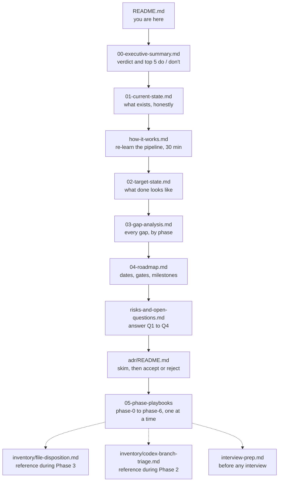

# Restoration plan: start here

> **What this is:** a step-by-step plan to turn this repository back into a flagship portfolio project. You do the work yourself, in small sessions, and understand every decision along the way.
> **Verdict:** fix in place. Don't restart, don't merge the AI branch ([why](00-executive-summary.md)).
> **Evidence base:** `main` = `53b0532`, GitHub Actions [run #68](https://github.com/Ayush-cloud06/Ayka-Secure-Technologies-GmbH/actions/runs/32621618951), and a full local re-run on 2026-09-28. Every claim cites a file and line, a command, or a run. Anything not proven is marked **UNVERIFIED**.
> **Scope of this branch:** only `docs/restore-plan/` was added. No existing file was changed.

---

## Reading order



**Short on time?** Read `00`, then `how-it-works.md`, then open [Phase 0](05-phase-playbooks/phase-0-orient.md).

---

## What's in the package

| File | Answers the question |
|---|---|
| [00-executive-summary.md](00-executive-summary.md) | Restart, fix or merge? What are the 5 things to do and the 5 not to do? |
| [01-current-state.md](01-current-state.md) | What exists today, what works, what's empty, what's broken? |
| [02-target-state.md](02-target-state.md) | What does "flagship-ready" mean, concretely and checkably? |
| [03-gap-analysis.md](03-gap-analysis.md) | What exactly has to change, and in which phase? |
| [04-roadmap.md](04-roadmap.md) | When, in what order, with which review gates? |
| [05-phase-playbooks/](05-phase-playbooks/) | Exactly what do I type in each session? |
| [adr/](adr/README.md) | Why was each decision made, and what were the alternatives? |
| [inventory/file-disposition.md](inventory/file-disposition.md) | What happens to each of the 373 files? |
| [inventory/codex-branch-triage.md](inventory/codex-branch-triage.md) | Where is the AI branch, and what should I take from it? |
| [risks-and-open-questions.md](risks-and-open-questions.md) | What could go wrong, and what do only I know? |
| [how-it-works.md](how-it-works.md) | How does my pipeline actually work? (study guide) |
| [interview-prep.md](interview-prep.md) | What will I be asked, and what's my honest answer? |
| [research/](research/README.md) | Where exactly did a claim come from? (raw, sanitised evidence notes) |

---

## Your first 60-minute session

Do this before anything else. It needs no decisions, changes no code, and protects evidence that expires.

**0–10 min: read**
- [ ] Read [00-executive-summary.md](00-executive-summary.md) end to end.

**10–20 min: save the last green evidence (it expires 2026-11-21)**
- [ ] Open [run #68](https://github.com/Ayush-cloud06/Ayka-Secure-Technologies-GmbH/actions/runs/32621618951) and scroll to **Artifacts**. Download `compliance-evidence` and `compliance-evidence-regression`. Store them **outside** the repo, e.g. `~/ayka-evidence/run-68/`. Alternatively, with the GitHub CLI:

```bash
mkdir -p ~/ayka-evidence/run-68 && cd ~/ayka-evidence/run-68
gh run download 32621618951 --repo Ayush-cloud06/Ayka-Secure-Technologies-GmbH
ls -R | head -30          # expect evidence/, output/compliance-report.md, output/tfplan.json
```

**20–30 min: tag the baseline**
- [ ] Mark today's `main` so you can always compare "before" and "after":

```bash
cd ~/path/to/Ayka-Secure-Technologies-GmbH
git fetch origin && git switch main && git pull --ff-only
git log --oneline -1                      # expect: 53b0532 fix: align risk documentation baseline dates
git tag -a baseline-2026-10 53b0532 -m "Baseline before restoration (see docs/restore-plan)"
git push origin baseline-2026-10
```

**30–45 min: answer the four blocking questions**
- [ ] Open [risks-and-open-questions.md](risks-and-open-questions.md#before-phase-1-blocking-decisions) and write your answers to Q1–Q4 in a private note (not in the repo). Q1: were the Entra passwords ever real? Q2: what can the AWS OIDC role do? Q3: was anything ever applied? Q4: is a history rewrite acceptable?

**45–55 min: prove the core still works on your machine**
- [ ] Run the evaluator tests:

```bash
python3 -m venv .venv && . .venv/bin/activate   # .venv/ is already in .gitignore (line 79)
pip install pytest pyyaml
python3 -m pytest -q tests/                     # expect: 5 passed
```

**55–60 min: close the session**
- [ ] Tick the tracker below ("Phase 0: started"), and note "next: Phase 0, install pinned tools and run the local chain".

> **Why these first:** the artifacts are the only proof of your last green run, and GitHub will delete them. The tag gives you a fixed "before" you can `git diff` against for the rest of the project. The four answers decide what Phase 1 does. None of it can break anything.

---

## Progress tracker

Edit this table as you go (it's your file now). Status: ☐ not started · ◐ in progress · ☑ done.

| Phase | Goal | Est. effort | Target dates | Status | Stopped at / next step |
|---|---|---|---|:---:|---|
| [0 Orient](05-phase-playbooks/phase-0-orient.md) | re-learn, tools, baseline (M0) | 1 session, 1.5 h | Tue 2026-10-06 | ☐ | |
| [1 Secrets](05-phase-playbooks/phase-1-secrets.md) | no plaintext credentials; exposure decision (M1) | 2 sessions, 3 h | Thu 10-08, Tue 10-13 | ☐ | |
| [2 Codex triage](05-phase-playbooks/phase-2-codex-branch-triage.md) | archive or declare lost (M2) | 1 session, 1 h | Thu 10-15 | ☐ | |
| [3 Prune](05-phase-playbooks/phase-3-prune.md) | zero empty files (M3) | 3 sessions, 4.5 h | Tue 10-20, Thu 10-22, Tue 10-27 | ☐ | |
| [4 Pipeline honest-green](05-phase-playbooks/phase-4-pipeline-green.md) | gate sees everything; tests bite (M4) | 4 sessions, 8 h | Thu 10-29 – Tue 11-10 | ☐ | |
| [5 README + demo](05-phase-playbooks/phase-5-readme-and-demo.md) | honest README, 3-min demo (M5) | 2 sessions, 3 h | Thu 11-12, Tue 11-17 | ☐ | |
| Buffer | catch up | 1 session | Thu 11-19 | ☐ | |
| [6 Next growth](05-phase-playbooks/phase-6-next-growth.md) | optional: state, sandbox apply, governance links | open | Dec 2026 – Jan 2027 | ☐ | |

**ADRs to decide** (change `Status: Proposed` to `Accepted` or `Rejected` in each file): see the [ADR index](adr/README.md).

---

## Conventions used in this plan

- `path:line` means the file and line at `main` = `53b0532`. Line numbers will drift as you edit, so the baseline tag is your anchor.
- **UNVERIFIED** means it was not proven in the planning session. Check it before you rely on it.
- ✅ solid · ⚠️ works but has known problems · ❌ empty or placeholder.
- Secrets are never reproduced. They're referred to by `path:line` only.
- "You" is the owner of this repository.

## How this plan was made

In a cloud session on 2026-09-28, four read-only research passes were run over the repo:

1. Terraform roots;
2. pipeline, evaluator and OPA;
3. file inventory and governance;
4. the codex branch.

They were cross-checked against the GitHub API and the CI job logs of run #68. The full scanner chain was re-run locally with the same tool versions: Terraform 1.7.5, Checkov 3.3.20, tfsec v1.28.14, conftest 0.45.0. It reproduced run #68 exactly. Every Mermaid diagram was render-checked with mermaid-cli 11.17.0.

One deviation is disclosed in [01-current-state.md §8](01-current-state.md#8-verification-results-planning-session-2026-09-28): Terraform providers came from `releases.hashicorp.com` because the sandbox blocked `registry.terraform.io`.
