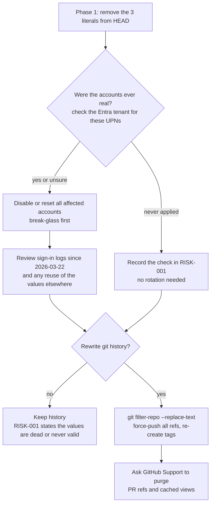

# ADR-0007: Secret handling for Entra bootstrap passwords

- **Status:** Proposed
- **Date:** 2026-09-28
- **Deciders:** Ayush (owner)

## Context and problem statement

Three Terraform files in a public repository contain literal passwords. The values are not reproduced anywhere in this plan.

| path:line | Account(s) | Why it matters |
|---|---|---|
| `Internal-IT/platform/domains/identity/entra-id/modules/core/users.tf:16` | Initial password shared by all `azuread_user.users` (24 people in `personnel.json`) | `force_password_change = true` (`:17`) |
| `…/entra-id/modules/privileged/break_glass.tf:6` | The break-glass account | `force_password_change = false` (`:7`) and `disable_password_expiration = true` (`:8`), and it is added to the tier0 group (`:11-14`). **If it was ever applied, the committed value is still the live, non-expiring password of a tier0 account.** |
| `…/entra-id/modules/privileged/admin_accounts.tf:9` | Initial password of the 4 privileged admin accounts | `force_password_change = true` (`:10`) |

The values have not changed since the earliest commit in the clone (89db3df, 2026-03-22; [research/terraform.md](../research/terraform.md) §5). They also sit in the pull-request refs `refs/pull/1..6/head` on GitHub, which you cannot rewrite.

Your risk register describes this as RISK-001 but says "even though current source is clean" (`risk-register.md:21`). **That is false for `main`** and must be corrected.

There are hints, not proof, that these accounts may have existed in a real tenant:

- The entra-id root has a real-looking `azurerm` backend (`entra-id/provider.tf:11-17`), and `remote-state/main.tf:1-23` defines exactly that storage account.
- The user principal names use a personal `onmicrosoft.com` tenant domain (`users.tf:5`).

Whether the accounts were ever real is **UNVERIFIED**, and only you can check.

> **Why this matters to you:** a secret is compromised the moment it is pushed to a public repository. Deleting it later does not un-publish it. The real question is not "how do I hide it?" but "was it ever valid, and is it still valid?" Rotation fixes the risk. Rewriting history only tidies up.

## Decision drivers

- No plaintext credential in `HEAD` (milestone M1, Phase 1).
- A committed value must never be a working credential.
- The fix must be explainable in an interview. Know which Terraform features actually protect a secret, and which only hide it.
- Don't destroy the evidence value of the history (ADR-0001) unless the risk demands it.
- Your own rule: "do not reproduce historical credential values in records" (`risk-treatment-plan.md:54`).

## Considered options

1. A variable with `sensitive = true`, supplied at apply time (for example `TF_VAR_…` from a secret store).
2. A `random_password` resource per account, exposed only through a `sensitive = true` output.
3. Remove the accounts, or at least the break-glass account, from Terraform and create them by hand.
4. Terraform **write-only arguments** (for example a `password_wo` attribute), which are never stored in plan or state. **UNVERIFIED** whether `azuread_user` supports this. It needs Terraform ≥ 1.11, while CI pins 1.7.5 (`test.yml:17`) and the root allows `azuread ~> 2.47` (`entra-id/provider.tf:5-7`).

What each option really protects:

- `sensitive = true` only hides the value from CLI and plan *display*. **The value is still written to the state file in plain text.** Your secret store becomes "whoever can read state".
- `random_password` also stores its result in state. But no human ever chooses or commits the value.
- Removing a secret from `HEAD` does **not** remove it from git history. `git log -p` still shows it forever, unless history is rewritten.

## Decision outcome

Chosen option: **2 for the regular and admin users, 3 for the break-glass account.**

- **Users and admins → option 2.** `random_password`, with `force_password_change = true` kept. The generated value only has to survive until first sign-in. It lives in state, which already has a dedicated backend (`entra-id/provider.tf:11-17`).
- **Break-glass → option 3.** An emergency account should not depend on the automation and state it exists to bypass. Create it by hand, keep the credential in offline custody, and document the procedure. This ties into RISK-013 / TRT-013 (`risk-treatment-plan.md:32`).

Two follow-up decisions depend on facts only you can check:

- **Rotation is required if and only if the accounts were ever real.** "Unsure" counts as real.
- **History rewrite comes only after rotation**, and only if you accept that it:
  - changes every commit SHA (the literals are in the earliest commits, so almost all of history changes);
  - breaks every existing clone (0 forks today);
  - orphans the SHAs that CI runs and the `baseline-2026-10` tag point to.
- Even after a rewrite, GitHub keeps PR refs and cached views until Support purges them. Any mirror or scraper that already copied the repository keeps its copy. **A rewrite never replaces rotation.**
- **Default if the accounts were never real: no rewrite.** Say so plainly in RISK-001.

## Consequences

### Positive

- `HEAD` has no plaintext credentials, and the one long-lived credential leaves code entirely.
- RISK-001 becomes accurate, with a dated check behind it.
- You can explain `sensitive` vs state vs history in an interview, which is a common question.

### Negative

- `random_password` values in state make the state file sensitive. Anyone with read access to the backend can read them.
- A manual break-glass account is one more procedure to maintain and test.
- If the accounts were real: work in the Entra portal (disable, reset, review sign-ins), outside this repository.
- If you rewrite history: broken clones and orphaned CI links, and still no guarantee the old values are gone from the internet.

## Pros and cons of the options

### 1. Variable + `sensitive`

- Good: small diff, and the value comes from outside the repository.
- Bad: someone still picks the value, and it ends up in state anyway.

### 2. `random_password` + sensitive output

- Good: no human-chosen secret, and a small diff.
- Bad: plaintext in state. It only fits accounts that must change password at first sign-in.

### 3. Manage outside Terraform

- Good: the secret never touches pipeline or state. It is the right fit for break-glass.
- Bad: drift from code, and a manual procedure.

### 4. Write-only arguments

- Good: nothing in state, if supported.
- Bad: **UNVERIFIED** provider support. It needs a Terraform upgrade that the rest of the repository is not ready for.

## Evidence

- `users.tf:16-17`, `break_glass.tf:6-8,11-14` and `admin_accounts.tf:9-10` under `Internal-IT/platform/domains/identity/entra-id/modules/`. Values not printed.
- [research/terraform.md](../research/terraform.md) §5: exactly 5 literal credential hits in the tree. The 3 Entra values are identical at all 3 root commits and at `HEAD`.
- After `git fetch origin '+refs/pull/*/head:refs/remotes/origin/pr/*'`, `git rev-parse refs/remotes/origin/pr/1:<path>` and `…/pr/6:<path>` return the same blob IDs as `main` for all 3 files. The values are therefore in GitHub PR refs. The file is present in all 6 PR refs.
- `Internal-IT/platform/domains/identity/entra-id/provider.tf:11-17` (backend) and `Internal-IT/platform/foundation/remote-state/main.tf:1-23`.
- `Governance/ISMS/03-risk-management/risk-register.md:21` (wrong "clean" claim), `risk-treatment-plan.md:20` (TRT-001 steps) and `:54`.
- [research/codex.md](../research/codex.md) §1: repository is public, `forks_count: 0`.

## Links

- Related: [ADR-0001](0001-fix-not-restart.md) (history as evidence), [ADR-0009](0009-governance-links-evidence.md) (fix RISK-001 text), [ADR-0013](0013-no-cloud-creds-for-plan-only.md)
- Phase playbook: [phase 1 – secrets](../05-phase-playbooks/phase-1-secrets.md)
