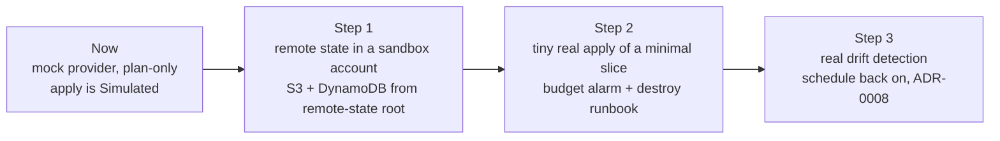

# ADR-0010: Mock-provider plan-only workloads now; path to a real sandbox apply later

- **Status:** Proposed
- **Date:** 2026-09-28
- **Deciders:** Ayush (owner)

## Context and problem statement

Both gated workloads are planned but never applied.

**ayka-portal** uses a mock AWS provider (`ayka-portal/provider.tf:17-33`):

- static placeholder keys (`:19-20`, which contain "mock");
- `skip_credentials_validation`, `skip_metadata_api_check`, `skip_region_validation` and `skip_requesting_account_id` (`:21-24`);
- `default_tags` (`:26-32`).

Combined with `-refresh=false` (`plan/action.yml:42`), it plans 87 resources fully offline ([research/terraform.md](../research/terraform.md) §6).

**control-validation-scenarios** has the same `skip_*` flags but **no static keys** (`control-validation-scenarios/provider.tf:12-21`). Its plan only works because CI puts real OIDC credentials in the environment (ADR-0013).

**The apply is simulated.** Commit 243c3b1 replaced a real `terraform apply` with an `echo` of "14 added" (`run-apply.sh:24-27`), while the real plan is 87 creates.

Your own risk register already accepts this state, with conditions:

- **RISK-008**, "a reviewer could mistake the mock-provider … for a deployed platform", has response "Accept with constraints" and status "acceptance pending" (`risk-register.md:28`).
- **TRT-008** says: keep the workload offline and simulated, and prohibit real credentials and apply (`risk-treatment-plan.md:27`).
- The interim constraints say "do not run a live apply from the demonstrated pipeline" (`:50`).
- TRT-002 puts state custody before any live apply (`:21`), and RISK-012 says to avoid live apply (`risk-register.md:32`).

The question is whether to keep it that way, and what would have to be true before anything real is applied.

> **Why this matters to you:** a plan-only gate is a legitimate design. Many real pipelines gate the *plan* and apply elsewhere. What hurts credibility is the fake "Apply complete!" line and a README that implies deployment. Say "plan-only by design, and here is my staged path to a real apply". That is a senior answer.

## Decision drivers

- Zero cloud cost and zero cloud risk while the gate is being fixed (Phases 1–5).
- Follow your own RISK-008 / TRT-008 constraints until you deliberately change them.
- A later real apply must be small, capped in cost and reversible.
- Don't add new tools before Phase 5 (ADR-0002).

## Considered options

1. Stay mock plan-only permanently.
2. Mock plan-only now; a staged path to a small real sandbox apply in Phase 6.
3. Apply the full ayka-portal to a real account now.
4. Use a local AWS emulator (such as LocalStack) for the apply step.

## Decision outcome

Chosen option: 2.

- **Now (Phases 1–5):**
  - Both workloads plan with mock credentials only (ADR-0013).
  - The apply job is labelled **Simulated** and prints so (ADR-0006).
  - RISK-008 stays "accept with constraints". Write down the acceptance itself when you accept this ADR.
- **Later (Phase 6)**, in order, and each step only after the previous one works:

1. **Remote state.** Reuse the existing AWS bootstrap in `Internal-IT/platform/foundation/remote-state/bootstrap.tf:5-40`: S3 bucket with versioning and SSE, plus a DynamoDB lock table. Before use:
   - add an S3 public-access block;
   - add a version constraint for the `aws` provider, which is unconstrained today ([research/terraform.md](../research/terraform.md) §1).
2. **Tiny real apply** of a minimal slice, not all 87 resources. For example the storage module or the KMS key, and nothing with a NAT gateway, RDS or ALB. Add:
   - a budget alarm, reusing the `aws_budgets_budget` pattern in `landing-zone/modules/cost_controls/main.tf:2-4`;
   - a `terraform destroy` runbook;
   - a separate, narrowly trusted role (ADR-0013);
   - required reviewers on the apply environment (TRT-005, `risk-treatment-plan.md:24`).

   Update RISK-008, TRT-002, TRT-008 and the interim constraints **before** this step, not after.
3. **Real drift.** Only once state and applied resources exist (ADR-0008).

## Consequences

### Positive

- The gate work stays free and risk-free.
- The path is concrete and uses code you already have (remote-state bootstrap, budget module).
- Each step produces new evidence you can link (ADR-0009), which is a real upgrade from Simulated to Implemented.

### Negative

- Until Phase 6 the project stays "plan-only". Some reviewers want to see real infrastructure.
- A real apply costs money and needs a sandbox AWS account you control. Exact cost is **UNVERIFIED** and depends on the slice. The budget alarm limits surprises; it does not prevent them.
- ayka-portal as written would probably not apply cleanly. Reasons (**UNVERIFIED**, reasoning only, [research/terraform.md](../research/terraform.md) §9 item 10):
  - the KMS key policy trusts the placeholder account `123456789012` (`kms.tf:19`);
  - the AMI is a placeholder;
  - the ALB log bucket uses SSE-KMS.

  That is another reason to start with a small slice.
- Regions are split: workloads use ap-south-1 (`ayka-portal/variables.tf:1-4`), while the state bucket is in eu-central-1 (`bootstrap.tf:2`). That works, but it needs one sentence of explanation. RISK-011 already flags inconsistent Region statements.

## Pros and cons of the options

### 1. Mock forever

- Good: free and simple.
- Bad: "Simulated" forever. Drift is never meaningful.

### 2. Mock now, staged sandbox later

- Good: safe now, credible later, and every step is small.
- Bad: needs discipline to not skip steps.

### 3. Full real apply now

- Good: real infrastructure to show.
- Bad: breaks your own RISK-008 / TRT-002 / TRT-005 conditions, costs money, and the code likely fails to apply. It also distracts from fixing the gate.

### 4. LocalStack or another emulator

- Good: "apply" without an AWS bill.
- Bad: a new tool (against ADR-0002 for now), and still a simulation. Its service coverage for this workload is **UNVERIFIED**.

## Evidence

- `Internal-IT/workloads/ayka-portal/provider.tf:17-33` and `Internal-IT/workloads/control-validation-scenarios/provider.tf:12-21`.
- `.github/actions/plan/action.yml:42`: `terraform plan -input=false -refresh=false`.
- [research/terraform.md](../research/terraform.md) §4 and §6: 87 offline creates. Scenarios plan fails without credentials ("No valid credential sources found") and succeeds with mock env credentials.
- `Internal-IT/engineering/ci-cd/scripts/run-apply.sh:24-27`. [research/terraform.md](../research/terraform.md) §4: 243c3b1 replaced the real apply.
- `Governance/ISMS/03-risk-management/risk-register.md:28,32` and `risk-treatment-plan.md:21,24,27,50`.
- `Internal-IT/platform/foundation/remote-state/bootstrap.tf:1-40` and `Internal-IT/platform/foundation/landing-zone/modules/cost_controls/main.tf:2-4`.

## Links

- Related: [ADR-0006](0006-honesty-labelling.md), [ADR-0008](0008-drift-manual-only.md), [ADR-0013](0013-no-cloud-creds-for-plan-only.md)
- Phase playbooks: [phase 4](../05-phase-playbooks/phase-4-pipeline-green.md), [phase 6 – next growth](../05-phase-playbooks/phase-6-next-growth.md)
