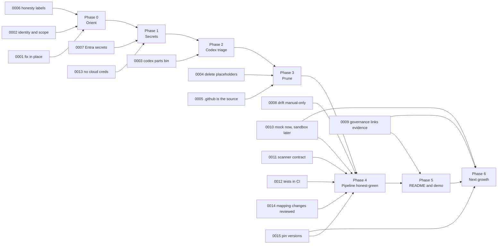

# Architecture Decision Records (ADRs)

## What an ADR is and how to use these

An ADR is a short record of **one** decision: the problem, the options that were considered, the choice, and its costs. These use the [MADR](https://adr.github.io/madr/) layout. Every file has the same sections, so you can compare them quickly:

1. Context
2. Drivers
3. Options
4. Outcome
5. Consequences
6. Pros and cons
7. Evidence
8. Links

All 15 records below were written by the planning session on 2026-09-28 and are **Proposed**. They are not in effect until you accept them. Read each one, then edit its `Status` line yourself:

- **Accepted** when you agree, or **Rejected** when you don't. A Rejected ADR stays in the folder as a record of the idea you turned down.
- Don't rewrite an accepted ADR when you change your mind later. Write a new one ("ADR-0016: … supersedes ADR-0008"), and set the old one's status to `Superseded by ADR-0016`. The history of *why* you changed course is part of the value.
- An ADR that blocks a phase (see the diagram) should be Accepted or Rejected **before** you start that phase.

Citation conventions:

- `path:line` is relative to the repository root, at `main` = `53b0532`.
- Research notes from the planning session are in [`../research/`](../research/). They use the same section numbers the ADRs cite.
- **UNVERIFIED** marks anything the planning session could not confirm. Check it yourself before relying on it.

## Index

| No. | Title | Status | Decided in phase | One-line decision |
|---|---|---|---|---|
| [0001](0001-fix-not-restart.md) | Fix in place instead of restarting | Proposed | 0 | Keep `main` and its 68-run history, and fix the known defects in small commits. No restart, no AI merge. |
| [0002](0002-identity-and-scope.md) | Project identity and scope boundary | Proposed | 0 (platform archive: open, end of 3) | Refine the identity sentence. The gate is in scope, platform roots are design-only context, and SIEM, SOC 2, Terragrunt and similar claims are out. |
| [0003](0003-codex-branch-parts-bin.md) | Codex AI-cleanup branch is a parts bin, never merged | Proposed | 2 | If found locally, archive it as a bundle and re-implement ideas by hand. If not found by the end of Phase 2, declare it lost. |
| [0004](0004-delete-placeholders.md) | Remove placeholder and empty files rather than filling them | Proposed | 3 | Delete 153 empty or title-only files. Keep your ISO skeleton as one "planned documents" table in `Governance/ISMS/README.md`. |
| [0005](0005-github-single-source-of-truth.md) | `.github/` is the single source of truth for pipelines | Proposed | 3 | Delete the 14 empty `ci-cd/pipelines/*.yml`, the 2 `templates/` symlinks and the unused `policy-check.yml`. Scripts stay where they are. |
| [0006](0006-honesty-labelling.md) | Implemented / Simulated / Planned labels | Proposed | 0 (applied in 4–5) | Every capability claim gets the weakest true label and a link to evidence. |
| [0007](0007-entra-bootstrap-secrets.md) | Secret handling for Entra bootstrap passwords | Proposed | 1 | Use `random_password` for users and admins, take break-glass out of Terraform, rotate only if the accounts were ever real, and rewrite history only after rotation. |
| [0008](0008-drift-manual-only.md) | Drift detection manual-only until a remote backend exists | Proposed | 4 | Remove the nightly cron, add a no-backend guard, and handle every plan exit code. |
| [0009](0009-governance-links-evidence.md) | Governance documents must link to real evidence | Proposed | 5 (RISK-001 text in 1) | Replace the 10 `AUDIT/` links with `path:line`, run URLs or committed evidence snapshots, and correct statuses that describe code not on `main`. |
| [0010](0010-mock-plan-only-then-sandbox.md) | Mock-provider plan-only now; path to a real sandbox apply later | Proposed | 4 (path in 6) | Stay plan-only now. Later go remote state, then a tiny real apply with a budget alarm, then real drift. |
| [0011](0011-fail-closed-scanner-contract.md) | Fail-closed scanner contract | Proposed | 4 | Every scanner result must exist, be non-empty, be schema-valid and name its target. Unmapped findings get at least MEDIUM. |
| [0012](0012-tests-run-in-ci.md) | Evaluator unit tests and OPA policy tests run in CI as a gate | Proposed | 4 | A `unit-tests` job (pytest plus `opa test`, failing on 0 tests) runs before any scan. |
| [0013](0013-no-cloud-creds-for-plan-only.md) | Plan-only CI does not assume the real AWS OIDC role | Proposed | 1 (AWS check), 4 (YAML) | Remove OIDC and `id-token: write`, use mock environment credentials for both workloads, and inspect or delete the role in AWS. |
| [0014](0014-control-mapping-changes-reviewed.md) | Severity and mapping changes need a written reason | Proposed | 4 | A `rationale` on every control, enforced by a test, changes via PR with required checks, and one expiring exceptions list. |
| [0015](0015-pin-tool-versions.md) | Pin tool versions; keep Rego v0 now, migrate later | Proposed | 4 (Rego v1 in 6) | SHA-pin every action, pin Checkov and TFLint, verify downloads by sha256, and keep conftest v0.45.0 until the Phase 6 Rego migration. |

## Which ADRs block which phase

An arrow from an ADR to a phase means: accept or reject that ADR before starting the phase.

## Links

- Plan entry point: [../README.md](../README.md)
- How the pipeline works: [../how-it-works.md](../how-it-works.md)
- Research notes the ADRs cite: [../research/](../research/)
- Phase playbooks: [../05-phase-playbooks/](../05-phase-playbooks/)
