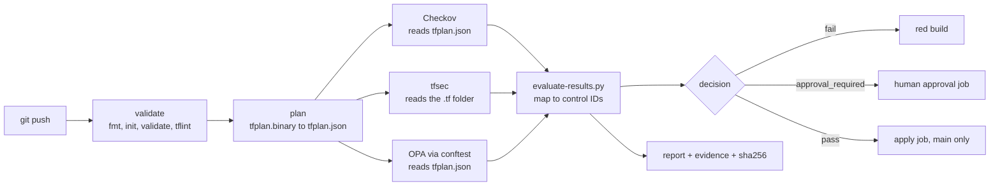
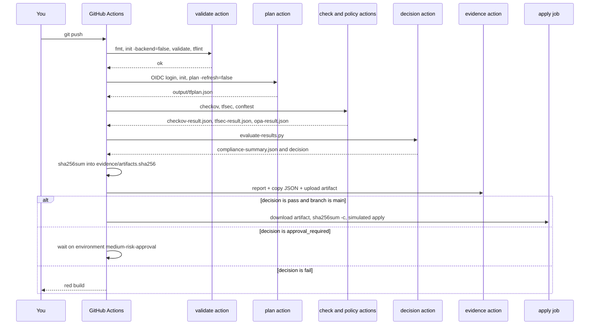
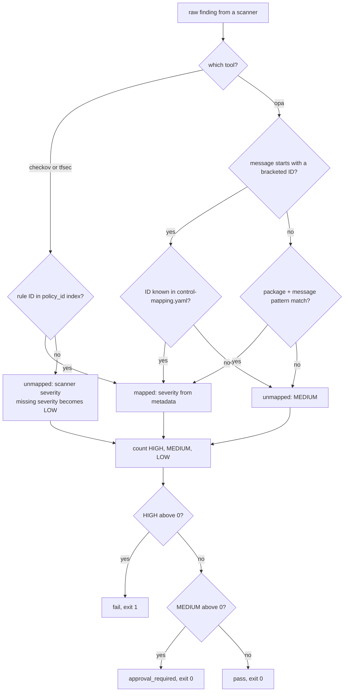
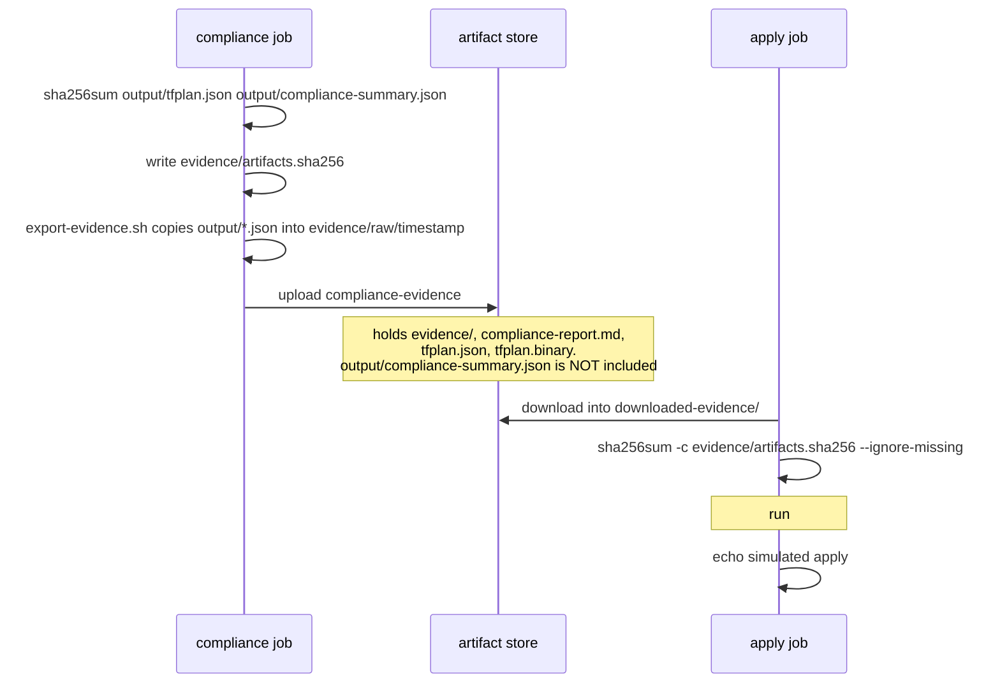

# How it works: re-learn your own pipeline in 30 minutes

> **Who this is for:** you, three months from now, or right before an interview.
> **How to use it:** read it top to bottom once with the code open next to it. Every claim points at a file and line, so you can check it yourself instead of trusting this page.
> **Evidence date:** code at `main` = `53b0532`; CI evidence from GitHub Actions run #68 on 2026-08-23 ([run link](https://github.com/Ayush-cloud06/Ayka-Secure-Technologies-GmbH/actions/runs/32621618951)).

---

## 1. The 30-second version

Your project takes a Terraform **plan** (what *would* change) and asks three independent scanners what is wrong with it. It then translates every complaint into **your own control IDs** (from `control-mapping.yaml`) and makes one of three decisions:

| Decision | When | What CI does |
|---|---|---|
| `fail` | at least one HIGH finding | job goes red, apply is impossible |
| `approval_required` | no HIGH, at least one MEDIUM | job stays green, a human-approval job is supposed to hold the apply |
| `pass` | only LOW (or nothing) | apply job becomes eligible (on `main` only) |

Source: `Internal-IT/engineering/ci-cd/scripts/evaluate-results.py:417-421`.

Every run leaves behind an evidence bundle: raw scanner JSON, the decision summary, a Markdown report, and a SHA-256 checksum file.



---

## 2. The stages, one by one

The entry point is `.github/workflows/test.yml` ("PR Compliance Pipeline"). Despite the name, it triggers on **every push to any branch** and on manual dispatch, not on pull requests (`test.yml:3-10`).

It runs three jobs:

1. `validate-scripts`: runs `bash -n` on every CI shell script (`test.yml:24-33`).
2. `compliance`: calls the reusable workflow `terraform-workflow.yml` for `ayka-portal` (`test.yml:35-42`). This is the "should pass" workload.
3. `regression`: runs the same composite actions against `control-validation-scenarios` (`test.yml:44-98`). This is the "should fail" workload.

### Stage table (what goes in, what comes out)

| # | Stage | Where | Reads | Writes |
|---|---|---|---|---|
| 1 | Validate | `.github/actions/validate/action.yml:26-43` | `*.tf` | nothing (pass/fail only) |
| 2 | Plan | `.github/actions/plan/action.yml:23-50` | `*.tf`, OIDC creds | `output/tfplan.binary`, `output/tfplan.json` |
| 3 | Cost hook | `terraform-workflow.yml:82-84` → `run-cost-check.sh` | nothing | prints "Simulated cost check: Passed." (infracost is not installed) |
| 4 | Checkov | `check/action.yml:22-24` → `run-checkov.sh:13-16` | `output/tfplan.json` | `output/checkov-result.json` |
| 5 | tfsec | `check/action.yml:26-28` → `run-tfsec.sh:13-19` | the **folder** in `$WORKLOAD_DIR` (default `ayka-portal`) | `output/tfsec-result` ⚠️ and `output/tfsec-result.json` (see section 5) |
| 6 | OPA | `policy/action.yml:15-17` → `run-policy-check.sh:17-28` | `output/tfplan.json`, `policy-as-code/OPA/**` | `output/opa-result.json`, `output/opa-result.stderr.log` |
| 7 | Decision | `decision/action.yml:21-49` → `evaluate-results.sh` → `evaluate-results.py` | the 3 result files + `control-mapping.yaml` | `output/compliance-summary.json`, job outputs |
| 8 | Checksum | `terraform-workflow.yml:96-105` | `tfplan.json`, `compliance-summary.json` | `evidence/artifacts.sha256` |
| 9 | Evidence | `evidence/action.yml:13-32` → `generate-report.py`, `export-evidence.sh` | `output/*.json` | `output/compliance-report.md`, `evidence/raw/<timestamp>/*.json`, uploaded artifact `compliance-evidence` |
| 10 | Approval | `terraform-workflow.yml:113-125` | decision output | waits on GitHub environment `medium-risk-approval` |
| 11 | Apply | `terraform-workflow.yml:127-150` → `apply/action.yml` → `run-apply.sh` | downloaded artifact | **simulated**: prints a hard-coded "Apply complete!" line (`run-apply.sh:24-27`) |

> **Why a plan and not the code?** Checkov and OPA read `tfplan.json`, which is Terraform's resolved view: variables filled in, modules expanded, `count` evaluated. A rule like "no SSH from 0.0.0.0/0" can then see the final value, even when it comes from a variable. The trade-off is that anything only known *after* apply (IDs, ARNs) shows up as "unknown". Some of your OPA rules trip over this (section 6).

### One PR-style run as a sequence



---

## 3. How one finding travels: scanner → control ID → severity → decision

Let's follow a real finding from your regression workload: the deliberately open SSH security group.

**Step 1: the Terraform.** `Internal-IT/workloads/control-validation-scenarios/ec2/open-ssh-security-group/main.tf:5-10` opens port 22 to `0.0.0.0/0`.

**Step 2: the OPA rule fires.** `Internal-IT/engineering/policy-as-code/OPA/terraform/aws_ec2.rego:6-21` walks the plan and emits a message that *starts with a control ID in brackets*:

```text
[EC2_OPEN_SSH] Security group module.ec2_openssh[0].aws_security_group.open_ssh allows SSH (22) from the internet
```

**Step 3: conftest writes JSON.** Roughly this shape, one entry per namespace:

```json
[{"filename": "output/tfplan.json",
  "namespace": "policies.terraform.aws_ec2",
  "failures": [{"msg": "[EC2_OPEN_SSH] Security group ... allows SSH (22) from the internet"}]}]
```

**Step 4: the evaluator maps it.** `resolve_opa_mapping` (`evaluate-results.py:162-217`) tries, in order:

1. **Bracket prefix.** The regex at `evaluate-results.py:29` pulls out `EC2_OPEN_SSH`, which is looked up in the control index (`:163-178`).
2. **Package + message pattern.** If there is no prefix, it checks whether the namespace's controls list a `message_patterns` substring (`:190-206`).
3. **Unmapped.** Otherwise the finding becomes MEDIUM with `mapping_method: opa_default` (`:208-217`).

Checkov and tfsec findings take a simpler path: their rule ID (`CKV_AWS_21`, `AVD-AWS-0107`) is looked up in the `policy_id` index (`resolve_scanner_mapping`, `:137-159`).

**Step 5: severity comes from YOUR metadata, not from the scanner.** Once a finding is mapped, its severity is the control's `severity` from `control-mapping.yaml` (`:155`, `:174`). `EC2_OPEN_SSH` is `HIGH` (`control-mapping.yaml:5`).

**Step 6: the decision.** One HIGH gives `decision: fail` (`:417-418`). The script exits 1 (`:453-454`), so the step, the job and the build go red.



### The four mapping methods you will see in `compliance-summary.json`

| `mapping_method` | Meaning | Severity source |
|---|---|---|
| `policy_id` | Checkov/tfsec rule ID found in the mapping | `metadata` |
| `control_id_prefix` | OPA message began with `[CONTROL_ID]` | `metadata` |
| `policy_package_message_pattern` | OPA package + substring match | `metadata` |
| `scanner_default` / `opa_default` / `control_id_prefix_unmapped` | nothing matched | scanner value, or MEDIUM for OPA |

> **Why map to your own control IDs at all?** Scanners speak in *their* rule IDs (`CKV_AWS_21`, `AVD-AWS-0090`). Auditors speak in *controls* ("S3 versioning", ISO A.8.13). The mapping file translates between them and lets **you** decide severity, so two scanners reporting the same problem roll up to one control (see `S3_VERSIONING_DISABLED`, which has Checkov and tfsec enforcements, `control-mapping.yaml:80-99`).
>
> **The catch (an interview question):** whoever edits `control-mapping.yaml` controls the gate. Setting a control to `LOW` makes the finding non-blocking. In run #68 all 14 ayka-portal findings were mapped to LOW controls (e.g. `CKV2_AWS_5` → `SECURITY_GROUP_UNUSED`, `control-mapping.yaml:560-575`). Each LOW choice needs a written reason. Phase 4 covers that.

---

## 4. What "fail-closed" means here and where it is true

**Fail-closed** means: *if the gate cannot prove the plan is safe, it must not say "pass".* A crashed scanner, a missing file or garbage JSON should turn the build red, never green.

Where your code does this **correctly**:

| Situation | Behaviour | Code |
|---|---|---|
| A result file is missing | exit 1 | `evaluate-results.sh:13-18` |
| A result file is not valid JSON | exit 1 | `evaluate-results.py:32-37` |
| conftest crashed (exit >1 or empty output) | an error payload is written; the evaluator exits 1 | `run-policy-check.sh:24-28`, `write-opa-error-result.py`, `evaluate-results.py:282-285` |
| OPA output is not a list | exit 1 | `evaluate-results.py:287-289` |
| An unknown OPA message | counted as MEDIUM (needs approval), not ignored | `evaluate-results.py:208-217` |

Where it currently **fails open** (confirmed; fixed in Phase 4):

| Gap | Why it is open | Evidence |
|---|---|---|
| **tfsec results are always dropped** | `tfsec --format json --out output/tfsec-result` writes a file literally named `tfsec-result`. The script then finds no `tfsec-result.json` and writes `{"results":[]}` | `run-tfsec.sh:13-19`; run #68 log lists `tfsec-result` (4137 bytes) *and* `tfsec-result.json` (15 bytes); `by_tool` shows only checkov + opa |
| The "missing file" safety net is defeated for tfsec | the fallback creates the file the evaluator was going to check for | `run-tfsec.sh:17-19` vs `evaluate-results.sh:13-18` |
| tfsec scans the wrong folder in the regression job | `WORKLOAD_DIR` is set to ayka-portal at workflow level and never overridden | `test.yml:13`, `run-tfsec.sh:9`; run #68 regression log env |
| Checkov on a missing or unreadable plan still "succeeds" | Checkov exits 0 with `failed_checks: []` plus `parsing_errors`, and the evaluator never looks at `parsing_errors`. Zero findings means `pass` | `run-checkov.sh:13-16`, `evaluate-results.py:222`; reproduced with Checkov 3.3.20 |
| Unmapped Checkov findings can never block | open-source Checkov reports `severity: null` (all 14 portal and 23 scenario findings), and `None` becomes LOW | `evaluate-results.py:48-54`, `:229` |
| A realistic bad plan passes | a probe plan with public SSH (via `aws_vpc_security_group_ingress_rule`), a root-module EC2 with IMDSv1 and an IAM policy with `Action = ["*"]` got `pass` (16 LOW, OPA 0). The Checkov checks that catch these (CKV_AWS_24, CKV_AWS_79, CKV_AWS_62/63) aren't mapped, so they fall to LOW | local probe run, 2026-09-28; see section 6 |
| The regression job cannot fail on a missed violation | if the decision is not `fail` it only prints `WARNING` | `test.yml:94-98` |
| Human approval may be a rubber stamp | the apply job started ~4 s after it was queued in run #68. That suggests environment `manual-apply-approval` has no required reviewers (**UNVERIFIED**: check Settings → Environments) | run #68 job timings |

> **How to say it in an interview:** "The evaluator itself is fail-closed on missing or malformed input. When I came back to the project I found that the tfsec wrapper defeated that by writing an empty fallback file, so tfsec findings were silently dropped. I fixed it and added a test that feeds the wrapper a missing file." (Only say the last sentence once Phase 4 is done.)

---

## 5. How the evidence checksums work



- **What is hashed:** `output/tfplan.json` and `output/compliance-summary.json` (`terraform-workflow.yml:100-101`).
- **When:** only if the decision step succeeded. The checksum step has no `if: always()`, so a `fail` run has no checksum file. That's acceptable, because a failed run must never be applied.
- **What is verified:** `run-apply.sh:14` runs `sha256sum -c … --ignore-missing`. The summary is not in the uploaded artifact under `output/`, so only the plan JSON is actually checked. Run #68 prints exactly one line: `output/tfplan.json: OK`.
- **What it proves:** the plan JSON the apply job received is byte-identical to the one that was scanned. That catches accidental corruption or a mix-up between runs.
- **What it does NOT prove:** that nobody tampered with it. The hash file travels **inside the same artifact** as the files it protects, so anyone who can rewrite the artifact can rewrite the hash too. Real tamper-evidence needs the hash stored somewhere the attacker can't write (a signed attestation, or an append-only store). That's a Phase 6 idea, not core scope.
- **Retention:** GitHub artifacts expire. Run #68's evidence expires on **2026-11-21** (GitHub API `expires_at`). Download it if you want to keep your last green baseline.

---

## 6. OPA rules: what they can and cannot see

- All rules in `OPA/terraform/*.rego` loop over `input.planned_values.root_module.child_modules[_].resources` (e.g. `aws_ec2.rego:7`). So they only see resources **exactly one module deep**:
  - Resources in the root module, like `ayka-portal/kms.tf`, are invisible to OPA.
  - Resources in nested modules are invisible too.
- **SSH/HTTP rules only read inline `ingress` blocks** with exact ports, `protocol == "tcp"` and IPv4 `0.0.0.0/0` (`aws_ec2.rego:6-39`). Standalone rule resources (`aws_vpc_security_group_ingress_rule`, `aws_security_group_rule`), `protocol = "-1"` and `::/0` are missed. ayka-portal uses only standalone rules (`modules/security/main.tf:56-136`).
- **`IAM_WILDCARD_POLICY` only matches `"Action": "*"` as a string** (`aws_iam.rego:11-15`). It misses `["*"]`, `NotAction`, service wildcards, and policies whose JSON is unknown at plan time.
- **`VPC_FLOW_LOGS_MISSING` is broken both ways** (`aws_vpc.rego:18,26-31`), confirmed with `opa eval`:
  - on a new VPC the `id` is unknown, so the rule never fires;
  - it compares `fl.values.resource_id`, but `aws_flow_log` has no such attribute in provider 5.100.0 (it's `vpc_id`), so on a known VPC id it always fires.
  - Checkov's `CKV2_AWS_11` still covers this control.
- **`NETWORK_ACL_UNRESTRICTED_INGRESS` has never been able to fire**: it checks `entry.rule_action` (`aws_vpc.rego:57`), but an inline `aws_network_acl` ingress entry has `action`. A new rego unit test fails on the original rule and passes after the one-word fix (planning prototype, see [Phase 4](05-phase-playbooks/phase-4-pipeline-green.md)). Combined with the empty NACL scenario, this HIGH control has never been exercised.
- **`ROUTE_TABLE_PUBLIC_IGW` never fires on a fresh plan**: `gateway_id` is absent until apply (`aws_vpc.rego:39-41`).
- **`IAM_USER_MFA_MISSING` compares the wrong fields**: it checks the resource label against `mfa.values.user`, but the attribute is `user_name` (`aws_iam.rego:48-66`). So it fires for every IAM user.
- `aws_s3.rego:4-30` doesn't link an ACL or encryption config to its bucket:
  - *any* public-read ACL in a module flags *every* bucket in it;
  - *any* encryption config satisfies all of them.
- OPA findings always have `resource: null`, because no rule emits `metadata` (`evaluate-results.py:306`).
- `OPA/aws/s3.rego` and `OPA/aws/ec2.rego` expect a made-up input (`input.buckets`, `input.instances`). They never fire on a plan, but they are still loaded, because `run-policy-check.sh:14` passes the whole `OPA/` folder. They are dead code.
- The rules use pre-OPA-1.0 syntax (`deny[msg] { … }`). They work with the pinned conftest `v0.45.0` (`policy/action.yml:11`). A newer conftest/OPA would reject them unless you migrate to `deny contains msg if { … }`.

---

## 7. Why there are two workloads

| Workload | Role | Expected | Actual (run #68) |
|---|---|---|---|
| `Internal-IT/workloads/ayka-portal` | realistic app (VPC, ALB, ECS, EC2, RDS, S3, KMS…) | pass with LOW only | `pass`: 0 HIGH / 0 MEDIUM / 14 LOW (all Checkov) |
| `Internal-IT/workloads/control-validation-scenarios` | deliberately broken ("negative test") | fail with HIGH | `fail`: 4 HIGH / 8 MEDIUM / 17 LOW (29 findings: Checkov 23, OPA 6) |

> **Why this matters:** a gate that has never been shown to *fail* proves nothing. The scenarios are your proof that the gate bites.

**What changes once tfsec is counted** (measured locally on 2026-09-28 by reading the real `tfsec-result` file):

| Workload | Today | With tfsec counted | New tfsec findings |
|---|---|---|---|
| ayka-portal | `pass` 0 / 0 / 14 | **`fail`** 3 / 1 / 14 | public ALB AVD-AWS-0053 (by design, unmapped HIGH); IAM wildcard AVD-AWS-0057 ×2 on a log-group ARN (false positive, unmapped HIGH); access-log bucket without logging AVD-AWS-0089 → `S3_LOGGING_DISABLED` (MEDIUM) |
| scenarios (scanning the right folder) | `fail` 4 / 8 / 17 | `fail` 17 / 16 / 21 | 25 findings, 23 mapped |

That isn't a regression; it's the truth becoming visible. Phase 4 fixes or documents each portal finding.

> **Also worth knowing:** your `# checkov:skip=` comments don't work in this pipeline. Checkov scans `tfplan.json`, which contains no source comments. Eight of the 14 portal findings are ones you tried to skip, e.g. `CKV2_AWS_5` at `modules/security/main.tf:28-49`. Checkov's `--repo-root-for-plan-enrichment` option would honour 3 of them; the other 5 sit outside their resource block.

---

## 8. Self-check (answer without looking, then verify)

1. Which file decides severity for a mapped Checkov finding: Checkov, or you?
2. What makes a run `approval_required`, and which job reacts to it?
3. Name two fail-closed behaviours and one fail-open gap, with file:line.
4. What exactly does the checksum protect against, and what not?
5. Why can't the OPA flow-log rule be trusted on a plan?
6. Why does the regression job currently stay green even if the gate misses a violation?

<details><summary>Answers</summary>

1. You: `control-mapping.yaml` severity (`evaluate-results.py:155`).
2. No HIGH plus at least one MEDIUM (`:419-421`); `medium-risk-approval` (`terraform-workflow.yml:113-125`).
3. Missing file (`evaluate-results.sh:13-18`), bad JSON (`evaluate-results.py:32-37`); the tfsec fallback (`run-tfsec.sh:17-19`).
4. It catches accidental change of `tfplan.json` between the scan and apply jobs. It doesn't stop deliberate tampering, because the hash lives in the same artifact.
5. On a new VPC the `id` is unknown at plan time, so it never fires. It also reads a `resource_id` attribute that `aws_flow_log` doesn't have, so on a known VPC it always fires (`aws_vpc.rego:18,26-31`).
6. `test.yml:94-98` only prints a WARNING.

</details>
