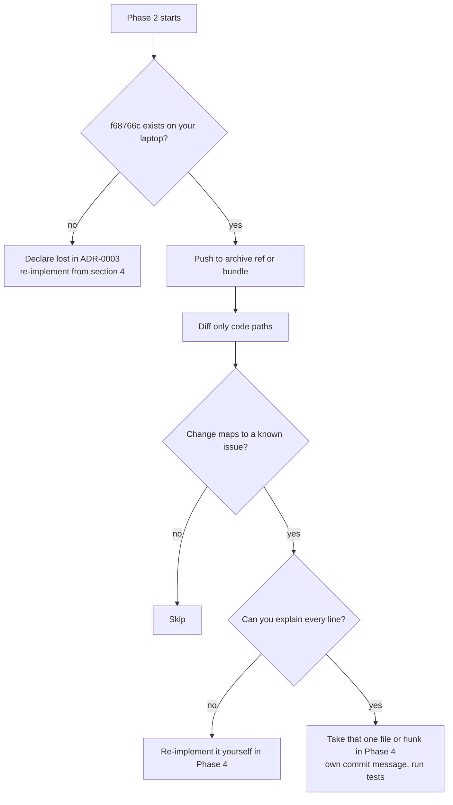

# Codex AI-cleanup branch: triage

> **Bottom line:** the AI cleanup branch (`codex/pre-restore-ai-cleanup-20260823`, commit `f68766c`) **is not on GitHub and was never pushed**. This session could not see a single line of it.
> - The per-change "take / skip" table you asked for therefore cannot be filled in from the real diff.
> - Instead, this file:
>   1. proves where the branch is *not*;
>   2. gives you the commands to recover it from your laptop;
>   3. lists every fix the cleanup was supposed to contain, checked against `main`, with a recommendation to **re-implement it yourself**.
>
> Decision record: [ADR-0003](../adr/0003-codex-branch-parts-bin.md). Playbook: [Phase 2](../05-phase-playbooks/phase-2-codex-branch-triage.md).

---

## 1. Where the branch is not (evidence)

| Check | Command / source | Result |
|---|---|---|
| Local object | `git cat-file -t f68766c` | `fatal: Not a valid object name f68766c` |
| Fetch by SHA | `git fetch origin f68766c` | `fatal: couldn't find remote ref f68766c` |
| Fetch by name | `git fetch origin refs/heads/codex/pre-restore-ai-cleanup-20260823` | `couldn't find remote ref` |
| Remote refs | `git ls-remote origin` | only `HEAD`, `refs/heads/main` (`53b0532`), `refs/pull/1..6/head` |
| GitHub branches | GitHub API `list_branches` | `main` only, `protected: false` |
| GitHub commit | GitHub API `get_commit f68766c` | "No commit found" (REST: HTTP 422) |
| Force pushes ever | GitHub activity API `activity_type=force_push` | 0 events |
| Branches ever created | activity API `branch_creation` | `main` (2026-01-16), `test-pipeline`, `test-pipeline-2` (2026-03-22) |
| Actions runs | 131 runs | only on `main` and `test-pipeline-2` |
| PR refs 1–6 | `git fetch origin '+refs/pull/*/head:…'` | all March-2026 test-pipeline PRs, all already ancestors of `main` |

Source: research agent D-codex, 2026-09-28. Raw API JSON kept in the session scratchpad (not committed).

### What `fe1b27e "Revert: cleanup"` actually is

It is **not** a `git revert`. Its parent is `243c3b1` ("mock creds for pipeline", 2026-04-15). `git show --stat fe1b27e` reports 89 files changed, +100 / −2:

- **84 new one-line `# Title` files** under `Governance/ISMS/00…11` (these paths never existed before);
- **3 previously empty files** given a heading (`Governance/ISMS/README.md`, two files in `04-controls-and-soa/`);
- `.gitignore` gains `annotations`, `graphify-out`, `AUDIT/`;
- `Governance/ISMS/tree.md` updated.

And: `git diff --stat 243c3b1 53b0532 -- tests .github Internal-IT` is **empty**. Every line of code on `main` today is exactly what you had on **15 April 2026**.

> **Why this matters to you:** you don't need to "undo" anything. `main` already *is* your own pre-AI code. The only AI traces left on `main` are the 84 file *names* you kept as stubs, and the risk docs' links to the local `AUDIT/` folder (see [ADR-0009](../adr/0009-governance-links-evidence.md)).

---

## 2. Recover it from your laptop (run there, not here)

```bash
# 1. Does it still exist?
git cat-file -t f68766c
git branch -a --list 'codex/*'
git reflog | grep -iE 'codex|cleanup|f68766c'

# 2. If it exists, check your memory of its size
git diff --shortstat main f68766c        # you remembered: 293 files, +9.5k / -3.8k

# 3. Back it up WITHOUT touching main (pick one)
git push origin f68766c:refs/heads/archive/codex-ai-cleanup-20260823
#   or keep it private:
git bundle create ~/codex-ai-cleanup.bundle f68766c ^main
```

If step 1 prints nothing, the branch is gone. That's fine: section 4 shows that every fix it was supposed to contain is small enough to redo by hand.

---

## 3. How to triage it IF you recover it

Only code paths matter. Ignore every `.md` file in the codex diff: you already rejected its docs, and ADR-0004/0009 set a different documentation approach.

```bash
BR=archive/codex-ai-cleanup-20260823
git fetch origin $BR
git diff --stat main origin/$BR -- tests .github \
  Internal-IT/engineering/ci-cd/scripts Internal-IT/engineering/policy-as-code '*.tf'
```

For each changed file, fill one row of this table (template):

| File | What the change does | Fixes which known issue (section 4 #) | Risk (what could break) | +/− lines | Take / Partial / Skip | How you'll apply it | How you'll review it |
|---|---|---|---|---|---|---|---|
| e.g. `run-tfsec.sh` | … | #1 | … | … | … | `git diff main origin/$BR -- <file> > /tmp/x.patch`, read it, then `git apply /tmp/x.patch` | run the Phase 4 local chain; tfsec shows up in `by_tool` |

Rules:

1. **Never** `git merge` or `git cherry-pick` a whole AI commit. Take **one file or one hunk at a time** (`git apply -p1 --include=<path>` or `git checkout origin/$BR -- <path>`), then read every line before committing.
2. If you can't explain a line out loud, don't take it. Re-implement it your way instead.
3. Take a file only if its row maps to a known issue in section 4. "Nice refactors" are skip by default.
4. One commit per fix, written by you, e.g. `fix(ci): write tfsec json to the path the evaluator reads`.



---

## 4. The fixes the cleanup was supposed to contain, checked against `main`

All evidence is on `main` = `53b0532`. For code this is identical to `243c3b1`. "Re-implement" means: small commit, your own words, in [Phase 4](../05-phase-playbooks/phase-4-pipeline-green.md).

| # | Change | State on `main` (evidence) | Fixes what | Risk of the fix | Size | Recommendation |
|---|---|---|---|---|---|---|
| 1 | tfsec output path | `run-tfsec.sh:13-19` writes `output/tfsec-result` (no `.json`), then writes an empty fallback. Reproduced locally with tfsec v1.28.14: the scenarios produce 25 findings (15 HIGH, 2 CRITICAL) that never reach the evaluator. CI run #68 lists both files. | fail-open: every tfsec finding dropped | ayka-portal may turn red once tfsec findings count (**expected**; triage them, see Phase 4) | ~5 lines | **Re-implement (P4, first)** |
| 2 | Pass `WORKLOAD_DIR` into the scan | `check/action.yml` has no `workload_dir` input; `run-tfsec.sh:9` defaults to ayka-portal; the regression job inherits `test.yml:13` | regression tfsec scans the wrong folder | none | ~8 lines | **Re-implement (P4)** |
| 3 | Validate evaluator inputs | Checkov on a missing plan exits 0 with `parsing_errors` that are ignored (`evaluate-results.py:220-222`). `{}` from checkov/tfsec and `[]` from OPA all give `pass`. | fail-open on broken or empty scanner output | false reds while you tune it; tests catch these | ~30–40 lines + tests | **Re-implement (P4)** |
| 4 | Run tests in CI | there's no pytest in `.github/**`; `validate-scripts` only does `bash -n` (`test.yml:29-33`); there are 0 `*_test.rego` files | tests exist but protect nothing | none | ~10 lines YAML + ~100 lines of tests | **Re-implement (P4)** |
| 5 | Pin actions and tools | tag refs at `plan/action.yml:24,30`, `validate/action.yml:17,22` (`tflint_version: latest` at :24), `policy-check.yml:18`; `pip install checkov` unpinned (`check/action.yml:15`) | reproducible decisions; supply-chain hygiene | a pinned version can go stale; that's a deliberate trade-off | ~15 lines | **Re-implement (P4)** |
| 6 | Rego v1 syntax | all 6 rego files fail `opa check` on OPA 1.0 (45 errors) and pass on 0.56 or with `--v0-compatible` | future upgrade | touches every rule | ~50 lines | **Optional (P6)**; keep conftest pinned now |
| 7 | Remove `OPA/aws/*.rego` | reads `input.instances` / `input.buckets` and never fires on plan JSON, but is still loaded (`run-policy-check.sh:14`); typo at `s3.rego:8` | dead code confuses readers | none | −2 files | **Re-implement (P3/P4 delete)** |
| 8 | Strict regression job | `test.yml:76` has `continue-on-error`; `test.yml:94-98` only warns | the negative test can't fail | none | ~10 lines | **Re-implement (P4)** |
| 9 | Checksum coverage | summary not uploaded under `output/` (`evidence/action.yml:28-32`); `--ignore-missing` (`run-apply.sh:14`); `tfplan.binary` not hashed | apply verifies less than it claims | none | ~5 lines | **Re-implement (P4)** |
| 10 | jq quoting | `decision/action.yml:38` gives a jq syntax error in run #68 | `schema_version` output empty | none | 1 line | **Re-implement (P4)** |
| 11 | Entra passwords | literal values at `entra-id/modules/core/users.tf:16`, `privileged/break_glass.tf:6`, `privileged/admin_accounts.tf:9` | secret hygiene | `terraform validate` must still pass | ~20 lines | **Re-implement (P1)** |
| 12 | Drift workflow | 61/61 nightly failures (plan exit code 2); now `disabled_inactivity` | noise and misleading red | none | ~5 lines | **Re-implement (P4)**: manual-only, see [ADR-0008](../adr/0008-drift-manual-only.md) |
| 13 | Delete empty files | 75 empty + 80 title-only tracked files (inventory) | fragmentation | could delete something you meant to write; mitigated by the Phase 3 checks | −155 files | **Do it your way (P3)** |
| 14 | Simulated apply label | `run-apply.sh:24-27` prints a hard-coded "14 added" | honesty | none | ~3 lines | **Re-implement (P4)** |

> **Why re-implement instead of take:** you reverted the cleanup because you couldn't follow it. Rows 1–12 are each ≤40 lines. Writing them yourself takes about as long as reviewing AI code, and afterwards you can explain every line in an interview. That's the point of this project.
