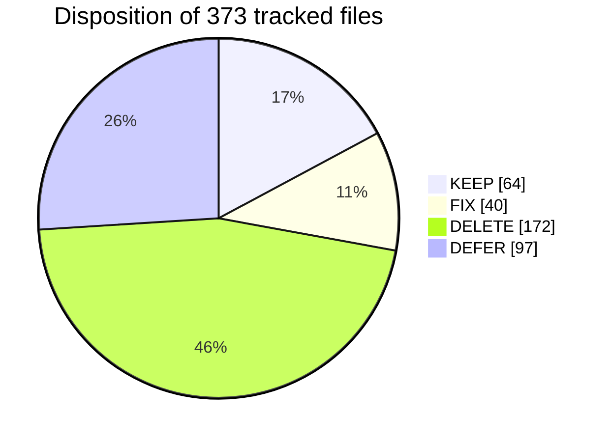

# File disposition: every tracked path

> **Generated** from the inventory of `main` = `53b0532` (373 tracked files) by the planning session. It uses real byte and line counts (`git cat-file`), not guesses.
> **Dispositions:** **KEEP** = in scope and works · **FIX** = keep but change content or name (phase given) · **DELETE** = empty, title-only, duplicate, dead, or generated · **DEFER** = substantive but outside the core gate; decide in Phase 6.
> Status column: `empty` (0 bytes/whitespace) · `title-only` (only headings) · `stub` (thin outline of things that don't exist) · `substantive` · `symlink` · `binary`.
> Rows are grouped by folder. A folder whose files all share one disposition is collapsed into a glob row. Line counts are newline counts.

## Totals

| Disposition | Files | Lines | Share |
|---|---:|---:|---:|
| **KEEP** | 64 | 3482 | 17% |
| **FIX** | 40 | 3310 | 11% |
| **DELETE** | 172 | 495 | 46% |
| **DEFER** | 97 | 3894 | 26% |
| **Total** | 373 | 11181 | 100% |

### When each change happens

| Disposition | Phase | Files |
|---|---|---:|
| FIX | P1 | 3 |
| FIX | P1/P5 | 1 |
| FIX | P3 | 9 |
| FIX | P4 | 16 |
| FIX | P5 | 10 |
| FIX | P6 | 1 |
| DELETE | P3 | 170 |
| DELETE | P4 | 2 |
| DEFER | P6 | 97 |

**After Phases 3–4:** 201 files remain (KEEP + FIX + DEFER), all non-empty. That's before any new files the phases add (e.g. rego tests, the ISMS index content). See [02-target-state.md](../02-target-state.md) for the 80–120 question.

## Files that look deletable but need care

| Path | Why care |
|---|---|
| `Internal-IT/platform/domains/identity/entra-id/modules/output/compliance.tf` | 1 byte, but `entra-id/main.tf:28-30` uses `./modules/output` as a module source. Remove the module block first, then the file, then run `terraform validate` |
| `Internal-IT/workloads/control-validation-scenarios/vpc/permissive-network-acl/` | Wired into `Internal-IT/workloads/control-validation-scenarios/main.tf:21-24` and its README, but defines nothing. Implement it (P4), don't just delete the folder |
| `Internal-IT/platform/domains/identity/docs/tempChangePlan.md` | Name says temporary, but it's a real decision record (Entra Free plan blocks group SCIM). Rename, don't delete |
| `Internal-IT/platform/structure.md` | Substantive (113 lines) but describes an aspirational layout. Read it once before deleting |
| `Governance/ISMS/tree.md` | Holds the list of documents you planned. Fold it into `Governance/ISMS/README.md` before deleting |
| 75 short-but-real files (≤15 non-blank lines) | Mostly `provider.tf` / `versions.tf` / `outputs.tf` / SCP JSON. Short ≠ empty; the deletion list uses status, not length |

## Per-folder table

### `.github`

**`.github/actions/apply/`**

| Path | Lines | Status | Disposition | Phase | Reason |
|---|---:|---|---|---|---|
| `action.yml` | 27 | substantive | **KEEP** | - | Downloads evidence and calls run-apply.sh |

**`.github/actions/check/`**

| Path | Lines | Status | Disposition | Phase | Reason |
|---|---:|---|---|---|---|
| `action.yml` | 29 | substantive | **FIX** | P4 | No `workload_dir` input → tfsec scans ayka-portal in the regression job; unpinned `pip install checkov` |

**`.github/actions/decision/`**

| Path | Lines | Status | Disposition | Phase | Reason |
|---|---:|---|---|---|---|
| `action.yml` | 49 | substantive | **FIX** | P4 | jq quoting bug at `:38` (schema_version empty in run #68) |

**`.github/actions/evidence/`**

| Path | Lines | Status | Disposition | Phase | Reason |
|---|---:|---|---|---|---|
| `action.yml` | 32 | substantive | **FIX** | P4 | Upload `output/compliance-summary.json` so the checksum can be verified |

**`.github/actions/plan/`**

| Path | Lines | Status | Disposition | Phase | Reason |
|---|---:|---|---|---|---|
| `action.yml` | 50 | substantive | **FIX** | P4 | Unpinned actions (`:24,30`); OIDC login not needed for mock provider (ADR-0013) |

**`.github/actions/policy/`**

| Path | Lines | Status | Disposition | Phase | Reason |
|---|---:|---|---|---|---|
| `action.yml` | 17 | substantive | **KEEP** | - | conftest v0.45.0 pinned (keeps Rego v0 working); optionally verify download checksum in P4 |

**`.github/actions/validate/`**

| Path | Lines | Status | Disposition | Phase | Reason |
|---|---:|---|---|---|---|
| `action.yml` | 43 | substantive | **FIX** | P4 | Unpinned `setup-terraform@v3`, `setup-tflint@v4`, `tflint_version: latest` |

**`.github/workflows/`**

| Path | Lines | Status | Disposition | Phase | Reason |
|---|---:|---|---|---|---|
| `drift-detection.yml` | 45 | substantive | **FIX** | P4 | Manual-only until remote state exists (ADR-0008); 61/61 nightly failures |
| `policy-check.yml` | 21 | substantive | **DELETE** | P3 | Reusable workflow nothing calls; only mirrored by a symlink (ADR-0005) |
| `terraform-workflow.yml` | 150 | substantive | **FIX** | P4 | Checksum coverage (`:96-105`), OIDC on plan-only work (ADR-0013) |
| `test.yml` | 99 | substantive | **FIX** | P4 | Regression job only warns (`:94-98`); tests never run; triggers on every push to any branch |

### Repository root

| Path | Lines | Status | Disposition | Phase | Reason |
|---|---:|---|---|---|---|
| `.gitignore` | 121 | substantive | **FIX** | P3 | `tree.md` rule ignores a tracked file; `output/` also matches `entra-id/modules/output/`; add `tfplan*`, `*.tfvars` policy |
| `LICENSE` | 201 | substantive | **KEEP** | - | License |
| `README.md` | 73 | substantive | **FIX** | P5 | Rewrite: remove over-claims (Terragrunt, SIEM, SOC 2, zero-trust, audit-ready…); add capability table (ADR-0006) |

### `Governance`

| Path | Files | Lines | Status | Disposition | Phase | Reason |
|---|---:|---:|---|---|---|---|
| `Governance/GDPR/*` | 4 | 0 | 4 empty | **DELETE** | P3 | Empty placeholder (ADR-0004) |

**`Governance/GDPR/technical-and-organization-measures/`**

| Path | Lines | Status | Disposition | Phase | Reason |
|---|---:|---|---|---|---|
| `identity-and-access-toms.md` | 32 | substantive | **DEFER** | P6 | Over-claims (zero-trust, FIDO2 for all, SCIM revokes) — banner in P5, fix in P6 |
| `segregation-of-duties.md` | 35 | substantive | **DEFER** | P6 | Broken `Internal-IT/cloud-platform` ref (`:31`); tier table contradicts other docs |

**`Governance/ISMS/00-context-and-governance/`**

| Path | Lines | Status | Disposition | Phase | Reason |
|---|---:|---|---|---|---|
| `context-of-organization.md` | 1 | title-only | **DELETE** | P3 | Title-only placeholder; listed in the ISMS index instead (ADR-0004) |
| `document-control-procedure.md` | 1 | title-only | **DELETE** | P3 | Title-only placeholder; listed in the ISMS index instead (ADR-0004) |
| `document-register.md` | 1 | title-only | **DELETE** | P3 | Title-only placeholder; listed in the ISMS index instead (ADR-0004) |
| `information-security-policy.md` | 127 | substantive | **FIX** | P5 | Generic template claiming 'Approved by: Managing Director' — relabel as simulated/unapproved |
| `interested-parties.md` | 1 | title-only | **DELETE** | P3 | Title-only placeholder; listed in the ISMS index instead (ADR-0004) |
| `isms-objectives.md` | 1 | title-only | **DELETE** | P3 | Title-only placeholder; listed in the ISMS index instead (ADR-0004) |
| `legal-and-regulatory-requirements.md` | 1 | title-only | **DELETE** | P3 | Title-only placeholder; listed in the ISMS index instead (ADR-0004) |
| `management-commitment-statement.md` | 1 | title-only | **DELETE** | P3 | Title-only placeholder; listed in the ISMS index instead (ADR-0004) |
| `record-retention-policy.md` | 1 | title-only | **DELETE** | P3 | Title-only placeholder; listed in the ISMS index instead (ADR-0004) |
| `scope.md` | 129 | substantive | **FIX** | P5 | Claims SIEM/backup systems in scope that don't exist; relabel approval as simulated |

| Path | Files | Lines | Status | Disposition | Phase | Reason |
|---|---:|---:|---|---|---|---|
| `Governance/ISMS/01-organization/*` | 7 | 7 | 7 title-only | **DELETE** | P3 | Title-only placeholder; listed in the ISMS index instead (ADR-0004) |

**`Governance/ISMS/01-organization/confidentiality-agreements/`**

| Path | Lines | Status | Disposition | Phase | Reason |
|---|---:|---|---|---|---|
| `signed-nda-index.md` | 1 | title-only | **DELETE** | P3 | Title-only placeholder; listed in the ISMS index instead (ADR-0004) |
| `template-nda.md` | 1 | title-only | **DELETE** | P3 | Title-only placeholder; listed in the ISMS index instead (ADR-0004) |

| Path | Files | Lines | Status | Disposition | Phase | Reason |
|---|---:|---:|---|---|---|---|
| `Governance/ISMS/02-asset-management/*` | 7 | 7 | 7 title-only | **DELETE** | P3 | Title-only placeholder; listed in the ISMS index instead (ADR-0004) |

**`Governance/ISMS/03-risk-management/`**

| Path | Lines | Status | Disposition | Phase | Reason |
|---|---:|---|---|---|---|
| `risk-acceptance-log.md` | 54 | substantive | **KEEP** | - | Your preferred style: honest, evidence-graded, simulated-case-study label |
| `risk-criteria.md` | 94 | substantive | **KEEP** | - | Your preferred style: honest, evidence-graded, simulated-case-study label |
| `risk-management-methodology.md` | 170 | substantive | **FIX** | P5 | 4 links into untracked `AUDIT/` (`:36,167-169`) |
| `risk-register.md` | 56 | substantive | **FIX** | P1/P5 | Model doc. P1: `:21` says source is clean (false on main). P5: 3 `AUDIT/` links (`:15`), '124 Checkov failures' (`:29`) → link CI runs (ADR-0009) |
| `risk-treatment-plan.md` | 68 | substantive | **FIX** | P5 | TRT-003/006 statuses describe fixes not on main (`:22,25`); '124 Checkov failures' (`:28`) |
| `threat-scenarios-catalog.md` | 49 | substantive | **KEEP** | - | Your preferred style: honest, evidence-graded, simulated-case-study label |

**`Governance/ISMS/03-risk-management/risk-assessment-results/`**

| Path | Lines | Status | Disposition | Phase | Reason |
|---|---:|---|---|---|---|
| `2026-q1-risk-assessment.md` | 72 | substantive | **FIX** | P5 | 2 links into untracked `AUDIT/` (`:19-20`) |
| `2026-q2-risk-review.md` | 72 | substantive | **KEEP** | - | Your preferred style: honest, evidence-graded, simulated-case-study label |

**`Governance/ISMS/04-controls-and-soa/`**

| Path | Lines | Status | Disposition | Phase | Reason |
|---|---:|---|---|---|---|
| `access-control-evidence-index.md` | 1 | title-only | **DELETE** | P3 | Title-only placeholder; listed in the ISMS index instead (ADR-0004) |
| `control-gap-analysis.md` | 1 | title-only | **DELETE** | P3 | Title-only placeholder; listed in the ISMS index instead (ADR-0004) |
| `control-mapping-to-internal-it.md` | 1 | title-only | **DELETE** | P3 | Title-only placeholder; listed in the ISMS index instead (ADR-0004) |
| `iam-iso27001-mapping.md` | 186 | substantive | **DEFER** | P6 | 7 broken `Internal-IT/iam/...` paths; A.5.15–A.5.18 labels shifted by one — banner in P5, fix in P6 |
| `justification-for-exclusions.md` | 1 | title-only | **DELETE** | P3 | Title-only placeholder; listed in the ISMS index instead (ADR-0004) |
| `privileged-access-justification.md` | 1 | title-only | **DELETE** | P3 | Title-only placeholder; listed in the ISMS index instead (ADR-0004) |
| `statement-of-applicability.md` | 1 | title-only | **DELETE** | P3 | Title-only placeholder; listed in the ISMS index instead (ADR-0004) |

| Path | Files | Lines | Status | Disposition | Phase | Reason |
|---|---:|---:|---|---|---|---|
| `Governance/ISMS/05-operational-policies/*` | 17 | 17 | 17 title-only | **DELETE** | P3 | Title-only placeholder; listed in the ISMS index instead (ADR-0004) |

| Path | Files | Lines | Status | Disposition | Phase | Reason |
|---|---:|---:|---|---|---|---|
| `Governance/ISMS/06-operational-procedures/*` | 12 | 12 | 12 title-only | **DELETE** | P3 | Title-only placeholder; listed in the ISMS index instead (ADR-0004) |

| Path | Files | Lines | Status | Disposition | Phase | Reason |
|---|---:|---:|---|---|---|---|
| `Governance/ISMS/07-technical-evidence/*` | 4 | 4 | 4 title-only | **DELETE** | P3 | Title-only placeholder; listed in the ISMS index instead (ADR-0004) |

| Path | Files | Lines | Status | Disposition | Phase | Reason |
|---|---:|---:|---|---|---|---|
| `Governance/ISMS/07-technical-evidence/iam/*` | 3 | 0 | 3 empty | **DELETE** | P3 | Empty 'evidence' file — evidence comes from CI artifacts (ADR-0009) |

| Path | Files | Lines | Status | Disposition | Phase | Reason |
|---|---:|---:|---|---|---|---|
| `Governance/ISMS/08-monitoring-and-measurement/*` | 3 | 3 | 3 title-only | **DELETE** | P3 | Title-only placeholder; listed in the ISMS index instead (ADR-0004) |

**`Governance/ISMS/08-monitoring-and-measurement/monitoring-results/`**

| Path | Lines | Status | Disposition | Phase | Reason |
|---|---:|---|---|---|---|
| `q1-monitoring.md` | 1 | title-only | **DELETE** | P3 | Title-only placeholder; listed in the ISMS index instead (ADR-0004) |
| `q2-monitoring.md` | 1 | title-only | **DELETE** | P3 | Title-only placeholder; listed in the ISMS index instead (ADR-0004) |

| Path | Files | Lines | Status | Disposition | Phase | Reason |
|---|---:|---:|---|---|---|---|
| `Governance/ISMS/09-internal-audit/*` | 3 | 3 | 3 title-only | **DELETE** | P3 | Title-only placeholder; listed in the ISMS index instead (ADR-0004) |

| Path | Files | Lines | Status | Disposition | Phase | Reason |
|---|---:|---:|---|---|---|---|
| `Governance/ISMS/10-management-review/*` | 4 | 4 | 4 title-only | **DELETE** | P3 | Title-only placeholder; listed in the ISMS index instead (ADR-0004) |

| Path | Files | Lines | Status | Disposition | Phase | Reason |
|---|---:|---:|---|---|---|---|
| `Governance/ISMS/11-improvement/*` | 4 | 4 | 4 title-only | **DELETE** | P3 | Title-only placeholder; listed in the ISMS index instead (ADR-0004) |

**`Governance/ISMS/`**

| Path | Lines | Status | Disposition | Phase | Reason |
|---|---:|---|---|---|---|
| `README.md` | 1 | title-only | **FIX** | P3 | Becomes the single 'planned documents' index replacing the 84 stubs (ADR-0004) |
| `tree.md` | 134 | substantive | **DELETE** | P3 | Planning tree; fold its list into `Governance/ISMS/README.md` first; also matched by `.gitignore:68` |

**`Governance/architecture/`**

| Path | Lines | Status | Disposition | Phase | Reason |
|---|---:|---|---|---|---|
| `README.md` | 4 | stub | **DELETE** | P3 | Thin stub describing things that don't exist (ADR-0004/0006) |
| `identity-architecture.md` | 71 | substantive | **KEEP** | - | Real Mermaid identity flow (tier naming to be reconciled in P6) |
| `platform-architecture.md` | 7 | stub | **DELETE** | P3 | Thin stub describing things that don't exist (ADR-0004/0006) |
| `security-control-model.md` | 5 | stub | **DELETE** | P3 | Thin stub describing things that don't exist (ADR-0004/0006) |
| `system-overview.md` | 22 | stub | **DELETE** | P3 | Thin stub describing things that don't exist (ADR-0004/0006) |

**`Governance/`**

| Path | Lines | Status | Disposition | Phase | Reason |
|---|---:|---|---|---|---|
| `company-security-roadmap.md` | 0 | empty | **DELETE** | P3 | Empty placeholder (ADR-0004) |
| `security-architecture.md` | 6 | stub | **DELETE** | P3 | Thin stub describing things that don't exist (ADR-0004/0006) |
| `security-operating-model.md` | 5 | stub | **DELETE** | P3 | Thin stub describing things that don't exist (ADR-0004/0006) |
| `vendor-risk-management.md` | 4 | stub | **DELETE** | P3 | Thin stub describing things that don't exist (ADR-0004/0006) |

### `Internal-IT`

**`Internal-IT/assurance/`**

| Path | Lines | Status | Disposition | Phase | Reason |
|---|---:|---|---|---|---|
| `README.md` | 0 | empty | **DELETE** | P3 | Empty placeholder (ADR-0004) |

| Path | Files | Lines | Status | Disposition | Phase | Reason |
|---|---:|---:|---|---|---|---|
| `Internal-IT/assurance/audit-support/*` | 4 | 1 | 4 empty | **DELETE** | P3 | Empty placeholder (ADR-0004) |

| Path | Files | Lines | Status | Disposition | Phase | Reason |
|---|---:|---:|---|---|---|---|
| `Internal-IT/assurance/audit-support/auditor-requests/*` | 3 | 0 | 3 empty | **DELETE** | P3 | Empty placeholder (ADR-0004) |

**`Internal-IT/assurance/evidence/`**

| Path | Lines | Status | Disposition | Phase | Reason |
|---|---:|---|---|---|---|
| `README.md` | 0 | empty | **DELETE** | P3 | Empty placeholder (ADR-0004) |

| Path | Files | Lines | Status | Disposition | Phase | Reason |
|---|---:|---:|---|---|---|---|
| `Internal-IT/assurance/integrity/*` | 3 | 0 | 3 empty | **DELETE** | P3 | Empty placeholder (ADR-0004) |

**`Internal-IT/assurance/metrics/`**

| Path | Lines | Status | Disposition | Phase | Reason |
|---|---:|---|---|---|---|
| `compliance-dashboard.md` | 0 | empty | **DELETE** | P3 | Empty placeholder (ADR-0004) |
| `security-kpis.md` | 0 | empty | **DELETE** | P3 | Empty placeholder (ADR-0004) |

**`Internal-IT/assurance/reports/compliance-reports/`**

| Path | Lines | Status | Disposition | Phase | Reason |
|---|---:|---|---|---|---|
| `control-effectiveness.md` | 0 | empty | **DELETE** | P3 | Empty placeholder (ADR-0004) |
| `iso27001-readiness.md` | 0 | empty | **DELETE** | P3 | Empty placeholder (ADR-0004) |

**`Internal-IT/assurance/reports/drift-reports/`**

| Path | Lines | Status | Disposition | Phase | Reason |
|---|---:|---|---|---|---|
| `infra-drift-summary.md` | 0 | empty | **DELETE** | P3 | Empty placeholder (ADR-0004) |

**`Internal-IT/assurance/reports/security-reports/`**

| Path | Lines | Status | Disposition | Phase | Reason |
|---|---:|---|---|---|---|
| `incident-summary.md` | 0 | empty | **DELETE** | P3 | Empty placeholder (ADR-0004) |
| `monthly-security-summary.md` | 0 | empty | **DELETE** | P3 | Empty placeholder (ADR-0004) |

**`Internal-IT/engineering/`**

| Path | Lines | Status | Disposition | Phase | Reason |
|---|---:|---|---|---|---|
| `.pre-commit-config.yaml` | 0 | empty | **DELETE** | P3 | Empty and in the wrong place (pre-commit reads repo root) |

**`Internal-IT/engineering/ci-cd/`**

| Path | Lines | Status | Disposition | Phase | Reason |
|---|---:|---|---|---|---|
| `README.md` | 0 | empty | **DELETE** | P3 | Empty |
| `architecture.md` | 14 | substantive | **FIX** | P3 | Describes the 14 empty `pipelines/*.yml`; rewrite to point at `.github/` + how-it-works (ADR-0005) |

**`Internal-IT/engineering/ci-cd/compliance-gates/approvals/`**

| Path | Lines | Status | Disposition | Phase | Reason |
|---|---:|---|---|---|---|
| `change-justification-template.md` | 0 | empty | **DELETE** | P3 | Empty placeholder (ADR-0004) |
| `prod-approval-policy.md` | 0 | empty | **DELETE** | P3 | Empty placeholder (ADR-0004) |

**`Internal-IT/engineering/ci-cd/compliance-gates/`**

| Path | Lines | Status | Disposition | Phase | Reason |
|---|---:|---|---|---|---|
| `enforcement-levels.md` | 42 | substantive | **FIX** | P3 | Absolute `/home/ayush/...` path at `:13` |
| `failure-handling.md` | 0 | empty | **DELETE** | P3 | Empty placeholder (ADR-0004) |
| `policy-evaluation-flow.md` | 30 | substantive | **FIX** | P3 | Absolute `/home/ayush/...` path at `:12` |

**`Internal-IT/engineering/ci-cd/pipelines/code-security/`**

| Path | Lines | Status | Disposition | Phase | Reason |
|---|---:|---|---|---|---|
| `iam-diff-check.yml` | 0 | empty | **DELETE** | P3 | Empty placeholder YAML shadowing `.github/` (ADR-0005) |
| `secrets-scan.yml` | 0 | empty | **DELETE** | P3 | Empty placeholder YAML shadowing `.github/` (ADR-0005) |

| Path | Files | Lines | Status | Disposition | Phase | Reason |
|---|---:|---:|---|---|---|---|
| `Internal-IT/engineering/ci-cd/pipelines/compliance/*` | 3 | 0 | 3 empty | **DELETE** | P3 | Empty placeholder YAML shadowing `.github/` (ADR-0005) |

| Path | Files | Lines | Status | Disposition | Phase | Reason |
|---|---:|---:|---|---|---|---|
| `Internal-IT/engineering/ci-cd/pipelines/core/*` | 4 | 0 | 4 empty | **DELETE** | P3 | Empty placeholder YAML shadowing `.github/` (ADR-0005) |

**`Internal-IT/engineering/ci-cd/pipelines/drift/`**

| Path | Lines | Status | Disposition | Phase | Reason |
|---|---:|---|---|---|---|
| `drift-detection.yml` | 0 | empty | **DELETE** | P3 | Empty placeholder YAML shadowing `.github/` (ADR-0005) |

| Path | Files | Lines | Status | Disposition | Phase | Reason |
|---|---:|---:|---|---|---|---|
| `Internal-IT/engineering/ci-cd/pipelines/release/*` | 4 | 0 | 4 empty | **DELETE** | P3 | Empty placeholder YAML shadowing `.github/` (ADR-0005) |

**`Internal-IT/engineering/ci-cd/scripts/`**

| Path | Lines | Status | Disposition | Phase | Reason |
|---|---:|---|---|---|---|
| `evaluate-results.py` | 458 | substantive | **FIX** | P4 | Validate input shapes; fail on checkov `parsing_errors`; unmapped-severity policy (ADR-0011) |
| `evaluate-results.sh` | 20 | substantive | **KEEP** | - | Fail-closed missing-file check (`:13-18`) |
| `export-evidence.sh` | 34 | substantive | **KEEP** | - | Copies `output/*.json`; fixed as a side effect of the tfsec fix |
| `generate-report.py` | 71 | substantive | **KEEP** | - | Markdown report |
| `run-apply.sh` | 27 | substantive | **FIX** | P4 | Hard-coded 'Apply complete! 14 added' (`:24-27`); `--ignore-missing` (`:14`) |
| `run-checkov.sh` | 18 | substantive | **KEEP** | - | Works; `|| true` is fine once the evaluator validates input (P4) |
| `run-cost-check.sh` | 13 | substantive | **FIX** | P4 | Label as simulated (infracost not installed) or remove the step |
| `run-policy-check.sh` | 30 | substantive | **FIX** | P4 | Point `--policy` at `OPA/terraform` once `OPA/aws` is deleted (`:14`) |
| `run-tfsec.sh` | 21 | substantive | **FIX** | P4 | Writes `tfsec-result` then an empty `.json` fallback → all tfsec findings dropped (`:13-19`) |
| `write-opa-error-result.py` | 36 | substantive | **KEEP** | - | Fail-closed OPA error payload |

**`Internal-IT/engineering/ci-cd/templates/`**

| Path | Lines | Status | Disposition | Phase | Reason |
|---|---:|---|---|---|---|
| `policy-check.yml` | 1 | symlink | **DELETE** | P3 | Symlink into `.github/workflows` (ADR-0005) |
| `terraform-workflow.yml` | 1 | symlink | **DELETE** | P3 | Symlink into `.github/workflows` (ADR-0005) |

**`Internal-IT/engineering/drift-detection/alerting/`**

| Path | Lines | Status | Disposition | Phase | Reason |
|---|---:|---|---|---|---|
| `drift-alerting.md` | 0 | empty | **DELETE** | P3 | Empty placeholder (ADR-0004) |
| `integration.md` | 0 | empty | **DELETE** | P3 | Empty placeholder (ADR-0004) |

**`Internal-IT/engineering/drift-detection/terraform-drift/`**

| Path | Lines | Status | Disposition | Phase | Reason |
|---|---:|---|---|---|---|
| `detection-strategy.md` | 0 | empty | **DELETE** | P3 | Empty placeholder (ADR-0004) |
| `drift-check.sh` | 0 | empty | **DELETE** | P3 | Empty placeholder (ADR-0004) |

**`Internal-IT/engineering/policy-as-code/OPA/aws/`**

| Path | Lines | Status | Disposition | Phase | Reason |
|---|---:|---|---|---|---|
| `ec2.rego` | 11 | substantive | **DELETE** | P4 | Dead: reads `input.instances`, never fires on plan JSON, still loaded |
| `s3.rego` | 11 | substantive | **DELETE** | P4 | Dead: reads `input.buckets`; typo `:8` |

| Path | Files | Lines | Status | Disposition | Phase | Reason |
|---|---:|---:|---|---|---|---|
| `Internal-IT/engineering/policy-as-code/OPA/terraform/*` | 4 | 301 | 4 substantive | **KEEP** | P4 | Live OPA rules; add `*_test.rego` in P4 (ADR-0012) |

**`Internal-IT/engineering/policy-as-code/metadata/`**

| Path | Lines | Status | Disposition | Phase | Reason |
|---|---:|---|---|---|---|
| `README.md` | 13 | substantive | **FIX** | P3 | Points to non-existent `../active/control-mapping.yaml` (`:8`) |
| `control-mapping.yaml` | 748 | substantive | **FIX** | P4 | Add `rationale` per severity (ADR-0014); review odd ISO refs (e.g. `:566-567`) |

**`Internal-IT/platform/`**

| Path | Lines | Status | Disposition | Phase | Reason |
|---|---:|---|---|---|---|
| `CONTROL-PLANE.md` | 20 | stub | **DELETE** | P3 | Generic headings; detection/response planes don't exist |
| `README.md` | 0 | empty | **DELETE** | P3 | Empty |
| `architecture.md` | 0 | empty | **DELETE** | P3 | Empty |
| `structure.md` | 113 | substantive | **DELETE** | P3 | Substantive but aspirational tree of dirs that don't exist; replaced by README repo map. **Review before deleting** |

**`Internal-IT/platform/deployments/`**

| Path | Lines | Status | Disposition | Phase | Reason |
|---|---:|---|---|---|---|
| `platform-rollout.md` | 24 | stub | **DELETE** | P3 | Phase outline for phases that don't exist |

**`Internal-IT/platform/domains/identity/`**

| Path | Lines | Status | Disposition | Phase | Reason |
|---|---:|---|---|---|---|
| `README.md` | 759 | substantive | **DEFER** | P6 | 759 lines, real; stale `iam/` tree at `:58-72` — fix with the identity pass |

| Path | Files | Lines | Status | Disposition | Phase | Reason |
|---|---:|---:|---|---|---|---|
| `Internal-IT/platform/domains/identity/aws-iam-core/*` | 10 | 552 | 10 substantive | **DEFER** | P6 | Design-only context root (never applied, not scanned by the gate) — keep in place; label in P5 (ADR-0002/0006) |

| Path | Files | Lines | Status | Disposition | Phase | Reason |
|---|---:|---:|---|---|---|---|
| `Internal-IT/platform/domains/identity/aws-identity-center/*` | 10 | 300 | 10 substantive | **DEFER** | P6 | Design-only context root (never applied, not scanned by the gate) — keep in place; label in P5 (ADR-0002/0006) |

**`Internal-IT/platform/domains/identity/docs/`**

| Path | Lines | Status | Disposition | Phase | Reason |
|---|---:|---|---|---|---|
| `break-glass-procedure.md` | 51 | substantive | **DEFER** | P6 | Design-only context root (never applied, not scanned by the gate) — keep in place; label in P5 (ADR-0002/0006) |
| `iam_compliance_crosswalk.md` | 48 | substantive | **DEFER** | P6 | Design-only context root (never applied, not scanned by the gate) — keep in place; label in P5 (ADR-0002/0006) |
| `identity-provisioning-workflow.md` | 60 | substantive | **DEFER** | P6 | Design-only context root (never applied, not scanned by the gate) — keep in place; label in P5 (ADR-0002/0006) |
| `identity-source.md` | 62 | substantive | **DEFER** | P6 | Design-only context root (never applied, not scanned by the gate) — keep in place; label in P5 (ADR-0002/0006) |
| `scim.md` | 32 | substantive | **DEFER** | P6 | Design-only context root (never applied, not scanned by the gate) — keep in place; label in P5 (ADR-0002/0006) |
| `tempChangePlan.md` | 86 | substantive | **FIX** | P3 | Real decision record (Entra Free plan blocks group SCIM); rename to `identity-boundary-decision.md` |

**`Internal-IT/platform/domains/identity/entra-id/`**

| Path | Lines | Status | Disposition | Phase | Reason |
|---|---:|---|---|---|---|
| `.gitignore` | 44 | substantive | **DEFER** | P6 | Design-only context root (never applied, not scanned by the gate) — keep in place; label in P5 (ADR-0002/0006) |
| `aws_enterprise_app.tf` | 83 | substantive | **DEFER** | P6 | Design-only context root (never applied, not scanned by the gate) — keep in place; label in P5 (ADR-0002/0006) |
| `main.tf` | 30 | substantive | **FIX** | P3 | Remove the `module "output"` block (`:28-30`) that points at an empty module |
| `provider.tf` | 22 | substantive | **DEFER** | P6 | Design-only context root (never applied, not scanned by the gate) — keep in place; label in P5 (ADR-0002/0006) |
| `provisioning.md` | 28 | substantive | **DEFER** | P6 | Design-only context root (never applied, not scanned by the gate) — keep in place; label in P5 (ADR-0002/0006) |
| `variables.tf` | 10 | substantive | **DEFER** | P6 | Design-only context root (never applied, not scanned by the gate) — keep in place; label in P5 (ADR-0002/0006) |

**`Internal-IT/platform/domains/identity/entra-id/modules/core/`**

| Path | Lines | Status | Disposition | Phase | Reason |
|---|---:|---|---|---|---|
| `group_roles.tf` | 18 | substantive | **DEFER** | P6 | Design-only context root (never applied, not scanned by the gate) — keep in place; label in P5 (ADR-0002/0006) |
| `groups_departments.tf` | 23 | substantive | **DEFER** | P6 | Design-only context root (never applied, not scanned by the gate) — keep in place; label in P5 (ADR-0002/0006) |
| `groups_tiers.tf` | 17 | substantive | **DEFER** | P6 | Design-only context root (never applied, not scanned by the gate) — keep in place; label in P5 (ADR-0002/0006) |
| `locals_personnel.tf` | 46 | substantive | **DEFER** | P6 | Design-only context root (never applied, not scanned by the gate) — keep in place; label in P5 (ADR-0002/0006) |
| `memberships.tf` | 27 | substantive | **DEFER** | P6 | Design-only context root (never applied, not scanned by the gate) — keep in place; label in P5 (ADR-0002/0006) |
| `outputs.tf` | 11 | substantive | **DEFER** | P6 | Design-only context root (never applied, not scanned by the gate) — keep in place; label in P5 (ADR-0002/0006) |
| `personnel.json` | 338 | substantive | **DEFER** | P6 | Design-only context root (never applied, not scanned by the gate) — keep in place; label in P5 (ADR-0002/0006) |
| `users.tf` | 19 | substantive | **FIX** | P1 | Literal password at `:16` (ADR-0007) |

**`Internal-IT/platform/domains/identity/entra-id/modules/output/`**

| Path | Lines | Status | Disposition | Phase | Reason |
|---|---:|---|---|---|---|
| `compliance.tf` | 1 | empty | **DELETE** | P3 | 1-byte file; **first** remove `module "output"` from `entra-id/main.tf:28-30` or init breaks |

**`Internal-IT/platform/domains/identity/entra-id/modules/privileged/`**

| Path | Lines | Status | Disposition | Phase | Reason |
|---|---:|---|---|---|---|
| `admin_accounts.tf` | 28 | substantive | **FIX** | P1 | Literal password at `:9` (ADR-0007) |
| `break_glass.tf` | 14 | substantive | **FIX** | P1 | Literal password at `:6` (ADR-0007) |
| `governance_authorities.tf` | 0 | empty | **DELETE** | P3 | Empty .tf |
| `outputs.tf` | 3 | substantive | **DEFER** | P6 | Design-only context root (never applied, not scanned by the gate) — keep in place; label in P5 (ADR-0002/0006) |
| `variables.tf` | 3 | substantive | **DEFER** | P6 | Design-only context root (never applied, not scanned by the gate) — keep in place; label in P5 (ADR-0002/0006) |

| Path | Files | Lines | Status | Disposition | Phase | Reason |
|---|---:|---:|---|---|---|---|
| `Internal-IT/platform/domains/identity/entra-id/modules/security/conditional_access/*` | 3 | 77 | 3 substantive | **DEFER** | P6 | Design-only context root (never applied, not scanned by the gate) — keep in place; label in P5 (ADR-0002/0006) |

**`Internal-IT/platform/foundation/`**

| Path | Lines | Status | Disposition | Phase | Reason |
|---|---:|---|---|---|---|
| `Platform_Complilance.md` | 120 | substantive | **FIX** | P3 | Filename typo; broken `Internal-IT/cloud-platform/` ref (`:3`); NIST/CIS/SOC 2 prose only |
| `README.md` | 28 | stub | **FIX** | P5 | Stale tree (`cloud-platform/`, files that don't exist) |

| Path | Files | Lines | Status | Disposition | Phase | Reason |
|---|---:|---:|---|---|---|---|
| `Internal-IT/platform/foundation/aws-organization/*` | 6 | 65 | 6 substantive | **DEFER** | P6 | Design-only context root (never applied, not scanned by the gate) — keep in place; label in P5 (ADR-0002/0006) |

| Path | Files | Lines | Status | Disposition | Phase | Reason |
|---|---:|---:|---|---|---|---|
| `Internal-IT/platform/foundation/aws-organization/modules/ou-structure/*` | 3 | 44 | 3 substantive | **DEFER** | P6 | Design-only context root (never applied, not scanned by the gate) — keep in place; label in P5 (ADR-0002/0006) |

| Path | Files | Lines | Status | Disposition | Phase | Reason |
|---|---:|---:|---|---|---|---|
| `Internal-IT/platform/foundation/aws-organization/modules/scp/*` | 6 | 104 | 6 substantive | **DEFER** | P6 | Design-only context root (never applied, not scanned by the gate) — keep in place; label in P5 (ADR-0002/0006) |

**`Internal-IT/platform/foundation/landing-zone/`**

| Path | Lines | Status | Disposition | Phase | Reason |
|---|---:|---|---|---|---|
| `.terraform.lock.hcl` | 25 | substantive | **DEFER** | P6 | Design-only context root (never applied, not scanned by the gate) — keep in place; label in P5 (ADR-0002/0006) |
| `README.md` | 16 | substantive | **DEFER** | P6 | Design-only context root (never applied, not scanned by the gate) — keep in place; label in P5 (ADR-0002/0006) |
| `enterprise_strict.tfvars` | 18 | substantive | **DEFER** | P6 | Tracked tfvars: 3 account IDs + contact email, no secrets; decide keep vs example file |
| `locals.tf` | 5 | substantive | **DEFER** | P6 | Design-only context root (never applied, not scanned by the gate) — keep in place; label in P5 (ADR-0002/0006) |
| `main.tf` | 56 | substantive | **DEFER** | P6 | Design-only context root (never applied, not scanned by the gate) — keep in place; label in P5 (ADR-0002/0006) |
| `provider.tf` | 35 | substantive | **DEFER** | P6 | Design-only context root (never applied, not scanned by the gate) — keep in place; label in P5 (ADR-0002/0006) |
| `variables.tf` | 49 | substantive | **DEFER** | P6 | Design-only context root (never applied, not scanned by the gate) — keep in place; label in P5 (ADR-0002/0006) |

| Path | Files | Lines | Status | Disposition | Phase | Reason |
|---|---:|---:|---|---|---|---|
| `Internal-IT/platform/foundation/landing-zone/modules/account_landing_zone/*` | 4 | 98 | 4 substantive | **DEFER** | P6 | Design-only context root (never applied, not scanned by the gate) — keep in place; label in P5 (ADR-0002/0006) |

**`Internal-IT/platform/foundation/landing-zone/modules/break_glass/`**

| Path | Lines | Status | Disposition | Phase | Reason |
|---|---:|---|---|---|---|
| `main.tf` | 23 | substantive | **DEFER** | P6 | Design-only context root (never applied, not scanned by the gate) — keep in place; label in P5 (ADR-0002/0006) |
| `variables.tf` | 4 | substantive | **DEFER** | P6 | Design-only context root (never applied, not scanned by the gate) — keep in place; label in P5 (ADR-0002/0006) |

**`Internal-IT/platform/foundation/landing-zone/modules/core/alerts/`**

| Path | Lines | Status | Disposition | Phase | Reason |
|---|---:|---|---|---|---|
| `outputs.tf` | 3 | substantive | **DEFER** | P6 | Design-only context root (never applied, not scanned by the gate) — keep in place; label in P5 (ADR-0002/0006) |
| `sns.tf` | 18 | substantive | **DEFER** | P6 | Design-only context root (never applied, not scanned by the gate) — keep in place; label in P5 (ADR-0002/0006) |

**`Internal-IT/platform/foundation/landing-zone/modules/core/docs/`**

| Path | Lines | Status | Disposition | Phase | Reason |
|---|---:|---|---|---|---|
| `remediation.md` | 7 | substantive | **DEFER** | P6 | Design-only context root (never applied, not scanned by the gate) — keep in place; label in P5 (ADR-0002/0006) |

| Path | Files | Lines | Status | Disposition | Phase | Reason |
|---|---:|---:|---|---|---|---|
| `Internal-IT/platform/foundation/landing-zone/modules/core/iam/*` | 3 | 133 | 3 substantive | **DEFER** | P6 | Design-only context root (never applied, not scanned by the gate) — keep in place; label in P5 (ADR-0002/0006) |

| Path | Files | Lines | Status | Disposition | Phase | Reason |
|---|---:|---:|---|---|---|---|
| `Internal-IT/platform/foundation/landing-zone/modules/core/logging/*` | 3 | 51 | 3 substantive | **DEFER** | P6 | Design-only context root (never applied, not scanned by the gate) — keep in place; label in P5 (ADR-0002/0006) |

| Path | Files | Lines | Status | Disposition | Phase | Reason |
|---|---:|---:|---|---|---|---|
| `Internal-IT/platform/foundation/landing-zone/modules/core/*` | 3 | 40 | 3 substantive | **DEFER** | P6 | Design-only context root (never applied, not scanned by the gate) — keep in place; label in P5 (ADR-0002/0006) |

**`Internal-IT/platform/foundation/landing-zone/modules/core/s3/`**

| Path | Lines | Status | Disposition | Phase | Reason |
|---|---:|---|---|---|---|
| `public_access_block.tf` | 10 | substantive | **DEFER** | P6 | Design-only context root (never applied, not scanned by the gate) — keep in place; label in P5 (ADR-0002/0006) |

**`Internal-IT/platform/foundation/landing-zone/modules/cost_controls/`**

| Path | Lines | Status | Disposition | Phase | Reason |
|---|---:|---|---|---|---|
| `main.tf` | 41 | substantive | **DEFER** | P6 | Design-only context root (never applied, not scanned by the gate) — keep in place; label in P5 (ADR-0002/0006) |
| `variables.tf` | 10 | substantive | **DEFER** | P6 | Design-only context root (never applied, not scanned by the gate) — keep in place; label in P5 (ADR-0002/0006) |

**`Internal-IT/platform/foundation/landing-zone/modules/quotas/`**

| Path | Lines | Status | Disposition | Phase | Reason |
|---|---:|---|---|---|---|
| `main.tf` | 7 | substantive | **DEFER** | P6 | Design-only context root (never applied, not scanned by the gate) — keep in place; label in P5 (ADR-0002/0006) |
| `variables.tf` | 5 | substantive | **DEFER** | P6 | Design-only context root (never applied, not scanned by the gate) — keep in place; label in P5 (ADR-0002/0006) |

**`Internal-IT/platform/foundation/landing-zone/modules/siem/`**

| Path | Lines | Status | Disposition | Phase | Reason |
|---|---:|---|---|---|---|
| `elastic-siem.md` | 23 | stub | **DELETE** | P3 | Describes an Elastic SIEM lab whose files don't exist (ADR-0006) |
| `main.tf` | 27 | substantive | **DEFER** | P6 | Design-only context root (never applied, not scanned by the gate) — keep in place; label in P5 (ADR-0002/0006) |
| `variables.tf` | 10 | substantive | **DEFER** | P6 | Design-only context root (never applied, not scanned by the gate) — keep in place; label in P5 (ADR-0002/0006) |

**`Internal-IT/platform/foundation/remote-state/`**

| Path | Lines | Status | Disposition | Phase | Reason |
|---|---:|---|---|---|---|
| `.terraform.lock.hcl` | 44 | substantive | **DEFER** | P6 | Design-only context root (never applied, not scanned by the gate) — keep in place; label in P5 (ADR-0002/0006) |
| `README.md` | 5 | stub | **FIX** | P6 | Stub unrelated to remote state; rewrite when the backend is built (ADR-0010) |
| `bootstrap.tf` | 40 | substantive | **DEFER** | P6 | Design-only context root (never applied, not scanned by the gate) — keep in place; label in P5 (ADR-0002/0006) |
| `main.tf` | 23 | substantive | **DEFER** | P6 | Design-only context root (never applied, not scanned by the gate) — keep in place; label in P5 (ADR-0002/0006) |
| `provider.tf` | 16 | substantive | **DEFER** | P6 | Design-only context root (never applied, not scanned by the gate) — keep in place; label in P5 (ADR-0002/0006) |
| `variables.tf` | 0 | empty | **DELETE** | P3 | Empty .tf |

**`Internal-IT/platform/operations/change-management/`**

| Path | Lines | Status | Disposition | Phase | Reason |
|---|---:|---|---|---|---|
| `change-policy.md` | 0 | empty | **DELETE** | P3 | Empty placeholder (ADR-0004) |
| `rollout-strategy.md` | 0 | empty | **DELETE** | P3 | Empty placeholder (ADR-0004) |

| Path | Files | Lines | Status | Disposition | Phase | Reason |
|---|---:|---:|---|---|---|---|
| `Internal-IT/platform/operations/incident-response/scenarios/*` | 3 | 0 | 3 empty | **DELETE** | P3 | Empty placeholder (ADR-0004) |

**`Internal-IT/platform/operations/monitoring/`**

| Path | Lines | Status | Disposition | Phase | Reason |
|---|---:|---|---|---|---|
| `alerting-strategy.md` | 0 | empty | **DELETE** | P3 | Empty placeholder (ADR-0004) |
| `dashboard.md` | 0 | empty | **DELETE** | P3 | Empty placeholder (ADR-0004) |

**`Internal-IT/workloads/`**

| Path | Lines | Status | Disposition | Phase | Reason |
|---|---:|---|---|---|---|
| `README.md` | 46 | substantive | **FIX** | P5 | False claims: networking via data sources, analytics module; ISO 2013 IDs (`:6,13,20-33`) |

| Path | Files | Lines | Status | Disposition | Phase | Reason |
|---|---:|---:|---|---|---|---|
| `Internal-IT/workloads/ayka-portal/*` | 6 | 414 | 6 substantive | **KEEP** | - | Gate's 'should pass' workload (mock provider, plan-only) |

**`Internal-IT/workloads/ayka-portal/envs/`**

| Path | Lines | Status | Disposition | Phase | Reason |
|---|---:|---|---|---|---|
| `dev.tfvars` | 14 | substantive | **KEEP** | - | Non-secret inputs (placeholder AMI) |

| Path | Files | Lines | Status | Disposition | Phase | Reason |
|---|---:|---:|---|---|---|---|
| `Internal-IT/workloads/ayka-portal/modules/compute/*` | 7 | 451 | 7 substantive | **KEEP** | - | Gate's 'should pass' workload (mock provider, plan-only) |

| Path | Files | Lines | Status | Disposition | Phase | Reason |
|---|---:|---:|---|---|---|---|
| `Internal-IT/workloads/ayka-portal/modules/database/*` | 4 | 178 | 4 substantive | **KEEP** | - | Gate's 'should pass' workload (mock provider, plan-only) |

| Path | Files | Lines | Status | Disposition | Phase | Reason |
|---|---:|---:|---|---|---|---|
| `Internal-IT/workloads/ayka-portal/modules/networking/*` | 4 | 249 | 4 substantive | **KEEP** | - | Gate's 'should pass' workload (mock provider, plan-only) |

| Path | Files | Lines | Status | Disposition | Phase | Reason |
|---|---:|---:|---|---|---|---|
| `Internal-IT/workloads/ayka-portal/modules/security/*` | 4 | 214 | 4 substantive | **KEEP** | - | Gate's 'should pass' workload (mock provider, plan-only) |

| Path | Files | Lines | Status | Disposition | Phase | Reason |
|---|---:|---:|---|---|---|---|
| `Internal-IT/workloads/ayka-portal/modules/storage/*` | 4 | 198 | 4 substantive | **KEEP** | - | Gate's 'should pass' workload (mock provider, plan-only) |

**`Internal-IT/workloads/control-validation-scenarios/`**

| Path | Lines | Status | Disposition | Phase | Reason |
|---|---:|---|---|---|---|
| `.terraform.lock.hcl` | 25 | substantive | **KEEP** | - | Gate's 'must fail' negative-test workload |
| `README.md` | 36 | substantive | **FIX** | P4 | Claims 'bad IAM' scenario that doesn't exist; document expected findings per scenario |
| `main.tf` | 24 | substantive | **KEEP** | - | Scenario switchboard (`count` per module) |
| `provider.tf` | 21 | substantive | **KEEP** | - | Gate's 'must fail' negative-test workload |
| `tfplan.binary` | -1 | binary | **DELETE** | P3 | Committed generated plan (zip with empty state); add to .gitignore |
| `variables.tf` | 23 | substantive | **KEEP** | - | Gate's 'must fail' negative-test workload |

**`Internal-IT/workloads/control-validation-scenarios/ec2/no-imdsv2/`**

| Path | Lines | Status | Disposition | Phase | Reason |
|---|---:|---|---|---|---|
| `README.md` | 0 | empty | **DELETE** | P3 | Empty placeholder (ADR-0004) |
| `main.tf` | 9 | substantive | **KEEP** | - | Gate's 'must fail' negative-test workload |
| `versions.tf` | 10 | substantive | **KEEP** | - | Gate's 'must fail' negative-test workload |

**`Internal-IT/workloads/control-validation-scenarios/ec2/open-ssh-security-group/`**

| Path | Lines | Status | Disposition | Phase | Reason |
|---|---:|---|---|---|---|
| `README.md` | 0 | empty | **DELETE** | P3 | Empty placeholder (ADR-0004) |
| `main.tf` | 18 | substantive | **KEEP** | - | Gate's 'must fail' negative-test workload |
| `variables.tf` | 0 | empty | **DELETE** | P3 | Empty .tf (safe: dir has other real .tf; checked with `terraform validate`) |
| `versions.tf` | 10 | substantive | **KEEP** | - | Gate's 'must fail' negative-test workload |

**`Internal-IT/workloads/control-validation-scenarios/s3/missing-encryption/`**

| Path | Lines | Status | Disposition | Phase | Reason |
|---|---:|---|---|---|---|
| `README.md` | 0 | empty | **DELETE** | P3 | Empty placeholder (ADR-0004) |
| `main.tf` | 13 | substantive | **KEEP** | - | Gate's 'must fail' negative-test workload |
| `versions.tf` | 10 | substantive | **KEEP** | - | Gate's 'must fail' negative-test workload |

**`Internal-IT/workloads/control-validation-scenarios/s3/public-bucket/`**

| Path | Lines | Status | Disposition | Phase | Reason |
|---|---:|---|---|---|---|
| `README.md` | 0 | empty | **DELETE** | P3 | Empty placeholder (ADR-0004) |
| `main.tf` | 8 | substantive | **KEEP** | - | Gate's 'must fail' negative-test workload |
| `variables.tf` | 0 | empty | **DELETE** | P3 | Empty .tf (safe: dir has other real .tf; checked with `terraform validate`) |
| `versions.tf` | 10 | substantive | **KEEP** | - | Gate's 'must fail' negative-test workload |

**`Internal-IT/workloads/control-validation-scenarios/shared/`**

| Path | Lines | Status | Disposition | Phase | Reason |
|---|---:|---|---|---|---|
| `variables.tf` | 0 | empty | **DELETE** | P3 | Empty; `shared/` is referenced by no module |
| `versions.tf` | 3 | substantive | **DELETE** | P3 | `shared/` is referenced by no module block (dead dir) |

**`Internal-IT/workloads/control-validation-scenarios/vpc/permissive-network-acl/`**

| Path | Lines | Status | Disposition | Phase | Reason |
|---|---:|---|---|---|---|
| `README.md` | 0 | empty | **DELETE** | P3 | Empty (scenario documented in the scenarios README) |
| `main.tf` | 0 | empty | **FIX** | P4 | Empty → scenario is a no-op; implement a NACL allowing 0.0.0.0/0 so `NETWORK_ACL_UNRESTRICTED_INGRESS` has a negative test |
| `variables.tf` | 0 | empty | **DELETE** | P3 | Empty .tf |
| `versions.tf` | 10 | substantive | **KEEP** | - | Gate's 'must fail' negative-test workload |

### `organization`

**`organization/`**

| Path | Lines | Status | Disposition | Phase | Reason |
|---|---:|---|---|---|---|
| `acceptable-use-policy.md` | 0 | empty | **DELETE** | P3 | Empty placeholder (ADR-0004) |
| `business-model.md` | 88 | substantive | **FIX** | P5 | Typos (`:8`, `:10`); TISAX/IEC 62443 offerings are fiction — label as simulated |
| `org-structure.md` | 40 | substantive | **KEEP** | - | Simulated company context (fictional personnel) |
| `personnel-register.md` | 111 | substantive | **KEEP** | - | Simulated company context (fictional personnel) |
| `roles-and-responsibilities.md` | 100 | substantive | **FIX** | P5 | Claims Microsoft Sentinel SIEM (`:69`); no SIEM exists |
| `security-steering-committee.md` | 0 | empty | **DELETE** | P3 | Empty placeholder (ADR-0004) |
| `training-and-awareness.md` | 129 | substantive | **KEEP** | - | Simulated company context (fictional personnel) |
| `vendor-management.md` | 0 | empty | **DELETE** | P3 | Empty placeholder (ADR-0004) |

### `tests`

**`tests/compliance/`**

| Path | Lines | Status | Disposition | Phase | Reason |
|---|---:|---|---|---|---|
| `test_evaluate_results.py` | 228 | substantive | **KEEP** | P4 | 5 passing tests; extend with fail-closed cases in P4 |

