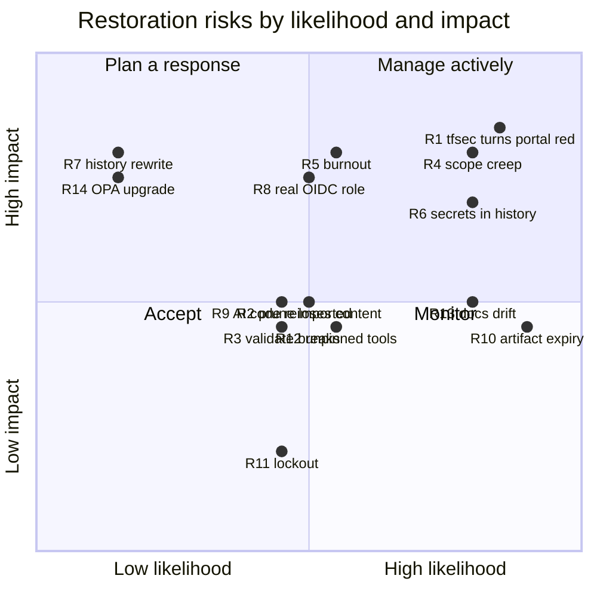

# Risks of the restoration work and open questions

> This file is about the **restoration work itself**: what could go wrong while you follow this plan, and what only you can answer.
> Risks to the simulated company live in `Governance/ISMS/03-risk-management/risk-register.md`. Keep the two separate.

---

## 1. Risk table (restoration work)

Scale: Likelihood / Impact = Low · Medium · High.

| # | Risk | Likelihood | Impact | Mitigation | Where handled |
|---|---|---|---|---|---|
| R1 | **Fixing tfsec turns `ayka-portal` red** (25 tfsec findings on the scenarios were being dropped; the portal will surface its own), and you're tempted to lower severities to get green again | High | High | Expect it; it's the honest state. Triage every new finding: fix the Terraform, or map it with a written rationale ([ADR-0014](adr/0014-control-mapping-changes-reviewed.md)). Never bulk-downgrade. | Phase 4 |
| R2 | Pruning deletes something you meant to write, or a file that is referenced somewhere | Medium | Medium | Baseline tag first. Deletion list generated from real sizes. "Short-but-meaningful" review. `grep` proof that nothing references deleted paths. Git history keeps every file (`git show baseline-2026-10:<path>`). | Phase 0 (tag), Phase 3 |
| R3 | A prune or secrets change breaks `terraform validate` in some root | Medium | Medium | Run `fmt -check` / `init -backend=false` / `validate` on every root before and after, and compare with the Phase 0 baseline table | Phase 1, 3 |
| R4 | **Scope creep**: adding SIEM, new AWS services, SOC 2 mappings, a dashboard… before the core is honest | High | High | [ADR-0002](adr/0002-identity-and-scope.md) scope boundary. Every new idea goes into Phase 6 as optional. Ask one question: "does this make the gate more *true*?" | All phases |
| R5 | **Burnout / losing momentum** (you stopped for months once already) | Medium | High | 1–2 h sessions with a safe stopping point in every playbook. Progress tracker in [README](README.md). Quick wins first (Phase 0–1 are small). It's OK to skip a week: the plan is resumable. | All phases |
| R6 | Secret clean-up is treated as "done" after editing the `.tf` files, but the values stay in public git history | High | High (only if the accounts were ever real) | Decision flowchart in [Phase 1](05-phase-playbooks/phase-1-secrets.md). Rotation or disabling fixes exposure; a history rewrite alone does not. | Phase 1 |
| R7 | A history rewrite (force-push) corrupts your own clones or loses commits | Low | High | Only if you decide it's needed. `git bundle` backup first. Repo has 0 forks. Re-clone afterwards. | Phase 1 |
| R8 | The real AWS role `github-actions-oidc-role` in account `982081090103` is broader than you think while the repo is public | Unknown | High | Inspect the trust policy and permissions in the AWS console. Remove the OIDC step from plan-only CI ([ADR-0013](adr/0013-no-cloud-creds-for-plan-only.md)). | Phase 1, 4 |
| R9 | Re-importing AI-written code you can't explain | Medium | Medium | [ADR-0003](adr/0003-codex-branch-parts-bin.md) rules: one file or hunk at a time, explain every line, or re-implement | Phase 2, 4 |
| R10 | **Evidence loss**: run #68 artifacts (your last green baseline) expire **2026-11-21** | High (certain if ignored) | Medium | Download them in Phase 0 and keep them outside git, or commit a small redacted summary | Phase 0 |
| R11 | Branch protection locks you out, or requires a check name that no longer exists after you rename jobs | Medium | Low | Turn protection on only after a green run with the final job names. Allow admin bypass while you're the only contributor. | Phase 4 |
| R12 | Unpinned tools (Checkov via `pip install checkov`, `tflint_version: latest`) change results between sessions, so you chase "regressions" that are tool updates | Medium | Medium | Record versions in Phase 0 (local Checkov was 3.3.20). Pin in Phase 4 ([ADR-0015](adr/0015-pin-tool-versions.md)). | Phase 0, 4 |
| R13 | Governance docs drift out of sync with code (e.g. the risk register cites "124 Checkov failures" and says the source is "clean") | High | Medium | [ADR-0009](adr/0009-governance-links-evidence.md): link to CI runs, not numbers from a local `AUDIT/` folder. Update the register at each phase gate. | Phase 1, 5 |
| R14 | Accidental upgrade to OPA/conftest ≥1.0 breaks every policy (45 parse errors) | Low | High | Keep `conftest v0.45.0` pinned until a deliberate Rego v1 migration (Phase 6) | Phase 4, 6 |
| R15 | Working only locally and losing work | Low | Medium | Commit small, push after each step (every playbook has commit messages) | All |

---

## 2. Open questions only you can answer

Answer the **Before Phase 1** questions first; they change what Phase 1 does. Each has a default I'd assume if you don't answer, so the plan never blocks.

### Before Phase 1 (blocking decisions)

| # | Question | Why it matters | Default if unanswered |
|---|---|---|---|
| Q1 | **Were the Entra passwords at `users.tf:16`, `break_glass.tf:6`, `admin_accounts.tf:9` ever used in a real Microsoft Entra tenant?** (Was `terraform apply` ever run for `entra-id`, or were these typed into a real account?) | Real means they must be rotated or the accounts disabled, and sign-ins reviewed. Never real means editing the code is enough and a history rewrite is optional. | **Assume real**: disable/rotate, and write a short record (no values) |
| Q2 | **What is AWS account `982081090103`, and what can `github-actions-oidc-role` do?** Check in IAM: trust policy `sub` condition (which repo and branches) and the attached policies. | CI assumed this role successfully in run #68. The repo is public and CI runs on every push to any branch (`test.yml:3-10`). | **Assume broad**: remove the OIDC step from plan-only CI, and restrict the trust policy to `main` or delete the role |
| Q3 | **Was any Terraform root ever applied for real** (org, landing zone, identity, remote-state), and does a `terraform.tfstate` exist on your laptop for any root? | Decides whether "design-only" is an honest label, and whether state must be protected before anything else. | **Assume nothing applied except whatever created the OIDC role**; don't delete local state files |
| Q4 | **Would you accept rewriting `main`'s history** (force-push) if the passwords turn out to be real? | A rewrite breaks clones and needs coordination. It does *not* remove the exposure on its own. | **No rewrite**; rotation/disable is the real fix |

### Before Phase 2–3

| # | Question | Why it matters | Default |
|---|---|---|---|
| Q5 | Does `f68766c` / `codex/pre-restore-ai-cleanup-20260823` still exist on your laptop? | Decides whether Phase 2 is a 15-minute close-out or a review session | **Assume lost** |
| Q6 | The 84 one-line ISMS stubs you added in `fe1b27e`: were they a to-do list you still want? | [ADR-0004](adr/0004-delete-placeholders.md) proposes replacing them with one "planned documents" index | **Replace with one index** |
| Q7 | **File-count target:** keep the platform Terraform roots (repo ends at about 200 files), or move them to an archive tag (about 105 files)? | Your "80–120 files" goal is only reachable by moving about 95 substantive platform files out | **Keep platform as design-only context** (it shows IAM/SCP/Identity Center skills) |
| Q8 | Is there anything in your local `AUDIT/` folder you want public (sanitised)? | The risk docs link to it; on GitHub those links are broken | **Don't publish it**; relink to CI runs |

### Before Phase 4–5

| # | Question | Why it matters | Default |
|---|---|---|---|
| Q9 | **Unmapped findings policy:** keep the scanner's severity (Checkov's usually empty, so LOW), treat unmapped as MEDIUM (needs approval), or fail on any unmapped finding? | This is the biggest remaining fail-open decision ([ADR-0011](adr/0011-fail-closed-scanner-contract.md)) | **MEDIUM** (needs approval) |
| Q10 | Do GitHub environments `medium-risk-approval` and `manual-apply-approval` have required reviewers? (Settings → Environments) | In run #68, apply started about 4 s after it was queued, so it looks like no human gate | **Assume none**; configure yourself as reviewer |
| Q11 | Drift workflow: delete it, or keep it manual-only? | [ADR-0008](adr/0008-drift-manual-only.md) | **Manual-only** |
| Q12 | Do you accept the refined identity sentence in [ADR-0002](adr/0002-identity-and-scope.md)? | README headline and interview pitch | **Keep your original** until you decide |
| Q13 | Who is the README for: cloud security engineer roles, GRC/compliance roles, or both? | Changes the order of README sections and the demo | **Cloud security engineer with a compliance angle** |

---

## 3. Facts you believed that turned out different

| You believed | Actually (evidence) |
|---|---|
| Last green pipeline run: 15 Apr 2026 | Runs #66–#68 on **2026-08-23** are green, including the current HEAD `53b0532` ([run #68](https://github.com/Ayush-cloud06/Ayka-Secure-Technologies-GmbH/actions/runs/32621618951)) |
| Codex branch exists on GitHub at `f68766c` | Not on GitHub, never pushed (0 force pushes; only `main` exists). See [codex-branch-triage.md](inventory/codex-branch-triage.md) |
| `fe1b27e` reverted the AI cleanup | It's a normal commit on top of `243c3b1` that *adds* 84 heading-only stubs. The cleanup was never in `main`'s history. |
| The drift workflow was auto-disabled because it kept failing | It failed 61/61 nights, but GitHub disabled it for **60 days of repository inactivity** (`disabled_inactivity`, 2026-06-15) |
| The pipeline is mock-only, with no cloud credentials | CI **does** assume a real AWS role via OIDC (run #68: `AWS_SESSION_TOKEN` set); Terraform just ignores it because of hard-coded mock keys |
| Green means the gate works | tfsec findings are dropped every run (`run-tfsec.sh:13-19`); the evaluator tests never run in CI |
| The risk register says the source is clean | `risk-register.md:21` ("current source is clean") is false for `main`: the three literal passwords are still there |
| tfvars were never committed | Two `.tfvars` are tracked: `landing-zone/enterprise_strict.tfvars`, `ayka-portal/envs/dev.tfvars` (content check: see [01-current-state.md](01-current-state.md)). A plan binary is also committed: `control-validation-scenarios/tfplan.binary` |
